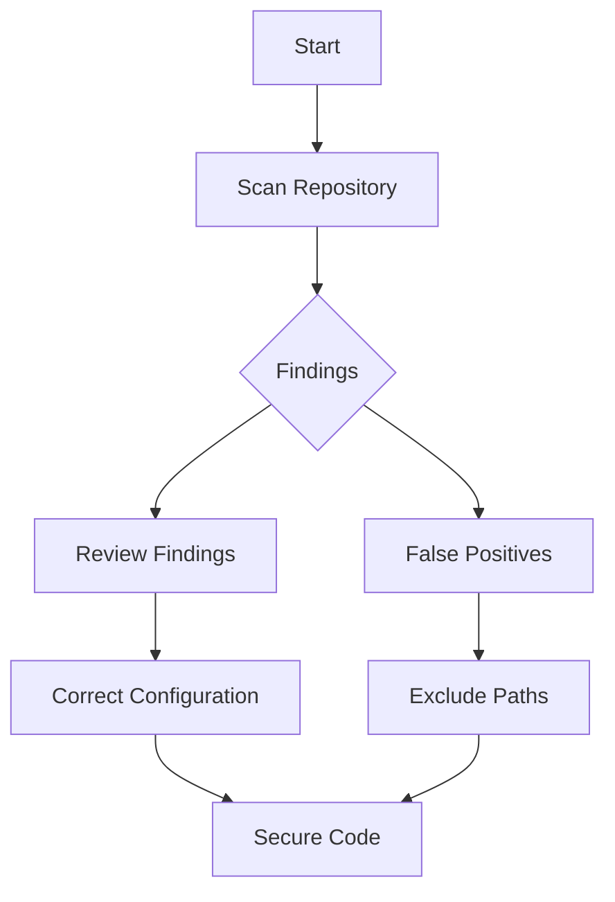

## Introduction to Application Vulnerability Scanning

Application vulnerability scanning is a critical component of DevSecOps, ensuring that applications are free from security vulnerabilities before they are deployed. This process involves automated tools that scan the application codebase for potential security issues, such as hardcoded secrets, SQL injection vulnerabilities, and other common security flaws. One of the most common tools used for this purpose is GitLeaks, which is designed to detect hardcoded secrets in your code repositories.

### What is GitLeaks?

GitLeaks is an open-source tool that scans your code repositories for hardcoded secrets, such as API keys, passwords, and other sensitive information. It works by analyzing the commit history of your repository and identifying patterns that match known secret formats. By doing so, it helps developers identify and remove these secrets from their codebase, reducing the risk of accidental exposure.

### Why Use GitLeaks?

Using GitLeaks is essential because hardcoded secrets in your codebase can lead to serious security breaches. For example, if an attacker gains access to your repository, they could easily extract these secrets and use them to compromise your systems. Real-world examples of such breaches include:

- **CVE-2021-22205**: A hardcoded secret in a popular open-source project led to unauthorized access to sensitive data.
- **GitHub Data Breach (2020)**: An attacker exploited a hardcoded secret in a GitHub repository to gain unauthorized access to user data.

### How GitLeaks Works

GitLeaks works by analyzing the commit history of your repository and identifying patterns that match known secret formats. It does this by:

1. **Scanning Commit History**: GitLeaks scans the entire commit history of your repository, looking for changes that introduce new secrets.
2. **Pattern Matching**: It uses regular expressions and other pattern-matching techniques to identify known secret formats, such as API keys, passwords, and SSH keys.
3. **Reporting Findings**: Once it identifies potential secrets, GitLeaks reports them to the user, providing details about the location and nature of the secret.

### Configuring GitLeaks

To effectively use GitLeaks, you need to configure it properly. This involves setting up a configuration file that specifies how GitLeaks should behave. In the given example, the configuration file is located at `.gitleaks.toml`.

#### Example Configuration File

```toml
[secret-patterns]
  [[secret-patterns]]
    name = "AWS Access Key"
    regex = "(AKIA|ASIA)[A-Z0-9]{16}"
    description = "AWS Access Key ID"
    format = "$1"

  [[secret-patterns]]
    name = "GitHub Token"
    regex = "[0-9a-f]{40}"
    description = "GitHub Personal Access Token"
    format = "$1"

[ignore-paths]
  ignore = ["test/**", "**/test/**"]
```

This configuration file defines two secret patterns (`AWS Access Key` and `GitHub Token`) and specifies paths to ignore (`test/**`, `**/test/**`). The `ignore-paths` section tells GitLeaks to exclude any files or directories that match these patterns from the scan.

### Running GitLeaks

To run GitLeaks, you need to execute the following command:

```bash
gitleaks --repo-path=/path/to/repo --report-path=/path/to/report.json
```

This command tells GitLeaks to scan the specified repository path and output the results to a JSON report.

### Handling False Positives

One of the challenges with vulnerability scanning tools like GitLeaks is handling false positives. False positives occur when the tool incorrectly identifies a piece of code as a secret. In the given example, the initial scan identified nine issues, but after renaming the configuration file, the number of findings increased to 37. This increase is due to the removal of the configuration file that was excluding certain paths.

### How to Prevent / Defend Against False Positives

To prevent false positives and ensure accurate results, follow these steps:

1. **Configure Exclusions Properly**: Ensure that your configuration file correctly excludes paths that contain test data or other non-sensitive information.
2. **Review and Validate Findings**: Manually review the findings reported by GitLeaks to verify their accuracy.
3. **Use Secure Coding Practices**: Avoid hardcoding secrets in your codebase. Instead, use environment variables or secure vaults to manage sensitive information.

#### Secure Coding Example

**Vulnerable Code**

```python
import os

# Hardcoded API key
api_key = "1234567890abcdef"
os.environ["API_KEY"] = api_key
```

**Secure Code**

```python
import os

# Retrieve API key from environment variable
api_key = os.getenv("API_KEY")
if not api_key:
    raise ValueError("API_KEY environment variable not set")
```

In the secure code example, the API key is retrieved from an environment variable, which is a more secure approach than hardcoding the key in the code.

### Complete Example

Let's walk through a complete example of configuring and running GitLeaks, including the initial scan, handling false positives, and securing the codebase.

#### Initial Scan

```bash
gitleaks --repo-path=/path/to/repo --report-path=/path/to/report.json
```

#### Reviewing Findings

After running the initial scan, review the findings in the report. Suppose the report identifies nine issues. You can then open the `.gitleaks.toml` configuration file to ensure it is correctly configured.

#### Renaming Configuration File

To demonstrate the effect of removing the configuration file, rename it temporarily:

```bash
mv .gitleaks.toml .gitleaks.toml.bak
```

#### Re-running GitLeaks

Re-run GitLeaks to see the increased number of findings:

```bash
gitleaks --repo-path=/path/to/repo --report-path=/path/to/report.json
```

#### Reviewing New Findings

The new report will show 37 findings, many of which are in the test directories. This demonstrates the importance of proper configuration to avoid false positives.

#### Restoring Configuration File

Restore the configuration file:

```bash
mv .gitleaks.toml.bak .gitleaks.toml
```

#### Final Scan

Run GitLeaks one final time to ensure the correct configuration is in place:

```bash
gitleaks --repo-path=/path/to/repo --report-path=/path/to/report.json
```

### Mermaid Diagrams

#### GitLeaks Workflow



This diagram illustrates the workflow of using GitLeaks, from scanning the repository to reviewing findings and securing the codebase.

### Conclusion

Application vulnerability scanning is a crucial aspect of DevSecOps, helping to identify and mitigate security risks in your codebase. Tools like GitLeaks play a vital role in this process by detecting hardcoded secrets and other security vulnerabilities. By properly configuring and using these tools, you can ensure that your applications are secure and free from unnecessary risks.

### Practice Labs

For hands-on experience with GitLeaks and other vulnerability scanning tools, consider the following labs:

- **PortSwigger Web Security Academy**: Offers interactive labs on various aspects of web security, including vulnerability scanning.
- **OWASP Juice Shop**: A deliberately insecure web application for practicing web security skills.
- **DVWA (Damn Vulnerable Web Application)**: Another intentionally vulnerable web application for learning web security.

These labs provide practical experience in identifying and fixing security vulnerabilities, making them valuable resources for mastering DevSecOps practices.

---
<!-- nav -->
[[DevSecOps/DevSecOps Bootcamp/05-Application Security Testing/02-Application Vulnerability Scanning/False Positives Fixing Security Vulnerabilities/03-Introduction to Application Vulnerability Scanning Part 2|Introduction to Application Vulnerability Scanning Part 2]] | [[DevSecOps/DevSecOps Bootcamp/05-Application Security Testing/02-Application Vulnerability Scanning/False Positives Fixing Security Vulnerabilities/00-Overview|Overview]] | [[DevSecOps/DevSecOps Bootcamp/05-Application Security Testing/02-Application Vulnerability Scanning/False Positives Fixing Security Vulnerabilities/05-Introduction to Application Vulnerability Scanning Part 4|Introduction to Application Vulnerability Scanning Part 4]]
