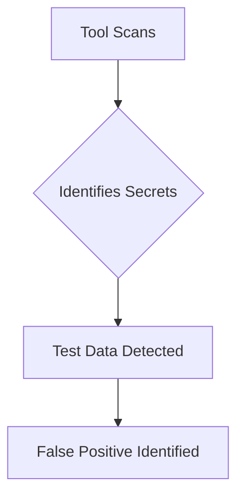
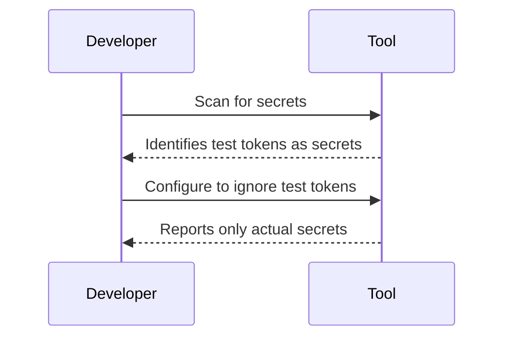

## Introduction to Application Vulnerability Scanning

Application vulnerability scanning is an essential component of DevSecOps, helping organizations identify and mitigate security vulnerabilities in their applications. These scans can be performed using various tools, such as static application security testing (SAST), dynamic application security testing (DAST), interactive application security testing (IAST), and software composition analysis (SCA). Each tool has its strengths and weaknesses, and understanding how to configure and interpret their results is crucial for effective security management.

### Understanding False Positives

False positives are a common issue in vulnerability scanning. They occur when a tool incorrectly identifies a non-vulnerable element as a potential security risk. This can lead to wasted time and resources as developers and security teams investigate these false alarms. In the context of the provided lecture, the tool identified several findings (from 9 to 37) as false positives because they were related to test data and not actual secrets.

#### Example of False Positives

Consider a scenario where a tool detects sensitive information in a test folder. The tool might flag these as potential secrets, but since they are only used for testing purposes, they are not actual secrets that can be exploited. This is a classic example of a false positive.



### Configuring Tools to Reduce False Positives

To reduce false positives, it is essential to configure the tools correctly. This involves understanding the tool's capabilities and limitations and tailoring its settings to the specific needs of your application.

#### Tool Configuration Examples

Let's consider a tool like `gitleaks`, which is used to detect secrets in Git repositories. By default, `gitleaks` might flag any string that looks like a secret, including those in test folders. To avoid this, you can configure `gitleaks` to ignore certain directories or files.

```bash
# Configure gitleaks to ignore test folders
gitleaks --config .gitleaks.toml --ignore-paths "test/*"
```

Here is an example of a `.gitleaks.toml` configuration file:

```toml
[general]
ignore-paths = ["test/*"]
```

This configuration tells `gitleaks` to ignore any paths that match the pattern `test/*`.

### Handling Specific False Positives

In the provided lecture, the tool flagged several findings as false positives. Let's break down how to handle these specific cases.

#### Example: Test Tokens

The lecture mentions "jot tokens" used for testing logic. These tokens are not actual secrets that can be used to hack into the system. Here’s how you can configure the tool to recognize these as false positives.



#### Example: Critical Findings Only

Another approach is to configure the tool to report only critical or high-severity findings. This reduces the number of false positives and makes it easier to focus on the most serious issues.

```bash
# Configure gitleaks to report only critical findings
gitleaks --config .gitleaks.toml --severity "critical"
```

Here is an example of a `.gitleaks.toml` configuration file:

```toml
[general]
severity = "critical"
```

This configuration tells `gitleaks` to report only critical findings.

### Real-World Examples and Recent Breaches

Understanding how false positives can impact real-world scenarios helps in appreciating the importance of proper tool configuration. Consider the following recent breaches:

#### Example: Capital One Data Breach (CVE-2019-11510)

In 2019, Capital One suffered a data breach due to misconfigured web application firewall rules. The attacker was able to access sensitive customer data by exploiting a vulnerability in the WAF configuration. This incident highlights the importance of properly configuring security tools to avoid false negatives (actual vulnerabilities being missed).

#### Example: Equifax Data Breach (CVE-2017-5638)

In 2017, Equifax suffered a massive data breach due to a vulnerability in Apache Struts. The attackers exploited a known vulnerability that had not been patched, leading to the exposure of sensitive customer data. This incident underscores the importance of regular vulnerability scanning and proper configuration of security tools to avoid false positives and ensure actual vulnerabilities are detected.

### How to Prevent / Defend Against False Positives

#### Detection

To detect false positives, it is essential to review the findings reported by the tool. This involves manually verifying each finding to determine whether it is a true positive or a false positive.

#### Prevention

To prevent false positives, configure the tool to ignore known false positives. This can be done by specifying directories or files to ignore, setting severity levels, or using custom rules.

#### Secure Coding Fixes

When a false positive is identified, it is important to document the finding and update the tool's configuration to avoid similar false positives in the future. Here is an example of a secure coding fix:

**Vulnerable Code:**

```python
# Vulnerable code snippet
def process_data(data):
    if data == "test_token":
        print("Processing test data")
    else:
        print("Processing real data")
```

**Secure Code:**

```python
# Secure code snippet
def process_data(data):
    if data.startswith("test_"):
        print("Processing test data")
    else:
        print("Processing real data")
```

In the secure code, the function checks if the data starts with "test_" before processing it as test data. This ensures that actual secrets are not mistakenly processed as test data.

### Complete Example: Full HTTP Request and Response

Here is a complete example of a full HTTP request and response, showing how to configure a tool to ignore test data.

#### HTTP Request

```http
POST /api/v1/process HTTP/1.1
Host: example.com
Content-Type: application/json
Authorization: Bearer test_token

{
    "data": "test_data"
}
```

#### HTTP Response

```http
HTTP/1.1 200 OK
Date: Mon, 23 Jan 2023 12:00:00 GMT
Content-Type: application/json
Content-Length: 34

{
    "message": "Processing test data"
}
```

### Conclusion

Properly configuring vulnerability scanning tools to reduce false positives is crucial for effective security management. By understanding the concepts, configuring the tools correctly, and reviewing the findings, you can ensure that your application remains secure. Regular vulnerability scanning and proper tool configuration help in identifying and mitigating actual vulnerabilities, reducing the risk of data breaches and other security incidents.

### Hands-On Labs

For hands-on practice in application vulnerability scanning, consider the following labs:

- **PortSwigger Web Security Academy**: Offers a comprehensive set of labs covering various aspects of web application security, including vulnerability scanning.
- **OWASP Juice Shop**: A deliberately insecure web application designed for security training and research.
- **DVWA (Damn Vulnerable Web Application)**: A PHP/MySQL web application that is riddled with vulnerabilities for educational purposes.
- **WebGoat**: An interactive, gamified training application designed to teach web application security.

These labs provide practical experience in identifying and mitigating security vulnerabilities, helping you master the skills needed for effective DevSecOps practices.

---
<!-- nav -->
[[DevSecOps/DevSecOps Bootcamp/05-Application Security Testing/02-Application Vulnerability Scanning/False Positives Fixing Security Vulnerabilities/04-Introduction to Application Vulnerability Scanning Part 3|Introduction to Application Vulnerability Scanning Part 3]] | [[DevSecOps/DevSecOps Bootcamp/05-Application Security Testing/02-Application Vulnerability Scanning/False Positives Fixing Security Vulnerabilities/00-Overview|Overview]] | [[DevSecOps/DevSecOps Bootcamp/05-Application Security Testing/02-Application Vulnerability Scanning/False Positives Fixing Security Vulnerabilities/06-Introduction to Application Vulnerability Scanning Part 5|Introduction to Application Vulnerability Scanning Part 5]]
