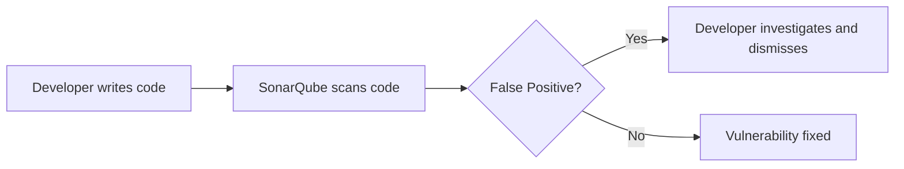
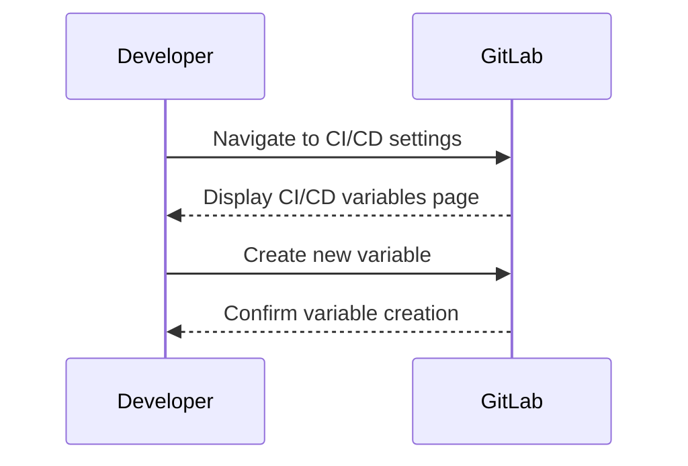

## Introduction to Application Vulnerability Scanning

Application vulnerability scanning is an essential component of modern DevSecOps practices. It involves using automated tools to identify potential security weaknesses within applications. These tools can detect a wide range of vulnerabilities, from SQL injection to cross-site scripting (XSS) attacks. However, one of the most challenging aspects of vulnerability scanning is dealing with false positives and false negatives.

### What Are False Positives and False Negatives?

False positives occur when a security tool incorrectly identifies a piece of code or configuration as a vulnerability when it is not. Conversely, false negatives happen when a security tool fails to identify an actual vulnerability. Both issues can significantly impact the effectiveness of a security program.

#### Why False Positives Matter

False positives can lead to wasted time and resources. Developers may spend unnecessary effort fixing non-existent issues, which can delay the release process and reduce overall productivity. Additionally, a high rate of false positives can erode trust in the security tools, leading to complacency and reduced vigilance.

#### Why False Negatives Matter

False negatives are even more dangerous because they allow real vulnerabilities to go undetected. This can result in serious security breaches, data leaks, and other catastrophic outcomes. For instance, the Equifax breach in 2017, which exposed sensitive information of over 143 million people, was partly due to unpatched vulnerabilities that were not detected by their security tools.

### Tools and Their Limitations

While automated tools like SonarQube, Fortify, and Veracode are invaluable in identifying potential security issues, they are not infallible. They rely on heuristics and patterns to detect vulnerabilities, which can sometimes lead to false positives and false negatives.

#### Example: SonarQube

SonarQube is a popular static code analysis tool that helps identify security vulnerabilities. However, it often flags certain patterns as potential vulnerabilities even when they are not. For example, it might flag a function that uses `eval()` as a potential code injection vulnerability, even though the input is properly sanitized.



### Hard-Coded Credentials

One common type of vulnerability that tools often miss is hard-coded credentials. This occurs when sensitive information such as database passwords or API keys are embedded directly in the source code. This is a significant security risk because anyone with access to the source code can obtain these credentials.

#### Real-World Example: Capital One Data Breach

In 2019, Capital One suffered a massive data breach that exposed the personal information of over 100 million customers. One of the root causes was a misconfigured web application firewall (WAF) that allowed unauthorized access to the company's Amazon Web Services (AWS) environment. The attacker was able to gain access to the AWS environment because of hard-coded credentials in the source code.

### Fixing Hard-Coded Credentials

To address the issue of hard-coded credentials, it is crucial to use environment variables or secret management tools. In the context of GitLab CI/CD, this can be achieved by creating secret variables in the project settings and referencing them in the pipeline.

#### Creating Secret Variables in GitLab CI/CD

GitLab provides a robust mechanism for managing secrets through its CI/CD pipeline. To create a secret variable, follow these steps:

1. **Navigate to Project Settings**: Log in to your GitLab account and navigate to the project settings.
2. **Access CI/CD Settings**: Under the "Settings" menu, select "CI/CD".
3. **Create a New Variable**: Click on the "Variables" tab and then click "Add variable".
4. **Define the Variable**: Enter the name of the variable (e.g., `DOCKER_PASSWORD`) and the value (the actual password). Ensure that the "Protected" option is checked to restrict access to protected branches (e.g., `main`).



### Using Secret Variables in Pipelines

Once the secret variable is created, it can be referenced in the `.gitlab-ci.yml` file. This ensures that the actual value of the secret is not exposed in the source code.

#### Example `.gitlab-ci.yml` Configuration

Here is an example of how to use a secret variable in a GitLab CI/CD pipeline:

```yaml
stages:
  - build
  - test
  - deploy

build_job:
  stage: build
  script:
    - echo "Building the application..."
    - docker build -t myapp:$CI_COMMIT_SHA .

test_job:
  stage: test
  script:
    - echo "Running tests..."
    - docker run myapp:$CI_COMMIT_SHA /bin/sh -c "pytest"

deploy_job:
  stage: deploy
  script:
    - echo "Deploying the application..."
    - docker login -u $CI_REGISTRY_USER -p $DOCKER_PASSWORD $CI_REGISTRY
    - docker push myapp:$CI_COMMIT_SHA
```

### Detection and Prevention

#### How to Detect Hard-Coded Credentials

To detect hard-coded credentials, you can use static code analysis tools like SonarQube or manual code reviews. Regularly scanning the codebase for sensitive information can help identify and mitigate these risks.

#### How to Prevent Hard-Coded Credentials

1. **Use Environment Variables**: Store sensitive information in environment variables rather than hard-coding them in the source code.
2. **Secret Management Tools**: Utilize secret management tools like HashiCorp Vault or AWS Secrets Manager to securely store and manage secrets.
3. **Code Reviews**: Implement regular code reviews to catch hard-coded credentials before they are committed to the repository.
4. **Automated Scanning**: Use automated tools to scan the codebase for sensitive information and flag any occurrences.

### Secure Coding Practices

#### Vulnerable Code Example

Here is an example of a vulnerable code snippet where a database password is hard-coded:

```python
import sqlite3

# Hard-coded database password
db_password = "mysecretpassword"

conn = sqlite3.connect('example.db')
cursor = conn.cursor()
cursor.execute(f"PRAGMA key='{db_password}'")
```

#### Secure Code Example

The same functionality can be achieved securely by using an environment variable:

```python
import os
import sqlite3

# Retrieve database password from environment variable
db_password = os.getenv("DB_PASSWORD")

conn = sqlite3.connect('example.db')
cursor = conn.cursor()
cursor.execute(f"PRAGMA key='{db_password}'")
```

### Conclusion

Fixing false positives and false negatives in application vulnerability scanning is crucial for maintaining a robust security posture. By leveraging tools effectively and implementing secure coding practices, organizations can significantly reduce the risk of security breaches. Regularly reviewing and updating security policies and procedures is essential to stay ahead of emerging threats.

### Hands-On Labs

For practical experience with application vulnerability scanning and fixing false positives, consider the following labs:

- **PortSwigger Web Security Academy**: Offers interactive labs to practice identifying and fixing various types of vulnerabilities.
- **OWASP Juice Shop**: A deliberately insecure web application for practicing security testing and vulnerability identification.
- **GitLab CI/CD Documentation**: Provides detailed guides and examples for setting up and managing CI/CD pipelines with GitLab.

By combining theoretical knowledge with hands-on practice, you can become proficient in identifying and mitigating security vulnerabilities in your applications.

---
<!-- nav -->
[[DevSecOps/DevSecOps Bootcamp/05-Application Security Testing/02-Application Vulnerability Scanning/False Positives Fixing Security Vulnerabilities/05-Introduction to Application Vulnerability Scanning Part 4|Introduction to Application Vulnerability Scanning Part 4]] | [[DevSecOps/DevSecOps Bootcamp/05-Application Security Testing/02-Application Vulnerability Scanning/False Positives Fixing Security Vulnerabilities/00-Overview|Overview]] | [[DevSecOps/DevSecOps Bootcamp/05-Application Security Testing/02-Application Vulnerability Scanning/False Positives Fixing Security Vulnerabilities/07-Introduction to Application Vulnerability Scanning Part 6|Introduction to Application Vulnerability Scanning Part 6]]
