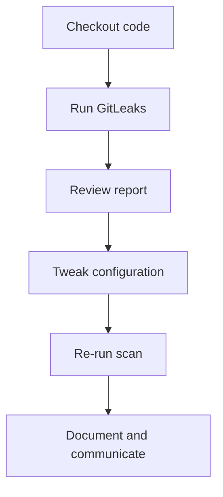

## Introduction to Application Vulnerability Scanning

Application vulnerability scanning is an essential component of modern DevSecOps practices. It helps identify potential security weaknesses within applications, ensuring that they are secure before deployment. However, one of the challenges faced during this process is dealing with false positives—issues flagged by security scanning tools that are not actual vulnerabilities. This chapter will delve into the intricacies of identifying and fixing false positives, providing a comprehensive guide to ensure your application remains secure and your development pipeline remains unblocked.

### Roles and Responsibilities in DevSecOps

In a DevSecOps environment, the roles and responsibilities are distributed among various team members. As a DevSecOps engineer, your primary responsibility is to help the development team identify and address security issues. You are responsible for integrating security scanning tools into the continuous integration/continuous deployment (CI/CD) pipeline and ensuring that the development team is aware of any security concerns.

The development team, on the other hand, is responsible for fixing the identified issues. They should review the scan results and make necessary changes to the codebase to eliminate vulnerabilities. This collaboration ensures that the application is secure and ready for deployment.

### Understanding False Positives

False positives occur when a security scanning tool incorrectly identifies a piece of code or configuration as a security issue. These false alarms can significantly disrupt the development process by blocking the pipeline and delaying releases. To effectively manage false positives, it is crucial to understand why they occur and how to mitigate them.

#### Causes of False Positives

1. **Tool Limitations**: Security scanning tools are not perfect. They rely on predefined rules and heuristics to identify potential vulnerabilities. These rules may not cover all possible scenarios, leading to false positives.
   
2. **Application Specificity**: Every application is unique, and what might be a security issue in one context may not be in another. Security scanning tools may not account for the specific nuances of your application, resulting in false positives.

3. **Configuration Issues**: Incorrectly configured security scanning tools can lead to false positives. Ensuring that the tools are properly set up and tuned for your specific application is essential.

### Identifying and Fixing False Positives

To effectively manage false positives, you need to follow a systematic approach:

1. **Review Scan Results**: Carefully review the scan results to identify any false positives. Look for patterns or common issues that are repeatedly flagged as false positives.

2. **Understand the Context**: Understand the context in which the flagged issue occurs. Is it a hardcoded value that is not sensitive? Is it a configuration that is not exploitable?

3. **Tweak the Tools**: Adjust the security scanning tools to reduce false positives. This may involve modifying the rules, adjusting the sensitivity settings, or excluding certain paths or files from the scan.

4. **Document and Communicate**: Document the false positives and communicate them to the development team. This ensures that everyone is aware of the issues and can take appropriate action.

### Example: GitLeaks Scan Results

Let's consider an example using GitLeaks, a popular tool for detecting hardcoded secrets in repositories. Suppose GitLeaks flags a hardcoded API key in a configuration file as a security issue. However, upon closer inspection, you realize that this API key is used for internal testing purposes and does not pose a real security risk.

#### Vulnerable Code Example

```yaml
# config.yaml
api_key: "abc123"
```

#### Secure Code Example

```yaml
# config.yaml
api_key: "${INTERNAL_API_KEY}"
```

By replacing the hardcoded API key with an environment variable, you can avoid the false positive while maintaining the functionality of the application.

### How to Prevent / Defend Against False Positives

#### Detection

1. **Automated Scanning**: Use automated scanning tools to identify potential false positives. Regularly review the scan results to catch any recurring issues.
   
2. **Manual Review**: Conduct manual reviews of the scan results to verify the accuracy of the flagged issues. This helps in identifying false positives that the automated tools might miss.

#### Prevention

1. **Tool Configuration**: Properly configure the security scanning tools to reduce false positives. This includes setting appropriate sensitivity levels and excluding non-sensitive paths or files from the scan.

2. **Code Reviews**: Implement regular code reviews to catch potential false positives before they are flagged by the scanning tools. This ensures that the codebase is clean and secure.

3. **Documentation**: Maintain detailed documentation of the false positives and the steps taken to resolve them. This helps in preventing similar issues in the future.

### Real-World Examples

#### Recent CVEs and Breaches

Consider the following real-world examples where false positives played a role in security breaches:

1. **CVE-2021-3427**: A vulnerability in the Apache Log4j library led to widespread exploitation. In this case, security scanning tools flagged certain log statements as potential vulnerabilities, leading to false positives. Proper configuration and tuning of the tools could have helped in reducing these false positives.

2. **SolarWinds Supply Chain Attack**: The SolarWinds supply chain attack involved the insertion of malicious code into the Orion software. Security scanning tools flagged certain code changes as potential vulnerabilities, leading to false positives. Proper review and validation of the flagged issues could have helped in preventing the attack.

### Complete Example: GitLeaks Integration

Let's walk through a complete example of integrating GitLeaks into a CI/CD pipeline and handling false positives.

#### Step 1: Install GitLeaks

First, install GitLeaks on your system. You can download it from the official repository:

```bash
wget https://github.com/zricethezav/gitleaks/releases/download/v7.15.1/gitleaks_7.15.1_linux_amd64.tar.gz
tar -xvf gitleaks_7.15.1_linux_amd64.tar.gz
sudo mv gitleaks /usr/local/bin/
```

#### Step 2: Configure GitLeaks

Configure GitLeaks to exclude certain paths or files from the scan. Create a configuration file `gitleaks.toml`:

```toml
[paths]
exclude = ["**/test/**", "**/docs/**"]

[secrets]
exclude = ["internal_api_key"]
```

#### Step 3: Integrate GitLeaks into the Pipeline

Integrate GitLeaks into your CI/CD pipeline using a script. Here’s an example using a GitHub Actions workflow:

```yaml
name: Security Scan

on:
  push:
    branches:
      - main

jobs:
  security-scan:
    runs-on: ubuntu-latest

    steps:
    - name: Checkout code
      uses: actions/checkout@v2

    - name: Run GitLeaks
      run: |
        gitleaks --config ./gitleaks.toml --repo-path . --report report.json
```

#### Step 4: Review Scan Results

After the scan completes, review the `report.json` file to identify any false positives. For example, suppose the report flags a hardcoded API key in a test file as a security issue. Upon closer inspection, you realize that this API key is used for internal testing purposes and does not pose a real security risk.

#### Step 5: Tweak the Tools

Adjust the GitLeaks configuration to exclude the test file from the scan. Update the `gitleaks.toml` file:

```toml
[paths]
exclude = ["**/test/**", "**/docs/**", "**/config/test_config.yaml"]

[secrets]
exclude = ["internal_api_key"]
```

#### Step 6: Re-run the Scan

Re-run the GitLeaks scan with the updated configuration:

```bash
gitleaks --config ./gitleaks.toml --repo-path . --report report.json
```

#### Step 7: Document and Communicate

Document the false positives and communicate them to the development team. This ensures that everyone is aware of the issues and can take appropriate action.

### Mermaid Diagrams

#### GitLeaks Workflow Diagram



### Conclusion

Managing false positives in application vulnerability scanning is a critical aspect of DevSecOps. By understanding the causes of false positives and implementing a systematic approach to identify and fix them, you can ensure that your application remains secure and your development pipeline remains unblocked. Regularly reviewing and tweaking the security scanning tools, along with proper documentation and communication, are key to effectively managing false positives.

### Practice Labs

For hands-on practice with application vulnerability scanning and false positive management, consider the following labs:

- **PortSwigger Web Security Academy**: Offers a variety of labs focused on web application security, including vulnerability scanning.
- **OWASP Juice Shop**: A deliberately insecure web application for practicing security testing and vulnerability scanning.
- **DVWA (Damn Vulnerable Web Application)**: Another popular web application for practicing security testing and vulnerability scanning.

These labs provide real-world scenarios and environments to practice and improve your skills in managing false positives and ensuring application security.

---
<!-- nav -->
[[DevSecOps/DevSecOps Bootcamp/05-Application Security Testing/02-Application Vulnerability Scanning/False Positives Fixing Security Vulnerabilities/07-Introduction to Application Vulnerability Scanning Part 6|Introduction to Application Vulnerability Scanning Part 6]] | [[DevSecOps/DevSecOps Bootcamp/05-Application Security Testing/02-Application Vulnerability Scanning/False Positives Fixing Security Vulnerabilities/00-Overview|Overview]] | [[09-Access Management and Repository Permissions|Access Management and Repository Permissions]]
