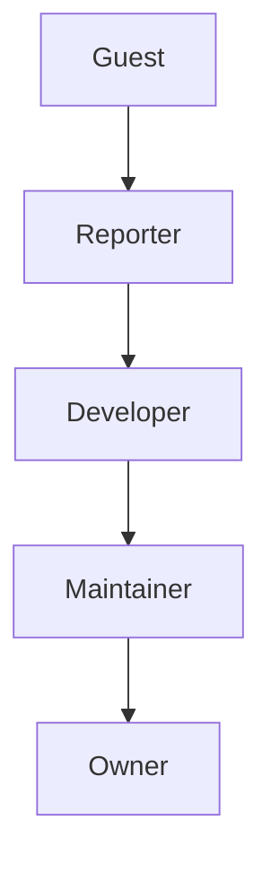
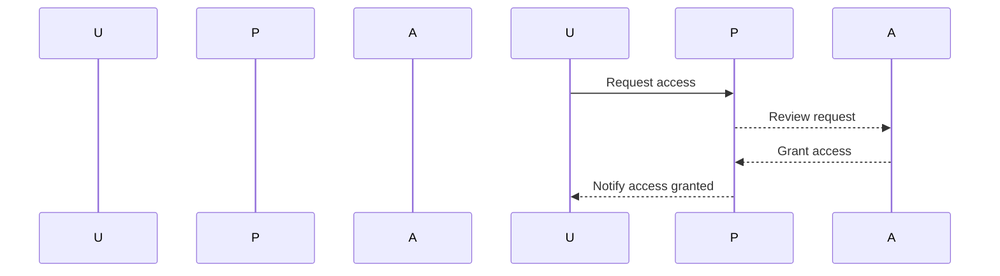

## Access Management and Repository Permissions

### Background Theory

Access management is a critical aspect of securing software development environments. It involves controlling who can access what resources within an organization's infrastructure. In the context of version control systems like Git, access management ensures that only authorized individuals can read, write, or modify code repositories. This is essential for preventing unauthorized access, accidental changes, and malicious activities that could compromise the integrity and security of the codebase.

### Granular Permission Access

Granular permission access allows organizations to define fine-grained controls over user actions within a repository. This means that instead of having a binary access model (either full access or no access), users can be granted specific permissions based on their roles and responsibilities. For example:

- **Read-only access**: Users can view the code but cannot make any changes.
- **Write access**: Users can push changes to branches but may not have permission to merge them into the main branch.
- **Merge access**: Users can merge changes into the main branch after review.
- **Admin access**: Users can manage repository settings, including permissions and hooks.

#### Example: GitLab Permission Levels

GitLab provides several permission levels that can be assigned to users:



- **Guest**: Can view the project but cannot create issues or merge requests.
- **Reporter**: Can view the project and create issues but cannot push code.
- **Developer**: Can view the project, create issues, and push code to non-default branches.
- **Maintainer**: Can view the project, create issues, push code, and manage project settings.
- **Owner**: Has full administrative rights over the project.

### Importance of Proper Access Management

Proper access management is crucial for several reasons:

1. **Security**: Limiting access to sensitive areas of the repository reduces the risk of unauthorized changes and data breaches.
2. **Control**: Ensures that only qualified individuals can perform critical tasks such as merging code into the main branch.
3. **Auditability**: Facilitates tracking who made changes and when, which is essential for compliance and incident response.

### Real-World Examples

#### Recent Breaches and CVEs

- **CVE-2021-22205**: This vulnerability in GitLab allowed unauthenticated attackers to execute arbitrary code on the server. Proper access management would have mitigated the risk by ensuring that only authenticated users had access to the repository.
- **GitHub Data Breach (2020)**: An attacker gained access to GitHub's internal systems and stole private repositories. Proper access management could have prevented unauthorized access to sensitive repositories.

### Configuring Access Management

#### Step-by-Step Mechanics

1. **Identify Roles and Responsibilities**: Determine the roles within your team and the corresponding permissions required for each role.
2. **Assign Permissions**: Configure permissions based on the identified roles. Ensure that only necessary permissions are granted.
3. **Review and Audit**: Regularly review and audit access permissions to ensure they remain appropriate and up-to-date.

#### Example Configuration: GitLab

Here’s an example of configuring access management in GitLab:



1. **Request Access**:
   - Users request access to the project.
   
2. **Review Request**:
   - Project administrators review the request and determine the appropriate level of access.
   
3. **Grant Access**:
   - Administrators grant the requested access level.
   
4. **Notify Access Granted**:
   - The system notifies the user that access has been granted.

### How to Prevent / Defend

#### Detection

- **Audit Logs**: Enable and monitor audit logs to track who accessed what and when.
- **Intrusion Detection Systems (IDS)**: Implement IDS to detect and alert on suspicious activities.

#### Prevention

- **Least Privilege Principle**: Assign the minimum necessary permissions to users.
- **Regular Audits**: Conduct regular audits to ensure that permissions are up-to-date and appropriate.

#### Secure Coding Fixes

##### Vulnerable Code Example

```yaml
# Vulnerable GitLab CI/CD Pipeline Configuration
stages:
  - build
  - test
  - deploy

build_job:
  stage: build
  script:
    - echo "Building..."
  only:
    - master

test_job:
  stage: test
  script:
    - echo "Testing..."
  only:
    - master

deploy_job:
  stage: deploy
  script:
    - echo "Deploying..."
  only:
    - master
```

##### Secure Code Example

```yaml
# Secure GitLab CI/CD Pipeline Configuration
stages:
  - build
  - test
  - deploy

build_job:
  stage: build
  script:
    - echo "Building..."
  only:
    - master
  rules:
    - if: '$CI_COMMIT_BRANCH == "master"'
      when: always

test_job:
  stage: test
  script:
    - echo "Testing..."
  only:
    - master
  rules:
    - if: '$CI_COMMIT_BRANCH == "master"'
      when: always

deploy_job:
  stage: deploy
  script:
    - echo "Deploying..."
  only:
    - master
  rules:
    - if: '$CI_COMMIT_BRANCH == "master"'
      when: manual
```

### Managing Secrets

Managing secrets is another critical aspect of securing repositories. Secrets include sensitive data such as API keys, database passwords, and other confidential information. Improper handling of secrets can lead to serious security vulnerabilities.

#### Best Practices for Managing Secrets

1. **Environment Variables**: Store secrets in environment variables rather than hardcoding them in the codebase.
2. **Secret Management Tools**: Use tools like HashiCorp Vault, AWS Secrets Manager, or Azure Key Vault to securely store and manage secrets.
3. **Encryption**: Encrypt secrets both at rest and in transit.
4. **Least Privilege**: Ensure that only necessary services and processes have access to secrets.

#### Example: Using Environment Variables

```bash
# .env file
DB_PASSWORD=your_secret_password
API_KEY=your_api_key
```

```python
# Python code example
import os

db_password = os.getenv('DB_PASSWORD')
api_key = os.getenv('API_KEY')

print(f"Database Password: {db_password}")
print(f"API Key: {api_key}")
```

### Real-World Example: Secret Exposure

#### CVE-2021-27658

This vulnerability in GitHub Actions exposed secrets due to improper handling. Proper secret management practices would have mitigated this risk.

### How to Prevent / Defend

#### Detection

- **Secret Scanners**: Use tools like TruffleHog or GitGuardian to scan repositories for exposed secrets.
- **Continuous Monitoring**: Monitor for any unauthorized access or usage of secrets.

#### Prevention

- **Use Secret Management Tools**: Leverage tools designed for secure secret management.
- **Encrypt Secrets**: Ensure that secrets are encrypted both at rest and in transit.

#### Secure Coding Fixes

##### Vulnerable Code Example

```python
# Vulnerable Python Code
db_password = "your_secret_password"
api_key = "your_api_key"

print(f"Database Password: {db_password}")
print(f"API Key: {api_key}")
```

##### Secure Code Example

```python
# Secure Python Code
import os

db_password = os.getenv('DB_PASSWORD')
api_key = os.getenv('API_KEY')

print(f"Database Password: {db_password}")
print(f"API Key: {api_key}")
```

### Conclusion

Proper access management and secret handling are fundamental to securing software development environments. By implementing granular permission access, following best practices, and using secure coding techniques, organizations can significantly reduce the risk of security vulnerabilities. Regular audits and continuous monitoring further enhance the security posture of the development environment.

### Practice Labs

For hands-on experience with application vulnerability scanning and fixing false positives, consider the following labs:

- **PortSwigger Web Security Academy**: Offers comprehensive labs on web application security, including access management and secret handling.
- **OWASP Juice Shop**: Provides a vulnerable web application for practicing security testing and vulnerability management.
- **DVWA (Damn Vulnerable Web Application)**: Another popular platform for learning web application security.

These labs provide practical scenarios to apply the concepts learned in this chapter.

---
<!-- nav -->
[[08-Introduction to Application Vulnerability Scanning|Introduction to Application Vulnerability Scanning]] | [[DevSecOps/DevSecOps Bootcamp/05-Application Security Testing/02-Application Vulnerability Scanning/False Positives Fixing Security Vulnerabilities/00-Overview|Overview]] | [[10-Understanding Application Vulnerability Scanning|Understanding Application Vulnerability Scanning]]
