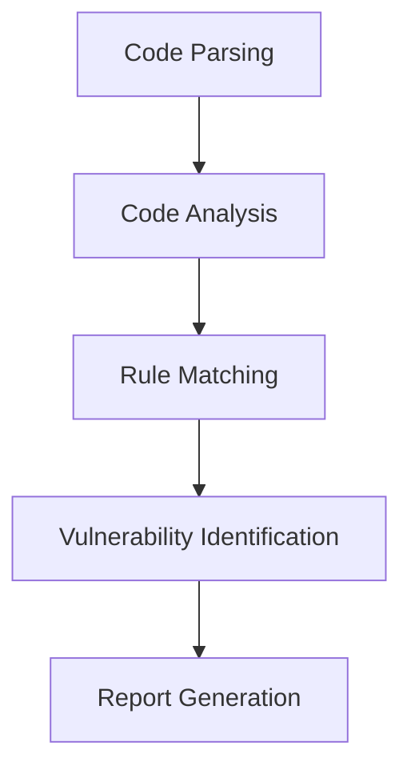

## Introduction to Application Vulnerability Scanning in DevSecOps

### What is Application Vulnerability Scanning?

Application vulnerability scanning is a process used to identify potential security vulnerabilities within an application's codebase. This process is critical in ensuring that applications are secure against various types of attacks. By integrating static application security testing (SAST) into the release pipeline, developers can catch and address security issues early in the development cycle, reducing the likelihood of vulnerabilities making it into production.

### Why is SAST Important in DevSecOps?

Static Application Security Testing (SAST) is a type of security analysis that examines the source code of an application to identify potential security vulnerabilities. Integrating SAST into the release pipeline is a fundamental step in implementing DevSecOps principles. This ensures that security is not an afterthought but is integrated into the entire development lifecycle.

#### Benefits of SAST Integration

- **Early Detection**: Identifies security issues early in the development process.
- **Developer Awareness**: Makes developers aware of security concerns and encourages secure coding practices.
- **Automated Security Checks**: Automates the process of checking for security vulnerabilities, reducing the burden on developers.
- **Continuous Improvement**: Encourages continuous improvement in code quality and security.

### Real-World Examples of SAST in Action

Recent real-world examples highlight the importance of SAST in identifying and mitigating security vulnerabilities:

- **CVE-2021-44228 (Log4Shell)**: A critical vulnerability in the Apache Log4j library that allowed remote code execution. SAST tools could have identified improper input validation and logging mechanisms.
- **CVE-2020-14882 (Zerologon)**: A vulnerability in Microsoft's Netlogon Remote Protocol that allowed attackers to gain administrative access to a Windows domain. SAST tools could have identified insecure authentication mechanisms.

### How SAST Works Under the Hood

SAST tools analyze the source code of an application to identify potential security vulnerabilities. They typically work by:

1. **Parsing the Code**: Breaking down the code into smaller, manageable chunks.
2. **Analyzing the Code**: Using predefined rules and heuristics to identify patterns that indicate potential security issues.
3. **Reporting Findings**: Generating reports that highlight the identified vulnerabilities and provide recommendations for remediation.

#### Example of a SAST Tool: SAMGREP

SAMGREP is a hypothetical SAST tool used in the context of the lecture. Let's explore how it works in detail:



1. **Code Parsing**: SAMGREP parses the source code to understand its structure and logic.
2. **Code Analysis**: It then analyzes the code to identify potential security issues based on predefined rules.
3. **Rule Matching**: SAMGREP matches the code against a set of rules that define known security vulnerabilities.
4. **Vulnerability Identification**: Once a match is found, SAMGREP identifies the vulnerability and its location in the code.
5. **Report Generation**: Finally, SAMGREP generates a report detailing the identified vulnerabilities and provides recommendations for remediation.

### Common Vulnerabilities Identified by SAST

The lecture mentions several common vulnerabilities identified by SAMGREP:

- **SQL Injection**
- **Path Traversal**
- **Template Injection**

Let's delve deeper into each of these vulnerabilities:

#### SQL Injection

SQL injection is a common vulnerability where an attacker injects malicious SQL statements into an application's database queries. This can lead to unauthorized data access, data manipulation, or even complete system compromise.

##### Example of SQL Injection

Consider the following vulnerable code snippet:

```python
def get_user_details(user_id):
    query = f"SELECT * FROM users WHERE id = {user_id}"
    cursor.execute(query)
    return cursor.fetchall()
```

An attacker could inject a malicious SQL statement by providing a user ID like `1 OR 1=1`.

##### Secure Code Fix

To prevent SQL injection, use parameterized queries:

```python
def get_user_details(user_id):
    query = "SELECT * FROM users WHERE id = %s"
    cursor.execute(query, (user_id,))
    return cursor.fetchall()
```

#### Path Traversal

Path traversal is a vulnerability where an attacker manipulates file paths to access or modify files outside the intended directory. This can lead to unauthorized access to sensitive files or directories.

##### Example of Path Traversal

Consider the following vulnerable code snippet:

```python
def read_file(filename):
    with open(f"/app/data/{filename}", "r") as file:
        return file.read()
```

An attacker could provide a filename like `../../etc/passwd` to access sensitive system files.

##### Secure Code Fix

To prevent path traversal, validate and sanitize the input:

```python
import os

def read_file(filename):
    base_dir = "/app/data/"
    safe_filename = os.path.join(base_dir, filename)
    if not os.path.commonpath([safe_filename, base_dir]) == base_dir:
        raise ValueError("Invalid filename")
    with open(safe_filename, "r") as file:
        return file.read()
```

#### Template Injection

Template injection is a vulnerability where an attacker injects malicious code into templates used by an application. This can lead to arbitrary code execution or data exfiltration.

##### Example of Template Injection

Consider the following vulnerable code snippet:

```python
from jinja2 import Template

def render_template(template_data, context):
    template = Template(template_data)
    return template.render(context)
```

An attacker could provide a template like `{{ config.SECRET_KEY }}` to exfiltrate sensitive data.

##### Secure Code Fix

To prevent template injection, escape user inputs:

```python
from jinja2 import Template

def render_template(template_data, context):
    template = Template(template_data)
    return template.render(context, autoescape=True)
```

### How to Prevent / Defend Against Vulnerabilities

#### Detection

Detection involves using SAST tools to identify potential security vulnerabilities in the codebase. Regularly running SAST scans helps ensure that new vulnerabilities are caught early.

#### Prevention

Prevention involves implementing secure coding practices and using automated tools to enforce security policies. Here are some key strategies:

- **Secure Coding Practices**: Follow secure coding guidelines and best practices.
- **Automated Tools**: Use SAST tools to automatically scan the codebase for vulnerabilities.
- **Code Reviews**: Conduct regular code reviews to catch and address security issues.

#### Secure-Coding Fixes

Show the vulnerable pattern and the corrected secure version side by side:

**Vulnerable Code: SQL Injection**

```python
def get_user_details(user_id):
    query = f"SELECT * FROM users WHERE id = {user_id}"
    cursor.execute(query)
    return cursor.fetchall()
```

**Secure Code: SQL Injection**

```python
def get_user_details(user_id):
    query = "SELECT * FROM users WHERE id = %s"
    cursor.execute(query, (user_id,))
    return cursor.fetchall()
```

**Vulnerable Code: Path Traversal**

```python
def read_file(filename):
    with open(f"/app/data/{filename}", "r") as file:
        return file.read()
```

**Secure Code: Path Traversal**

```python
import os

def read_file(filename):
    base_dir = "/app/data/"
    safe_filename = os.path.join(base_dir, filename)
    if not os.path.commonpath([safe_filename, base_dir]) == base_dir:
        raise ValueError("Invalid filename")
    with open(safe_filename, "r") as file:
        return file.read()
```

**Vulnerable Code: Template Injection**

```python
from jinja2 import Template

def render_template(template_data, context):
    template = Template(template_data)
    return template.render(context)
```

**Secure Code: Template Injection**

```python
from jinja2 import Template

def render_template(template_data, context):
    template = Template(template_data)
    return template.render(context, autoescape=True)
```

### Configuring SAST in the Release Pipeline

Integrating SAST into the release pipeline involves configuring the build and deployment processes to include SAST scans. This ensures that security checks are performed automatically as part of the development workflow.

#### Example Configuration: Jenkins Pipeline

Here is an example of how to configure a Jenkins pipeline to include SAST scans:

```groovy
pipeline {
    agent any
    stages {
        stage('Build') {
            steps {
                sh 'mvn clean package'
            }
        }
        stage('Test') {
            steps {
                sh 'mvn test'
            }
        }
        stage('Security Scan') {
            steps {
                sh 'samgrep --config=samgrep-config.yaml --report-format=json > sast-report.json'
            }
        }
        stage('Deploy') {
            steps {
                sh 'kubectl apply -f deployment.yaml'
            }
        }
    }
}
```

In this example, the `Security Scan` stage runs the SAMGREP tool to perform SAST scans and generate a report.

### Full HTTP Request and Response Example

When integrating SAST into the release pipeline, it is essential to understand the HTTP requests and responses involved. Here is an example of a full HTTP request and response:

#### HTTP Request

```http
POST /api/v1/security-scan HTTP/1.1
Host: example.com
Content-Type: application/json
Authorization: Bearer <access_token>

{
    "project": "my-project",
    "branch": "main",
    "commit": "abc123"
}
```

#### HTTP Response

```http
HTTP/1.1 200 OK
Date: Tue, 15 Nov 2022 12:00:00 GMT
Content-Type: application/json
Content-Length: 123

{
    "status": "success",
    "message": "Security scan initiated successfully",
    "scan_id": "12345"
}
```

### Common Pitfalls and Best Practices

#### Common Pitfalls

- **Ignoring SAST Reports**: Developers might ignore SAST reports, leading to unaddressed vulnerabilities.
- **False Positives**: SAST tools can generate false positives, causing unnecessary noise.
- **Configuration Issues**: Incorrect configuration of SAST tools can lead to incomplete or inaccurate scans.

#### Best Practices

- **Regular Scans**: Run SAST scans regularly as part of the development workflow.
- **Address Findings**: Address the findings reported by SAST tools promptly.
- **Configure Properly**: Configure SAST tools properly to avoid false positives and ensure comprehensive coverage.

### Hands-On Labs for Practice

For hands-on practice with SAST integration in DevSecOps, consider the following labs:

- **PortSwigger Web Security Academy**: Offers interactive labs to practice web application security.
- **OWASP Juice Shop**: A deliberately insecure web application for practicing security testing.
- **DVWA (Damn Vulnerable Web Application)**: A PHP/MySQL web application that contains numerous security vulnerabilities.

### Conclusion

Integrating SAST into the release pipeline is a crucial step in implementing DevSecOps principles. By automating security checks and making developers aware of security concerns, organizations can significantly improve the security of their applications. Regularly running SAST scans and addressing the findings is essential to maintaining a secure codebase.

By following the best practices and using the recommended tools and labs, developers can effectively integrate SAST into their workflows and ensure that their applications are secure against various types of attacks.

---
<!-- nav -->
[[DevSecOps/DevSecOps Bootcamp/05-Application Security Testing/02-Application Vulnerability Scanning/Integrate SAST Scans in Release Pipeline/00-Overview|Overview]] | [[DevSecOps/DevSecOps Bootcamp/05-Application Security Testing/02-Application Vulnerability Scanning/Integrate SAST Scans in Release Pipeline/02-Introduction to Application Vulnerability Scanning Part 1|Introduction to Application Vulnerability Scanning Part 1]]
