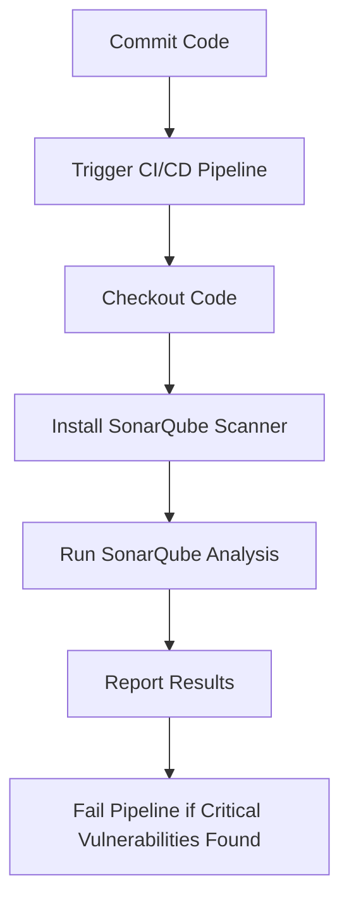

## Introduction to Application Vulnerability Scanning

Application vulnerability scanning is a critical component of modern software development practices, particularly within the DevSecOps framework. This process involves systematically identifying potential security weaknesses in an application's codebase before it reaches production. Static Application Security Testing (SAST) is one such technique used to analyze the source code for vulnerabilities without executing the program. This chapter delves into integrating SAST scans into the release pipeline, explaining the importance, mechanics, and practical implementation of this practice.

### Importance of SAST in the Release Pipeline

The primary goal of integrating SAST scans into the release pipeline is to ensure that no significant security vulnerabilities slip through to production. Ideally, a well-implemented SAST scan should not find tens or hundreds of vulnerabilities on every pipeline run. Instead, the objective is to catch critical issues early in the development cycle, allowing developers to address them promptly.

#### Teaching Secure Coding Practices

To achieve this, it is essential to teach the development team to write secure code and configure applications and underlying systems securely. This includes understanding common security vulnerabilities such as SQL injection, Cross-Site Scripting (XSS), and improper input validation. These vulnerabilities can provide attackers with opportunities to exploit the application.

### Understanding Security Vulnerabilities

Before diving into the specifics of SAST, let's review some common types of security vulnerabilities:

1. **SQL Injection**: Occurs when an attacker manipulates a SQL query by inserting malicious SQL statements via input data from the client to the application.
2. **Cross-Site Scripting (XSS)**: Happens when an attacker injects malicious scripts into web pages viewed by other users.
3. **Improper Input Validation**: When user inputs are not properly validated and sanitized, leading to potential exploitation.

These vulnerabilities can be exploited if the code is not checked for security issues. Therefore, validating the code for security vulnerabilities is crucial.

### Static Application Security Testing (SAST)

Static Application Security Testing (SAST) is a method of analyzing the source code of an application to identify security vulnerabilities. Unlike Dynamic Application Security Testing (DAST), which requires the application to be executed, SAST analyzes the code without running it. This makes SST particularly useful for catching issues early in the development lifecycle.

#### Tools for SAST

There are numerous tools available for performing SAST, and the choice of tool often depends on the programming language and specific requirements of the project. Some popular SAST tools include:

- **SonarQube**: Supports multiple programming languages and provides detailed reports on code quality and security issues.
- **Fortify Static Code Analyzer**: Specializes in finding security vulnerabilities in code written in various programming languages.
- **Checkmarx**: Offers comprehensive SAST capabilities and integrates well with CI/CD pipelines.

### Language-Specific SAST Tools

Since each programming language has its unique syntax and structure, many SAST tools are specialized for specific languages. For instance, a tool designed for JavaScript might look for patterns indicative of SQL injection vulnerabilities differently than a tool designed for Java.

#### Example: SQL Injection in JavaScript

Consider the following JavaScript code snippet:

```javascript
const userInput = req.body.username;
const sqlQuery = `SELECT * FROM users WHERE username = '${userInput}'`;
```

This code is vulnerable to SQL injection because it directly incorporates user input into the SQL query. A more secure approach would involve parameterized queries:

```javascript
const userInput = req.body.username;
const sqlQuery = `SELECT * FROM users WHERE username = ?`;
db.query(sqlQuery, [userInput], (err, results) => {
    // Handle results
});
```

In this corrected version, the user input is passed as a parameter, preventing SQL injection.

### Multi-Language SAST Tools

While language-specific tools are highly effective, there are also SaaS tools that can understand and test multiple programming languages. These tools are particularly useful in polyglot environments where applications are built using a mix of languages.

#### Example: SonarQube

SonarQube supports multiple languages and provides detailed reports on code quality and security issues. Here’s how you might integrate SonarQube into a CI/CD pipeline:

1. **Install SonarQube Scanner**: Ensure the SonarQube scanner is installed in your development environment.
2. **Configure SonarQube Project**: Create a `sonar-project.properties` file to specify project details and analysis settings.

```properties
# sonar-project.properties
sonar.projectKey=my_project
sonar.sources=src
sonar.language=js
sonar.host.url=http://localhost:9000
sonar.login=your_token
```

3. **Run Analysis**: Add a step in your CI/CD pipeline to run the SonarQube analysis.

```bash
sonar-scanner
```

### Real-World Examples and Recent Breaches

Recent breaches and CVEs highlight the importance of SAST in catching vulnerabilities early. For example, the Equifax breach in 2017 was partly due to an unpatched Apache Struts vulnerability. Integrating SAST could have helped identify and mitigate such issues earlier.

### Common Pitfalls and Best Practices

#### Common Pitfalls

1. **False Positives**: SAST tools can sometimes generate false positives, leading to unnecessary work for developers.
2. **Configuration Issues**: Improperly configured SAST tools may miss critical vulnerabilities.
3. **Ignoring Results**: Developers might ignore SAST results, leading to unresolved vulnerabilities.

#### Best Practices

1. **Regular Updates**: Keep SAST tools updated to ensure they can detect the latest vulnerabilities.
2. **Integrate Early**: Integrate SAST into the early stages of the development cycle to catch issues before they become deeply embedded.
3. **Review Results**: Regularly review SAST results and address identified vulnerabilities promptly.

### How to Prevent / Defend

#### Detection

To effectively detect vulnerabilities, integrate SAST into the CI/CD pipeline. Ensure that the pipeline fails if SAST identifies critical vulnerabilities.

#### Prevention

1. **Secure Coding Practices**: Train developers in secure coding practices to reduce the likelihood of introducing vulnerabilities.
2. **Code Reviews**: Conduct regular code reviews to catch and address security issues.
3. **Automated Testing**: Use automated testing tools to continuously monitor and improve code quality.

#### Secure-Coding Fixes

Compare the vulnerable code with the secure version to illustrate the necessary changes:

**Vulnerable Code:**

```javascript
const userInput = req.body.username;
const sqlQuery = `SELECT * FROM users WHERE username = '${userInput}'`;
```

**Secure Code:**

```javascript
const userInput = req.body.username;
const sqlQuery = `SELECT * FROM users WHERE username = ?`;
db.query(sqlQuery, [userInput], (err, results) => {
    // Handle results
});
```

### Complete Example: Integration with CI/CD Pipeline

Here’s a complete example of integrating SAST into a CI/CD pipeline using GitHub Actions and SonarQube:

1. **GitHub Actions Workflow File** (`/.github/workflows/sast.yml`):

```yaml
name: SAST Scan

on:
  push:
    branches:
      - main
  pull_request:
    branches:
      - main

jobs:
  build:
    runs-on: ubuntu-latest

    steps:
    - name: Checkout code
      uses: actions/checkout@v2

    - name: Install SonarQube Scanner
      run: |
        wget https://binaries.sonarsource.com/Distribution/sonar-scanner-cli/sonar-scanner-cli-4.6.2.2472-linux.zip
        unzip sonar-scanner-cli-4.6.2.2472-linux.zip
        cd sonar-scanner-4.6.2.2472-linux/bin

    - name: Run SonarQube Analysis
      run: |
        ./sonar-scanner -Dsonar.projectKey=my_project -Dsonar.sources=src -Dsonar.language=js -Dsonar.host.url=http://localhost:9000 -Dsonar.login=your_token
```

2. **SonarQube Project Configuration** (`sonar-project.properties`):

```properties
sonar.projectKey=my_project
sonar.sources=src
sonar.language=js
sonar.host.url=http://localhost:9000
sonar.login=your_token
```

### Mermaid Diagrams

#### CI/CD Pipeline with SAST Integration



### Hands-On Labs

For hands-on practice with SAST integration, consider the following labs:

- **PortSwigger Web Security Academy**: Offers interactive labs to learn about various security vulnerabilities and how to detect them.
- **OWASP Juice Shop**: A deliberately insecure web application for security training purposes.
- **DVWA (Damn Vulnerable Web Application)**: Another intentionally vulnerable web application for learning security concepts.

### Conclusion

Integrating SAST scans into the release pipeline is a crucial step in ensuring the security of modern applications. By teaching secure coding practices, using appropriate SAST tools, and regularly reviewing and addressing vulnerabilities, organizations can significantly reduce the risk of security breaches.

---
<!-- nav -->
[[08-Introduction to Application Vulnerability Scanning Part 7|Introduction to Application Vulnerability Scanning Part 7]] | [[DevSecOps/DevSecOps Bootcamp/05-Application Security Testing/02-Application Vulnerability Scanning/Integrate SAST Scans in Release Pipeline/00-Overview|Overview]] | [[10-Introduction to Secure Code and Application Vulnerability Scanning|Introduction to Secure Code and Application Vulnerability Scanning]]
