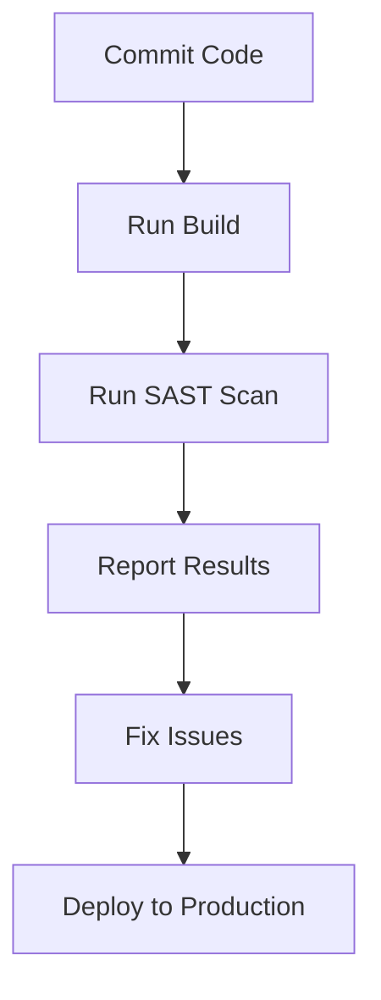

## Introduction to Secure Code and Application Vulnerability Scanning

### What is Secure Code?

Secure code refers to the practice of writing software in a manner that minimizes the potential for security vulnerabilities. This means that the code should be designed and implemented in a way that prevents unauthorized access, data breaches, and other security threats. Secure coding practices are essential because they help ensure that applications are robust and resilient against various types of attacks.

#### Why Secure Code Matters

In today’s interconnected world, software vulnerabilities can have severe consequences. A single vulnerability can lead to data breaches, financial losses, and damage to an organization's reputation. For instance, the Equifax breach in 2017, which exposed sensitive information of over 143 million people, was caused by a vulnerability in Apache Struts. This highlights the importance of secure coding practices.

### Understanding Application Vulnerability Scanning

Application vulnerability scanning is the process of identifying weaknesses in software applications that could be exploited by attackers. There are several types of vulnerability scanning tools, including Static Application Security Testing (SAST), Dynamic Application Security Testing (DAST), and Interactive Application Security Testing (IAST).

#### Static Application Security Testing (SAST)

SAST tools analyze the source code of an application to identify potential security vulnerabilities. These tools can detect issues such as SQL injection, cross-site scripting (XSS), and buffer overflows. SAST is particularly useful during the development phase because it can catch vulnerabilities early in the lifecycle.

### Integrating SAST Scans in the Release Pipeline

Integrating SAST scans into the release pipeline is a critical step in ensuring that applications are secure. By automating the scanning process, teams can catch and address vulnerabilities before the code is deployed to production.

#### Setting Up a SAST Scan

To integrate SAST scans into your release pipeline, you need to choose a suitable SAST tool and configure it to run automatically as part of your build process. Here is an example using SonarQube, a popular SAST tool:



#### Example Configuration with SonarQube

SonarQube can be integrated into a CI/CD pipeline using plugins or scripts. Below is an example of how to configure a Jenkins pipeline to run SonarQube analysis:

```yaml
pipeline {
    agent any
    stages {
        stage('Build') {
            steps {
                sh 'mvn clean package'
            }
        }
        stage('SonarQube Analysis') {
            steps {
                withSonarQubeEnv('SonarQube') {
                    sh 'mvn sonar:sonar'
                }
            }
        }
    }
}
```

### Real-World Examples and Recent CVEs

#### Example: Heartbleed Bug (CVE-2014-0160)

The Heartbleed bug was a serious vulnerability in the OpenSSL cryptographic software library. It allowed attackers to read sensitive information from the memory of servers and clients. This vulnerability could have been detected earlier if SAST tools were used during the development process.

#### Example: Equifax Breach (CVE-2017-5638)

The Equifax breach was caused by a vulnerability in Apache Struts. This vulnerability could have been identified and fixed if regular SAST scans were performed on the codebase.

### Common Pitfalls and How to Avoid Them

#### Common Pitfalls

1. **Ignoring False Positives**: SAST tools may generate false positives, leading developers to ignore legitimate vulnerabilities.
2. **Incomplete Coverage**: Not all parts of the codebase may be analyzed, leaving some vulnerabilities undetected.
3. **Outdated Rules**: Using outdated rules can result in missing new types of vulnerabilities.

#### How to Avoid Pitfalls

1. **Review False Positives**: Developers should review false positives to ensure that legitimate vulnerabilities are not overlooked.
2. **Ensure Complete Coverage**: Ensure that all parts of the codebase are analyzed by the SAST tool.
3. **Keep Rules Updated**: Regularly update the rules used by the SAST tool to ensure that it can detect the latest types of vulnerabilities.

### How to Prevent / Defend

#### Detection

Detection involves regularly running SAST scans to identify potential vulnerabilities. This can be done as part of the continuous integration (CI) process.

#### Prevention

Prevention involves educating developers on secure coding practices and ensuring that they follow these practices consistently. This can be achieved through training programs and code reviews.

#### Secure Coding Fixes

Here is an example of a vulnerable code snippet and its secure counterpart:

**Vulnerable Code:**
```java
public String getUsername() {
    return username;
}
```

**Secure Code:**
```java
public String getUsername() {
    if (username == null) {
        throw new NullPointerException("Username cannot be null");
    }
    return username;
}
```

#### Configuration Hardening

Configuration hardening involves securing the environment in which the application runs. This can be achieved by configuring firewalls, disabling unnecessary services, and using secure protocols.

### Hands-On Labs

For hands-on practice with SAST scans, consider the following labs:

- **PortSwigger Web Security Academy**: Offers interactive labs on web application security.
- **OWASP Juice Shop**: A deliberately insecure web application for practicing security testing.
- **DVWA (Damn Vulnerable Web Application)**: A PHP/MySQL web application that is riddled with vulnerabilities for educational purposes.

These labs provide practical experience in identifying and fixing security vulnerabilities in real-world applications.

### Conclusion

Integrating SAST scans into the release pipeline is a crucial step in ensuring that applications are secure. By automating the scanning process, teams can catch and address vulnerabilities early in the development cycle. This not only reduces the risk of security breaches but also helps in building a culture of secure coding within the organization.

---
<!-- nav -->
[[09-Introduction to Application Vulnerability Scanning|Introduction to Application Vulnerability Scanning]] | [[DevSecOps/DevSecOps Bootcamp/05-Application Security Testing/02-Application Vulnerability Scanning/Integrate SAST Scans in Release Pipeline/00-Overview|Overview]] | [[11-Introduction to Static Application Security Testing (SAST)|Introduction to Static Application Security Testing (SAST)]]
