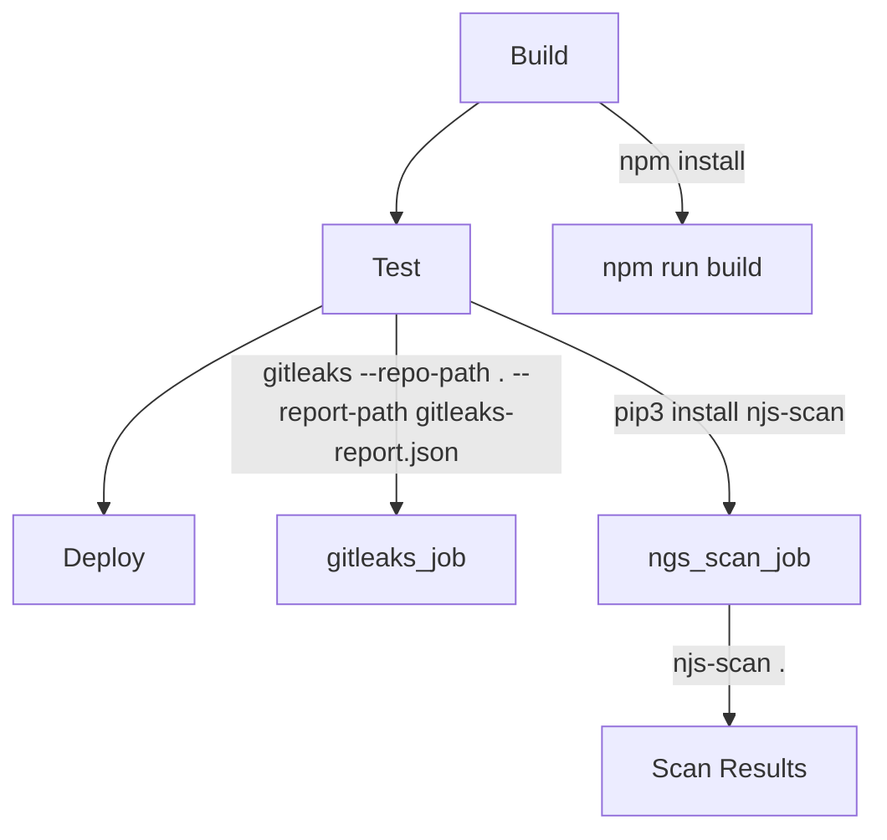

## Integrating SAST into the DevSecOps Pipeline

To integrate SAST into the DevSecOps pipeline, we need to add a job that runs the SAST tool during the build process. This ensures that security checks are performed automatically whenever changes are pushed to the repository.

### Step-by-Step Integration

Let's walk through the process of integrating `Node.js Scan` into our GitLab CI/CD pipeline.

#### 1. Add a New Job

We will add a new job called `NGS_scan` right after the `GitLeaks` job in the `test` stage of our `.gitlab-ci.yml` file.

```yaml
stages:
  - build
  - test
  - deploy

build_job:
  stage: build
  script:
    - npm install
    - npm run build

gitleaks_job:
  stage: test
  script:
    - gitleaks --repo-path . --report-path gitleaks-report.json

ngs_scan_job:
  stage: test
  image: python:3.9
  before_script:
    - pip3 install ngs-scan
  script:
    - ngs-scan .
```

#### 2. Configure the Docker Image

We will use a Python Docker image to run the `NGS_scan` job. This image comes with `pip3` pre-installed, which we will use to install the `njs-scan` package.

#### 3. Install the SAST Tool

In the `before_script` section, we install the `njs-scan` package using `pip3`.

```bash
pip3 install njs-scan
```

#### 4. Run the SAST Tool

The `script` section contains the command to run the `njs-scan` tool. We pass the current directory (`.`) as the location to scan.

```bash
njs-scan .
```

### Full Example of `.gitlab-ci.yml`

Here is the complete `.gitlab-ci.yml` file with the added `NGS_scan` job:

```yaml
stages:
  - build
  - test
  - deploy

build_job:
  stage: build
  script:
    - npm install
    - npm run build

gitleaks_job:
  stage: test
  script:
    - gitleaks --repo-path . --report-path gitleaks-report.json

ngs_scan_job:
  stage: test
  image: python:3.9
  before_script:
    - pip3 install njs-scan
  script:
    - njs-scan .
```

### Explanation of Each Section

- **Stages**: Defines the stages of the pipeline (`build`, `test`, `deploy`).
- **build_job**: Installs dependencies and builds the project.
- **gitleaks_job**: Runs `GitLeaks` to detect secrets in the codebase.
- **ngs_scan_job**: Runs the `njs-scan` tool to perform static security analysis.

### Mermaid Diagram of the Pipeline



### Common Pitfalls and Best Practices

#### 1. False Positives

One common issue with SAST tools is false positives. These occur when the tool flags code as potentially vulnerable, but upon closer inspection, the code is actually safe. To mitigate this, it is important to review the findings manually and adjust the tool's settings to reduce false positives.

#### 2. Performance Impact

Running SAST tools can be resource-intensive, especially for large codebases. To minimize performance impact, consider running SAST jobs only on critical branches or at specific times (e.g., nightly).

#### 3. Integration with Other Tools

Integrating SAST with other security tools like Dynamic Application Security Testing (DAST) and Interactive Application Security Testing (IAST) can provide a more comprehensive security analysis.

### Real-World Examples

#### Example: CVE-2021-21972

CVE-2021-21972 is a vulnerability in the `express-rate-limit` middleware for Node.js applications. This middleware is used to limit the number of requests from a single IP address within a specified time frame. However, a flaw in the implementation allowed attackers to bypass rate limiting by manipulating the `X-Forwarded-For` header.

A SAST tool like `njs-scan` could detect this vulnerability by analyzing the usage of `express-rate-limit` and flagging any insecure configurations.

### How to Prevent / Defend

#### 1. Secure Coding Practices

Implement secure coding practices to avoid common vulnerabilities. For example, always validate user input and use parameterized queries to prevent SQL injection.

#### 2. Regular Updates

Keep your dependencies up-to-date to ensure you have the latest security patches. Use tools like `npm audit` to check for known vulnerabilities in your dependencies.

#### 3. Automated Security Testing

Integrate automated security testing tools like SAST, DAST, and IAST into your CI/CD pipeline to catch vulnerabilities early.

#### 4. Secure Configuration Management

Use tools like `njs-scan` to ensure your application's configuration is secure. For example, ensure that sensitive information like API keys and database credentials are not hardcoded in the source code.

### Complete Example of Secure vs. Insecure Code

#### Insecure Code

```javascript
const express = require('express');
const rateLimit = require('express-rate-limit');

const app = express();

// Insecure configuration
app.use(rateLimit({
  windowMs: 15 * 60 * 1000, // 15 minutes
  max: 100,
}));

app.listen(3000, () => {
  console.log('Server started on port 3000');
});
```

#### Secure Code

```javascript
const express = require('express');
const rateLimit = require('express-rate-limit');

const app = express();

// Secure configuration
app.use(rateLimit({
  windowMs: 15 * 60 * 1000, // 15 minutes
  max: 100,
  handler: (req, res) => {
    res.status(429).send('Too many requests, please try again later.');
  },
}));

app.listen(3000, () => {
  console.log('Server started on port .3000');
});
```

### Hands-On Labs

To practice integrating SAST into your DevSecOps pipeline, consider the following labs:

- **PortSwigger Web Security Academy**: Offers interactive labs to learn about web application security.
- **OWASP Juice Shop**: A deliberately insecure web application for practicing security testing.
- **DVWA (Damn Vulnerable Web Application)**: A PHP/MySQL web application that is riddled with vulnerabilities for educational purposes.
- **WebGoat**: A deliberately insecure Java web application maintained by OWASP.

These labs provide a practical way to apply the concepts learned in this chapter and gain hands-on experience with integrating SAST into your CI/CD pipeline.

By following these steps and best practices, you can effectively integrate SAST into your DevSecOps pipeline and improve the security of your applications.

---
<!-- nav -->
[[12-Installation|Installation]] | [[DevSecOps/DevSecOps Bootcamp/05-Application Security Testing/02-Application Vulnerability Scanning/Integrate SAST Scans in Release Pipeline/00-Overview|Overview]] | [[14-Integration with CICD Systems|Integration with CICD Systems]]
