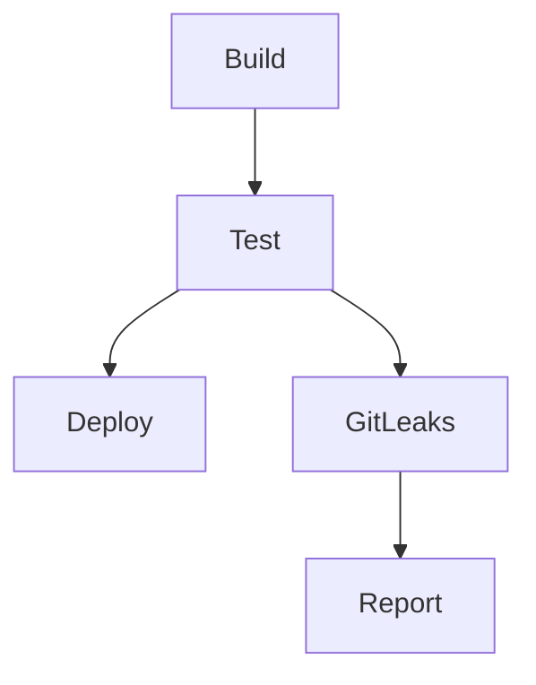

## Introduction to Application Vulnerability Scanning and Pre-Commit Hooks

Application vulnerability scanning is a critical component of modern DevSecOps practices. It helps identify potential security issues in the codebase before they are deployed to production environments. One effective method to integrate security checks into the development process is through pre-commit hooks, which run automatically before a developer commits changes to the repository. In this chapter, we will focus on integrating GitLeaks, a popular secret scanning tool, into a CI/CD pipeline using Docker and GitLab CI.

### Background Theory

#### What is GitLeaks?

GitLeaks is an open-source tool designed to scan repositories for secrets, such as API keys, access tokens, and other sensitive information. It works by analyzing the commit history of a repository and identifying patterns that match known secret formats. This helps prevent accidental exposure of sensitive data in public repositories.

#### Why Use GitLeaks?

Using GitLeaks in your CI/CD pipeline ensures that developers do not accidentally commit sensitive information to the repository. This is particularly important in open-source projects and organizations that handle sensitive data. By catching these issues early, you can mitigate the risk of data breaches and ensure compliance with security policies.

#### How Does GitLeaks Work?

GitLeaks operates by analyzing the commit history of a repository. It looks for patterns that match known secret formats, such as:

- API keys
- Access tokens
- Passwords
- SSH keys
- Private keys

When GitLeaks identifies a potential secret, it flags the commit and provides details about the detected secret. This allows developers to review the flagged commits and take appropriate action, such as removing the secret from the repository.

### Integrating GitLeaks into a CI/CD Pipeline

To integrate GitLeaks into a CI/CD pipeline, we will use GitLab CI and Docker. This setup ensures that the pipeline is flexible and can be easily adapted to different environments and platforms.

#### GitLab CI Architecture

Before diving into the integration, let's briefly review the GitLab CI architecture. GitLab CI uses runners to execute jobs defined in the pipeline. These runners can be:

- **Shared Runners**: Provided by GitLab and used by default.
- **Specific Runners**: Configured by users to run specific types of jobs.

Each job in the pipeline can be assigned to a different runner, allowing for parallel execution and flexibility in resource management.

#### Using Docker in GitLab CI

Docker is a containerization technology that allows you to package applications and their dependencies into lightweight, portable containers. In GitLab CI, Docker images are used to define the environment in which jobs are executed. This ensures consistency across different runners and environments.

By using Docker images, you can:

- **Ensure Consistency**: Each job runs in a consistent environment, regardless of the underlying runner.
- **Isolate Dependencies**: Each job can have its own set of dependencies, isolated from other jobs.
- **Ease Maintenance**: You can update the Docker image independently of the pipeline code, making maintenance easier.

### Setting Up the GitLeaks Job

Now, let's set up the GitLeaks job in our GitLab CI pipeline. We will use a Docker image to run GitLeaks and integrate it into the pipeline.

#### Step-by-Step Setup

1. **Create a `.gitlab-ci.yml` File**:
   This file defines the jobs and stages in the pipeline. We will add a new job for GitLeaks.

```yaml
stages:
  - build
  - test
  - deploy

build_job:
  stage: build
  script:
    - echo "Building the application..."

test_job:
  stage: test
  script:
    - echo "Running tests..."

deploy_job:
  stage: deploy
  script:
    - echo "Deploying the application..."

gitleaks_job:
  stage: test
  image: gitleaks/gitleaks:latest
  script:
    - gitleaks --repo-path . --report-path gitleaks-report.json
```

2. **Explanation of the `.gitlab-ci.yml` File**:
   - **Stages**: Defines the stages in the pipeline (`build`, `test`, `deploy`).
   - **Jobs**: Each job is defined under a specific stage.
     - `build_job`: Builds the application.
     - `test_job`: Runs tests.
     - `deploy_job`: Deploys the application.
     - `gitleaks_job`: Runs GitLeaks to scan for secrets.

3. **Using Docker Image**:
   - The `image` keyword specifies the Docker image to use for the job. Here, we use the latest version of the `gitleaks/gitleaks` image.
   - The `script` keyword contains the commands to run in the Docker container. In this case, we run `gitleaks` to scan the repository and generate a report.

### Running the Pipeline

Once the `.gitlab-ci.yml` file is set up, you can push the changes to the repository and trigger the pipeline. The GitLab CI server will execute the jobs in the specified order, including the GitLeaks job.

#### Example Pipeline Execution

1. **Build Stage**:
   - The `build_job` runs first, building the application.

2. **Test Stage**:
   - The `test_job` runs next, executing the tests.
   - The `gitleaks_job` runs concurrently, scanning the repository for secrets.

3. **Deploy Stage**:
   - The `deploy_job` runs last, deploying the application.

### Handling Detected Secrets

If GitLeaks detects any secrets in the repository, it will generate a report and flag the commits containing the secrets. You can then review the report and take appropriate action, such as removing the secrets from the repository.

#### Example Report

The `gitleaks-report.json` file generated by GitLeaks might look like this:

```json
{
  "secrets": [
    {
      "commit": "abc123",
      "file": "src/main.js",
      "line": 10,
      "secret": "api_key_12345"
    },
    {
      "commit": "def456",
      "file": "config.json",
      "line": 5,
      "secret": "access_token_67890"
    }
  ]
}
```

### How to Prevent / Defend

#### Detection

To detect secrets in the repository, you can run GitLeaks manually or integrate it into the CI/CD pipeline as described above. Regularly running GitLeaks helps catch secrets early and prevent accidental exposure.

#### Prevention

To prevent accidental exposure of secrets, follow these best practices:

1. **Use Environment Variables**: Store sensitive information in environment variables instead of hardcoding them in the codebase.
2. **Use Secret Management Tools**: Use tools like HashiCorp Vault or AWS Secrets Manager to manage and store secrets securely.
3. **Educate Developers**: Train developers on the importance of keeping secrets out of the codebase and provide guidelines on how to handle sensitive information.

#### Secure Coding Fixes

Here is an example of a vulnerable code snippet and its secure counterpart:

**Vulnerable Code**:
```javascript
const apiKey = 'api_key_12345';
```

**Secure Code**:
```javascript
const apiKey = process.env.API_KEY;
```

In the secure code, the API key is stored in an environment variable, preventing it from being hardcoded in the codebase.

### Real-World Examples

#### Recent Breaches

One notable breach involving exposed secrets occurred in 2021 when a misconfigured GitHub repository exposed AWS credentials, leading to unauthorized access to sensitive data. This incident highlights the importance of regularly scanning repositories for secrets.

#### CVEs

CVE-2021-22205 is an example of a vulnerability related to exposed secrets. This CVE involved a misconfigured Kubernetes deployment that exposed sensitive information, leading to unauthorized access. Using tools like GitLeaks can help prevent such vulnerabilities.

### Mermaid Diagrams

#### GitLab CI Pipeline Topology



This diagram shows the topology of the GitLab CI pipeline, with the GitLeaks job running concurrently with the test stage.

### Conclusion

Integrating GitLeaks into your CI/CD pipeline is a crucial step in ensuring the security of your codebase. By catching secrets early, you can prevent accidental exposure and mitigate the risk of data breaches. Using Docker and GitLab CI provides a flexible and maintainable solution that can be easily adapted to different environments and platforms.

### Practice Labs

For hands-on practice with GitLeaks and CI/CD pipelines, consider the following labs:

- **PortSwigger Web Security Academy**: Offers exercises on securing web applications and integrating security tools into CI/CD pipelines.
- **OWASP Juice Shop**: Provides a vulnerable web application for practicing security testing and integrating security tools.
- **DVWA (Damn Vulnerable Web Application)**: Another vulnerable web application for practicing security testing and integrating security tools.

These labs provide practical experience in integrating GitLeaks and other security tools into CI/CD pipelines, helping you master the skills needed to secure your codebase effectively.

---
<!-- nav -->
[[DevSecOps/DevSecOps Bootcamp/05-Application Security Testing/02-Application Vulnerability Scanning/Pre commit Hook for Secret Scanning Integrating GitLeaks in CI Pipeline/00-Overview|Overview]] | [[DevSecOps/DevSecOps Bootcamp/05-Application Security Testing/02-Application Vulnerability Scanning/Pre commit Hook for Secret Scanning Integrating GitLeaks in CI Pipeline/02-Introduction to Application Vulnerability Scanning and Secret Scanning|Introduction to Application Vulnerability Scanning and Secret Scanning]]
