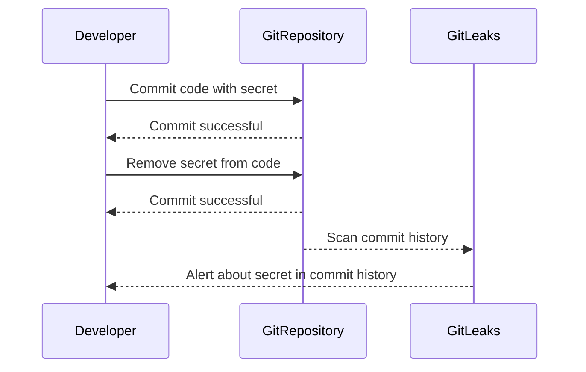

## Introduction to Application Vulnerability Scanning with GitLeaks

Application vulnerability scanning is an essential component of modern DevSecOps practices. One critical aspect of this process is ensuring that sensitive information, such as API keys, passwords, and other secrets, does not accidentally get committed to version control systems like Git. This is where tools like GitLeaks come into play.

### What is GitLeaks?

GitLeaks is an open-source tool designed to scan Git repositories for secrets and sensitive data. It works by analyzing the commit history of a repository to identify patterns that match known secret formats. By doing so, GitLeaks helps developers and security teams catch and mitigate potential security risks early in the development lifecycle.

### Why Use GitLeaks?

The primary reason for using GitLeaks is to prevent accidental exposure of sensitive information. Even if a developer removes a secret from the current version of the code, the secret might still exist in the commit history. This means that anyone with access to the repository can potentially retrieve the secret by examining past commits.

### How Does GitLeaks Work?

GitLeaks operates by scanning the entire commit history of a Git repository. It looks for patterns that match known secret formats, such as:

- API keys
- Passwords
- SSH private keys
- AWS access keys
- Database credentials

By identifying these patterns, GitLeaks can alert developers and security teams to the presence of sensitive information in the repository.

### Example of GitLeaks in Action

Consider a scenario where a developer accidentally commits an AWS access key to a Git repository. Even if the developer later removes the key from the code, the key still exists in the commit history. GitLeaks would detect this and alert the team to the potential security risk.

### Real-World Examples

#### Recent Breaches Involving Secrets in Repositories

One notable example is the breach involving Tesla's AWS credentials. In 2020, Tesla's AWS credentials were exposed in a public GitHub repository. This incident highlights the importance of using tools like GitLeaks to prevent such exposures.



### Integrating GitLeaks into a CI Pipeline

To effectively integrate GitLeaks into a CI pipeline, you need to set up a pre-commit hook that runs GitLeaks before each commit. This ensures that the repository is scanned for secrets at every stage of the development process.

#### Setting Up GitLeaks in a CI Pipeline

1. **Install GitLeaks**: First, you need to install GitLeaks on your system. You can download the latest release from the GitLeaks GitHub repository.

2. **Create a Pre-Commit Hook**: Next, create a pre-commit hook that runs GitLeaks. This hook should be placed in the `.git/hooks` directory of your repository.

3. **Configure the CI Pipeline**: Finally, configure your CI pipeline to run the pre-commit hook. This ensures that GitLeaks is executed before each commit.

Here is an example of how to set up a pre-commit hook for GitLeaks:

```bash
#!/bin/sh
# .git/hooks/pre-commit

# Run GitLeaks
gitleaks --report=stdout --repo-path=. --config=./gitleaks.toml
if [ $? -ne 0 ]; then
  echo "GitLeaks found secrets in the commit. Aborting commit."
  exit 1
fi
```

This script runs GitLeaks and checks the exit status. If GitLeaks finds any secrets, it aborts the commit.

### Full Example of a CI Pipeline with GitLeaks

Let's walk through a complete example of integrating GitLeaks into a CI pipeline using a popular CI tool like Jenkins.

#### Step 1: Install GitLeaks

First, ensure that GitLeaks is installed on your build server. You can download the latest release from the GitLeaks GitHub repository.

```bash
wget https://github.com/zricethezav/gitleaks/releases/download/v7.14.1/gitleaks_7.14.1_linux_amd64.tar.gz
tar -xvf gitleaks_7.14.1_linux_amd64.tar.gz
sudo mv gitleaks /usr/local/bin/
```

#### Step 2: Create a Pre-Commit Hook

Next, create a pre-commit hook that runs GitLeaks. Place this script in the `.git/hooks` directory of your repository.

```bash
#!/bin/sh
# .git/hooks/pre-commit

# Run GitLeaks
gitleaks --report=stdout --repo-path=. --config=./gitleaks.toml
if [ $? -ne 0 ]; then
  echo "GitLeaks found secrets in the commit. Aborting commit."
  exit 1
fi
```

Make sure to make the script executable:

```bash
chmod +x .git/hooks/pre-commit
```

#### Step 3: Configure the CI Pipeline

Finally, configure your CI pipeline to run the pre-commit hook. Here is an example of a Jenkins pipeline configuration:

```groovy
pipeline {
    agent any

    stages {
        stage('Pre-Commit') {
            steps {
                script {
                    sh '.git/hooks/pre-commit'
                }
            }
        }
        stage('Build') {
            steps {
                // Your build steps here
            }
        }
        stage('Test') {
            steps {
                // Your test steps here
            }
        }
    }
}
```

### Full Raw HTTP Message Example

When integrating GitLeaks into a CI pipeline, you might encounter HTTP requests and responses. Here is an example of a full raw HTTP message:

```http
POST /api/v1/jobs HTTP/1.1
Host: ci.example.com
Content-Type: application/json
Authorization: Bearer <your_token>

{
  "job": {
    "name": "pre-commit",
    "steps": [
      {
        "script": ".git/hooks/pre-commit"
      }
    ]
  }
}

HTTP/1.1 200 OK
Date: Tue, 20 Mar 2023 12:00:00 GMT
Content-Type: application/json
Content-Length: 123

{
  "status": "success",
  "message": "Job completed successfully"
}
```

### Common Pitfalls and Best Practices

#### Common Pitfalls

1. **Ignoring GitLeaks Alerts**: Developers might ignore GitLeaks alerts, thinking that the secrets are not important. This can lead to serious security vulnerabilities.
2. **Incomplete Configuration**: Not configuring GitLeaks properly can result in missed detections. Ensure that you have a comprehensive configuration file (`gitleaks.toml`) that covers all possible secret formats.
3. **False Positives**: GitLeaks might generate false positives, especially if the configuration is too broad. Fine-tuning the configuration can help reduce false positives.

#### Best Practices

1. **Regularly Update GitLeaks**: Keep GitLeaks updated to the latest version to ensure that you have the most recent patterns and configurations.
2. **Educate Developers**: Educate developers about the importance of keeping secrets out of version control systems. Regular training sessions can help reinforce this practice.
3. **Automate Remediation**: Automate the remediation process by integrating GitLeaks with your CI pipeline. This ensures that secrets are detected and removed automatically.

### How to Prevent / Defend

#### Detection

To detect secrets in your repository, you can use GitLeaks as described above. Additionally, you can use other tools like TruffleHog, which is another popular tool for detecting secrets in Git repositories.

#### Prevention

To prevent secrets from being committed to your repository, follow these best practices:

1. **Use Environment Variables**: Store secrets in environment variables instead of hardcoding them in the codebase.
2. **Use Secret Management Tools**: Use secret management tools like HashiCorp Vault or AWS Secrets Manager to manage secrets securely.
3. **Educate Developers**: Regularly educate developers about the importance of keeping secrets out of version control systems.

#### Secure Coding Fixes

Here is an example of a vulnerable code snippet and its secure counterpart:

**Vulnerable Code**

```python
import os

API_KEY = "your_api_key_here"

def fetch_data():
    url = f"https://api.example.com/data?key={API_KEY}"
    response = requests.get(url)
    return response.json()
```

**Secure Code**

```python
import os

API_KEY = os.getenv("API_KEY")

def fetch_data():
    url = f"https://api.example.com/data?key={API_KEY}"
    response = requests.get(url)
    return response.json()
```

In the secure code, the API key is retrieved from an environment variable instead of being hardcoded in the codebase.

### Configuration Hardening

To further harden your configuration, you can use tools like `gitleaks` to enforce strict policies. Here is an example of a `gitleaks.toml` configuration file:

```toml
[general]
  verbose = true
  report = "stdout"
  repoPath = "."

[secrets]
  [[secrets]]
    name = "AWS Access Key"
    regex = "(AKIA)[A-Z0-9]{16}"
    description = "AWS Access Key"
    severity = "high"

  [[secrets]]
    name = "GitHub Token"
    regex = "[0-9a-f]{40}"
    description = "GitHub Token"
    severity = "high"
```

This configuration file defines two secret patterns: one for AWS Access Keys and one for GitHub Tokens. You can customize this file to include additional secret patterns specific to your organization.

### Conclusion

Integrating GitLeaks into your CI pipeline is a crucial step in ensuring the security of your codebase. By catching and mitigating potential security risks early in the development lifecycle, you can prevent serious security vulnerabilities. Remember to regularly update GitLeaks, educate developers, and automate the remediation process to ensure the highest level of security.

### Practice Labs

For hands-on experience with GitLeaks and other DevSecOps practices, consider the following labs:

- **PortSwigger Web Security Academy**: Offers a variety of labs focused on web application security.
- **OWASP Juice Shop**: A deliberately insecure web application for practicing web security skills.
- **DVWA (Damn Vulnerable Web Application)**: Another intentionally vulnerable web application for learning web security.
- **WebGoat**: An interactive web application security training tool.

These labs provide practical experience in identifying and mitigating security vulnerabilities, including those related to secrets in version control systems.

---
<!-- nav -->
[[DevSecOps/DevSecOps Bootcamp/05-Application Security Testing/02-Application Vulnerability Scanning/Pre commit Hook for Secret Scanning Integrating GitLeaks in CI Pipeline/02-Introduction to Application Vulnerability Scanning and Secret Scanning|Introduction to Application Vulnerability Scanning and Secret Scanning]] | [[DevSecOps/DevSecOps Bootcamp/05-Application Security Testing/02-Application Vulnerability Scanning/Pre commit Hook for Secret Scanning Integrating GitLeaks in CI Pipeline/00-Overview|Overview]] | [[DevSecOps/DevSecOps Bootcamp/05-Application Security Testing/02-Application Vulnerability Scanning/Pre commit Hook for Secret Scanning Integrating GitLeaks in CI Pipeline/04-Introduction to Application Vulnerability Scanning Part 1|Introduction to Application Vulnerability Scanning Part 1]]
