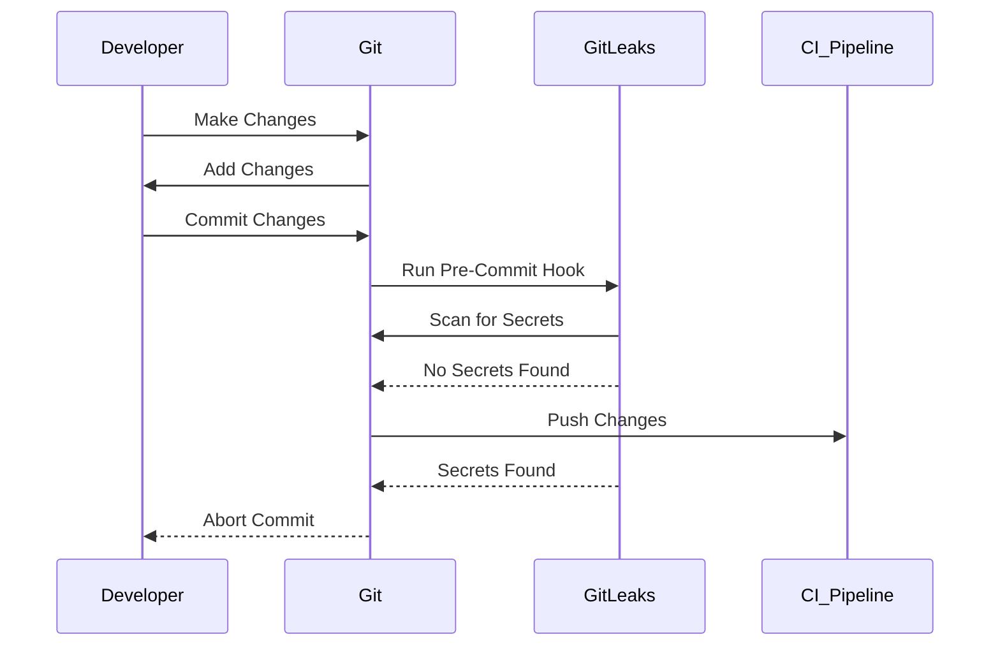

## Introduction to Application Vulnerability Scanning

Application vulnerability scanning is a critical component of DevSecOps, ensuring that applications are free from security vulnerabilities before they are deployed. One of the most effective ways to integrate security into the development process is through the use of pre-commit hooks in the Continuous Integration (CI) pipeline. Specifically, integrating tools like GitLeaks can help detect secrets and sensitive information being committed to the repository.

### What is GitLeaks?

GitLeaks is an open-source tool designed to detect secrets and sensitive information in your Git repositories. It scans the entire history of a Git repository, including commits, branches, and tags, to identify patterns that match known secret formats such as API keys, passwords, and SSH keys. By integrating GitLeaks into your CI pipeline, you can ensure that developers do not accidentally commit sensitive data to the repository.

### Why Use GitLeaks in a CI Pipeline?

Using GitLeaks in a CI pipeline provides several benefits:

1. **Proactive Detection**: GitLeaks can detect secrets before they are committed, preventing them from entering the repository.
2. **Automated Process**: Developers do not need to manually run GitLeaks; it runs automatically as part of the CI pipeline.
3. **Comprehensive Scanning**: GitLeaks scans the entire history of the repository, ensuring that no secrets are missed.
4. **Integration with Existing Tools**: GitLeaks can be easily integrated with existing CI/CD tools like Jenkins, GitHub Actions, and GitLab CI.

### How GitLeaks Works

GitLeaks works by scanning the Git repository for patterns that match known secret formats. It uses regular expressions to identify these patterns and can be configured to scan specific files or directories. Once a potential secret is detected, GitLeaks can be configured to report the finding, either by logging it to a file or sending an alert to a designated team.

### Setting Up GitLeaks in a CI Pipeline

To set up GitLeaks in a CI pipeline, you need to follow these steps:

1. **Install GitLeaks**: First, you need to install GitLeaks on your system. GitLeaks is available for various operating systems, including Linux, macOS, and Windows. You can download the latest version from the official GitLeaks GitHub repository.

2. **Create a Pre-Commit Hook**: A pre-commit hook is a script that runs before a commit is made to the repository. To create a pre-commit hook, you need to create a file named `pre-commit` in the `.git/hooks` directory of your repository.

3. **Configure the Pre-Commit Hook**: In the `pre-commit` file, you need to add the commands to run GitLeaks. Here is an example of how to configure the pre-commit hook:

```bash
#!/bin/sh
# Run GitLeaks to scan for secrets
gitleaks --path .
if [ $? -ne 0 ]; then
  echo "GitLeaks found a secret! Aborting commit."
  exit 1
fi
```

This script runs GitLeaks on the current directory (`.`) and checks the exit status. If GitLeaks finds a secret, it exits with a non-zero status, aborting the commit.

### Example of a Complete Pre-Commit Hook

Here is a more detailed example of a pre-commit hook that integrates GitLeaks:

```bash
#!/bin/sh
# Run GitLeaks to scan for secrets
echo "Running GitLeaks..."
gitleaks --path .

# Check the exit status
if [ $? -ne 0 ]; then
  echo "GitLeaks found a secret! Aborting commit."
  exit 1
else
  echo "No secrets found. Committing..."
  git commit -m "Your commit message"
fi
```

### Explanation of the Code

- **`#!/bin/sh`**: This is the shebang line, indicating that the script should be run using the `/bin/sh` shell.
- **`echo "Running GitLeaks..."`**: This prints a message to the console, indicating that GitLeaks is running.
- **`gitleaks --path .`**: This runs GitLeaks on the current directory (`.`).
- **`if [ $? -ne 0 ]; then`**: This checks the exit status of the previous command. If the exit status is not zero, it means GitLeaks found a secret.
- **`echo "GitLeaks found a secret! Aborting commit."`**: This prints a message to the console, indicating that a secret was found and the commit is aborted.
- **`exit 1`**: This exits the script with a non-zero status, aborting the commit.
- **`else`**: If no secrets are found, the script continues.
- **`echo "No secrets found. Committing..."`**: This prints a message to the console, indicating that no secrets were found and the commit is proceeding.
- **`git commit -m "Your commit message"`**: This commits the changes with the specified commit message.

### Mermaid Diagram of the Workflow

Here is a mermaid diagram illustrating the workflow of the pre-commit hook:



### Common Pitfalls and How to Avoid Them

1. **False Positives**: GitLeaks may sometimes flag legitimate strings as secrets. To avoid false positives, you can configure GitLeaks to ignore certain patterns or directories.
2. **Performance Issues**: Running GitLeaks on large repositories can be slow. To improve performance, you can configure GitLeaks to scan only specific directories or files.
3. **Ignoring Important Secrets**: Ensure that GitLeaks is configured to scan for all types of secrets, including API keys, passwords, and SSH keys.

### How to Prevent / Defend

#### Detection

To detect secrets in your Git repository, you can use GitLeaks as described above. Additionally, you can use other tools like TruffleHog, which is another open-source tool for detecting secrets in Git repositories.

#### Prevention

To prevent secrets from being committed to the repository, you can:

1. **Educate Developers**: Train developers on the importance of not committing secrets and how to use tools like GitLeaks.
2. **Use Pre-Commit Hooks**: Integrate GitLeaks into the CI pipeline using pre-commit hooks, as described above.
3. **Regular Audits**: Regularly audit the repository for secrets using tools like GitLeaks.

#### Secure Coding Fixes

Here is an example of a vulnerable code snippet and the corresponding secure code:

**Vulnerable Code:**

```python
import os

api_key = os.getenv('API_KEY')
print(api_key)
```

**Secure Code:**

```python
import os

def get_api_key():
    api_key = os.getenv('API_KEY')
    if api_key:
        return api_key
    else:
        raise ValueError("API_KEY environment variable not set")

try:
    api_key = get_api_key()
    print(api_key)
except ValueError as e:
    print(e)
```

In the secure code, the `get_api_key` function checks if the `API_KEY` environment variable is set before returning it. If it is not set, it raises a `ValueError`.

### Real-World Examples

#### Recent Breaches

One recent breach involving secrets in a Git repository occurred in 2021 when a developer accidentally committed an AWS access key to a public GitHub repository. The access key was used to gain unauthorized access to the developer's AWS account, leading to a significant financial loss.

#### CVEs

A notable CVE related to secrets in Git repositories is CVE-2021-3014, which involved a developer accidentally committing a private SSH key to a public GitHub repository. The SSH key was used to gain unauthorized access to the developer's GitHub account, leading to a compromise of multiple repositories.

### Conclusion

Integrating GitLeaks into your CI pipeline using pre-commit hooks is a powerful way to ensure that secrets and sensitive information are not committed to your Git repository. By following the steps outlined in this chapter, you can set up a robust security process that helps protect your application from security vulnerabilities.

### Practice Labs

For hands-on practice with GitLeaks and pre-commit hooks, consider the following labs:

- **PortSwigger Web Security Academy**: Offers a module on secret scanning and GitLeaks integration.
- **OWASP Juice Shop**: Provides a lab environment where you can practice integrating GitLeaks into a CI pipeline.
- **DVWA (Damn Vulnerable Web Application)**: Includes a module on secret scanning and GitLeaks integration.

By completing these labs, you can gain practical experience with integrating GitLeaks into your CI pipeline and ensure that your application is secure from secrets and sensitive information.

---
<!-- nav -->
[[06-Introduction to Application Vulnerability Scanning Part 3|Introduction to Application Vulnerability Scanning Part 3]] | [[DevSecOps/DevSecOps Bootcamp/05-Application Security Testing/02-Application Vulnerability Scanning/Pre commit Hook for Secret Scanning Integrating GitLeaks in CI Pipeline/00-Overview|Overview]] | [[08-Introduction to Application Vulnerability Scanning Part 5|Introduction to Application Vulnerability Scanning Part 5]]
