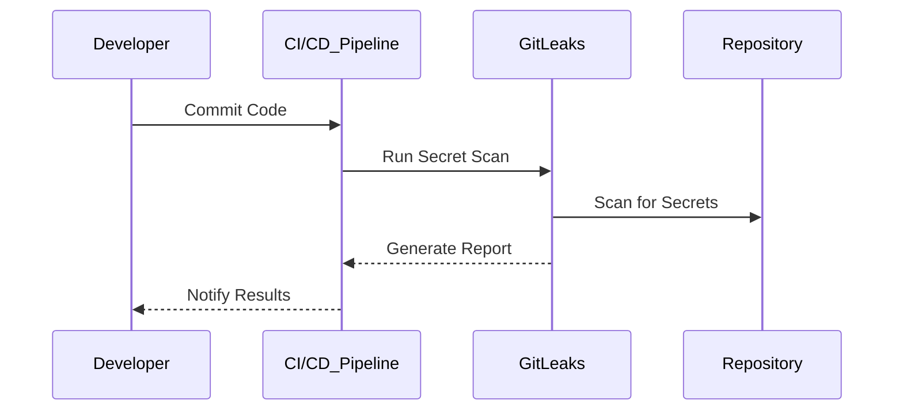

## Introduction to Application Vulnerability Scanning

Application vulnerability scanning is a critical component of modern DevSecOps practices. It helps identify potential security weaknesses in the codebase before it reaches production, thereby reducing the risk of vulnerabilities being exploited. One such tool that can be integrated into the Continuous Integration/Continuous Deployment (CI/CD) pipeline is GitLeaks. GitLeaks is designed to scan repositories for secrets and sensitive data that might have been accidentally committed, such as API keys, passwords, or private keys.

### Why Automate Vulnerability Scanning?

In the context of DevSecOps, automation is key to ensuring that security checks are consistently applied across the development lifecycle. Relying on developers to manually run security tools on every commit is impractical and error-prone. By integrating these tools into the CI/CD pipeline, we ensure that security checks are performed automatically and consistently, reducing the likelihood of human error.

### GitLeaks: A Tool for Secret Scanning

GitLeaks is an open-source tool that scans Git repositories for secrets and sensitive information. It supports various types of secrets, including API keys, passwords, and private keys. The tool can be run locally or integrated into a CI/CD pipeline using a Docker image.

#### Installing GitLeaks Locally

To install GitLeaks locally, you can follow these steps:

1. **Download the latest release** from the GitLeaks GitHub repository.
2. **Extract the archive** and place the executable in a directory included in your system's PATH.

Here is an example of how to download and extract GitLeaks:

```bash
wget https://github.com/zricethezav/gitleaks/releases/download/v7.13.1/gitleaks_7.13.1_Linux_x86_64.tar.gz
tar -xvf gitleaks_7.13.1_Linux_x86_64.tar.gz
sudo mv gitleaks /usr/local/bin/
```

#### Running GitLeaks Locally

Once installed, you can run GitLeaks to scan a Git repository. Here is an example command:

```bash
gitleaks --repo-path=/path/to/repo --report-path=/path/to/report.json
```

This command scans the specified Git repository and generates a report in JSON format.

### Integrating GitLeaks into the CI/CD Pipeline

Integrating GitLeaks into the CI/CD pipeline ensures that secret scanning is performed automatically on every commit. This can be achieved using a Docker image, which simplifies the setup process and ensures consistency across different environments.

#### Using GitLeaks Docker Image

The GitLeaks Docker image can be used to run the tool within a CI/CD pipeline. Here is an example of how to use the Docker image in a Jenkins pipeline:

```yaml
pipeline {
    agent { docker 'zricethezav/gitleaks' }
    stages {
        stage('Scan for Secrets') {
            steps {
                script {
                    sh 'gitleaks --repo-path=/path/to/repo --report-path=/path/to/report.json'
                }
            }
        }
    }
}
```

This Jenkins pipeline uses the GitLeaks Docker image to scan the specified Git repository and generate a report.

### Configuring Different Tools in the CI/CD Pipeline

Configuring different tools in the CI/CD pipeline can be complex, especially when dealing with multiple technologies. Historically, tools like Jenkins required manual installation or the use of plugins to run specific commands. However, using Docker images simplifies this process by providing a consistent environment for running tools.

#### Historical Context: Jenkins Configuration

In the past, configuring tools like NPM, Node.js, or executing unit tests in Jenkins required manual steps:

1. **SSH into the Jenkins server** and install the necessary tools.
2. **Install plugins** for specific tools if available.
3. **Configure the Jenkins job** to use the installed tools.

This process was time-consuming and prone to errors, especially when dealing with multiple tools or updates.

#### Modern Approach: Using Docker Images

Using Docker images simplifies the configuration process by providing a consistent environment for running tools. Here is an example of how to configure a Jenkins pipeline using Docker images:

```yaml
pipeline {
    agent { docker 'node:latest' }
    stages {
        stage('Install Dependencies') {
            steps {
                sh 'npm install'
            }
        }
        stage('Run Unit Tests') {
            steps {
                sh 'npm test'
            }
        }
        stage('Scan for Secrets') {
            agent { docker 'zricethezav/gitleaks' }
            steps {
                sh 'gitleaks --repo-path=/path/to/repo --report-path=/path/to/report.json'
            }
        }
    }
}
```

This pipeline uses Docker images to run different stages, ensuring consistency and reducing the need for manual configuration.

### Handling Updates and Changes

As new versions of tools like GitLeaks are released, it is important to update the pipeline to leverage the latest features and improvements. Using Docker images makes it easier to update the pipeline, as you can simply pull the latest image.

#### Example: Updating GitLeaks

To update GitLeaks in the pipeline, you can modify the Docker image tag:

```yaml
pipeline {
    agent { docker 'zricethezav/gitleaks:v7.113.1' }
    stages {
        stage('Scan for Secrets') {
            steps {
                sh 'gitleaks --repo-path=/path/to/repo --report-path=/path/to/report.json'
            }
        }
    }
}
```

By specifying the version tag, you ensure that the pipeline uses the desired version of GitLeaks.

### Real-World Examples and Breaches

Several real-world examples highlight the importance of secret scanning in the CI/CD pipeline. For instance, the **GitHub Actions security incident** (CVE-2021-22205) demonstrated the risks of exposing secrets in repositories. In this case, attackers exploited a vulnerability in GitHub Actions to gain unauthorized access to repositories and steal secrets.

#### Example: GitHub Actions Security Incident

In February 2021, a vulnerability in GitHub Actions allowed attackers to gain unauthorized access to repositories and steal secrets. This incident underscores the importance of secret scanning and the need to integrate such tools into the CI/CD pipeline.

### How to Prevent / Defend

To prevent and defend against secret exposure, it is crucial to implement robust security measures in the CI/CD pipeline. Here are some best practices:

#### Secure Coding Practices

Implement secure coding practices to avoid committing secrets to repositories. Use environment variables and secure vaults to manage secrets.

##### Example: Using Environment Variables

Instead of hardcoding secrets in the code, use environment variables:

```bash
export API_KEY=your_api_key_here
```

Then, reference the environment variable in your code:

```python
import os

api_key = os.getenv('API_KEY')
```

#### Secret Management Tools

Use secret management tools like HashiCorp Vault or AWS Secrets Manager to securely store and manage secrets.

##### Example: Using HashiCorp Vault

HashiCorp Vault provides a secure way to store and manage secrets. Here is an example of how to retrieve a secret from Vault:

```bash
vault kv get secret/data/api-key
```

#### Regular Audits and Scans

Regularly audit and scan repositories for secrets using tools like GitLeaks. Integrate these tools into the CI/CD pipeline to ensure continuous monitoring.

##### Example: GitLeaks Scan Report

Here is an example of a GitLeaks scan report:

```json
{
  "results": [
    {
      "commit": "abc123",
      "file": "src/main.py",
      "line": 10,
      "secret": "your_secret_here",
      "type": "API Key"
    }
  ]
}
```

### Common Pitfalls and Best Practices

#### Common Pitfalls

1. **Manual Installation**: Relying on manual installation of tools can lead to inconsistencies and errors.
2. **Outdated Tools**: Using outdated tools can miss new vulnerabilities and features.
3. **Ignoring Reports**: Ignoring scan reports can result in undetected secrets.

#### Best Practices

1. **Automate Everything**: Automate the installation and execution of tools in the CI/CD pipeline.
2. **Regular Updates**: Regularly update tools to leverage the latest features and improvements.
3. **Review Reports**: Regularly review scan reports to address detected issues.

### Conclusion

Integrating GitLeaks into the CI/CD pipeline is a crucial step in ensuring the security of your codebase. By automating secret scanning, you reduce the risk of exposing sensitive information and improve overall security posture. Using Docker images simplifies the configuration process and ensures consistency across different environments.

### Practice Labs

For hands-on practice with application vulnerability scanning and integrating GitLeaks into the CI/CD pipeline, consider the following labs:

- **PortSwigger Web Security Academy**: Offers interactive labs for learning web security concepts.
- **OWASP Juice Shop**: A deliberately insecure web application for practicing security testing.
- **DVWA (Damn Vulnerable Web Application)**: A PHP/MySQL web application that demonstrates web application vulnerabilities.
- **WebGoat**: An interactive training application for learning about web application security.

These labs provide practical experience in identifying and addressing security vulnerabilities in web applications.



This sequence diagram illustrates the flow of secret scanning in the CI/CD pipeline using GitLeaks. The developer commits code, triggering the CI/CD pipeline to run GitLeaks, which scans the repository for secrets and generates a report. The results are then notified to the developer.

### Full Example: Complete CI/CD Pipeline with GitLeaks

Here is a complete example of a CI/CD pipeline using GitLeaks:

```yaml
pipeline {
    agent any
    stages {
        stage('Checkout Code') {
            steps {
                checkout scm
            }
        }
        stage('Install Dependencies') {
            steps {
                script {
                    sh 'npm install'
                }
            }
        }
        stage('Run Unit Tests') {
            steps {
                script {
                    sh 'npm test'
                }
            }
        }
        stage('Scan for Secrets') {
            agent { docker 'zricethezav/gitleaks:v7.13.1' }
            steps {
                script {
                    sh 'gitleaks --repo-path=. --report-path=./gitleaks-report.json'
                }
            }
        }
        stage('Notify Results') {
            steps {
                script {
                    sh 'cat ./gitleaks-report.json'
                }
            }
        }
    }
}
```

This pipeline includes stages for checking out code, installing dependencies, running unit tests, scanning for secrets using GitLeaks, and notifying the results.

### Conclusion

Integrating GitLeaks into the CI/CD pipeline is essential for ensuring the security of your codebase. By automating secret scanning, you reduce the risk of exposing sensitive information and improve overall security posture. Using Docker images simplifies the configuration process and ensures consistency across different environments. Regular audits and scans are crucial for maintaining a secure codebase.

---
<!-- nav -->
[[09-Introduction to Application Vulnerability Scanning Part 6|Introduction to Application Vulnerability Scanning Part 6]] | [[DevSecOps/DevSecOps Bootcamp/05-Application Security Testing/02-Application Vulnerability Scanning/Pre commit Hook for Secret Scanning Integrating GitLeaks in CI Pipeline/00-Overview|Overview]] | [[11-Introduction to Pre-Commit Hooks|Introduction to Pre-Commit Hooks]]
