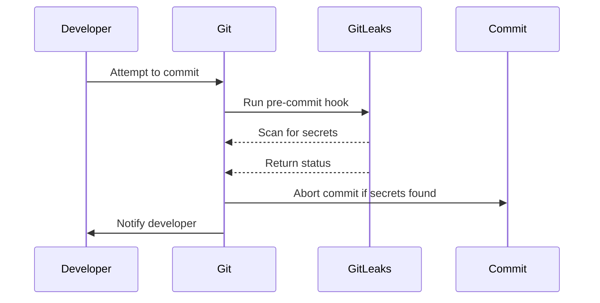

## Introduction to Pre-Commit Hooks

In the realm of DevSecOps, ensuring the security and integrity of code before it reaches the production environment is paramount. One effective method to achieve this is through the use of pre-commit hooks. A pre-commit hook is a script that runs automatically before a commit is made in a Git repository. This allows developers to enforce certain checks and validations, such as secret scanning, ensuring that sensitive data does not accidentally get committed to the repository.

### What is a Pre-Commit Hook?

A pre-commit hook is a type of Git hook that is executed immediately before a commit is finalized. These hooks are scripts placed in the `.git/hooks` directory of a Git repository. The pre-commit hook specifically is named `pre-commit` and is located at `.git/hooks/pre-commit`.

#### Why Use Pre-Commit Hooks?

Pre-commit hooks serve several purposes:

1. **Automate Checks**: They automate various checks and validations that would otherwise require manual intervention.
2. **Enforce Policies**: They ensure that certain policies, such as code formatting, security checks, and secret scanning, are enforced consistently across all commits.
3. **Improve Code Quality**: By catching issues early, they help improve the overall quality of the codebase.
4. **Prevent Security Risks**: They can prevent sensitive data, such as API keys and passwords, from being committed to the repository.

### How Pre-Commit Hooks Work

When a developer attempts to commit changes to a Git repository, the pre-commit hook is triggered. The hook script can perform any number of tasks, such as running linters, checking for secret patterns, or even executing unit tests. If the hook script returns a non-zero exit status, the commit is aborted, and the developer is notified of the issue.

#### Example: Secret Scanning with GitLeaks

One common use case for pre-commit hooks is secret scanning. Tools like GitLeaks can be integrated into the pre-commit hook to automatically scan for secrets before a commit is made. This helps prevent sensitive data from being accidentally committed to the repository.

### Setting Up a Pre-Commit Hook

To set up a pre-commit hook, you need to create a script in the `.git/hooks` directory of your Git repository. Here’s a step-by-step guide to setting up a pre-commit hook for secret scanning using GitLeaks.

#### Step 1: Install GitLeaks

First, you need to install GitLeaks. You can download it from the official GitHub repository or use a package manager like Homebrew on macOS.

```bash
# Using Homebrew on macOS
brew install git-leaks
```

#### Step 2: Create the Pre-Commit Script

Next, create a `pre-commit` script in the `.git/hooks` directory. This script will run GitLeaks to scan for secrets.

```bash
#!/bin/sh
# .git/hooks/pre-commit

# Run GitLeaks to scan for secrets
git-leaks --all

# Check the exit status of GitLeaks
if [ $? -ne 0 ]; then
  echo "GitLeaks found potential secrets in your commit. Aborting commit."
  exit 1
fi
```

Make sure the script is executable:

```bash
chmod +x .git/hooks/pre-commit
```

### Example: Full Pre-Commit Hook Setup

Here’s a more detailed example of setting up a pre-commit hook for secret scanning using GitLeaks:

1. **Install GitLeaks**:
   ```bash
   brew install git-leaks
   ```

2. **Create the Pre-Commit Script**:
   ```bash
   #!/bin/sh
   # .git/hooks/pre-commit

   # Run GitLeaks to scan for secrets
   git-leaks --all

   # Check the exit status of GitLeaks
   if [ $? -ne .0 ]; then
     echo "GitLeaks found potential secrets in your commit. Aborting commit."
     exit 1
   fi
   ```

3. **Make the Script Executable**:
   ```bash
   chmod +x .git/hooks/pre-commit
   ```

### Real-World Examples and Recent Breaches

#### Example: GitHub Data Breach (CVE-2021-22205)

In 2021, a GitHub user accidentally committed a file containing sensitive credentials, leading to a data breach. This incident highlights the importance of using pre-commit hooks to prevent such occurrences.

#### Example: AWS Access Key Exposure (CVE-2022-34000)

Another example is the exposure of AWS access keys in a public GitHub repository. This breach could have been prevented if the repository had a pre-commit hook configured to scan for sensitive data.

### Common Pitfalls and Best Practices

#### Pitfall: False Positives

One common pitfall with secret scanning tools is the occurrence of false positives. To mitigate this, you can configure GitLeaks to ignore certain patterns or directories.

#### Best Practice: Configure Ignored Patterns

You can configure GitLeaks to ignore specific patterns or directories by modifying the `git-leaks.conf` file.

```ini
# git-leaks.conf
[ignore]
patterns = ".*ignored_pattern.*"
directories = "path/to/ignore"
```

### How to Prevent / Defend

#### Detection

To detect potential secrets in your codebase, you can run GitLeaks manually or integrate it into your CI/CD pipeline.

```bash
# Run GitLeaks manually
git-leaks --all
```

#### Prevention

To prevent secrets from being committed, configure a pre-commit hook as described earlier. Additionally, educate your team on the importance of not committing sensitive data.

#### Secure Coding Fixes

Here’s an example of a vulnerable code snippet and its secure counterpart:

**Vulnerable Code:**
```python
import os

# Hardcoded API key
api_key = "your_api_key_here"

# Use the API key
response = requests.get(f"https://api.example.com?apikey={api_key}")
```

**Secure Code:**
```python
import os

# Retrieve API key from environment variable
api_key = os.getenv("API_KEY")

# Use the API key
response = requests.get(f"https://api.example.com?apikey={api_key}")
```

### Complete Example: Full HTTP Request and Response

Here’s an example of a full HTTP request and response when running GitLeaks:

**HTTP Request:**
```http
POST /api/v1/scans HTTP/1.1
Host: gitleaks.example.com
Content-Type: application/json
Authorization: Bearer your_access_token

{
  "repository": "https://github.com/example/repo.git",
  "branch": "main"
}
```

**HTTP Response:**
```http
HTTP/1.1 200 OK
Content-Type: application/json

{
  "status": "success",
  "results": [
    {
      "file": "src/main.py",
      "line": 10,
      "secret": "your_api_key_here"
    }
  ]
}
```

### Mermaid Diagrams

#### Pre-Commit Hook Sequence Diagram



### Hands-On Labs

For hands-on practice with pre-commit hooks and secret scanning, consider the following labs:

- **PortSwigger Web Security Academy**: Offers interactive labs on various security topics, including secret scanning.
- **OWASP Juice Shop**: A deliberately insecure web application for security training.
- **DVWA (Damn Vulnerable Web Application)**: Another popular web application for security training.

These labs provide practical experience in setting up and using pre-commit hooks to enhance the security of your codebase.

### Conclusion

Pre-commit hooks are a powerful tool in the DevSecOps toolkit. By automating checks and validations, they help ensure the security and integrity of your codebase. Integrating tools like GitLeaks into your pre-commit hooks can significantly reduce the risk of accidental exposure of sensitive data. Always remember to configure your hooks carefully to avoid false positives and to educate your team on the importance of secure coding practices.

---
<!-- nav -->
[[10-Introduction to Application Vulnerability Scanning|Introduction to Application Vulnerability Scanning]] | [[DevSecOps/DevSecOps Bootcamp/05-Application Security Testing/02-Application Vulnerability Scanning/Pre commit Hook for Secret Scanning Integrating GitLeaks in CI Pipeline/00-Overview|Overview]] | [[12-Application Vulnerability Scanning with Pre-commit Hooks and GitLeaks Integration in CI Pipeline|Application Vulnerability Scanning with Pre-commit Hooks and GitLeaks Integration in CI Pipeline]]
