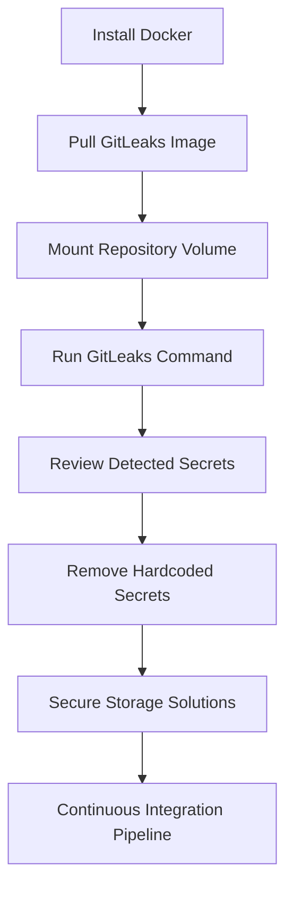

## Introduction to Application Vulnerability Scanning with GitLeaks

Application vulnerability scanning is a critical component of DevSecOps practices. One specific type of vulnerability scanning focuses on detecting hardcoded secrets within an application's source code. This process is essential because hardcoded secrets, such as API keys, database credentials, and other sensitive information, can lead to severe security breaches if exposed.

### What is GitLeaks?

GitLeaks is an open-source tool designed to scan repositories for hardcoded secrets. It searches through the commit history of a repository to identify instances where sensitive information might have been committed accidentally. By using GitLeaks, developers can ensure that their repositories remain free from hardcoded secrets, thereby reducing the risk of security vulnerabilities.

### Why Use GitLeaks?

The primary reason for using GitLeaks is to prevent the accidental exposure of sensitive information. Hardcoded secrets can be easily overlooked during code reviews, and once committed, they become part of the repository's history. This can lead to serious security issues if the repository is publicly accessible or if it falls into the wrong hands.

### How Does GitLeaks Work?

GitLeaks works by analyzing the commit history of a repository. It looks for patterns that match known secret formats, such as API keys, database passwords, and SSH keys. Once it identifies potential secrets, it flags them for review. This allows developers to take corrective action, such as removing the secrets from the repository and updating their secure storage mechanisms.

### Prerequisites for Using GitLeaks

Before diving into the practical aspects of using GitLeaks, let's cover the prerequisites:

1. **Docker Installation**: GitLeaks is often run using a Docker container. Therefore, you need to have Docker installed on your local machine. If you haven't installed Docker yet, you can download it from the official Docker website.

2. **Repository Setup**: Ensure that you have access to the repository you want to scan. This could be a local repository or a remote one that you can clone.

### Setting Up GitLeaks Using Docker

To set up GitLeaks using Docker, follow these steps:

1. **Pull the GitLeaks Docker Image**:
   First, you need to pull the GitLeaks Docker image from Docker Hub. You can do this using the following command:

   ```bash
   docker pull gitleaks/gitleaks
   ```

   This command will download the latest version of the GitLeaks Docker image.

2. **Mount the Repository Volume**:
   Next, you need to mount the volume containing your repository into the Docker container. This allows GitLeaks to access the repository files and scan them for secrets.

   ```bash
   docker run --rm -v $(pwd):/repo gitleaks/gitleaks detect --path /repo
   ```

   Here, `$(pwd)` refers to the current working directory, which should contain your repository. The `--path /repo` option specifies the path inside the container where the repository will be mounted.

### Understanding the GitLeaks Command

Let's break down the GitLeaks command used above:

- `docker run`: This command runs a new container from the specified image.
- `--rm`: This flag automatically removes the container after it exits.
- `-v $(pwd):/repo`: This flag mounts the current working directory (`$(pwd)`) to `/repo` inside the container.
- `gitleaks/gitleaks`: This is the name of the Docker image.
- `detect`: This is the main command that tells GitLeaks to start scanning the repository for secrets.
- `--path /repo`: This option specifies the path to the repository inside the container.

### Real-World Example: CVE-2021-22205

A real-world example of the importance of secret scanning is the CVE-2021-22205 vulnerability. In this case, a hardcoded API key was found in the source code of a popular open-source project. This led to unauthorized access to the project's backend services, resulting in a significant security breach.

By using GitLeaks, developers can proactively identify and remove such hardcoded secrets, preventing similar incidents from occurring.

### Common Pitfalls and Best Practices

When using GitLeaks, there are several common pitfalls to avoid:

1. **False Positives**: GitLeaks may sometimes flag non-sensitive information as a secret. It's important to manually verify the flagged items to ensure they are indeed secrets.

2. **Incomplete Scans**: Ensure that the entire repository is scanned, including all branches and tags. Missing even a single commit can lead to undetected secrets.

3. **Regular Scans**: Perform regular scans of your repositories to catch any newly committed secrets. This can be automated using continuous integration (CI) pipelines.

### How to Prevent / Defend Against Hardcoded Secrets

#### Detection

To detect hardcoded secrets, you can integrate GitLeaks into your CI/CD pipeline. This ensures that every commit is scanned for secrets before being merged into the main branch.

```yaml
# Example .github/workflows/ci.yml
name: CI

on:
  push:
    branches: [ main ]
  pull_request:
    branches: [ main ]

jobs:
  build:
    runs-on: ubuntu-latest

    steps:
    - uses: actions/checkout@v2
    - name: Run GitLeaks
      run: |
        docker run --rm -v $(pwd):/repo gitleaks/gitleaks detect --path /repo
```

#### Prevention

To prevent hardcoded secrets, follow these best practices:

1. **Use Environment Variables**: Store sensitive information in environment variables instead of hardcoding them in the source code.

2. **Secure Storage Solutions**: Use secure storage solutions like HashiCorp Vault or AWS Secrets Manager to manage secrets.

3. **Code Reviews**: Implement strict code reviews to catch hardcoded secrets before they are committed.

#### Secure Coding Fixes

Here’s an example of a vulnerable code snippet and its secure counterpart:

**Vulnerable Code:**
```python
import requests

API_KEY = "my-secret-api-key"
response = requests.get(f"https://api.example.com?apikey={API_KEY}")
```

**Secure Code:**
```python
import os
import requests

API_KEY = os.getenv("API_KEY")
response = requests.get(f"https://api.example.com?apikey={API_KEY}")
```

In the secure version, the API key is retrieved from an environment variable, ensuring it is not hardcoded in the source code.

### Configuration Hardening

To further harden your configuration, consider the following steps:

1. **Limit Access**: Restrict access to the repository to only authorized personnel.

2. **Audit Logs**: Enable audit logs to track who accessed the repository and when.

3. **Two-Factor Authentication**: Require two-factor authentication for accessing the repository.

### Conclusion

Using GitLeaks for secret scanning is a crucial step in maintaining the security of your applications. By following the steps outlined in this chapter, you can effectively detect and prevent hardcoded secrets, thereby reducing the risk of security breaches.

### Practice Labs

For hands-on practice with GitLeaks, consider the following labs:

- **PortSwigger Web Security Academy**: Offers a module on secret scanning and how to use tools like GitLeaks.
- **OWASP Juice Shop**: Provides a vulnerable web application that you can use to practice secret scanning techniques.

These labs will help you gain practical experience in using GitLeaks and other secret scanning tools.

### Summary Diagram

Below is a summary diagram illustrating the process of using GitLeaks for secret scanning:



This diagram provides a visual representation of the steps involved in using GitLeaks for secret scanning, from installation to continuous integration.

### Further Reading

For more detailed information on DevSecOps practices and secret scanning, refer to the following resources:

- **OWASP Cheat Sheet Series**: Provides comprehensive guides on various security topics, including secret management.
- **GitHub Security Lab**: Offers practical exercises and challenges related to security practices.

By following these guidelines and resources, you can enhance your skills in application vulnerability scanning and maintain robust security practices in your development environment.

---
<!-- nav -->
[[02-Introduction to Application Vulnerability Scanning with GitLeaks Part 2|Introduction to Application Vulnerability Scanning with GitLeaks Part 2]] | [[DevSecOps/DevSecOps Bootcamp/05-Application Security Testing/02-Application Vulnerability Scanning/Secret Scanning with GitLeaks Local Environment/00-Overview|Overview]] | [[DevSecOps/DevSecOps Bootcamp/05-Application Security Testing/02-Application Vulnerability Scanning/Secret Scanning with GitLeaks Local Environment/04-Introduction to Application Vulnerability Scanning Part 1|Introduction to Application Vulnerability Scanning Part 1]]
