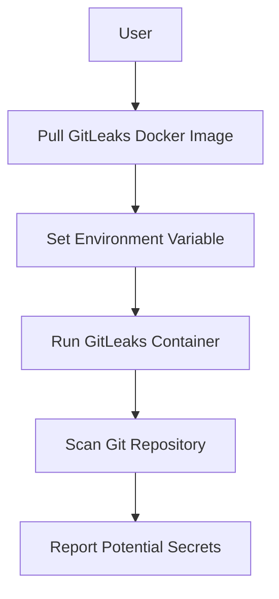

## Introduction to Application Vulnerability Scanning

Application vulnerability scanning is a critical component of modern DevSecOps practices. It involves using automated tools to identify potential security vulnerabilities within an application's codebase. One such tool is GitLeaks, which is designed to detect secrets (such as API keys, passwords, and other sensitive information) that may have been accidentally committed to a version control system like Git.

### What is GitLeaks?

GitLeaks is an open-source tool developed to find secrets in Git repositories. It scans the commit history of a Git repository to identify patterns that match known secret formats. This tool is particularly useful because it helps organizations catch and remediate security issues before they become serious breaches.

### Why Use GitLeaks?

The importance of using GitLeaks lies in its ability to prevent sensitive data from being exposed. In many cases, developers might inadvertently commit sensitive information to their repositories. Once this information is committed, it becomes part of the repository's history and can be accessed by anyone with access to the repository. This can lead to serious security breaches, as demonstrated by several high-profile incidents:

- **CVE-2021-22204**: A vulnerability was discovered in the GitHub Actions workflow files, allowing attackers to steal secrets stored in environment variables.
- **GitHub Data Breach (2020)**: A misconfigured GitHub Actions workflow allowed unauthorized access to sensitive data, including API tokens and SSH keys.

### How Does GitLeaks Work?

GitLeaks works by scanning the commit history of a Git repository for patterns that match known secret formats. These patterns include regular expressions that match common secret formats such as API keys, passwords, and SSH keys. Once it identifies a potential secret, it flags the commit for review.

### Setting Up GitLeaks Locally

To set up GitLeaks locally, we can use Docker to run the tool. Docker provides a consistent and isolated environment for running applications, ensuring that the tool runs consistently across different systems.

#### Step-by-Step Setup

1. **Pull the GitLeaks Docker Image**:
   First, we need to pull the GitLeaks Docker image from Docker Hub. This can be done using the `docker pull` command.

   ```sh
   docker pull gitleaks/gitleaks
   ```

   This command downloads the latest version of the GitLeaks Docker image to your local Docker repository.

2. **Set Up the Environment Variable**:
   Next, we need to set up an environment variable that points to the location of the Git repository we want to scan. This is necessary because GitLeaks needs to know where to look for the repository.

   ```sh
   export GITLEAKS_PATH="/home/user/JuiceShop"
   ```

   Here, `/home/user/JuiceShop` is the absolute path to the Git repository we want to scan. Using an absolute path ensures that GitLeaks can correctly locate the repository regardless of the current working directory.

3. **Run the GitLeaks Container**:
   Finally, we can run the GitLeaks container using the `docker run` command. We need to mount the Git repository into the container so that GitLeaks can access it.

   ```sh
   docker run --rm -v $GITLEAKS_PATH:/path gitleaks/gitleaks --path /path
   ```

   This command runs the GitLeaks container, mounts the specified Git repository into the container at the `/path` directory, and runs the GitLeaks tool against that directory.

### Detailed Explanation of the Commands

Let's break down each part of the commands used to set up and run GitLeaks:

1. **Docker Pull Command**:
   ```sh
   docker pull gitleaks/gitleaks
   ```
   This command pulls the latest version of the GitLeaks Docker image from Docker Hub. The `gitleaks/gitleaks` image contains the GitLeaks tool and all its dependencies.

2. **Environment Variable Setup**:
   ```sh
   export GITLEAKS_PATH="/home/user/JuiceShop"
   ```
   This command sets up an environment variable named `GITLEAKS_PATH` that points to the absolute path of the Git repository we want to scan. The `export` command makes this variable available to the shell environment.

3. **Docker Run Command**:
   ```sh
   docker run --rm -v $GITLEAKS_PATH:/path gitleaks/gitleaks --path /path
   ```
   This command runs the GitLeaks container. The `--rm` flag ensures that the container is removed after it finishes executing. The `-v` flag mounts the specified Git repository into the container at the `/path` directory. The `gitleaks/gitleaks` image is the Docker image we pulled earlier, and `--path /path` specifies the directory within the container where the Git repository is mounted.

### Mermaid Diagram: GitLeaks Workflow



This diagram illustrates the workflow of setting up and running GitLeaks. The user first pulls the GitLeaks Docker image, sets up an environment variable pointing to the Git repository, runs the GitLeaks container, scans the Git repository, and finally reports any potential secrets found.

### Common Pitfalls and Best Practices

When using GitLeaks, there are several common pitfalls to avoid:

1. **Incorrect Path Specification**:
   Ensure that the path specified in the environment variable is correct and points to the root of the Git repository. Incorrect paths can result in GitLeaks not finding the repository or scanning the wrong directory.

2. **Insufficient Permissions**:
   Make sure that the user running the GitLeaks container has sufficient permissions to access the Git repository. Insufficient permissions can result in errors during the scanning process.

3. **Ignoring False Positives**:
   GitLeaks may sometimes flag false positives, especially if the repository contains code that matches the secret patterns but is not actually a secret. It is important to manually verify any flagged commits to ensure that they are indeed sensitive.

### How to Prevent / Defend

#### Detection

To detect secrets in your Git repository, you can regularly run GitLeaks as part of your continuous integration (CI) pipeline. This ensures that any new commits are scanned for secrets before they are merged into the main branch.

#### Prevention

To prevent secrets from being committed to your Git repository, you can implement the following best practices:

1. **Use Environment Variables**:
   Store sensitive information in environment variables rather than hardcoding them into your codebase. This ensures that the secrets are not committed to the repository.

2. **Use Secret Management Tools**:
   Utilize secret management tools like HashiCorp Vault or AWS Secrets Manager to securely store and manage secrets. These tools provide mechanisms for securely accessing secrets without exposing them in your codebase.

3. **Educate Developers**:
   Educate developers about the risks of committing sensitive information to version control systems. Regular training sessions and reminders can help ensure that developers are aware of the best practices for handling secrets.

#### Secure Coding Fixes

Here is an example of how to securely handle secrets in your codebase:

**Vulnerable Code**:
```python
import os

# Hardcoded API key
API_KEY = "abc123"

def make_api_request():
    headers = {
        "Authorization": f"Bearer {API_KEY}"
    }
    # Make API request
```

**Secure Code**:
```python
import os

# Retrieve API key from environment variable
API_KEY = os.getenv("API_KEY")

def make_api_request():
    headers = {
        "Authorization": f"Bearer {API_KEY}"
    }
    # Make API request
```

In the secure code example, the API key is retrieved from an environment variable rather than being hardcoded into the codebase. This ensures that the secret is not committed to the repository.

### Complete Example: Running GitLeaks

Let's walk through a complete example of running GitLeaks on a Git repository.

#### Step 1: Clone the Repository

First, clone the repository you want to scan. For this example, we will use the OWASP Juice Shop repository.

```sh
git clone https://github.com/bkimminich/juice-shop.git
```

#### Step 2: Set Up the Environment Variable

Next, set up the environment variable pointing to the cloned repository.

```sh
export GITLEAKS_PATH="/home/user/juice-shop"
```

#### Step 3: Run GitLeaks

Finally, run GitLeaks to scan the repository.

```sh
docker run --rm -v $GITLEAKS_PATH:/path gitleaks/gitleaks --path /path
```

#### Expected Output

If GitLeaks finds any potential secrets, it will report them. For example:

```sh
Potential secret found in commit abc123:
File: src/app.js
Line: 10
Secret: abc123
```

This output indicates that GitLeaks found a potential secret in the `src/app.js` file at line 10 in the commit `abc123`.

### Real-World Example: GitHub Data Breach (2020)

In 2020, a misconfigured GitHub Actions workflow allowed unauthorized access to sensitive data, including API tokens and SSH keys. This breach highlights the importance of using tools like GitLeaks to detect and remediate secrets in version control systems.

#### Vulnerable Configuration

```yaml
name: Build and Deploy

on:
  push:
    branches:
      - master

jobs:
  build:
    runs-on: ubuntu-latest
    steps:
      - name: Checkout code
        uses: actions/checkout@v2
      - name: Set up Node.js
        uses: actions/setup-node@v2
        with:
          node-version: '12.x'
      - name: Install dependencies
        run: npm install
      - name: Build
        run: npm run build
      - name: Deploy
        run: |
          echo "Deploying..."
          ssh -i ~/.ssh/id_rsa user@server "cd /var/www/html && git pull"
```

#### Secure Configuration

```yaml
name: Build and Deploy

on:
  push:
    branches:
      - master

jobs:
  build:
    runs-on: ubuntu-latest
    steps:
      - name: Checkout code
        uses: actions/checkout@v2
      - name: Set up Node.js
        uses: actions/setup-node@v2
        with:
          node-version: '12.x'
      - name: Install dependencies
        run: npm install
      - name: Build
        run: npm run build
      - name: Deploy
        env:
          SSH_PRIVATE_KEY: ${{ secrets.SSH_PRIVATE_KEY }}
        run: |
          echo "Deploying..."
          ssh -i ~/.ssh/id_rsa user@server "cd /var/www/html && git pull"
```

In the secure configuration, the SSH private key is stored as a secret in GitHub Actions and accessed via the `secrets` context. This ensures that the secret is not exposed in the workflow configuration.

### Hands-On Lab: PortSwigger Web Security Academy

To practice using GitLeaks, you can use the PortSwigger Web Security Academy. This platform provides a series of interactive labs that cover various aspects of web security, including secret scanning.

1. **Navigate to the PortSwigger Web Security Academy**:
   Visit the [PortSwigger Web Security Academy](https://portswigger.net/web-security).

2. **Find the Secret Scanning Lab**:
   Look for the lab that covers secret scanning and follow the instructions to set up and run GitLeaks.

3. **Complete the Lab**:
   Follow the steps in the lab to scan a sample Git repository for secrets and learn how to detect and remediate them.

By completing this lab, you will gain hands-on experience with using GitLeaks to detect and remediate secrets in Git repositories.

### Conclusion

Application vulnerability scanning is a crucial aspect of modern DevSecOps practices. Tools like GitLeaks play a vital role in detecting and remediating secrets in version control systems. By following best practices and regularly scanning your repositories, you can significantly reduce the risk of sensitive data exposure.

---
<!-- nav -->
[[DevSecOps/DevSecOps Bootcamp/05-Application Security Testing/02-Application Vulnerability Scanning/Secret Scanning with GitLeaks Local Environment/04-Introduction to Application Vulnerability Scanning Part 1|Introduction to Application Vulnerability Scanning Part 1]] | [[DevSecOps/DevSecOps Bootcamp/05-Application Security Testing/02-Application Vulnerability Scanning/Secret Scanning with GitLeaks Local Environment/00-Overview|Overview]] | [[06-Introduction to Application Vulnerability Scanning|Introduction to Application Vulnerability Scanning]]
