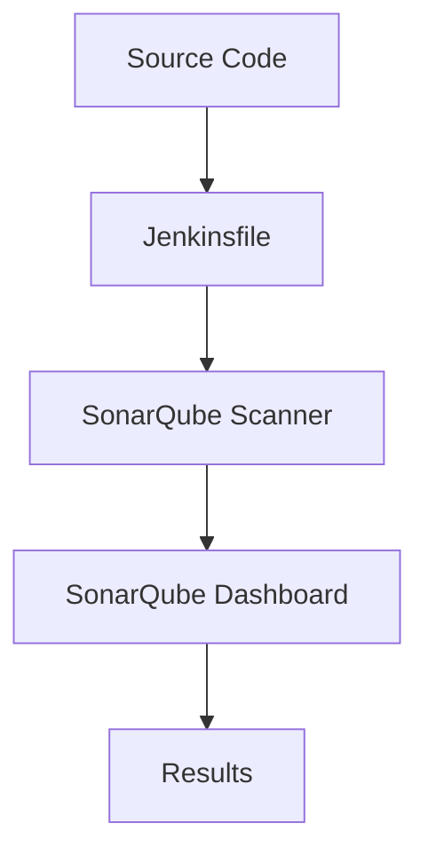
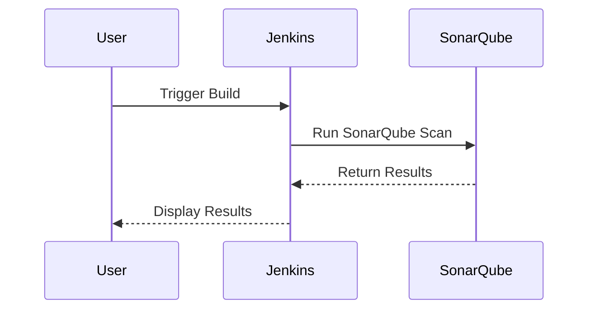

## Introduction to Automating Code Security Testing with SonarQube and Jenkins

Automating code security testing is a critical component of modern DevSecOps practices. By integrating tools like SonarQube into your Continuous Integration (CI) and Continuous Deployment (CD) pipelines, you can ensure that your codebase remains free from vulnerabilities and adheres to best coding practices. This chapter will guide you through setting up SonarQube with Jenkins for automated code analysis, using the OWASP Juice Shop project as an example.

### What is SonarQube?

SonarQube is an open-source platform designed for continuous inspection of code quality. It supports multiple programming languages and provides a comprehensive set of features to help developers identify and fix issues in their code. SonarQube performs static code analysis, which means it analyzes the code without executing it, looking for potential bugs, vulnerabilities, and coding standards violations.

#### Why Use SonarQube?

- **Early Detection of Issues**: SonarQube helps catch issues early in the development cycle, reducing the cost and complexity of fixing them later.
- **Comprehensive Analysis**: It covers a wide range of issues, including security vulnerabilities, code smells, and coding standards violations.
- **Integration Capabilities**: SonarQube integrates seamlessly with popular CI/CD tools like Jenkins, making it easy to incorporate into existing workflows.

### What is Jenkins?

Jenkins is an open-source automation server that provides extensive support for automating the software development lifecycle. It is widely used for continuous integration and continuous delivery (CI/CD) processes. Jenkins allows you to build, test, and deploy your applications automatically, ensuring consistency and reliability in your development process.

#### Why Use Jenkins?

- **Flexibility**: Jenkins supports a wide range of plugins and integrations, allowing you to customize your CI/CD pipeline according to your needs.
- **Community Support**: With a large and active community, Jenkins offers extensive documentation, plugins, and support resources.
- **Scalability**: Jenkins can handle small to large-scale projects, making it suitable for various development environments.

### Integrating SonarQube with Jenkins

In this section, we will demonstrate how to integrate SonarQube with Jenkins to perform automated code analysis. We will use the OWASP Juice Shop project as an example to illustrate the setup process.

#### Setting Up the Environment

1. **Clone the OWASP Juice Shop Repository**:
   ```bash
   git clone https://github.com/bkimminich/juice-shop.git
   cd juice-shop
   ```

2. **Create a New Branch**:
   ```bash
   git checkout -b sonar-scanner
   ```

3. **Configure the Jenkinsfile**:
   Open the `Jenkinsfile` in the root directory of the project and make the necessary changes to integrate SonarQube.

### Configuring the Jenkinsfile

The `Jenkinsfile` is a Groovy script that defines the stages of your CI/CD pipeline. We will modify this file to include a stage for running the SonarQube scanner.

#### Step-by-Step Configuration

1. **Update the Description**:
   Add a description to the Jenkinsfile to indicate the purpose of the pipeline.
   ```groovy
   pipeline {
       agent any
       options {
           timestamps()
       }
       stages {
           stage('Build') {
               steps {
                   echo 'Building...'
               }
           }
       }
       post {
           always {
               echo 'Pipeline completed'
           }
       }
   }
   ```

2. **Add an Environment Variable**:
   Define an environment variable for the SonarQube project key.
   ```groovy
   environment {
       SONAR_KEY = 'juice-shop'
   }
   ```

3. **Add the SonarQube Stage**:
   Create a new stage to run the SonarQube scanner.
   ```groovy
   pipeline {
       agent any
       options {
           timestamps()
       }
       environment {
           SONAR_KEY = 'juice-shop'
       }
       stages {
           stage('Build') {
               steps {
                   echo 'Building...'
               }
           }
           stage('SonarQube Scan') {
               agent {
                   docker {
                       image 'sonarsource/sonar-scanner-cli:latest'
                       args '-u sonarqube:sonarqube'
                   }
               }
               steps {
                   sh 'sonar-scanner -Dsonar.projectKey=${SONAR_KEY} -Dsonar.host.url=http://localhost:9000 -Dsonar.login=admin -Dsonar.password=admin'
               }
           }
       }
       post {
           always {
               echo 'Pipeline completed'
           }
       }
   }
   ```

### Explanation of the Jenkinsfile Configuration

- **Agent Configuration**: The `agent` directive specifies the environment in which the pipeline runs. Here, we use a Docker image to run the SonarQube scanner.
- **Environment Variables**: The `environment` block defines variables that can be used throughout the pipeline. In this case, we define the `SONAR_KEY` variable.
- **Stages**: The `stages` block defines the different stages of the pipeline. We have a `Build` stage and a `SonarQube Scan` stage.
- **Steps**: The `steps` block within each stage defines the actions to be performed. In the `SonarQube Scan` stage, we run the `sonar-scanner` command with the necessary parameters.

### Running the Pipeline

To run the pipeline, commit the changes and push the branch to the remote repository. Then, trigger the Jenkins job to execute the pipeline.

```bash
git add .
git commit -m "Add SonarQube scanning to Jenkins pipeline"
git push origin sonar-scanner
```

### Monitoring the Results

Once the pipeline completes, you can monitor the results in the SonarQube dashboard. The dashboard provides detailed information about the code quality, including issues detected, code coverage, and more.

### Real-World Examples and Recent CVEs

Integrating SonarQube with Jenkins can help detect and mitigate various security vulnerabilities. For example, consider the following CVE:

- **CVE-2021-3116**: This vulnerability affects the Apache Commons Collections library, which is commonly used in Java applications. SonarQube can detect the usage of this library and flag it as a potential security risk.

### How to Prevent / Defend

#### Detection

- **Static Code Analysis**: Regularly run static code analysis tools like SonarQube to detect potential vulnerabilities and coding standards violations.
- **Dependency Scanning**: Use tools like OWASP Dependency-Check to scan for vulnerable dependencies in your project.

#### Prevention

- **Secure Coding Practices**: Follow secure coding guidelines and best practices to minimize the risk of introducing vulnerabilities.
- **Code Reviews**: Conduct regular code reviews to ensure that the code adheres to security standards and best practices.

#### Secure-Coding Fixes

Here is an example of a vulnerable code snippet and its secure counterpart:

**Vulnerable Code**:
```java
import org.apache.commons.collections.Transformer;
import org.apache.commons.collections.functors.ChainedTransformer;

public class VulnerableClass {
    public void vulnerableMethod() {
        Transformer[] transformers = new Transformer[2];
        transformers[0] = new ConstantTransformer(Runtime.class);
        transformers[1] = new InvokerTransformer("getRuntime", new Class[]{}, new Object[]{});
        ChainedTransformer chainedTransformer = new ChainedTransformer(transformers);
    }
}
```

**Secure Code**:
```java
import java.util.Collections;

public class SecureClass {
    public void secureMethod() {
        // Avoid using vulnerable libraries
        Collections.emptyList();
    }
}
```

### Complete Example with Full HTTP Requests and Responses

#### HTTP Request to SonarQube API

```http
POST /api/projects/create HTTP/1.1
Host: localhost:9000
Content-Type: application/x-www-form-urlencoded

key=juice-shop&name=Juice%20Shop
```

#### HTTP Response from SonarQube API

```http
HTTP/1.1 200 OK
Content-Type: application/json

{
  "id": "juice-shop",
  "key": "juice-shop",
  "name": "Juice Shop",
  "qualifier": "TRK",
  "visibility": "public",
  "version": null,
  "organization": null
}
```

### Mermaid Diagrams

#### Pipeline Architecture



#### Sequence Diagram



### Practice Labs

For hands-on practice with integrating SonarQube and Jenkins, consider the following labs:

- **PortSwigger Web Security Academy**: Offers interactive labs to learn about web security.
- **OWASP Juice Shop**: Provides a vulnerable web application to practice security testing.
- **DVWA (Damn Vulnerable Web Application)**: Another vulnerable web application for security testing.

By following these steps and best practices, you can effectively integrate SonarQube with Jenkins to automate code security testing and improve the overall quality of your codebase.

---
<!-- nav -->
[[DevSecOps/DevSecOps Bootcamp/05-Application Security Testing/03-Automating Code Security Testing/02-Demo Analyzing Code during Automated Builds Using SonarQube/00-Overview|Overview]] | [[02-Introduction to Automating Code Security Testing with SonarQube|Introduction to Automating Code Security Testing with SonarQube]]
