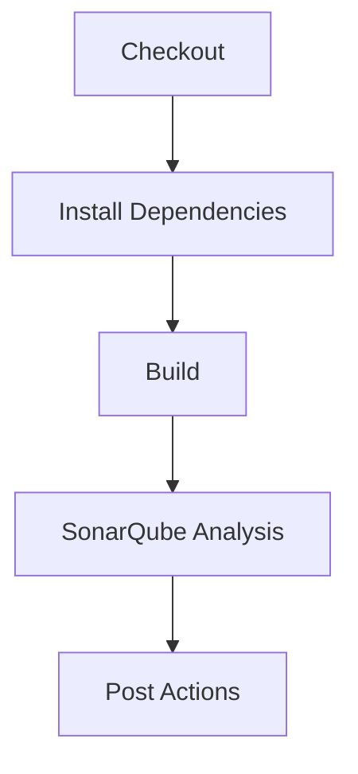
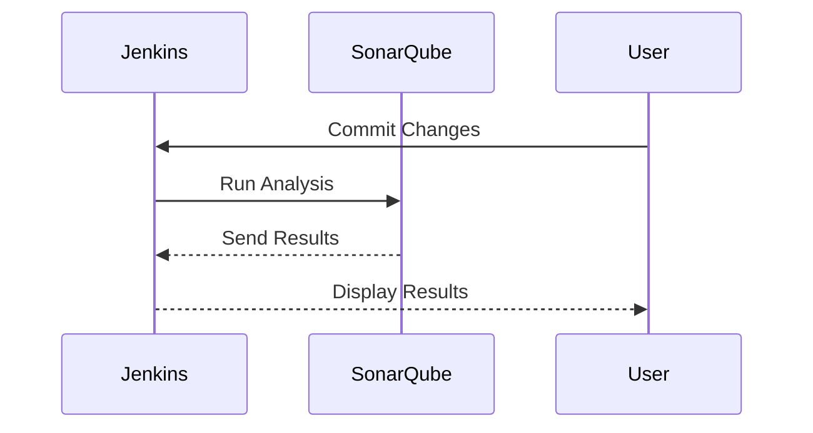

## Introduction to Automating Code Security Testing with SonarQube

Automating code security testing is an essential practice in modern software development, especially within the DevSecOps paradigm. One of the most widely used tools for this purpose is SonarQube. This chapter will delve into the process of integrating SonarQube into your automated build pipelines using Jenkins as an example Continuous Integration/Continuous Deployment (CI/CD) platform.

### What is SonarQube?

SonarQube is an open-source platform designed to analyze code quality, maintainability, and security. It supports a wide range of programming languages including Java, C#, Python, JavaScript, and many others. SonarQube provides detailed reports on code issues categorized into four main types:

- **Bugs**: Issues that may cause the application to crash or behave unexpectedly.
- **Vulnerabilities**: Security weaknesses that could be exploited by attackers.
- **Code Smells**: Poor coding practices that reduce code readability and maintainability.
- **Coverage**: Information about the percentage of code covered by unit tests.

### Why Use SonarQube in CI/CD Pipelines?

Integrating SonarQube into your CI/CD pipeline ensures that code quality and security checks are performed automatically with each build. This helps catch issues early in the development cycle, reducing the likelihood of bugs and vulnerabilities making their way into production.

### Prerequisites for Setting Up SonarQube

Before setting up SonarQube in your CI/CD pipeline, ensure you have the following prerequisites:

1. **Jenkins Installed**: Jenkins is a popular CI/CD server that supports various plugins, including the SonarQube plugin.
2. **SonarQube Server**: A SonarQube server instance must be running. You can install it locally or use a hosted service.
3. **SonarQube Scanner**: The SonarQube scanner is a command-line tool that runs static analysis on your code and sends the results to the SonarQube server.
4. **Programming Language Support**: Ensure that your project uses a language supported by SonarQube.

### Installing TypeScript

For this example, we'll assume that the project uses TypeScript. TypeScript is a superset of JavaScript that adds static typing and other features to improve code quality and maintainability.

```bash
npm install -g typescript
```

This command installs TypeScript globally on your system.

### Configuring Jenkins for SonarQube Integration

To integrate SonarQube into your Jenkins pipeline, follow these steps:

1. **Install the SonarQube Plugin**:
    - Go to `Manage Jenkins` > `Manage Plugins`.
    - Search for `SonarQube` and install the plugin.

2. **Configure SonarQube Server in Jenkins**:
    - Go to `Manage Jenkins` > `Configure System`.
    - Scroll down to the `SonarQube servers` section.
    - Click `Add SonarQube server` and provide the necessary details:
        - **Name**: A name for your SonarQube server.
        - **Server URL**: The URL of your SonarQube server.
        - **Authentication Token**: An authentication token generated from your SonarQube server.

3. **Create a Jenkins Pipeline Job**:
    - Create a new pipeline job in Jenkins.
    - In the `Pipeline` section, select `Pipeline script from SCM`.
    - Choose your SCM (e.g., Git) and provide the repository URL.
    - Specify the path to your Jenkinsfile.

### Example Jenkinsfile Configuration

Here is an example Jenkinsfile that integrates SonarQube:

```groovy
pipeline {
    agent any

    stages {
        stage('Checkout') {
            steps {
                git url: 'https://github.com/your-repo.git'
            }
        }

        stage('Install Dependencies') {
            steps {
                sh 'npm install'
            }
        }

        stage('Build') {
            steps {
                sh 'npm run build'
            }
        }

        stage('SonarQube Analysis') {
            steps {
                withSonarQubeEnv('SonarQube') {
                    sh 'sonar-scanner'
                }
            }
        }
    }

    post {
        always {
            echo 'Analysis completed.'
        }
    }
}
```

### Explanation of the Jenkinsfile

- **Checkout Stage**: Clones the repository.
- **Install Dependencies Stage**: Installs project dependencies using npm.
- **Build Stage**: Runs the build process.
- **SonarQube Analysis Stage**: Uses the `withSonarQubeEnv` step to configure the environment and runs the `sonar-scanner` command.

### Running the SonarQube Scanner

The `sonar-scanner` command performs static analysis on the code and sends the results to the SonarQube server. Here is an example of how to run the scanner:

```bash
sonar-scanner \
  -Dsonar.projectKey=your-project-key \
  -Dsonar.sources=. \
  -Dsonar.host.url=http://localhost:9000 \
  -Dsonar.login=your-auth-token
```

### Understanding the SonarQube Scanner Command

- `-Dsonar.projectKey`: Unique identifier for your project.
- `-Dsonar.sources`: Directory containing the source code.
- `-Dsonar.host.url`: URL of the SonarQube server.
- `-Dsonar.login`: Authentication token for accessing the SonarQube server.

### Viewing SonarQube Results

After the analysis completes, you can view the results in the SonarQube dashboard. The dashboard provides detailed insights into code quality, security, and coverage metrics.

### Real-World Examples and Recent CVEs

#### Example: CVE-2021-44228 (Log4j)

In December 2021, a critical vulnerability was discovered in the Apache Log4j library, designated as CVE-2021-44228. This vulnerability allowed remote code execution through specially crafted log messages. Integrating SonarQube into your CI/CD pipeline would help identify similar vulnerabilities early in the development process.

#### Example: Heartbleed (CVE-2014-0160)

Heartbleed was a serious vulnerability in the OpenSSL cryptographic software library. It allowed stealing the private keys used to encrypt traffic, compromising the confidentiality of data. Static analysis tools like SonarQube can help detect such issues by analyzing code patterns and identifying potential security weaknesses.

### Common Pitfalls and How to Avoid Them

#### Pitfall: Missing Configuration

Ensure that the SonarQube scanner is properly configured with the correct project key, source directory, and authentication token. Missing or incorrect configuration can result in failed analysis.

#### Pitfall: Ignoring Vulnerabilities

It's crucial to address vulnerabilities identified by SonarQube promptly. Ignoring them can lead to security breaches and data leaks.

### How to Prevent / Defend

#### Detection

- **Regular Scans**: Schedule regular scans to detect new vulnerabilities.
- **Pre-commit Hooks**: Use pre-commit hooks to run SonarQube analysis before committing changes.

#### Prevention

- **Secure Coding Practices**: Follow secure coding guidelines to avoid common vulnerabilities.
- **Code Reviews**: Conduct regular code reviews to catch issues early.

#### Secure-Coding Fixes

Compare the vulnerable code with the secure version:

**Vulnerable Code:**
```javascript
const fs = require('fs');
const filePath = process.argv[2];
fs.readFile(filePath, 'utf8', (err, data) => {
  if (err) throw err;
  console.log(data);
});
```

**Secure Code:**
```javascript
const fs = require('fs');
const filePath = process.argv[2];
if (!filePath || !filePath.startsWith('/path/to/safe/directory')) {
  console.error('Invalid file path');
  return;
}
fs.readFile(filePath, 'utf8', (err, data) => {
  if (err) throw err;
  console.log(data);
});
```

### Complete Example with Raw HTTP Messages

#### Full HTTP Request and Response

When interacting with the SonarQube server, you might send HTTP requests to retrieve analysis results. Here is an example of a full HTTP request and response:

**HTTP Request:**
```http
GET /api/measures/component?component=your-project-key&metricKeys=sqale_index HTTP/1.1
Host: localhost:9000
Authorization: Basic your-auth-token
Accept: application/json
```

**HTTP Response:**
```http
HTTP/1.1 200 OK
Date: Mon, 01 Jan 2024 00:00:00 GMT
Content-Type: application/json
Content-Length: 123

{
  "component": {
    "key": "your-project-key",
    "measures": [
      {
        "metric": "sqale_index",
        "value": "123"
      }
    ]
  }
}
```

### Mermaid Diagrams

#### Pipeline Topology

A mermaid diagram showing the pipeline topology:



#### Sequence Diagram

A mermaid sequence diagram showing the interaction between Jenkins and SonarQube:



### Hands-On Labs

#### Recommended Labs

- **PortSwigger Web Security Academy**: Offers practical exercises for web application security.
- **OWASP Juice Shop**: A deliberately insecure web application for practicing security skills.
- **DVWA (Damn Vulnerable Web Application)**: Another intentionally vulnerable web app for learning security.
- **WebGoat**: An interactive training application for learning about web application security.

These labs provide hands-on experience with integrating security tools into CI/CD pipelines.

### Conclusion

Integrating SonarQube into your CI/CD pipeline is a powerful way to ensure code quality and security. By automating the analysis process, you can catch issues early and prevent them from reaching production. Following best practices and using secure coding techniques can further enhance the effectiveness of your security measures.

---
<!-- nav -->
[[01-Introduction to Automating Code Security Testing with SonarQube and Jenkins|Introduction to Automating Code Security Testing with SonarQube and Jenkins]] | [[DevSecOps/DevSecOps Bootcamp/05-Application Security Testing/03-Automating Code Security Testing/02-Demo Analyzing Code during Automated Builds Using SonarQube/00-Overview|Overview]] | [[03-Introduction to SonarQube for Code Security Testing|Introduction to SonarQube for Code Security Testing]]
