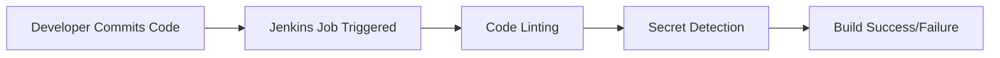
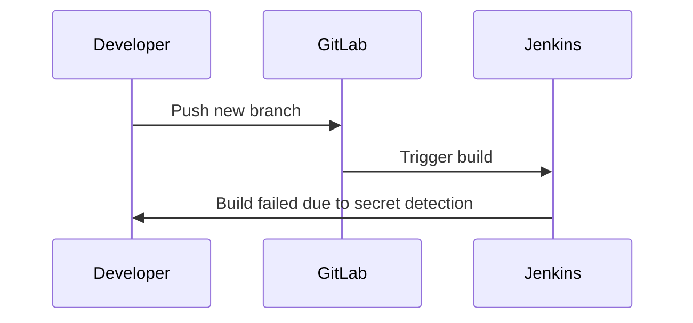

## Introduction to Automating Code Security Testing

Automating code security testing is a critical component of modern DevSecOps practices. It ensures that code changes are scanned for vulnerabilities, security weaknesses, and sensitive data leaks before they are merged into the main codebase. This process helps maintain the integrity and security of the application throughout its development lifecycle.

### Background Theory

In DevSecOps, continuous integration (CI) and continuous delivery (CD) pipelines are used to automate the building, testing, and deployment of applications. These pipelines can be configured to run various security checks automatically, ensuring that security is integrated into every stage of the development process.

#### Continuous Integration (CI)

Continuous Integration involves automatically building and testing code changes as they are committed to the version control system. This helps catch issues early, reducing the cost and complexity of fixing them later.

#### Continuous Delivery (CD)

Continuous Delivery extends CI by automating the deployment process. This means that once code passes all tests, it can be deployed to production automatically, provided it meets certain criteria.

### Tools and Technologies

Several tools are commonly used for automating code security testing:

- **Jenkins**: An open-source automation server that supports a wide range of plugins for various tasks, including security testing.
- **GitLab**: A web-based Git-repository manager that provides CI/CD capabilities out-of-the-box.
- **SonarQube**: A static code analysis tool that detects bugs, vulnerabilities, and code smells.
- **Trufflehog**: A tool for detecting secrets in your codebase.

### Example Scenario: Jenkins and GitLab

Let's walk through an example scenario using Jenkins and GitLab to demonstrate how automated code security testing can be implemented.

#### Setting Up Jenkins

1. **Install Jenkins**: Download and install Jenkins on your server.
2. **Configure Jenkins**: Set up Jenkins jobs to trigger on code commits.
3. **Add Plugins**: Install necessary plugins such as Git, SonarQube, and Trufflehog.



#### Setting Up GitLab

1. **Create a Repository**: Create a new repository in GitLab.
2. **Configure CI/CD Pipeline**: Define a `.gitlab-ci.yml` file to specify the pipeline steps.

```yaml
stages:
  - build
  - test
  - deploy

build_job:
  stage: build
  script:
    - echo "Building the project..."
    - docker build -t myapp .

test_job:
  stage: test
  script:
    - echo "Running tests..."
    - docker run myapp pytest

deploy_job:
  stage: deploy
  script:
    - echo "Deploying the application..."
    - docker push myapp
```

### Secret Detection in Codebases

Secret detection is crucial for identifying sensitive information such as API keys, passwords, and other credentials that might have been accidentally committed to the codebase.

#### Using Trufflehog

Trufflehog is a tool that scans repositories for secrets. It can be integrated into the CI/CD pipeline to automatically detect secrets.

```bash
trufflehog --entropy=False --regex=True --rules=rules.json <repository>
```

#### Example of Adding a Secret

Let's consider the scenario where a developer adds a secret to the codebase.

1. **Create a New Branch**:
   ```bash
   git checkout -b secret
   ```

2. **Add a File Containing a Password**:
   ```bash
   echo "password=supersecret" > Secrets.txt
   ```

3. **Stage the File**:
   ```bash
   git add Secrets.txt
   ```

4. **Commit the File**:
   ```bash
   git commit -m "Add secret"
   ```

5. **Push the Branch to GitLab**:
   ```bash
   git push origin secret
   ```

### Pre-Commit Hooks

Pre-commit hooks are scripts that run before a commit is made. They can be used to enforce coding standards, run tests, and detect secrets.

#### Bypassing Pre-Commit Hooks

It is possible to bypass pre-commit hooks by using the `--no-verify` flag with the `git commit` command.

```bash
git commit --no-verify -m "Add secret"
```

### Jenkins Build Result

When the new branch is pushed to GitLab, Jenkins will detect the new branch and trigger a build.



### Full HTTP Request and Response

Here is an example of a full HTTP request and response for triggering a Jenkins build:

```http
POST /job/Juice%20Shop/buildWithParameters HTTP/1.1
Host: jenkins.example.com
Content-Type: application/x-www-form-urlencoded

token=mytoken&branch=secret
```

```http
HTTP/1.1 201 Created
Date: Mon, 01 Jan 2024 00:00:00 GMT
Location: http://jenkins.example.com/job/Juice%20Shop/123/
Content-Length: 0
```

### Real-World Examples

Recent breaches and CVEs highlight the importance of automated code security testing:

- **CVE-2021-44228 (Log4Shell)**: This vulnerability in Apache Log4j allowed attackers to execute arbitrary code. Automated testing could have caught this issue earlier.
- **GitHub Secret Scanning Breach (2022)**: GitHub detected and removed thousands of secrets from public repositories, emphasizing the need for automated secret detection.

### How to Prevent / Defend

#### Detection

- **Use Trufflehog**: Integrate Trufflehog into your CI/CD pipeline to scan for secrets.
- **Monitor Repositories**: Regularly monitor repositories for any accidental commits of secrets.

#### Prevention

- **Educate Developers**: Train developers on the importance of not committing secrets.
- **Use Environment Variables**: Store secrets in environment variables rather than hardcoding them.

#### Secure-Coding Fixes

**Vulnerable Code**:
```python
import os

def get_secret():
    return "supersecret"
```

**Secure Code**:
```python
import os

def get_secret():
    return os.getenv("SECRET")
```

#### Configuration Hardening

- **Enable Pre-Commit Hooks**: Ensure pre-commit hooks are enabled and enforced.
- **Use Secure Environments**: Use secure environments like Docker containers to isolate secrets.

### Practice Labs

For hands-on practice, consider the following labs:

- **PortSwigger Web Security Academy**: Offers a variety of labs related to web security.
- **OWASP Juice Shop**: A deliberately insecure web app for practicing security testing.
- **DVWA (Damn Vulnerable Web Application)**: Another web app for practicing security testing.

By integrating these practices and tools into your DevSecOps workflow, you can significantly enhance the security of your codebase and reduce the risk of vulnerabilities.

---
<!-- nav -->
[[DevSecOps/DevSecOps Bootcamp/05-Application Security Testing/03-Automating Code Security Testing/04-Demo Detecting New Secrets during Automated Security Testing/00-Overview|Overview]] | [[02-Automating Code Security Testing Detecting New Secrets During Automated Security Testing|Automating Code Security Testing Detecting New Secrets During Automated Security Testing]]
