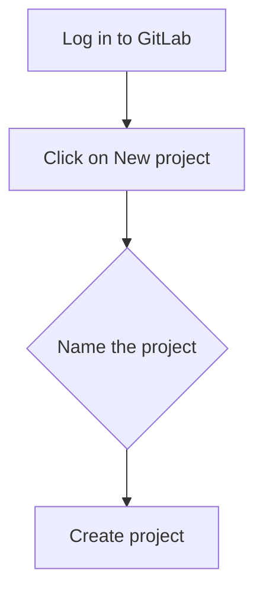
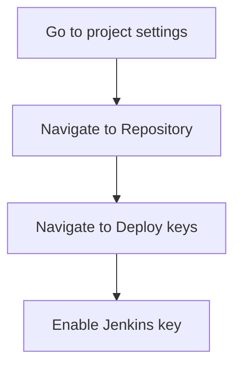
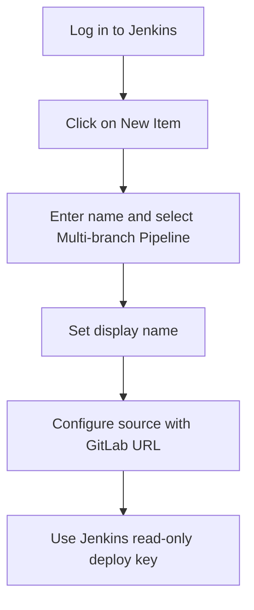

## Setting Up a Pipeline for Automated Security Testing

### Background Theory

Automated security testing is an essential component of modern DevSecOps practices. It allows developers and security teams to identify potential vulnerabilities and security issues early in the development cycle, reducing the risk of security breaches and improving overall application security. One critical aspect of automated security testing is the detection of secrets, such as API keys, passwords, and other sensitive information, which can be inadvertently committed to version control systems.

### Setting Up the Environment

To demonstrate the process of detecting new secrets during automated security testing, we will set up a pipeline using the Juice Shop project and Jenkins. The Juice Shop is a deliberately insecure web application designed for security training and research. Jenkins is a popular open-source automation server used for continuous integration and continuous delivery (CI/CD).

#### Creating the GitLab Repository

First, we need to create a repository for the Juice Shop project in GitLab. GitLab is a web-based Git-repository manager that provides a wide range of features for project management, including version control, issue tracking, and CI/CD pipelines.

1. **Log in to GitLab**: Access the GitLab web interface and log in with your credentials.
2. **Create a New Project**:
    - Click on the "New project" button.
    - Name the project `Juice Shop`.
    - Click on "Create project".



#### Enabling Deploy Keys

Deploy keys allow Jenkins to clone the repository without requiring user credentials. This is crucial for automating the CI/CD pipeline.

1. **Enable Deploy Keys**:
    - Go to the project settings by clicking on "Settings" in the left-hand menu.
    - Navigate to "Repository" and then "Deploy keys".
    - Click on "Expand" and scroll down to enable the Jenkins key.



### Configuring Jenkins

Next, we configure Jenkins to create a new job for the Juice Shop project.

1. **Create a New Item**:
    - Log in to Jenkins and click on "New Item" from the main dashboard.
    - Enter the name `juice shop` and select "Multi-branch Pipeline".
    - Set the display name to `juice shop`.

2. **Add GitLab Source**:
    - Configure the source by specifying the GitLab repository URL.
    - Use the same credentials as previously configured (Jenkins read-only deploy key).



### Adding Content to the Repository

The repository is currently empty, so we need to add some initial content.

1. **Clone the Repository**:
    - Open a terminal and clone the repository using the SSH URL provided by GitLab.

```bash
git clone git@gitlab.com:<username>/juice-shop.git
cd juice-shop
```

2. **Add Initial Files**:
    - Add some initial files to the repository, such as a `README.md` and a basic `Dockerfile`.

```markdown
# Juice Shop
This is a deliberately insecure web application for security training and research.
```

```dockerfile
FROM node:14-alpine
WORKDIR /app
COPY package*.json ./
RUN npm install
COPY . .
CMD ["npm", "start"]
```

3. **Commit and Push Changes**:
    - Commit the changes and push them to the remote repository.

```bash
git add .
git commit -m "Initial commit"
git push origin master
```

### Configuring the Jenkins Pipeline

Now that the repository contains some initial content, we can configure the Jenkins pipeline to perform automated security testing.

1. **Pipeline Configuration**:
    - In Jenkins, navigate to the `juice shop` job and configure the pipeline script.

```groovy
pipeline {
    agent any
    stages {
        stage('Checkout') {
            steps {
                git branch: 'master', url: 'git@gitlab.com:<username>/juice-shop.git'
            }
        }
        stage('Security Testing') {
            steps {
                sh 'pip install detect-secrets'
                sh 'detect-secrets scan --baseline baseline.json'
            }
        }
    }
}
```

### Detecting Secrets

The `detect-secrets` tool is used to scan the repository for potential secrets. It generates a baseline file (`baseline.json`) that can be used to track changes in secrets over time.

1. **Running the Scan**:
    - Execute the pipeline to run the security testing stage.

```bash
pip install detect-secrets
detect-secrets scan --baseline baseline.json
```

### Handling Detected Secrets

If secrets are detected, they should be removed from the repository and securely stored elsewhere.

1. **Removing Secrets**:
    - Remove the secrets from the repository and commit the changes.

```bash
git rm <secret-file>
git commit -m "Remove secret file"
git push origin master
```

2. **Updating Baseline**:
    - Update the baseline file to reflect the removal of the secrets.

```bash
detect-secrets scan --update baseline.json
```

### How to Prevent / Defend

#### Detection

To detect secrets effectively, ensure that the `detect-secrets` tool is regularly updated and configured to scan for all types of secrets. Use a baseline file to track changes over time.

#### Prevention

Prevent secrets from being committed to the repository by:

1. **Educating Developers**:
    - Train developers on the importance of keeping secrets out of version control.
2. **Using Secret Management Tools**:
    - Utilize tools like HashiCorp Vault or AWS Secrets Manager to store and manage secrets securely.
3. **Implementing Pre-commit Hooks**:
    - Use pre-commit hooks to automatically check for secrets before commits are made.

#### Secure Coding Fixes

Compare the vulnerable and secure versions of the code:

**Vulnerable Version**:
```python
import os
API_KEY = os.getenv('API_KEY')
```

**Secure Version**:
```python
import os
from aws_secretsmanager import get_secret

API_KEY = get_secret('my-api-key')
```

### Real-World Examples

Recent breaches have highlighted the importance of automated security testing and secret detection. For example, the SolarWinds breach involved the compromise of API keys and other sensitive information. By implementing automated security testing and secret detection, organizations can significantly reduce the risk of such breaches.

### Conclusion

Automated security testing is a critical component of modern DevSecOps practices. By setting up a pipeline for the Juice Shop project and using tools like `detect-secrets`, organizations can effectively detect and prevent the inclusion of secrets in version control systems. This not only improves application security but also ensures compliance with security best practices.

### Practice Labs

For hands-on practice, consider the following labs:

- **PortSwigger Web Security Academy**: Offers interactive labs for learning web security concepts.
- **OWASP Juice Shop**: Provides a deliberately insecure web application for security training.
- **DVWA**: A PHP/MySQL web application that demonstrates insecure coding practices.

These labs provide practical experience in setting up and configuring automated security testing pipelines, ensuring that you can apply these concepts in real-world scenarios.

---
<!-- nav -->
[[03-Automating Code Security Testing Detecting New Secrets|Automating Code Security Testing Detecting New Secrets]] | [[DevSecOps/DevSecOps Bootcamp/05-Application Security Testing/03-Automating Code Security Testing/04-Demo Detecting New Secrets during Automated Security Testing/00-Overview|Overview]] | [[DevSecOps/DevSecOps Bootcamp/05-Application Security Testing/03-Automating Code Security Testing/04-Demo Detecting New Secrets during Automated Security Testing/05-Practice Questions & Answers|Practice Questions & Answers]]
