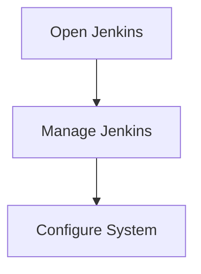
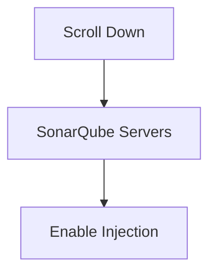
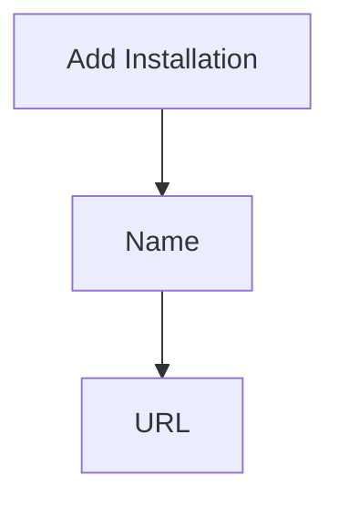
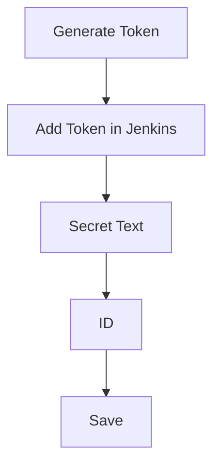

## Introduction to Automating Code Security Testing with Jenkins and SonarQube

Automating code security testing is a critical component of modern DevSecOps practices. By integrating tools like SonarQube into your continuous integration (CI) pipeline, you can ensure that your codebase remains free from vulnerabilities and adheres to quality standards. This chapter will guide you through the process of setting up SonarQube with Jenkins, explaining every step in detail and providing comprehensive background information.

### Background Theory

#### Continuous Integration (CI)
Continuous Integration (CI) is a practice where developers frequently merge their code changes into a central repository, followed by automated builds and tests. This ensures that the codebase remains stable and that issues are identified early in the development cycle.

#### Continuous Delivery (CD)
Continuous Delivery (CD) extends CI by ensuring that the application can be released to production at any time. This involves automating the deployment process and maintaining a high level of confidence in the codebase.

#### DevSecOps
DevSecOps integrates security practices into the DevOps lifecycle. Instead of treating security as a separate phase, it is embedded throughout the development, testing, and deployment processes. This approach helps identify and mitigate security risks early and continuously.

### Setting Up Jenkins

Before configuring SonarQube, ensure that Jenkins is properly installed and configured. Jenkins is a popular open-source automation server that supports building, deploying, and automating any project.

#### Restarting Jenkins
After making significant changes to Jenkins, it is often necessary to restart the server to apply those changes. This can be done via the Jenkins UI or by restarting the Jenkins service on the server.

```bash
sudo systemctl restart jenkins
```

### Configuring SonarQube in Jenkins

SonarQube is a powerful static code analysis tool that helps identify bugs, vulnerabilities, and code smells in your codebase. Integrating SonarQube with Jenkins allows you to automatically analyze your code during the build process.

#### Managing Jenkins Configuration
To configure SonarQube in Jenkins, navigate to `Manage Jenkins` and then select `Configure System`.



#### Enabling SonarQube Server Configuration Injection
Scroll down to the `SonarQube servers` section. Here, you will find options related to SonarQube configurations. Enable the `Injection of SonarQube server configuration` option to allow Jenkins to inject SonarQube server details into the build environment.



#### Adding a SonarQube Installation
Next, add a SonarQube installation. Provide a name for the installation, such as `SonarQube.demo.local`. Specify the URL of the SonarQube server, including the port number (e.g., `http://sonarqube.demo.local:9000`).



#### Adding Server Authentication Token
To authenticate with the SonarQube server, you need to provide an authentication token. Generate this token within SonarQube and then add it to Jenkins.

1. **Generate Token**: Log in to your SonarQube instance and generate a new token.
2. **Add Token in Jenkins**:
   - Click on `Add Server Authentication token`.
   - Paste the generated token into the `Secret` field.
   - Set the `Type` to `secret text`.
   - Provide an `ID` for the token, such as `SONAR_OFF_TOKEN`.
   - Optionally, add a description for the token.



### Full Example of Configuration

Here is a complete example of the configuration steps:

1. **Restart Jenkins**:
   ```bash
   sudo systemctl restart jenkins
   ```

2. **Navigate to Manage Jenkins**:
   - Open Jenkins.
   - Click on `Manage Jenkins`.
   - Select `Configure System`.

3. **Enable SonarQube Server Configuration Injection**:
   - Scroll down to the `SonarQube servers` section.
   - Check the box for `Enable injection of SonarQube server configuration`.

4. **Add SonarQube Installation**:
   - Click on `Add SonarQube installation`.
   - Name: `SonarQube.demo.local`
   - URL: `http://sonarqube.demo.local:9000`

5. **Add Server Authentication Token**:
   - Click on `Add Server Authentication token`.
   - Secret: Paste the generated token.
   - Type: `secret text`
   - ID: `SONAR_OFF_TOKEN`
   - Description: `SONAR_OFF_TOKEN`

6. **Save Configuration**:
   - Click on `Save`.

### Real-World Examples and Recent Breaches

#### Example: CVE-2021-22205
CVE-2021-22205 is a vulnerability in SonarQube that allows unauthorized access to sensitive data. This vulnerability was exploited due to improper input validation and authentication mechanisms.

**Impact**: Unauthorized users could access sensitive data, leading to potential data breaches.

**Mitigation**: Ensure that SonarQube is updated to the latest version and that proper authentication mechanisms are in place.

#### Example: Equifax Data Breach
The Equifax data breach in 2017 exposed sensitive personal information of millions of individuals. One of the contributing factors was the lack of proper security testing and code analysis.

**Impact**: Personal data of 147 million individuals was compromised.

**Mitigation**: Implementing a robust CI/CD pipeline with integrated security testing tools like SonarQube can help prevent such breaches.

### How to Prevent / Defend

#### Detection
Regularly scan your codebase using SonarQube to detect vulnerabilities and code smells. Integrate these scans into your CI/CD pipeline to ensure that issues are identified early.

#### Prevention
1. **Keep SonarQube Updated**: Regularly update SonarQube to the latest version to benefit from security patches and improvements.
2. **Use Strong Authentication Mechanisms**: Ensure that strong authentication mechanisms are in place to protect against unauthorized access.
3. **Implement Secure Coding Practices**: Follow secure coding guidelines to minimize the risk of introducing vulnerabilities.

#### Secure-Coding Fixes

**Vulnerable Code Example**:
```java
public class User {
    private String password;

    public void setPassword(String password) {
        this.password = password;
    }

    public String getPassword() {
        return password;
    }
}
```

**Secure Code Example**:
```java
import java.security.MessageDigest;
import java.security.NoSuchAlgorithmException;

public class User {
    private String passwordHash;

    public void setPassword(String password) throws NoSuchAlgorithmException {
        MessageDigest md = MessageDigest.getInstance("SHA-256");
        byte[] hash = md.digest(password.getBytes());
        this.passwordHash = bytesToHex(hash);
    }

    public String getPasswordHash() {
        return passwordHash;
    }

    private String bytesToHex(byte[] bytes) {
        StringBuilder result = new StringBuilder();
        for (byte b : bytes) {
            result.append(String.format("%02x", b));
        }
        return result.toString();
    }
}
```

### Complete Example of HTTP Request and Response

When configuring SonarQube in Jenkins, you may need to interact with the SonarQube API to retrieve or update configurations.

#### HTTP Request Example
```http
GET /api/server/index HTTP/1.1
Host: sonarqube.demo.local:9000
Authorization: Basic <base64-encoded-token>
```

#### HTTP Response Example
```http
HTTP/1.1 200 OK
Content-Type: application/json;charset=utf-8
Cache-Control: no-cache
Expires: Thu, 01 Jan 1970 00:00:00 GMT
Date: Mon, 10 Oct 2023 12:00:00 GMT
Content-Length: 123

{
  "version": "9.3",
  "buildDate": "2023-09-28T10:00:00Z",
  "revision": "12345"
}
```

### Hands-On Labs

For practical experience, consider the following labs:

- **PortSwigger Web Security Academy**: Offers hands-on labs for web application security.
- **OWASP Juice Shop**: A deliberately insecure web application for practicing security testing.
- **DVWA (Damn Vulnerable Web Application)**: Another web application for learning security testing.
- **WebGoat**: An interactive training application for learning about web application security.

These labs provide real-world scenarios and challenges to help you master the concepts covered in this chapter.

### Conclusion

Integrating SonarQube with Jenkins is a crucial step in automating code security testing. By following the detailed steps outlined in this chapter, you can ensure that your codebase remains secure and of high quality. Regularly updating and securing your tools, along with implementing secure coding practices, will help prevent vulnerabilities and data breaches.

---
<!-- nav -->
[[DevSecOps/DevSecOps Bootcamp/05-Application Security Testing/03-Automating Code Security Testing/05-Demo Installing a Code Quality Metrics System/00-Overview|Overview]] | [[DevSecOps/DevSecOps Bootcamp/05-Application Security Testing/03-Automating Code Security Testing/05-Demo Installing a Code Quality Metrics System/02-Introduction to Automating Code Security Testing|Introduction to Automating Code Security Testing]]
