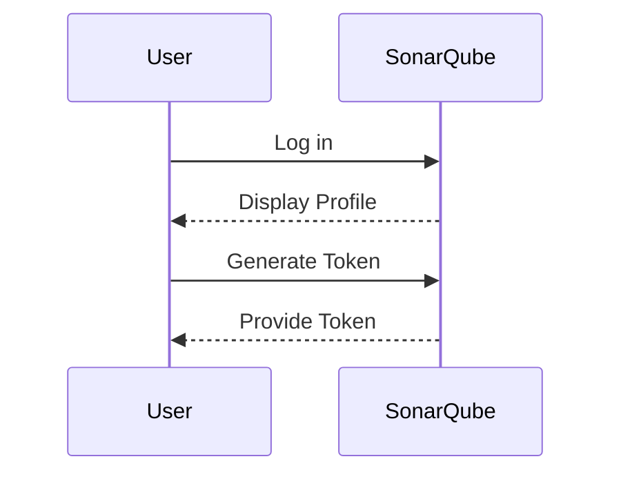
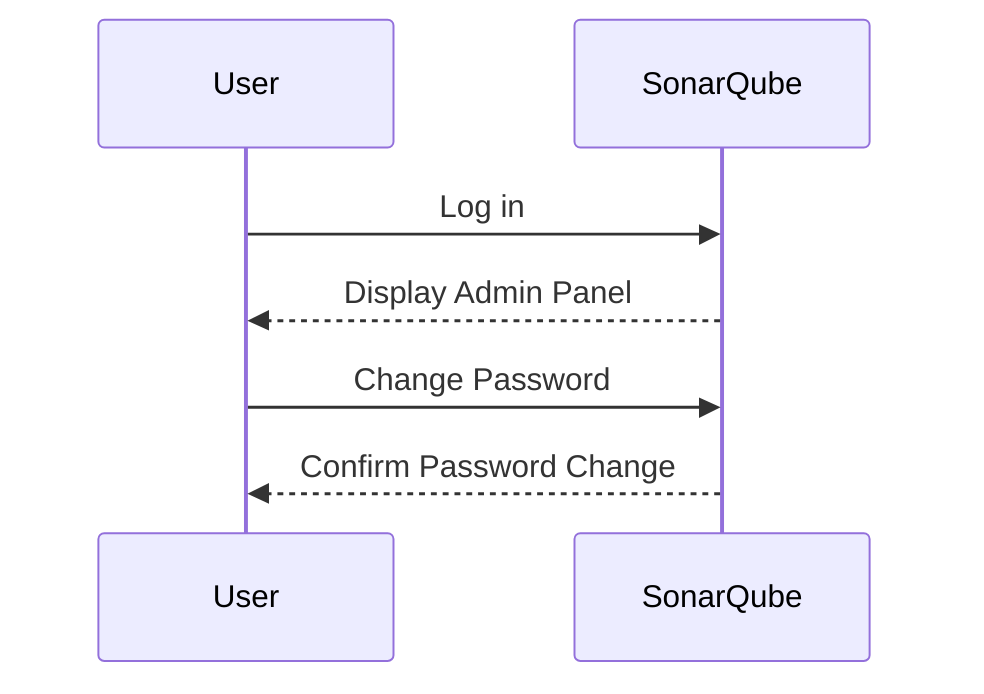
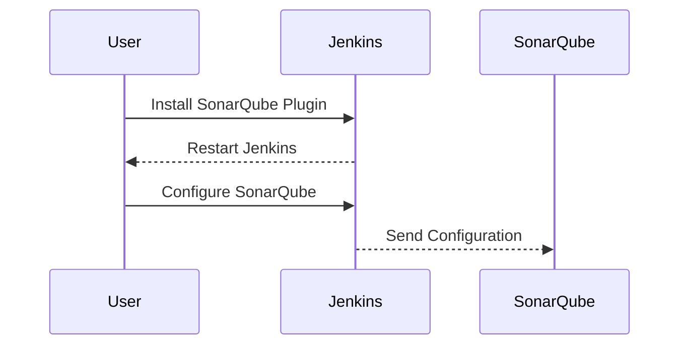
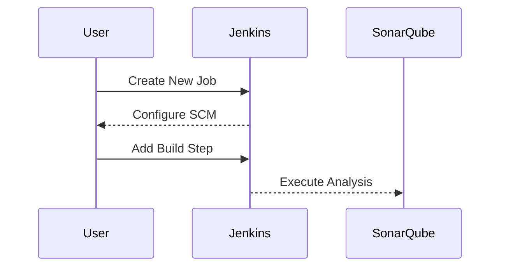

## Introduction to Automating Code Security Testing

Automating code security testing is an essential component of modern DevSecOps practices. It ensures that code quality and security are maintained throughout the development lifecycle. One popular tool used for this purpose is SonarQube, which provides static code analysis, bug detection, and security vulnerability scanning. In this chapter, we will walk through the process of setting up a SonarQube instance and integrating it with Jenkins, a widely-used continuous integration (CI) tool.

### Setting Up SonarQube

SonarQube is an open-source platform designed to analyze code quality and security. It supports multiple programming languages and integrates seamlessly with various CI/CD tools. Before we proceed with the setup, let's understand the key components of SonarQube:

- **SonarQube Server**: The central component that processes code analysis and provides a web interface for viewing results.
- **SonarQube Scanner**: A tool that runs on the build server to perform code analysis and send results back to the SonarQube server.
- **Plugins**: Additional modules that extend the functionality of SonarQube, such as support for specific programming languages or integration with other tools.

#### Generating a Token for Jenkins

To enable Jenkins to communicate with SonarQube, we need to generate an API token. This token will be used for authentication purposes. Here’s how you can generate the token:

1. **Log in to SonarQube**:
   - Navigate to the SonarQube web interface.
   - Click on your profile icon in the top-right corner and select `My Account`.

2. **Generate the Token**:
   - Under the `Security` section, click on `Generate Token`.
   - Name the token (e.g., `Jenkins`) and click `Generate`.
   - Copy the generated token; you will need it later to configure Jenkins.



#### Changing Default Password

It is crucial to change the default password for security reasons, even in a demo environment. This prevents unauthorized access and ensures that the system is secure.

1. **Navigate to Administration**:
   - Click on the `Administration` link in the top menu.
   - Select `Security` and then `Users`.

2. **Change Password**:
   - Locate the user account (e.g., `admin`) and click on `Edit`.
   - Enter a new, strong password and save the changes.



### Updating Plugins

Keeping SonarQube and its plugins up-to-date is essential for maintaining optimal performance and security. Outdated plugins can introduce vulnerabilities and reduce the effectiveness of code analysis.

1. **Navigate to Marketplace**:
   - Click on the `Marketplace` link in the top menu.
   - Ensure that all plugins are up-to-date by selecting `Plugins Updates Only`.

2. **Update Plugins**:
   - Click on `Update All` to apply the latest updates.
   - After updating, SonarQube may prompt you to restart the server to apply the changes.

```mermaid
sequenceDiagram
    participant User
    participant SonarQube
    User->>SonarQube: Log in
    SonarQube-->>User: Display Marketplace
    User->>SonarQube: Update Plugins
    SonarQ
```

### Integrating SonarQube with Jenkins

Once SonarQube is set up, the next step is to integrate it with Jenkins. This allows Jenkins to trigger code analysis automatically during the build process.

1. **Install SonarQube Plugin in Jenkins**:
   - Navigate to `Manage Jenkins` > `Manage Plugins`.
   - Search for `SonarQube Scanner` and install it.
   - Restart Jenkins to apply the changes.

2. **Configure SonarQube in Jenkins**:
   - Go to `Manage Jenkins` > `Configure System`.
   - Scroll down to the `SonarQube servers` section.
   - Add a new SonarQube server by providing the URL and the API token generated earlier.



### Configuring Build Jobs

Finally, we need to configure Jenkins build jobs to include SonarQube analysis.

1. **Create a New Job**:
   - Go to `New Item` and create a new job.
   - Choose `Freestyle project` and provide a name.

2. **Configure Source Code Management**:
   - Set up the source code management (SCM) to point to your repository.

3. **Add Build Steps**:
   - Add a build step to execute the SonarQube analysis.
   - Use the `Execute SonarQube Scanner` option and provide the necessary parameters.



### Example Configuration

Here is a complete example of how to configure a Jenkins job to run SonarQube analysis:

1. **Jenkinsfile**:
   - Define the pipeline in a `Jenkinsfile` to automate the build process.

```groovy
pipeline {
    agent any
    stages {
        stage('Checkout') {
            steps {
                git 'https://github.com/your-repo.git'
            }
        }
        stage('Build') {
            steps {
                sh 'mvn clean package'
            }
        }
        stage('SonarQube Analysis') {
            steps {
                withSonarQubeEnv('SonarQube') {
                    sh 'mvn sonar:sonar'
                }
            }
        }
    }
}
```

2. **SonarQube Properties**:
   - Configure the `sonar-project.properties` file to specify project details.

```properties
sonar.projectKey=your-project-key
sonar.projectName=Your Project Name
sonar.projectVersion=1.0
sonar.sources=src/main/java
sonar.tests=src/test/java
sonar.java.binaries=target/classes
```

### Common Pitfalls and How to Prevent Them

#### Weak Authentication Tokens

Using weak or default authentication tokens can expose your system to unauthorized access. Always ensure that tokens are strong and unique.

**How to Prevent**:
- Generate strong, unique tokens for each integration.
- Regularly rotate tokens to minimize exposure.

#### Outdated Plugins

Running outdated plugins can introduce security vulnerabilities and reduce the effectiveness of code analysis.

**How to Prevent**:
- Regularly check for and apply updates to all plugins.
- Enable automatic updates if supported by the tool.

#### Misconfigured Build Jobs

Incorrectly configured build jobs can lead to incomplete or incorrect code analysis.

**How to Prevent**:
- Review and test build configurations thoroughly.
- Use consistent and standardized configurations across all jobs.

### Real-World Examples

#### CVE-2021-44228 (Log4Shell)

The Log4Shell vulnerability (CVE-2021-44228) affected many applications using Apache Log4j. Static code analysis tools like SonarQube could have detected this vulnerability if properly configured.

**Example**:
- Ensure that your code analysis includes checks for known vulnerabilities.
- Regularly update your analysis rules to include the latest security advisories.

### Conclusion

Automating code security testing with tools like SonarQube and Jenkins is a critical aspect of modern DevSecOps practices. By following the steps outlined in this chapter, you can ensure that your code is analyzed for quality and security at every stage of the development lifecycle. Remember to maintain strong authentication, keep plugins up-to-date, and configure build jobs correctly to avoid common pitfalls.

### Practice Labs

For hands-on experience with automating code security testing, consider the following labs:

- **PortSwigger Web Security Academy**: Offers interactive labs on web application security.
- **OWASP Juice Shop**: A deliberately insecure web application for practicing security testing.
- **DVWA (Damn Vulnerable Web Application)**: A PHP/MySQL web application that demonstrates web application vulnerabilities.

These labs provide practical experience in setting up and configuring automated security testing tools in a controlled environment.

---
<!-- nav -->
[[01-Introduction to Automating Code Security Testing with Jenkins and SonarQube|Introduction to Automating Code Security Testing with Jenkins and SonarQube]] | [[DevSecOps/DevSecOps Bootcamp/05-Application Security Testing/03-Automating Code Security Testing/05-Demo Installing a Code Quality Metrics System/00-Overview|Overview]] | [[03-Introduction to Code Quality Metrics Systems|Introduction to Code Quality Metrics Systems]]
