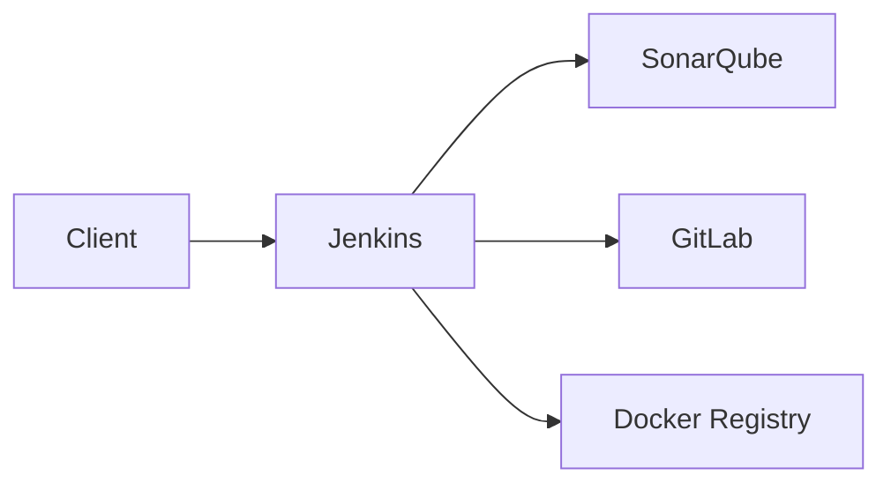
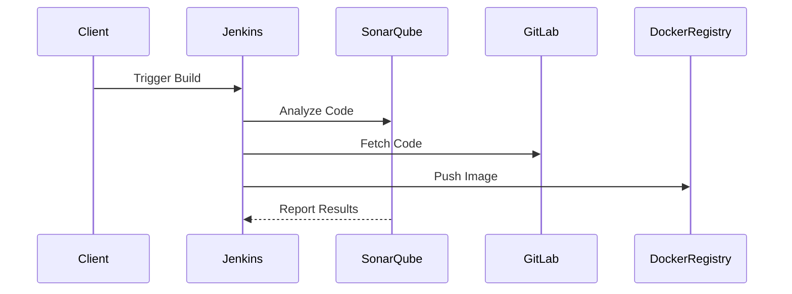

## Introduction to Code Quality Metrics Systems

Code quality metrics systems are essential tools in the DevSecOps pipeline. They help ensure that the codebase adheres to established coding standards, detects potential bugs, and identifies security vulnerabilities. One such system is SonarQube, which provides comprehensive analysis of code quality, security, and maintainability.

### What is SonarQube?

SonarQube is an open-source platform designed to manage code quality. It supports multiple programming languages and integrates seamlessly with various development environments. SonarQube performs static code analysis, which means it examines the code without executing it, to identify issues such as bugs, code smells, and security vulnerabilities.

#### Why Use SonarQube?

- **Quality Assurance**: Ensures that the codebase meets predefined quality standards.
- **Security**: Identifies security vulnerabilities early in the development cycle.
- **Maintainability**: Helps maintain code readability and maintainability over time.
- **Integration**: Integrates with CI/CD pipelines to automate code quality checks.

### Setting Up SonarQube Using Docker Compose

To set up SonarQube, we will use Docker Compose, a tool for defining and running multi-container Docker applications. This approach simplifies the setup process and ensures consistency across different environments.

#### Prerequisites

Before proceeding, ensure you have the following installed:

- Docker
- Docker Compose

#### Step-by-Step Setup

1. **Clone the DevSecOps Lab Repository**

   First, clone the DevSecOps Lab repository from GitHub:

   ```bash
   git clone https://github.com/yourusername/devsecops-lab.git
   cd devsecops-lab
   ```

2. **Check Out the Correct Tag**

   Ensure you are working with the correct tag:

   ```bash
   git checkout tags/Demo_7
   ```

3. **Review the Docker Compose File**

   Open the `docker-compose.yml` file. This file defines the services to be run, including GitLab, Jenkins, Docker Registry, and now SonarQube.

   ```yaml
   version: '3'
   services:
     gitlab:
       image: 'gitlab/gitlab-ce:latest'
       ports:
         - '80:80'
         - '443:443'
         - '22:22'
       volumes:
         - ./data/gitlab/config:/etc/gitlab
         - ./data/gitlab/logs:/var/log/gitlab
         - ./data/gitlab/data:/var/opt/gitlab
     jenkins:
       image: 'jenkins/jenkins:lts'
       ports:
         - '8080:8080'
         - '50000:50000'
       volumes:
         - ./data/jenkins:/var/jenkins_home
     docker-registry:
       image: 'registry:2'
       ports:
         - '5000:5000'
       volumes:
         - ./data/docker-registry:/var/lib/registry
     sonarqube:
       image: 'sonarq
   ```

   The `sonarqube` service is defined with the following properties:

   - **Image**: `sonarqube:7.9-community`
   - **Ports**: Exposes port `9000` for the SonarQube web interface.
   - **Volumes**: Maps volumes to store configuration files and data.

4. **Start the Services**

   Run the following command to start the services:

   ```bash
   docker-compose up -d sonarqube
   ```

   This command starts the `sonarqube` service in detached mode (`-d`). The other services (`gitlab`, `jenkins`, and `docker-registry`) continue to run in the background.

### Accessing SonarQube

Once SonarQube is up and running, you can access it via the web interface.

1. **Open the Web Interface**

   Navigate to `http://localhost:9000` or `http://sonarqube.demo.local:9000` in your browser.

2. **Login**

   Use the default credentials to log in:

   - **Username**: `admin`
   - **Password**: `admin`

### Configuring SonarQube

After logging in, you can configure SonarQube according to your project requirements.

#### Example Configuration

1. **Add a New Project**

   Click on `Projects` and then `Create`. Provide the necessary details such as the project name, key, and description.

2. **Configure Analysis**

   Set up the analysis settings, including the language, quality profiles, and issue severities.

### Integrating SonarQube with Jenkins

To integrate SonarQube with Jenkins, follow these steps:

1. **Install the SonarQube Plugin**

   In Jenkins, navigate to `Manage Jenkins` > `Manage Plugins`. Search for and install the `SonarQube Scanner` plugin.

2. **Configure the SonarQube Server**

   Go to `Manage Jenkins` > `Configure System`. Scroll down to the `SonarQube servers` section and add a new server with the URL `http://sonarqube.demo.local:9000`.

3. **Set Up a Jenkins Job**

   Create a new Jenkins job and configure it to use the SonarQube Scanner. Add the necessary build steps to analyze the code.

### Real-World Examples

#### Recent CVEs and Breaches

- **CVE-2021-22205**: A vulnerability in SonarQube allowed unauthorized users to bypass authentication and gain administrative privileges. This highlights the importance of keeping SonarQube updated and configured securely.
- **Breaches**: Several organizations have experienced breaches due to unsecured SonarQube instances. Proper configuration and monitoring are crucial to prevent such incidents.

### How to Prevent / Defend

#### Detection

- **Regular Audits**: Conduct regular audits of SonarQube configurations and logs to detect any unauthorized access or suspicious activities.
- **Monitoring Tools**: Use monitoring tools like Splunk or ELK Stack to monitor SonarQube logs and detect anomalies.

#### Prevention

- **Secure Configuration**: Follow the official SonarQube security guidelines to secure the installation. Disable unnecessary features and restrict access to sensitive information.
- **Update Regularly**: Keep SonarQube and its plugins up to date to mitigate known vulnerabilities.
- **Access Control**: Implement strict access control measures, including role-based access control (RBAC) and two-factor authentication (2FA).

#### Secure Coding Fixes

**Vulnerable Code Example**

```java
public class VulnerableClass {
    public void insecureMethod() {
        String userInput = "malicious input";
        // Vulnerable code that does not validate user input
    }
}
```

**Fixed Code Example**

```java
public class FixedClass {
    public void secureMethod(String userInput) {
        if (isValidInput(userInput)) {
            // Safe code that validates user input
        } else {
            throw new IllegalArgumentException("Invalid input");
        }
    }

    private boolean isValidInput(String input) {
        // Validation logic
        return input.matches("[a-zA-Z0-9]+");
    }
}
```

### Complete Example

#### Full HTTP Request and Response

**HTTP Request**

```http
POST /api/projects/create HTTP/1.1
Host: sonarqube.demo.local:9000
Content-Type: application/x-www-form-urlencoded

name=MyProject&key=my_project_key&visibility=private
```

**HTTP Response**

```http
HTTP/1.1 201 Created
Date: Mon, 01 Jan 2024 00:00:00 GMT
Content-Type: application/json;charset=UTF-8
Content-Length: 102

{
  "id": "my_project_id",
  "key": "my_project_key",
  "name": "MyProject",
  "visibility": "private"
}
```

### Mermaid Diagrams

#### Network Topology



#### Sequence Diagram



### Practice Labs

For hands-on practice, consider the following labs:

- **PortSwigger Web Security Academy**: Offers exercises on securing web applications.
- **OWASP Juice Shop**: A deliberately insecure web application for practicing security testing.
- **DVWA**: Damn Vulnerable Web Application for learning web application security.
- **WebGoat**: An interactive web application security training tool.

These labs provide practical experience in setting up and securing SonarQube within a DevSecOps environment.

### Conclusion

Setting up and integrating SonarQube into your DevSecOps pipeline is a critical step towards ensuring code quality and security. By following the detailed steps outlined above, you can effectively configure and utilize SonarQube to enhance your development processes. Remember to stay vigilant and regularly update your configurations to mitigate potential security risks.

---
<!-- nav -->
[[DevSecOps/DevSecOps Bootcamp/05-Application Security Testing/03-Automating Code Security Testing/05-Demo Installing a Code Quality Metrics System/02-Introduction to Automating Code Security Testing|Introduction to Automating Code Security Testing]] | [[DevSecOps/DevSecOps Bootcamp/05-Application Security Testing/03-Automating Code Security Testing/05-Demo Installing a Code Quality Metrics System/00-Overview|Overview]] | [[DevSecOps/DevSecOps Bootcamp/05-Application Security Testing/03-Automating Code Security Testing/05-Demo Installing a Code Quality Metrics System/04-Practice Questions & Answers|Practice Questions & Answers]]
