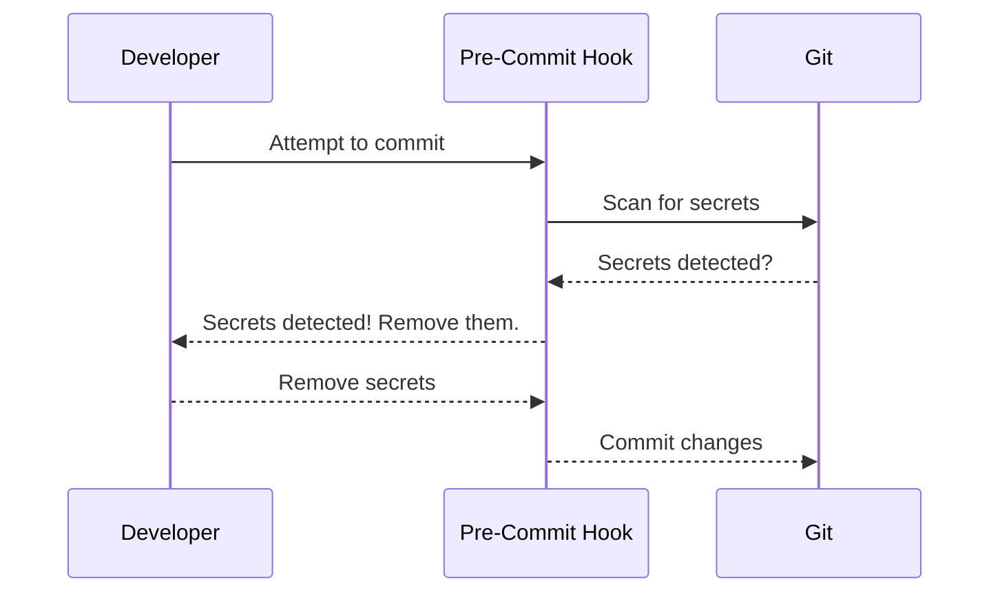
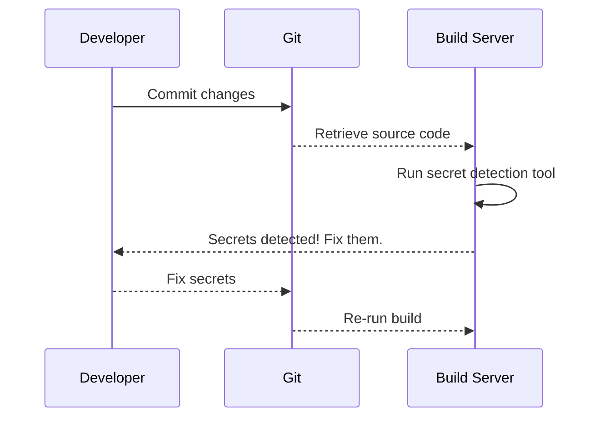
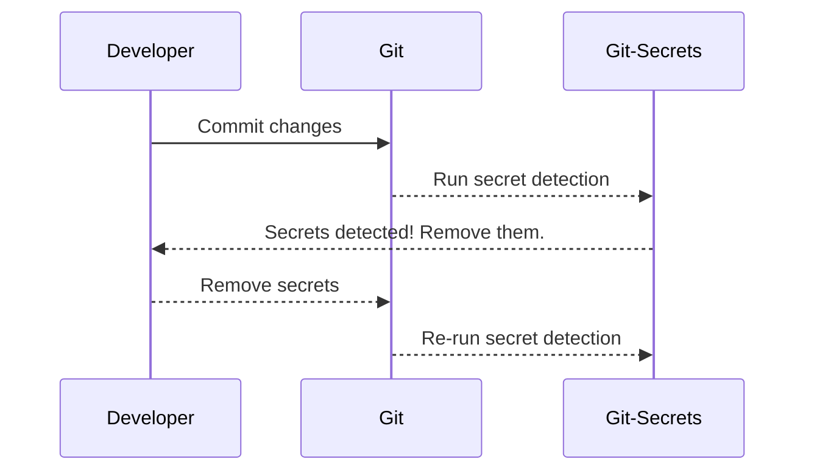
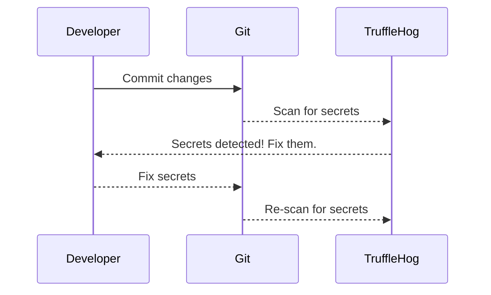
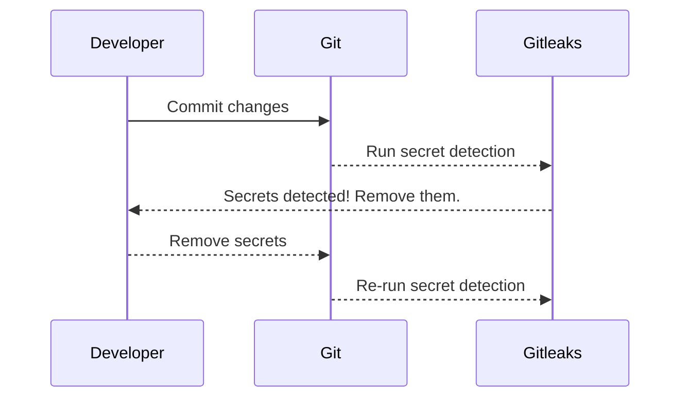

## Detecting Secrets in Code

### Introduction

Detecting secrets in code is a critical aspect of DevSecOps practices. Secrets, such as API keys, database credentials, and encryption keys, should never be hard-coded into source code. If secrets are found in source code, they pose significant security risks, including unauthorized access, data breaches, and compliance violations. In this chapter, we will delve into the reasons why detecting secrets is essential, the best locations to perform these checks, and the tools and techniques used to identify and mitigate secret exposure.

### Why Detect Secrets?

#### What Are Secrets?

Secrets are sensitive pieces of information that should remain confidential. Examples include:

- **API Keys**: Used to authenticate and authorize access to external services.
- **Database Credentials**: Username and password combinations used to access databases.
- **Encryption Keys**: Used to encrypt and decrypt data.
- **OAuth Tokens**: Used for authentication and authorization in OAuth-based systems.

#### Why Should Secrets Not Be Hard-Coded?

Hard-coding secrets in source code poses several risks:

1. **Exposure**: If the source code is pushed to a public repository or leaked, the secrets become publicly accessible.
2. **Unauthorized Access**: Attackers can use exposed secrets to gain unauthorized access to systems and data.
3. **Compliance Violations**: Many regulatory frameworks, such as GDPR and HIPAA, require strict controls over sensitive data. Exposing secrets can lead to non-compliance penalties.

#### Real-World Example: GitHub Data Breach

In 2020, a GitHub user accidentally committed an AWS access key and secret key to a public repository. This led to unauthorized access to the user's AWS account, resulting in significant financial losses. This incident highlights the importance of detecting and preventing secret exposure in source code.

### Best Locations to Detect Secrets

The best locations to detect secrets in your workflow are:

1. **Pre-Commit Hook**
2. **Build Server**

#### Pre-Commit Hook

A pre-commit hook is a script that runs before a commit is made. This ensures that secrets are detected and intercepted before they enter the codebase.

##### How Does It Work?

When a developer attempts to commit changes, the pre-commit hook runs and scans the code for potential secrets. If secrets are found, the commit is blocked, and the developer is alerted.

##### Example: Git Pre-Commit Hook

```bash
#!/bin/sh
# git-pre-commit-hook.sh

echo "Running pre-commit hook..."

# Run a secret detection tool
if ! git-secrets --scan; then
    echo "Secrets detected! Please remove them before committing."
    exit 1
fi

echo "No secrets detected. Committing..."
```

##### Diagram: Pre-Commit Hook Workflow



#### Build Server

The build server retrieves source code that has already been committed and analyzes it for secrets. This ensures that even if secrets slip through the pre-commit hook, they are detected during the build process.

##### How Does It Work?

During the build process, the build server runs a secret detection tool to scan the source code. If secrets are found, the build fails, and the developer is notified.

##### Example: Jenkins Build Script

```groovy
pipeline {
    agent any
    stages {
        stage('Build') {
            steps {
                sh 'make'
            }
        }
        stage('Secret Detection') {
            steps {
                sh 'git-secrets --scan'
            }
        }
    }
}
```

##### Diagram: Build Server Workflow



### Tools for Secret Detection

Several tools are available for detecting secrets in code. Some popular ones include:

1. **Git-Secrets**
2. **TruffleHog**
3. **Gitleaks**

#### Git-Secrets

**What Is Git-Secrets?**

Git-Secrets is a tool that helps detect secrets in Git repositories. It can be configured to run as a pre-commit hook or as part of a build process.

**How Does It Work?**

Git-Secrets uses regular expressions to match patterns that resemble secrets. It can be customized to detect specific types of secrets.

**Example Configuration**

```yaml
# .gitsecrets
patterns:
  - pattern: ^[a-zA-Z0-9]{40}$
    description: SHA-1 hash
  - pattern: ^[a-zA-Z0-9]{64}$
    description: SHA-256 hash
  - pattern: ^[a-zA-Z0-9]{32}$
    description: MD5 hash
```

**Diagram: Git-Secrets Workflow**



#### TruffleHog

**What Is TruffleHog?**

TruffleHog is a tool that detects secrets in Git repositories. It uses machine learning to identify patterns that resemble secrets.

**How Does It Work?**

TruffleHog scans Git repositories and identifies potential secrets based on patterns and context.

**Example Usage**

```bash
trufflehog --regex --entropy=True --max_depth=100 https://github.com/user/repo.git
```

**Diagram: TruffleHog Workflow**



#### Gitleaks

**What Is Gitleaks?**

Gitleaks is a tool that detects secrets in Git repositories. It supports various types of secrets and can be configured to run as a pre-commit hook or as part of a build process.

**How Does It Work?**

Gitleaks uses regular expressions and context to identify potential secrets.

**Example Configuration**

```yaml
# gitleaks.toml
[regex]
  [[regex]]
    name = "AWS Access Key"
    regex = "(AKIA|ASIA)[A-Z0-9]{16}"
    description = "AWS Access Key"
```

**Diagram: Gitleaks Workflow**



### How to Prevent / Defend

#### Secure Coding Practices

1. **Environment Variables**: Store secrets in environment variables instead of hard-coding them.
2. **Configuration Files**: Use configuration files to store secrets, but ensure they are not checked into the repository.
3. **Secret Management Tools**: Use tools like HashiCorp Vault or AWS Secrets Manager to manage secrets securely.

#### Example: Using Environment Variables

**Vulnerable Code**

```python
import os

# Hard-coded secret
api_key = "my-secret-key"

def get_data():
    url = f"https://api.example.com/data?key={api_key}"
    response = requests.get(url)
    return response.json()
```

**Secure Code**

```python
import os

# Read secret from environment variable
api_key = os.getenv("API_KEY")

def get_data():
    url = f"https://api.example.com/data?key={api_key}"
    response = requests.get(url)
    return response.json()
```

#### Example: Using Configuration Files

**Vulnerable Code**

```python
import json

# Hard-coded secret
api_key = "my-secret-key"

def get_data():
    url = f"https://api.example.com/data?key={api_key}"
    response = requests.get(url)
    return response.json()
```

**Secure Code**

```python
import json

# Read secret from configuration file
with open("config.json") as f:
    config = json.load(f)
    api_key = config["api_key"]

def get_data():
    url = f"https://api.example.com/data?key={api_key}"
    response = requests.get(url)
    return response.json()
```

#### Example: Using Secret Management Tools

**Vulnerable Code**

```python
import requests

# Hard-coded secret
api_key = "my-secret-key"

def get_data():
    url = f"https://api.example.com/data?key={api_key}"
    response = requests.get(url)
    return response.json()
```

**Secure Code**

```python
import hvac
import requests

# Initialize Vault client
client = hvac.Client(url="https://vault.example.com", token="my-vault-token")

# Read secret from Vault
secret = client.secrets.kv.v2.read_secret_version(path="my-secret")
api_key = secret["data"]["data"]["api_key"]

def get_data():
    url = f"https://api.example.com/data?key={api_key}"
    response = requests.get(url)
    return response.json()
```

### Hands-On Labs

To practice detecting secrets in code, consider the following labs:

- **PortSwigger Web Security Academy**: Offers interactive labs on web application security, including secret detection.
- **OWASP Juice Shop**: A deliberately insecure web application for practicing security testing.
- **DVWA (Damn Vulnerable Web Application)**: A PHP/MySQL web application that demonstrates insecure coding practices.
- **WebGoat**: An interactive training application designed to teach web application security.

These labs provide practical experience in identifying and mitigating secret exposure in code.

### Conclusion

Detecting secrets in code is a crucial aspect of DevSecOps practices. By using pre-commit hooks and build servers, and leveraging tools like Git-Secrets, TruffleHog, and Gitleaks, you can effectively identify and prevent secret exposure. Secure coding practices, such as using environment variables and secret management tools, further enhance the security of your applications. Regularly practicing these techniques in hands-on labs will help you master the art of detecting and mitigating secret exposure in code.

---
<!-- nav -->
[[DevSecOps/DevSecOps Bootcamp/05-Application Security Testing/03-Automating Code Security Testing/08-Detecting Secrets in Code/00-Overview|Overview]] | [[DevSecOps/DevSecOps Bootcamp/05-Application Security Testing/03-Automating Code Security Testing/08-Detecting Secrets in Code/02-Practice Questions & Answers|Practice Questions & Answers]]
