## Introduction to Code Quality Metrics Systems

Code quality metrics systems are essential tools in modern software development, particularly within the DevSecOps framework. These systems help developers maintain high-quality code by identifying potential issues, suggesting improvements, and providing a clear, objective view of the codebase's health. This chapter delves into the workflow and conclusion of using code quality metrics systems, covering everything from initial setup to ongoing maintenance and improvement.

### What Are Code Quality Metrics Systems?

Code quality metrics systems are automated tools designed to analyze source code and provide quantitative measures of its quality. These systems typically evaluate code based on various criteria, including complexity, maintainability, readability, and adherence to coding standards. By automating this process, these systems help teams identify and address issues early in the development cycle, reducing the likelihood of bugs and security vulnerabilities.

#### Why Use Code Quality Metrics Systems?

Using code quality metrics systems offers several benefits:

1. **Objective Evaluation**: These systems provide an objective assessment of code quality, which can be more reliable than subjective human evaluations.
2. **Early Detection**: Automated analysis helps catch issues early in the development process, reducing the cost and effort required to fix them later.
3. **Consistency**: Metrics systems ensure consistency across the codebase by enforcing coding standards and best practices.
4. **Continuous Improvement**: Regular analysis allows teams to track improvements over time and identify areas needing further attention.

### Selecting a Suitable System

Choosing the right code quality metrics system is crucial for effective integration into your development workflow. Consider the following factors when selecting a system:

1. **Language Support**: Ensure the system supports the programming languages used in your project. For instance, if your application is primarily written in JavaScript, choose a system with strong JavaScript support.
2. **Framework Compatibility**: Check if the system integrates well with the frameworks and libraries used in your project.
3. **Ease of Setup**: Opt for a system that requires minimal setup and configuration. Ideally, it should work out-of-the-box with your existing environment.
4. **Comprehensive Reporting**: Look for systems that provide detailed reports and visual dashboards to help you understand the state of your codebase.

#### Example: JavaScript Support

In our example, we chose a system with ample support for JavaScript. This decision was driven by the fact that our application is predominantly written in JavaScript. The system provided immediate results without requiring additional plugins, streamlining the setup process.

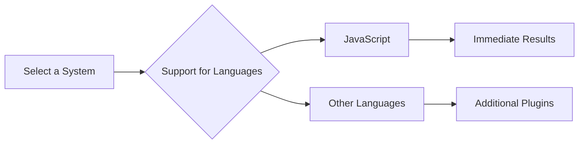

### Generating and Auditing Issue Lists

Once the system is set up, it generates a list of issues found in the codebase. This list is critical for maintaining code quality, but it requires careful auditing to ensure accuracy and relevance.

#### Steps to Generate and Audit Issue Lists

1. **Run Initial Scan**: Execute the first scan to generate a baseline of issues.
2. **Audit Issues**: Review each issue to determine if it is a false positive or a genuine problem.
3. **Prioritize Issues**: Focus on high-priority issues that could significantly impact code quality or introduce security vulnerabilities.

#### Example: False Positives

During the initial scan, numerous issues may be flagged as potential problems. However, many of these could be false positives. For instance, a rule might flag a variable name as too short, but in context, it might be perfectly acceptable. Careful auditing ensures that only genuine issues are addressed.

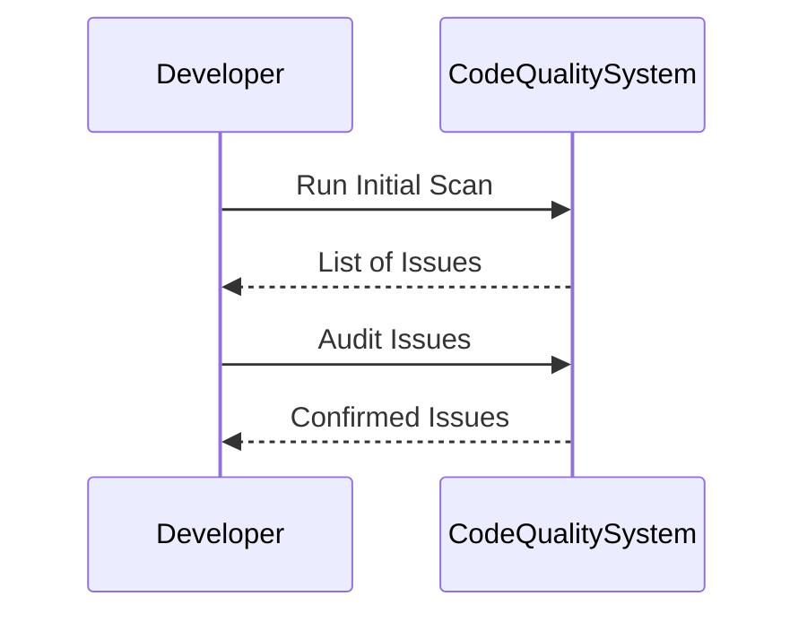

### Configuring Rules and Metrics

To ensure the system provides meaningful insights, it is essential to configure the rules and metrics according to your specific needs.

#### Steps to Configure Rules and Metrics

1. **Review Default Rules**: Understand the default rules and their implications on your codebase.
2. **Customize Rules**: Adjust the rules to align with your coding standards and project requirements.
3. **Set Thresholds**: Define thresholds for different metrics to avoid information overload.

#### Example: Customizing Rules

Suppose the system flags a large number of issues related to code complexity. You might decide to adjust the threshold for complexity to a higher value, reducing the number of issues reported. This customization ensures that the system focuses on the most critical issues.

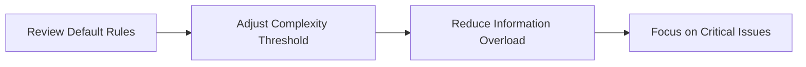

### Comparing Scan Results Over Time

Regularly comparing scan results helps track the evolution of code quality over time. This comparison can reveal both regressions and improvements, allowing teams to take corrective actions as needed.

#### Steps to Compare Scan Results

1. **Store Historical Data**: Keep a record of past scan results for comparison.
2. **Compare Results**: Analyze the differences between consecutive scans.
3. **Identify Trends**: Look for patterns in the data to understand the overall trend in code quality.

#### Example: Regression Analysis

Suppose a recent scan reveals a regression in code quality compared to the previous scan. This could indicate that recent changes have introduced new issues. By identifying the specific changes responsible, teams can take corrective actions to restore code quality.

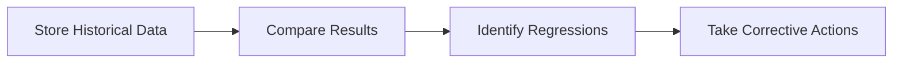

### Benefits of Using Code Quality Metrics Systems

The advantages of using code quality metrics systems extend beyond mere issue detection. These systems provide several key benefits:

1. **Visibility**: They make the quality of code visible, enabling teams to understand the state of the codebase objectively.
2. **Best Practices**: By suggesting best practices, these systems help teams improve their coding habits and adhere to industry standards.
3. **Impact Insight**: They offer insights into the impact of changes, helping teams assess the effects of recent modifications.

#### Example: Graphical Dashboard

One of the standout features of these systems is the graphical dashboard. This dashboard provides an at-a-glance view of code quality metrics, making it easy to identify trends and areas needing attention. For instance, a dashboard might highlight a sudden increase in complexity scores, indicating a potential issue.

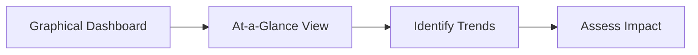

### Real-World Examples and Case Studies

Real-world examples and case studies illustrate the practical application and effectiveness of code quality metrics systems. Here are a few recent examples:

#### Example 1: CVE-2021-44228 (Log4j)

The Log4j vulnerability (CVE-2021-44228) highlighted the importance of code quality and security. A code quality metrics system could have identified the problematic code early, preventing the widespread exploitation of this vulnerability.

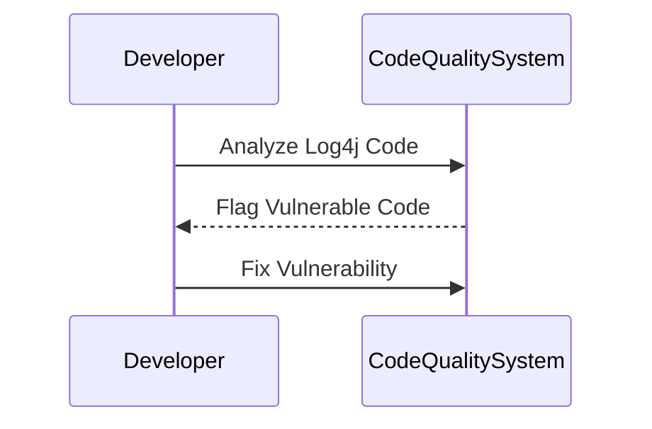

#### Example 2: Capital One Breach (2019)

The Capital One breach in 2019 exposed sensitive customer data due to misconfigured cloud storage. A code quality metrics system could have flagged the misconfiguration, preventing the breach.

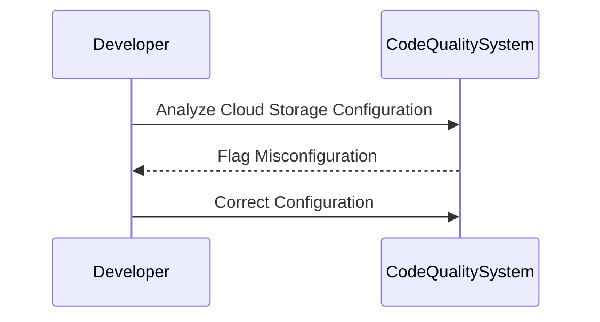

### Common Pitfalls and How to Avoid Them

While code quality metrics systems offer significant benefits, they are not without challenges. Here are some common pitfalls and strategies to avoid them:

#### Pitfall 1: Information Overload

**Problem**: The system may flag too many issues, leading to information overload and difficulty in prioritization.

**Solution**: Customize the rules and metrics to focus on the most critical issues. Set appropriate thresholds to filter out less severe problems.

#### Pitfall 2: False Positives

**Problem**: Many flagged issues may be false positives, wasting time and resources.

**Solution**: Conduct thorough audits to verify the validity of each issue. Adjust the rules to reduce false positives.

#### Pitfall 3: Lack of Integration

**Problem**: Poor integration with existing development tools can hinder adoption.

**Solution**: Choose a system that integrates seamlessly with your existing tools and workflows. Ensure compatibility with your version control system, IDE, and continuous integration pipeline.

### How to Prevent / Defend

To effectively use code quality metrics systems, it is crucial to implement robust detection, prevention, and mitigation strategies.

#### Detection

**Tools**: Use static code analysis tools like SonarQube, ESLint, or Pylint to detect issues early in the development cycle.

**Example**: SonarQube provides comprehensive code analysis and reporting capabilities.

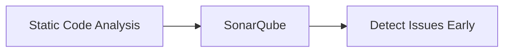

#### Prevention

**Secure Coding Practices**: Implement secure coding practices to prevent common vulnerabilities.

**Example**: Use secure coding guidelines like the OWASP Top Ten to guide development practices.

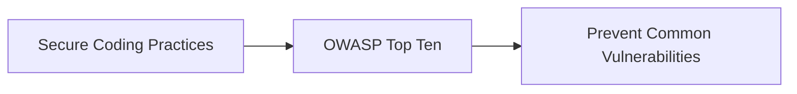

#### Mitigation

**Configuration Hardening**: Harden configurations to minimize exposure to vulnerabilities.

**Example**: Secure cloud storage configurations to prevent unauthorized access.

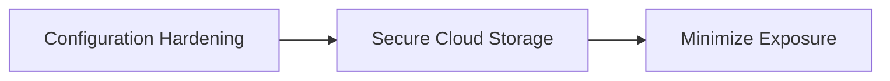

### Complete Example: Setting Up and Using a Code Quality Metrics System

Here is a complete example of setting up and using a code quality metrics system, specifically SonarQube, for a JavaScript project.

#### Step 1: Install SonarQube

First, install SonarQube on your local machine or server.

```bash
# Download SonarQube
wget https://binaries.sonarsource.com/Distribution/sonarqube/sonarqube-8.9.1.48888.zip

# Unzip the package
unzip sonarqube-8.9.1.48888.zip

# Start SonarQube
cd sonarqube-8.9.1.48888/bin/linux-x86-64/
./sonar.sh start
```

#### Step 2: Configure SonarQube

Configure SonarQube to integrate with your JavaScript project.

```bash
# Create a new project in SonarQube
sonar-project.properties

# Add the following properties
sonar.projectKey=my_project
sonar.sources=src
sonar.language=js
sonar.host.url=http://localhost:9000
sonar.login=<your_token>
```

#### Step 3: Run Initial Scan

Run the initial scan to generate a baseline of issues.

```bash
# Run the initial scan
sonar-scanner
```

#### Step 4: Audit Issues

Audit the issues generated by the initial scan.

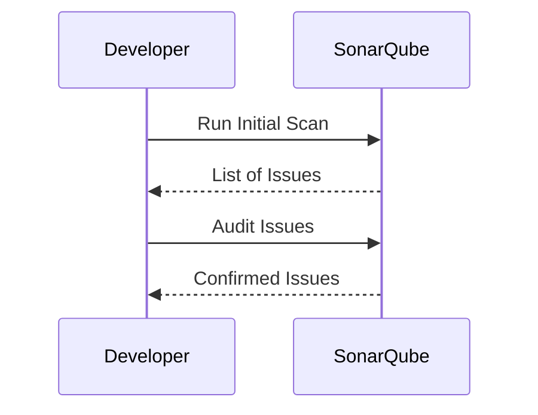

#### Step 5: Configure Rules and Metrics

Customize the rules and metrics to align with your project requirements.

```bash
# Customize rules and metrics
sonar-project.properties

# Add the following properties
sonar.cpd.exclusions=src/**/*.js
sonar.issue.ignore.multicriteria=e1,e2
sonar.issue.ignore.multicriteria.e1.ruleKey=squid:S1068
sonar.issue.ignore.multicriteria.e1.resourceKey=src/**/*.js
sonar.issue.ignore.multicriteria.e2.ruleKey=squid:S1192
sonar.issue.ignore.multicriteria.e2.resourceKey=src/**/*.js
```

#### Step 6: Compare Scan Results Over Time

Regularly compare scan results to track the evolution of code quality.

```bash
# Run subsequent scans
sonar-scanner
```

#### Full HTTP Request and Response Example

Here is an example of a full HTTP request and response for configuring SonarQube via its API.

```http
POST /api/settings/set HTTP/1.1
Host: localhost:9000
Content-Type: application/x-www-form-urlencoded

key=sonar.cpd.exclusions&value=src/**/*.js
```

```http
HTTP/1.1 200 OK
Date: Tue, 15 Aug 2023 12:00:00 GMT
Content-Type: application/json

{
  "status": "success",
  "message": "Setting updated successfully"
}
```

### Hands-On Labs

To gain practical experience with code quality metrics systems, consider the following hands-on labs:

- **PortSwigger Web Security Academy**: Offers exercises on securing web applications.
- **OWASP Juice Shop**: Provides a vulnerable web application for learning security concepts.
- **DVWA (Damn Vulnerable Web Application)**: A deliberately insecure web application for practicing security testing.
- **WebGoat**: An interactive training application for learning about web application security.

These labs provide real-world scenarios to apply the concepts learned in this chapter.

### Conclusion

Code quality metrics systems are invaluable tools for maintaining high-quality code in modern software development. By selecting the right system, generating and auditing issue lists, configuring rules and metrics, and comparing scan results over time, teams can significantly improve code quality and reduce the risk of security vulnerabilities. Through careful implementation and regular monitoring, these systems can provide objective insights, suggest best practices, and help teams continuously improve their codebases.

---
<!-- nav -->
[[DevSecOps/DevSecOps Bootcamp/05-Application Security Testing/03-Automating Code Security Testing/12-Workflow and Conclusion of Code Quality Metrics Systems/01-Introduction to Automating Code Security Testing|Introduction to Automating Code Security Testing]] | [[DevSecOps/DevSecOps Bootcamp/05-Application Security Testing/03-Automating Code Security Testing/12-Workflow and Conclusion of Code Quality Metrics Systems/00-Overview|Overview]] | [[DevSecOps/DevSecOps Bootcamp/05-Application Security Testing/03-Automating Code Security Testing/12-Workflow and Conclusion of Code Quality Metrics Systems/03-Practice Questions & Answers|Practice Questions & Answers]]
