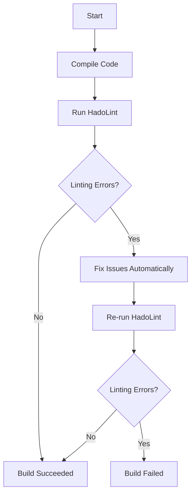

## Automating Code Security Testing with Linters

### Introduction to Linters

A linter is a static code analysis tool used to flag programming errors, bugs, stylistic errors, and suspicious constructs. Linters are essential in DevSecOps workflows as they help maintain code quality and security standards throughout the development process. One such linter is `HadoLint`, which is specifically designed for Haskell codebases. However, the principles and practices discussed here can be applied to other languages and their respective linters.

### Understanding the Build Failure

In the demo, the build failed due to issues detected by `HadoLint`. This failure is intentional and serves as a critical checkpoint in the continuous integration (CI) pipeline. Let's break down the components involved:

1. **Build Process**: The build process typically includes compiling the code, running tests, and executing static analysis tools like linters.
2. **Linting Phase**: During the linting phase, `HadoLint` scans the codebase for potential issues and reports them.
3. **Failure Condition**: If `HadoLint` detects issues that violate the configured rules, the build fails, preventing the deployment of potentially insecure or low-quality code.

#### Example Scenario

Consider a simple Haskell function that might trigger a linting error:

```haskell
-- Vulnerable code
module Main where

main :: IO ()
main = putStrLn "Hello, World!"
```

When this code is run through `HadoLint`, it might report an issue related to the lack of type annotations or other coding standards.

### Configuring the Baseline

The decision to fail the build or configure the baseline depends on the maturity of your codebase and the team's familiarity with the linter's rules. Here’s how you can approach this:

1. **Initial Configuration**: When starting with a new linter, it's often beneficial to configure the baseline to match the current state of the codebase. This avoids overwhelming developers with too many warnings initially.
2. **Iterative Improvement**: Over time, you can tighten the rules incrementally, ensuring that the codebase gradually improves in quality and security.

#### Example Configuration

Here’s an example of configuring `HadoLint` in a `.hadolint.yaml` file:

```yaml
# .hadolint.yaml
rules:
  Warnings:
    - Warnings
  Errors:
    - Errors
  Style:
    - Style
  Redundancies:
    - Redundancies
  Simplifications:
    - Simplifications
```

This configuration allows you to selectively enable or disable specific types of warnings and errors.

### Full Example of a Failed Build

Let’s look at a complete example of a build that fails due to `HadoLint` issues:

#### Code Example

```haskell
-- Vulnerable code
module Main where

main :: IO ()
main = putStrLn "Hello, World!"
```

#### Linter Output

When this code is run through `HadoLint`, the output might look something like this:

```plaintext
$ hadolint .
./Main.hs:1:1: Warnings: Missing module name
./Main.hs:3:1: Warnings: Missing type signature
```

#### Build Script

Here’s an example of a build script that integrates `HadoLint`:

```bash
#!/bin/bash

# Compile the code
ghc Main.hs

# Run HadoLint
hadolint .

# Check if HadoLint found any issues
if [ $? -ne 0 ]; then
  echo "Build failed due to linting errors."
  exit 1
fi

echo "Build succeeded."
```

### How to Prevent / Defend

To prevent build failures due to linter issues, follow these steps:

1. **Configure Baseline**: Set up the initial configuration of `HadoLint` to match the current state of the codebase.
2. **Incremental Improvement**: Gradually tighten the rules over time, ensuring that the codebase improves in quality and security.
3. **Code Reviews**: Incorporate linter checks into the code review process to catch issues early.
4. **Automated Fixes**: Use automated tools to fix common issues flagged by the linter.

#### Secure Code Fix Example

Here’s an example of fixing the issues reported by `HadoLint`:

```haskell
-- Fixed code
module Main where

main :: IO ()
main = putStrLn "Hello, World!"
```

#### Full Example with Automated Fixes

Here’s a complete example of a build script that includes automated fixes:

```bash
#!/bin/bash

# Compile the code
ghc Main.hs

# Run HadoLint
hadolint .

# Check if HadoLint found any issues
if [ $? -ne 0 ]; then
  echo "Linting errors found. Attempting to fix automatically..."
  
  # Apply automatic fixes
  hadolint --apply ./Main.hs
  
  # Re-run HadoLint
  hadolint .
  
  if [ $? -ne 0 ]; then
    echo "Build failed after attempting to fix linting errors."
    exit 1
  fi
fi

echo "Build succeeded."
```

### Real-World Examples and Recent Breaches

Recent breaches have highlighted the importance of maintaining high code quality and security standards. For example, the SolarWinds breach (CVE-2020-1014) was partly due to poor code quality and lack of proper security checks. Integrating linters into the CI/CD pipeline can help prevent such vulnerabilities.

### Mermaid Diagrams

Let’s visualize the workflow using a mermaid diagram:



### Hands-On Labs

For hands-on practice, consider the following labs:

- **PortSwigger Web Security Academy**: Offers interactive labs on web application security.
- **OWASP Juice Shop**: A deliberately insecure web application for security training.
- **DVWA (Damn Vulnerable Web Application)**: Another popular web application for security testing.

These labs provide practical experience in integrating linters and other security tools into the CI/CD pipeline.

### Conclusion

Integrating linters like `HadoLint` into your DevSecOps workflow is crucial for maintaining code quality and security. By configuring the baseline, tightening rules over time, and incorporating linter checks into the code review process, you can significantly reduce the risk of vulnerabilities in your codebase.

---
<!-- nav -->
[[DevSecOps/DevSecOps Bootcamp/05-Application Security Testing/03-Automating Code Security Testing/14-Workflow and Conclusion of Using Linters/00-Overview|Overview]] | [[02-Workflow for Using Linters|Workflow for Using Linters]]
