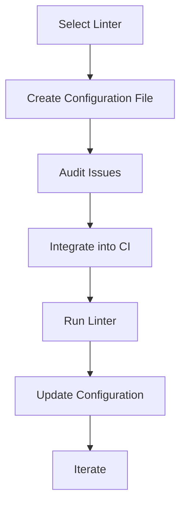

## Workflow for Using Linters

### Introduction to Linters

A linter is a static code analysis tool designed to flag programming errors, bugs, stylistic errors, and suspicious constructs. The primary goal of a linter is to ensure that the codebase adheres to a set of predefined rules and standards, thereby improving code quality, maintainability, and security. Linters can be applied to various programming languages, including Python, JavaScript, Java, C++, and many others.

### Selecting the Tooling

The first step in integrating linters into your development workflow is to agree upon the specific linter tool and its version. This decision is critical because different linters may have varying capabilities and compatibility with your existing tools and frameworks.

#### Example: Choosing a Linter for Python

For Python, popular linters include `flake8`, `pylint`, and `mypy`. Each of these tools has its strengths:

- **`flake8`**: Combines `pep8` (now `pycodestyle`) and `pyflakes` to enforce PEP 8 style guidelines and detect simple errors.
- **`pylint`**: Provides more extensive checks, including code complexity and potential bugs.
- **`mypy`**: Focuses on type checking, ensuring that your code adheres to type annotations.

#### Real-World Example: CVE-2021-44228 (Log4Shell)

In the case of the Log4Shell vulnerability (CVE-2021-44228), a linter could have flagged the use of unsafe logging functions. By enforcing strict coding standards, linters can help prevent such vulnerabilities.

### Creating a List of Current Linter Issues

Once you have selected the linter, the next step is to run it against your existing codebase to identify any issues. This initial scan helps you understand the current state of your code and the areas that need improvement.

#### Example: Running `flake8`

To run `flake8` on a Python project, you would typically execute the following command:

```bash
flake8 .
```

This command scans the current directory and all subdirectories for Python files and reports any violations of the PEP 8 style guide.

### Auditing the List of Issues

After identifying the issues, the next step is to audit them to determine whether they are false positives or genuine problems. This process is crucial because blindly fixing all reported issues without verification can lead to unnecessary changes and potential bugs.

#### Example: Auditing `flake8` Reports

Suppose `flake8` reports the following issue:

```plaintext
./src/main.py:10:1: E302 expected 2 blank lines, found 1
```

This indicates that there should be two blank lines between function definitions, but only one was found. You would need to verify whether this rule makes sense in the context of your codebase.

### Adding Configuration Files

To ensure that the linter only flags valid issues, you should add a configuration file to your repository. This file specifies the rules and exceptions that the linter should follow.

#### Example: Configuring `flake8`

You can create a `.flake8` configuration file in the root of your project with the following content:

```ini
[flake8]
max-line-length = 120
ignore = E203, E231
```

This configuration sets the maximum line length to 120 characters and ignores certain rules (`E203` and `E231`).

### Warning or Failing Builds for New Issues

As part of your continuous integration (CI) pipeline, you should configure the linter to warn or fail builds when new issues arise. This ensures that the code quality does not degrade over time.

#### Example: Integrating `flake8` into a CI Pipeline

You can integrate `flake8` into a CI pipeline using a `.github/workflows/ci.yml` file:

```yaml
name: CI

on:
  push:
    branches: [ main ]
  pull_request:
    branches: [ main ]

jobs:
  build:
    runs-on: ubuntu-latest

    steps:
    - uses: actions/checkout@v3
    - name: Set up Python
      uses: actions/setup-python@v4
      with:
        python-version: '3.x'
    - name: Install dependencies
      run: |
        python -m pip install --upgrade pip
        pip install flake8
    - name: Run flake8
      run: |
        flake8 .
```

This workflow checks out the code, sets up Python, installs `flake8`, and runs it on the codebase. If `flake8` finds any issues, the build will fail.

### Updating Configuration When Necessary

As your codebase evolves, you may need to update the linter configuration to reflect new requirements or to address false positives.

#### Example: Updating `.flake8` Configuration

Suppose you introduce a new library that requires a different coding style. You can update the `.flake8` configuration to accommodate this change:

```ini
[flake8]
max-line-length = 120
ignore = E203, E231, W503
```

Here, the `W503` rule is added to the ignore list to allow for chained comparisons.

### Advantages of Using Linters

#### Error Detection

Linters can detect various types of errors, including syntax errors, logical errors, and potential security vulnerabilities. By catching these issues early, linters help prevent bugs and security flaws from making their way into production.

#### Formatting and Styling

Linters enforce consistent formatting and styling across the codebase. This uniformity makes the code easier to read and maintain, reducing the cognitive load on developers.

#### Best Practices

Linters often come with built-in rules that promote best practices. For example, they can flag unused variables, redundant imports, and inefficient code patterns.

### Compatibility Considerations

Not all linters are compatible with every tool or framework. Before selecting a linter, you should ensure that it integrates well with your existing development environment.

#### Example: Compatibility with Frameworks

If you are using a specific framework like Django or Flask, you should choose a linter that supports the conventions and best practices of that framework. For instance, `flake8-django` extends `flake8` to provide additional checks for Django-specific code.

### Ease of Integration

Most linters are relatively easy to integrate into continuous integration pipelines. This ease of integration is a significant advantage, as it allows you to automate the process of code quality enforcement.

#### Example: Integrating `pylint` into a CI Pipeline

You can integrate `pylint` into a CI pipeline using a similar approach to the `flake8` example:

```yaml
name: CI

on:
  push:
    branches: [ main ]
  pull_request:
    branches: [ main ]

jobs:
  build:
    runs-on: ubuntu-latest

    steps:
    - uses: actions/checkout@v3
    - name: Set up Python
      uses: actions/setup-python@v4
      with:
        python-version: '3.x'
    - name: Install dependencies
      run: |
        python -m pip install --upgrade pip
        pip install pylint
    - name: Run pylint
      run: |
        pylint .
```

### Iterative Process

The process of integrating linters into your workflow is iterative. You should continuously refine the tooling, configuration, and processes based on feedback and evolving requirements.

#### Steps in the Iterative Process

1. **Select the Tool**: Choose the appropriate linter based on your language and framework.
2. **Implement the Tool**: Integrate the linter into your CI pipeline.
3. **Analyze Results**: Review the issues reported by the linter and determine their validity.
4. **Improve**: Refine the linter configuration and adjust the codebase to meet the defined standards.

### How to Prevent / Defend

#### Detection

To detect issues flagged by linters, you should regularly run the linter as part of your CI pipeline. This ensures that any new issues are caught early in the development cycle.

#### Prevention

To prevent issues from arising, you should enforce strict coding standards and best practices. This includes using linters to catch potential problems before they become serious issues.

#### Secure Coding Fixes

To demonstrate secure coding practices, consider the following example:

**Vulnerable Code**

```python
def calculate_discount(price, discount_percentage):
    return price * (1 - discount_percentage)
```

**Fixed Code**

```python
def calculate_discount(price, discount_percentage):
    if discount_percentage < 0 or discount_percentage > 1:
        raise ValueError("Discount percentage must be between 0 and 1")
    return price * (1 - discount_percentage)
```

In the fixed code, we add validation to ensure that the `discount_percentage` is within a valid range, preventing potential errors or security vulnerabilities.

#### Configuration Hardening

To harden your linter configuration, you can enable stricter rules and disable less critical ones. For example, you can modify the `.flake8` configuration to enforce more stringent rules:

```ini
[flake8]
max-line-length = 110
ignore = E203, E231
```

By reducing the maximum line length and disabling less critical rules, you can ensure that the code adheres to higher standards.

### Conclusion

Integrating linters into your development workflow is a powerful way to improve code quality, maintainability, and security. By following the steps outlined in this chapter, you can effectively leverage linters to enhance your codebase and prevent common issues.

### Practice Labs

For hands-on experience with linters, consider the following practice labs:

- **PortSwigger Web Security Academy**: Offers interactive labs on web application security, including topics related to code quality and security.
- **OWASP Juice Shop**: A deliberately insecure web application for practicing web security skills.
- **DVWA (Damn Vulnerable Web Application)**: Another intentionally vulnerable web application for learning web security.
- **WebGoat**: An interactive training application for learning about web application security.

These labs provide practical scenarios where you can apply the concepts learned in this chapter and gain valuable experience with linters and other security tools.

### Summary Diagram



This diagram summarizes the key steps involved in integrating linters into your development workflow. By following this process, you can ensure that your codebase remains high-quality and secure.

---
<!-- nav -->
[[01-Automating Code Security Testing with Linters|Automating Code Security Testing with Linters]] | [[DevSecOps/DevSecOps Bootcamp/05-Application Security Testing/03-Automating Code Security Testing/14-Workflow and Conclusion of Using Linters/00-Overview|Overview]] | [[DevSecOps/DevSecOps Bootcamp/05-Application Security Testing/03-Automating Code Security Testing/14-Workflow and Conclusion of Using Linters/03-Practice Questions & Answers|Practice Questions & Answers]]
