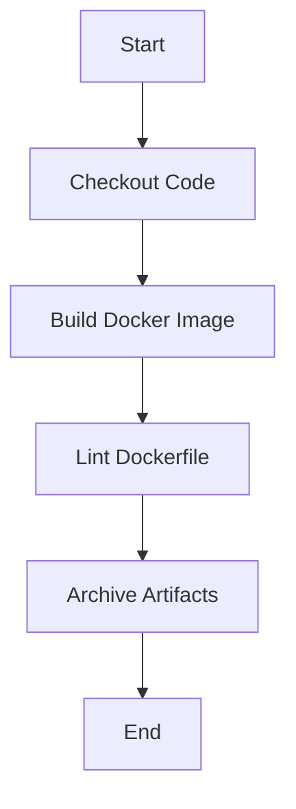

## Automating Code Security Testing: Linting a Dockerfile

### Introduction to Code Security Testing

Automating code security testing is a critical component of modern DevSecOps practices. By integrating automated tools into the Continuous Integration/Continuous Deployment (CI/CD) pipeline, developers can ensure that their code adheres to security best practices and standards. One such tool is a linter, which checks the code for potential issues and violations of coding standards.

In this chapter, we will focus on linting a Dockerfile using a pipeline stage in Jenkins. This process ensures that the Dockerfile is free of common security vulnerabilities and follows best practices.

### Setting Up the Pipeline Stage

The first step is to define a pipeline stage that runs regardless of whether the build fails or not. This is crucial because even if the build fails, we still want to capture and save the artifacts generated during the build process.

#### Groovy Syntax for Archiving Artifacts

Jenkins uses Groovy as its scripting language. To archive artifacts, we use the `archiveArtifacts` step in the Jenkinsfile. Here’s an example of how to set up this step:

```groovy
pipeline {
    agent any
    stages {
        stage('Build') {
            steps {
                // Build steps go here
            }
        }
        stage('Lint') {
            steps {
                sh 'hadolint Dockerfile'
            }
        }
    }
    post {
        always {
            archiveArtifacts artifacts: '**/*Results.txt', allowEmptyArchive: true
        }
    }
}
```

In this example, the `post` section contains an `always` block, which ensures that the `archiveArtifacts` step runs regardless of the build status. The `artifacts` parameter specifies a regular expression to match the files to be archived. In this case, we are archiving all files ending with `Results.txt`.

### Creating a New Branch

Before pushing the changes to the GitLab server, we need to create a new branch. This allows us to test the changes without affecting the main branch.

#### Using Git Commands

To create a new branch and push the changes, follow these steps:

1. **Create a new branch**:
   ```bash
   git checkout -b demo_free
   ```

2. **Add the modified Jenkinsfile**:
   ```bash
   git add Jenkinsfile
   ```

3. **Commit the changes**:
   ```bash
   git commit -m "Add linting to Dockerfile"
   ```

4. **Push the changes to the GitLab server**:
   ```bash
   git push origin demo_free
   ```

### Monitoring the Build Results

After pushing the changes, we can monitor the build results through the Jenkins web interface.

#### Accessing the Build Results

1. **Navigate to the Jenkins dashboard**.
2. **Click on the job name** to view the build details.
3. **Click on the specific build number** to see the detailed output.

If the build fails, it indicates that the linter found issues in the Dockerfile. This is actually a good sign because it means the linter is working correctly.

### Analyzing the Build Artifacts

To understand what went wrong, we can download the build artifacts and review the linting results.

#### Downloading and Reviewing Artifacts

1. **Download the build artifacts** from the Jenkins web interface.
2. **Review the linting results** in the downloaded files.

These results will provide detailed information about the issues found in the Dockerfile. This allows us to address the issues and improve the security of the Dockerfile.

### Real-World Examples and Recent Breaches

Linting Dockerfiles is particularly important given recent security breaches involving Docker images. For example, the [CVE-2021-21319](https://nvd.nist.gov/vuln/detail/CVE-2021-21319) vulnerability in Docker images allowed attackers to execute arbitrary commands on the host system. By using a linter, we can catch such issues early in the development cycle.

### How to Prevent / Defend

#### Secure Coding Practices

To prevent security vulnerabilities in Dockerfiles, follow these secure coding practices:

1. **Use the latest base images**: Always use the latest and most secure base images.
2. **Avoid unnecessary permissions**: Run the container with the least privileges necessary.
3. **Minimize the image size**: Only include the necessary components in the Dockerfile.

#### Example Vulnerable vs. Secure Dockerfile

Here is an example of a vulnerable Dockerfile and its secure counterpart:

**Vulnerable Dockerfile**:
```Dockerfile
FROM python:3.8-slim
RUN apt-get update && apt-get install -y curl
COPY . /app
WORKDIR /app
CMD ["python", "app.py"]
```

**Secure Dockerfile**:
```Dockerfile
FROM python:3.8-slim-buster
RUN apt-get update && apt-get install -y --no-install-recommends curl \
    && rm -rf /var/lib/apt/lists/*
COPY . /app
WORKDIR /app
CMD ["python", "app.py"]
```

In the secure version, we use the `--no-install-recommends` flag to avoid installing unnecessary packages, and we clean up the apt cache to minimize the image size.

### Complete Example with HTTP Requests and Responses

To demonstrate the complete process, let’s consider a scenario where we are pushing the Dockerfile to a GitLab server and triggering a Jenkins build.

#### Full HTTP Request and Response

**HTTP Request**:
```http
POST /api/v4/projects/12345/repository/commits HTTP/1.1
Host: gitlab.example.com
Authorization: Bearer <your_access_token>
Content-Type: application/json

{
  "branch": "demo_free",
  "commit_message": "Add linting to Dockerfile",
  "actions": [
    {
      "action": "create",
      "file_path": "Jenkinsfile",
      "content": "pipeline { ... }"
    }
  ]
}
```

**HTTP Response**:
```http
HTTP/1.1 201 Created
Content-Type: application/json

{
  "id": "abc123",
  "short_id": "abc123",
  "title": "Add linting to Dockerfile",
  "author_name": "John Doe",
  "created_at": "2023-09-15T12:00:00Z",
  "committed_at": "2023-09-15T12:00:00Z",
  "parent_ids": ["def456"],
  "message": "Add linting to Dockerfile",
  "web_url": "https://gitlab.example.com/project/repo/-/commit/abc123"
}
```

This HTTP request and response demonstrate the process of pushing the Dockerfile to the GitLab server and triggering a Jenkins build.

### Mermaid Diagrams

#### Pipeline Architecture

A mermaid diagram can help visualize the pipeline architecture:



This diagram shows the flow of the pipeline, including the linting step and artifact archiving.

### Common Pitfalls and Best Practices

#### Common Pitfalls

1. **Ignoring linting results**: Always review and address the issues reported by the linter.
2. **Using outdated base images**: Always use the latest and most secure base images.
3. **Overly permissive permissions**: Run the container with the least privileges necessary.

#### Best Practices

1. **Regularly update the linter**: Ensure that the linter is up-to-date with the latest security guidelines.
2. **Automate the linting process**: Integrate the linter into the CI/CD pipeline to ensure that it runs automatically.
3. **Document the linting rules**: Clearly document the linting rules and guidelines to ensure consistency across the team.

### Hands-On Labs

For hands-on practice, consider the following labs:

- **PortSwigger Web Security Academy**: Offers a variety of labs related to web application security.
- **OWASP Juice Shop**: A deliberately insecure web application for security training.
- **DVWA (Damn Vulnerable Web Application)**: A PHP/MySQL web application that is riddled with vulnerabilities.
- **WebGoat**: An interactive, gamified training application for learning about web application security.

These labs provide practical experience in identifying and fixing security vulnerabilities in Dockerfiles and other aspects of DevSecOps.

### Conclusion

Automating code security testing using a linter is a crucial step in ensuring the security of Dockerfiles. By integrating the linter into the CI/CD pipeline and following secure coding practices, we can significantly reduce the risk of security vulnerabilities. Regularly reviewing and addressing the issues reported by the linter helps maintain the security of the Docker images.

---
<!-- nav -->
[[DevSecOps/DevSecOps Bootcamp/05-Application Security Testing/03-Automating Code Security Testing/Demo Linting a Dockerfile/01-Introduction to Dockerfile Linting|Introduction to Dockerfile Linting]] | [[DevSecOps/DevSecOps Bootcamp/05-Application Security Testing/03-Automating Code Security Testing/Demo Linting a Dockerfile/00-Overview|Overview]] | [[03-Automating Code Security Testing Linting a Dockerfile|Automating Code Security Testing Linting a Dockerfile]]
