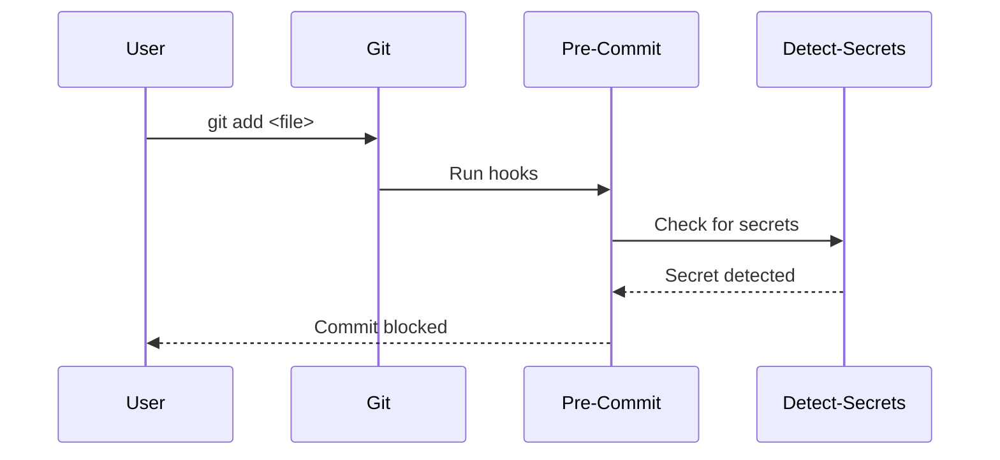

## Introduction to Pre-Commit Hooks

In the realm of DevSecOps, automating code security testing is crucial for maintaining the integrity and security of your codebase. One effective way to achieve this is through the use of pre-commit hooks. These hooks allow you to run various checks and tests before code is committed to a version control system like Git. This ensures that only code meeting certain criteria is added to the repository, thereby reducing the risk of introducing vulnerabilities or sensitive data.

### What is Pre-Commit?

Pre-Commit is a Python library designed to manage and run pre-commit hooks. These hooks are scripts that execute before a commit is finalized. By leveraging pre-commit hooks, developers can enforce coding standards, run static analysis tools, and even detect sensitive information such as passwords or API keys being inadvertently committed to the repository.

### Installing Pre-Commit

To get started with Pre-Commit, you need to install it using `pip`. The installation process is straightforward:

```bash
pip install pre-commit
```

Once installed, you can proceed to set up the hooks for your project.

### Setting Up Pre-Commit Hooks

The next step is to configure the hooks for your repository. Pre-Commit uses a configuration file named `.pre-commit-config.yaml` to define the hooks and their behavior. This file is typically placed in the root directory of your project.

#### Creating the Configuration File

To create the configuration file, you can use any text editor. In the provided example, Emacs is used:

```bash
emacs .pre-commit-config.yaml
```

The configuration file follows a YAML syntax and specifies the hooks to be executed. Here’s an example configuration file:

```yaml
repos:
  - repo: https://github.com/pre-commit/pre-commit-hooks
    rev: v4.0.0
    hooks:
      - id: check-added-large-files
      - id: check-case-conflict
      - id: check-toml
      - id: end-of-file-fixer
      - id: trailing-whitespace
  - repo: local
    hooks:
      - id: detect-secrets
        name: detect-secrets
        entry: python -m detect_secrets --baseline baseline.json
        language: system
        files: \.(py|js|json)$
```

This configuration includes several hooks from the `pre-commit-hooks` repository and a custom hook for detecting secrets.

### Understanding the Configuration File

Each entry in the `repos` section defines a repository from which hooks are sourced. The `rev` field specifies the version of the repository to use. Each hook is defined by an `id`, which corresponds to a specific script within the repository.

For example, the `detect-secrets` hook is a custom hook that runs the `detect-secrets` tool. The `entry` field specifies the command to run, and the `files` field defines the file patterns to which the hook should apply.

### Running Pre-Commit Hooks

After setting up the configuration file, you need to install the hooks for your repository:

```bash
pre-commit install
```

This command sets up the necessary hooks in your `.git/hooks` directory.

### Testing the Setup

To ensure that the pre-commit hooks are functioning correctly, you can create a test file containing sensitive information and attempt to commit it:

```bash
echo "secret_password=123456" > settings.txt
git add settings.txt
git commit -m "Add settings file"
```

When you run the `git commit` command, the pre-commit hooks will execute. If the `detect-secrets` hook detects sensitive information, it will prevent the commit from proceeding.

### Real-World Example: CVE-2021-44228

A real-world example of the importance of pre-commit hooks is the Log4j vulnerability (CVE-2021-44228). This vulnerability allowed attackers to execute arbitrary code by injecting malicious log messages. If pre-commit hooks had been in place to detect and prevent the inclusion of sensitive information or known vulnerable dependencies, the impact of this vulnerability could have been significantly reduced.

### How to Prevent / Defend

#### Detection

To detect sensitive information being committed, you can use tools like `detect-secrets`. This tool scans your codebase for potential secrets and generates a baseline file (`baseline.json`) that can be used to compare against future changes.

#### Prevention

To prevent sensitive information from being committed, you can configure pre-commit hooks to run `detect-secrets` before each commit. If sensitive information is detected, the commit will be blocked.

#### Secure Coding Fixes

Here’s an example of how to correct a vulnerable commit:

**Vulnerable Commit:**

```bash
echo "secret_password=123456" > settings.txt
git add settings.txt
git commit -m "Add settings file"
```

**Secure Commit:**

```bash
echo "secret_password=<%= ENV['SECRET_PASSWORD'] %>" > settings.txt
git add settings.txt
git commit -m "Add settings file"
```

In the secure version, the sensitive information is replaced with an environment variable reference, ensuring that the actual secret is not stored in the codebase.

### Complete Example

Let’s walk through a complete example of setting up and using pre-commit hooks to prevent secrets from being committed.

#### Step 1: Install Pre-Commit

```bash
pip install pre-commit
```

#### Step 2: Create Configuration File

```bash
emacs .pre-commit-config.yaml
```

Configuration file:

```yaml
repos:
  - repo: https://github.com/pre-commit/pre-commit-hooks
    rev: v4.0.0
    hooks:
      - id: check-added-large-files
      - id: check-case-conflict
      - id: check-toml
      - id: end-of-file-fixer
      - id: trailing-whitespace
  - repo: local
    hooks:
      - id: detect-secrets
        name: detect-secrets
        entry: python -m detect_secrets --baseline baseline.json
        language: system
        files: \.(py|js|json)$
```

#### Step 3: Install Hooks

```bash
pre-commit install
```

#### Step  4: Test Setup

Create a test file:

```bash
echo "secret_password=123456" > settings.txt
git add settings.txt
git commit -m "Add settings file"
```

If the `detect-secrets` hook detects the secret, the commit will be blocked.

### Mermaid Diagrams

#### Pre-Commit Hook Flow



### Common Pitfalls

#### Incorrect Configuration

Ensure that the configuration file is correctly formatted and that all required fields are present. Missing or incorrect entries can cause the hooks to fail silently.

#### False Positives

Some hooks may generate false positives, especially if they are not finely tuned to your specific codebase. Regularly review and adjust the configuration to minimize false positives.

### Hands-On Labs

For practical experience with pre-commit hooks, consider the following labs:

- **PortSwigger Web Security Academy**: Offers interactive labs on web application security, including sections on secure coding practices.
- **OWASP Juice Shop**: A deliberately insecure web application for security training, which can be used to practice securing codebases.
- **DVWA (Damn Vulnerable Web Application)**: Another popular web application for security training, useful for practicing secure coding techniques.

These labs provide a controlled environment to experiment with pre-commit hooks and other security measures.

### Conclusion

Automating code security testing with pre-commit hooks is a powerful strategy for maintaining the integrity and security of your codebase. By setting up and configuring these hooks, you can prevent sensitive information from being committed and ensure that only code meeting certain criteria is added to your repository. This not only reduces the risk of introducing vulnerabilities but also enforces best practices across your development team.

---
<!-- nav -->
[[DevSecOps/DevSecOps Bootcamp/05-Application Security Testing/03-Automating Code Security Testing/Demo Preventing Secrets from Being Committed/02-Introduction to Automating Code Security Testing|Introduction to Automating Code Security Testing]] | [[DevSecOps/DevSecOps Bootcamp/05-Application Security Testing/03-Automating Code Security Testing/Demo Preventing Secrets from Being Committed/00-Overview|Overview]] | [[04-Automating Code Security Testing Preventing Secrets from Being Committed|Automating Code Security Testing Preventing Secrets from Being Committed]]
