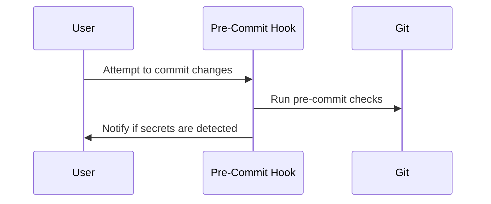

## Automating Code Security Testing: Preventing Secrets from Being Committed

### Background Theory

In the realm of DevSecOps, one of the most critical aspects is ensuring that sensitive information, such as API keys, database credentials, and other secrets, does not accidentally get committed to version control systems like Git. This can lead to severe security breaches, as demonstrated by numerous real-world incidents.

#### Real-World Example: Twitter API Key Leak

In 2019, a developer inadvertently committed an API key to the public GitHub repository of the popular cryptocurrency wallet application, MyEtherWallet. This incident led to unauthorized access to the Twitter API, which could have been used to post malicious tweets or spread misinformation. This breach highlights the importance of preventing secrets from being committed to repositories.

### Pre-Commit Hooks

One effective method to prevent secrets from being committed is through the use of pre-commit hooks. A pre-commit hook is a script that runs automatically before a commit is made. If the script detects a problem, it can prevent the commit from proceeding.

#### How Pre-Commit Hooks Work

Pre-commit hooks are typically implemented using tools like `pre-commit`, which is a framework for managing and maintaining multi-language pre-commit hooks. These hooks can be configured to run various checks, including detecting secrets.



### Detecting Secrets with `detect-secrets`

`detect-secrets` is a tool designed to help identify secrets in your codebase. It can be integrated into your pre-commit hooks to ensure that secrets are not committed.

#### Installation and Configuration

To install `detect-secrets`, you can use pip:

```bash
pip install detect-secrets
```

Next, you need to configure `detect-secrets` to work with your pre-commit hooks. You can create a `.pre-commit-config.yaml` file in your project root:

```yaml
repos:
  - repo: https://github.com/Yelp/detect-secrets
    rev: v1.0.0
    hooks:
      - id: detect-secrets
```

This configuration tells `pre-commit` to use the `detect-secrets` hook from the specified repository.

### Full Example: Pre-Commit Hook with `detect-secrets`

Let's walk through a complete example of setting up a pre-commit hook with `detect-secrets`.

#### Step 1: Install `pre-commit`

First, install `pre-commit`:

```bash
pip install pre-commit
```

#### Step 2: Configure `pre-commit`

Create a `.pre-commit-config.yaml` file in your project root:

```yaml
repos:
  - repo: https://github.com/pre-commit/pre-commit-hooks
    rev: v4.0.1
    hooks:
      - id: trailing-whitespace
      - id: end-of-file-fixer
  - repo: https://github.com/Yelp/detect-secrets
    rev: v1.0.0
    hooks:
      - id: detect-secrets
```

This configuration sets up `pre-commit` to run several hooks, including `detect-secrets`.

#### Step 3: Initialize `pre-commit`

Initialize `pre-commit` in your project:

```bash
pre-commit install
```

#### Step 4: Test the Setup

Now, let's test the setup by attempting to commit a file containing a secret:

```bash
echo "API_KEY=your_secret_key" > secrets.txt
git add secrets.txt
git commit -m "Add secrets"
```

If `detect-secrets` detects the secret, it will prevent the commit and notify you:

```plaintext
An error occurred during the 'detect-secrets' hook.
- hook id: detect-secrets
- exit code: 1

Detected secrets in the following files:
secrets.txt
```

### Continuous Integration Pipeline Integration

In addition to pre-commit hooks, it is also essential to integrate `detect-secrets` into your continuous integration (CI) pipeline. This ensures that even if a secret somehow makes it past the pre-commit hook, it will be caught before it reaches production.

#### Example: GitHub Actions

Here’s an example of integrating `detect-secrets` into a GitHub Actions workflow:

```yaml
name: CI

on:
  push:
    branches: [ main ]
  pull_request:
    branches: [ main ]

jobs:
  build:
    runs-on: ubuntu-latest

    steps:
    - uses: actions/checkout@v3
    - name: Set up Python
      uses: actions/setup-python@v4
      with:
        python-version: '3.x'
    - name: Install dependencies
      run: |
        python -m pip install --upgrade pip
        pip install pre-commit
    - name: Run pre-commit checks
      run: |
        pre-commit run --all-files
```

This workflow checks out the code, installs `pre-commit`, and runs the pre-commit checks, including `detect-secrets`.

### Common Pitfalls and Best Practices

#### Pitfall: False Positives

One common issue with secret detection tools is false positives. To mitigate this, you can configure `detect-secrets` to ignore certain patterns or files.

#### Best Practice: Regular Updates

Regularly update `detect-secrets` to ensure it catches new types of secrets and avoids false positives.

### How to Prevent / Defend

#### Detection

Use tools like `detect-secrets` to detect secrets in your codebase. Ensure these tools are integrated into both pre-commit hooks and CI pipelines.

#### Prevention

Educate developers about the risks of committing secrets. Implement strict policies and automated checks to prevent secrets from being committed.

#### Secure-Coding Fixes

Show the vulnerable pattern and the corrected secure version side by side:

**Vulnerable Pattern:**

```plaintext
# secrets.txt
API_KEY=your_secret_key
```

**Secure Version:**

```plaintext
# .env
API_KEY=your_secret_key
```

Ensure that `.env` files are ignored by version control:

```plaintext
# .gitignore
.env
```

#### Configuration Hardening

Configure `detect-secrets` to ignore certain patterns or files:

```yaml
plugins:
  - plugin: aws_keys
    exclude_regex: '^ignored_pattern$'
```

### Conclusion

Automating code security testing is crucial in preventing secrets from being committed to version control systems. By using tools like `detect-secrets` and integrating them into pre-commit hooks and CI pipelines, you can significantly reduce the risk of sensitive information leaks. Always stay vigilant and regularly update your tools to ensure maximum security.

### Practice Labs

For hands-on practice, consider the following labs:

- **PortSwigger Web Security Academy**: Offers exercises on securing web applications, including preventing secrets from being committed.
- **OWASP Juice Shop**: Provides a vulnerable web application for practicing security testing, including secret management.
- **DVWA (Damn Vulnerable Web Application)**: Another excellent resource for practicing web application security, including secret management.

These labs provide practical experience in applying the concepts discussed in this chapter.

---
<!-- nav -->
[[03-Introduction to Pre-Commit Hooks|Introduction to Pre-Commit Hooks]] | [[DevSecOps/DevSecOps Bootcamp/05-Application Security Testing/03-Automating Code Security Testing/Demo Preventing Secrets from Being Committed/00-Overview|Overview]] | [[05-Installing and Configuring Detect Secrets|Installing and Configuring Detect Secrets]]
