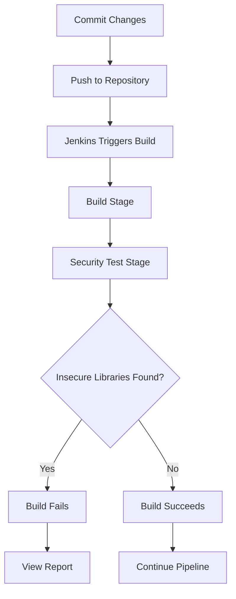

## Introduction to Automating Third-Party Libraries Security Testing

In modern software development, third-party libraries are ubiquitous. They provide functionality that developers can integrate into their applications without having to write the code from scratch. However, these libraries can also introduce security vulnerabilities if they are not properly vetted. This is where automated tools like OWASP Dependency Check come into play. These tools help identify insecure third-party libraries and ensure that your application remains secure.

### What Are Third-Party Libraries?

Third-party libraries are pre-written code modules that developers can incorporate into their applications. These libraries can range from simple utility functions to complex frameworks that handle specific tasks such as database access, web services, or user interface components. By using third-party libraries, developers can save time and effort, as they do not have to write and maintain the code themselves.

#### Why Are Third-Party Libraries Important?

Third-party libraries offer several benefits:

1. **Time Efficiency**: Developers can leverage existing code, reducing the time required to build applications.
2. **Quality Assurance**: Well-maintained libraries often undergo rigorous testing and peer review, ensuring high quality.
3. **Feature Expansion**: Libraries can provide features that might be difficult or time-consuming to implement from scratch.

However, third-party libraries also introduce risks, particularly around security. If a library contains vulnerabilities, these can be exploited by attackers, potentially compromising the entire application.

### Security Risks of Third-Party Libraries

The primary security risk associated with third-party libraries is the presence of known vulnerabilities. These vulnerabilities can be exploited by attackers to gain unauthorized access, execute malicious code, or cause other types of harm. For example, the Heartbleed vulnerability in OpenSSL was a significant security issue that affected many applications using this library.

#### Real-World Example: Heartbleed Vulnerability

The Heartbleed vulnerability (CVE-2014-0160) was discovered in the OpenSSL cryptographic software library. This vulnerability allowed attackers to read sensitive information from the memory of systems using OpenSSL, including private keys, passwords, and other critical data. This vulnerability affected numerous applications and services that relied on OpenSSL, highlighting the importance of keeping third-party libraries up-to-date and secure.

### OWASP Dependency Check

OWASP Dependency Check is a tool designed to identify project dependencies that contain known vulnerabilities. It supports various package managers and can be integrated into continuous integration (CI) pipelines to automatically scan for insecure libraries.

#### How OWASP Dependency Check Works

OWASP Dependency Check works by analyzing the dependencies of a project and comparing them against a database of known vulnerabilities. Here’s a step-by-step breakdown of the process:

1. **Dependency Analysis**: The tool scans the project’s dependencies, typically by examining files such as `pom.xml` (for Maven projects) or `package.json` (for Node.js projects).
2. **Vulnerability Database**: The tool compares the identified dependencies against a database of known vulnerabilities, which includes entries from sources like the National Vulnerability Database (NVD).
3. **Report Generation**: If any insecure libraries are found, the tool generates a report detailing the vulnerabilities and provides recommendations for remediation.

### Integrating OWASP Dependency Check into a CI Pipeline

To effectively use OWASP Dependency Check, it should be integrated into a continuous integration pipeline. This ensures that the tool runs automatically whenever changes are made to the project, providing immediate feedback on the security status of the dependencies.

#### Setting Up OWASP Dependency Check in Jenkins

Let’s walk through the process of setting up OWASP Dependency Check in a Jenkins pipeline.

1. **Add jQuery File**:
    - First, add the jQuery file to your project. For example, you might download the jQuery library and place it in your project directory.
    - Commit the changes to your local repository and push them to the remote repository.

```bash
# Add jQuery file to the project
git add path/to/jquery.min.js

# Commit the changes
git commit -m "Add jQuery library"

# Push the changes to the remote repository
git push origin main
```

2. **Configure Jenkins Pipeline**:
    - Ensure that your Jenkins pipeline is configured to run OWASP Dependency Check. This typically involves adding a step to the Jenkinsfile that executes the dependency check.

```groovy
pipeline {
    agent any

    stages {
        stage('Build') {
            steps {
                sh 'mvn clean install'
            }
        }

        stage('Security Test') {
            steps {
                sh 'mvn org.owasp:dependency-check-maven:check'
            }
        }
    }
}
```

3. **Run the Pipeline**:
    - Trigger the Jenkins pipeline to run. The pipeline will first build the project and then run the security test using OWASP Dependency Check.

### Analyzing the Results

Once the pipeline completes, you can analyze the results to determine if any insecure libraries were detected.

#### Example Output

If the build fails due to an insecure library, Jenkins will display an error message indicating that insecure libraries were found. You can also view the detailed report generated by OWASP Dependency Check.

```plaintext
[INFO] Checking for updates
[INFO] Skipping dependency update check for NVD
[INFO] Analysis done in 1 seconds
[INFO] Found BOM references: 0
[INFO] Identified 1 dependencies with known vulnerabilities
[INFO] 
[INFO] The following dependencies were found to have vulnerabilities:
[INFO] * jquery-3.6.0.min.js (CVE-2021-44228)
[INFO] 
[INFO] See the dependency-check report for more details.
```

### Mermaid Diagram: OWASP Dependency Check Workflow

A mermaid diagram can help visualize the workflow of using OWASP Dependency Check in a CI pipeline.



### Common Pitfalls and Best Practices

When integrating OWASP Dependency Check into your CI pipeline, there are several common pitfalls to avoid:

1. **Outdated Vulnerability Database**: Ensure that the vulnerability database used by OWASP Dependency Check is up-to-date. Outdated databases may miss newly discovered vulnerabilities.
2. **Ignoring False Positives**: While OWASP Dependency Check is generally accurate, it may occasionally flag false positives. It’s important to review the findings carefully and not ignore valid warnings.
3. **Manual Remediation**: Automated tools like OWASP Dependency Check can only go so far. Manual review and remediation are still necessary to ensure that all vulnerabilities are addressed.

### How to Prevent / Defend Against Insecure Libraries

To defend against insecure third-party libraries, follow these best practices:

1. **Regular Updates**: Keep all third-party libraries up-to-date. Regularly check for updates and apply them promptly.
2. **Automated Scanning**: Integrate automated scanning tools like OWASP Dependency Check into your CI pipeline to catch vulnerabilities early.
3. **Secure Coding Practices**: Follow secure coding practices to minimize the risk of introducing vulnerabilities through third-party libraries.
4. **Vendor Management**: Establish a vendor management program to ensure that third-party libraries come from trusted sources.

#### Secure Code Fix Example

Here’s an example of how to address an insecure library in your code:

**Vulnerable Code:**

```javascript
// Vulnerable code using an outdated jQuery version
<script src="path/to/jquery-3.6.0.min.js"></script>
```

**Fixed Code:**

```javascript
// Fixed code using a secure jQuery version
<script src="path/to/jquery-3.6.1.min.js"></script>
```

### Conclusion

Automating third-party libraries security testing is crucial for maintaining the security of modern applications. Tools like OWASP Dependency Check help identify and mitigate vulnerabilities in third-party libraries, ensuring that your application remains secure. By integrating these tools into your CI pipeline, you can catch and address vulnerabilities early, reducing the risk of security breaches.

### Practice Labs

For hands-on practice with automating third-party libraries security testing, consider the following labs:

- **PortSwigger Web Security Academy**: Offers a module on dependency checking and secure coding practices.
- **OWASP Juice Shop**: Provides a vulnerable web application that can be used to practice identifying and fixing insecure third-party libraries.
- **Jenkins Official Documentation**: Includes tutorials and examples on integrating OWASP Dependency Check into Jenkins pipelines.

By following these guidelines and practicing with real-world examples, you can master the art of automating third-party libraries security testing and ensure the security of your applications.

---
<!-- nav -->
[[DevSecOps/DevSecOps Bootcamp/05-Application Security Testing/04-Automating Third Party Libraries Security Testing/03-Demo Using OWASP Dependency Check in a Pipeline/00-Overview|Overview]] | [[02-Automating Third-Party Libraries Security Testing Using OWASP Dependency Check in a Pipeline|Automating Third-Party Libraries Security Testing Using OWASP Dependency Check in a Pipeline]]
