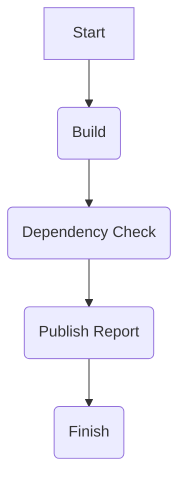
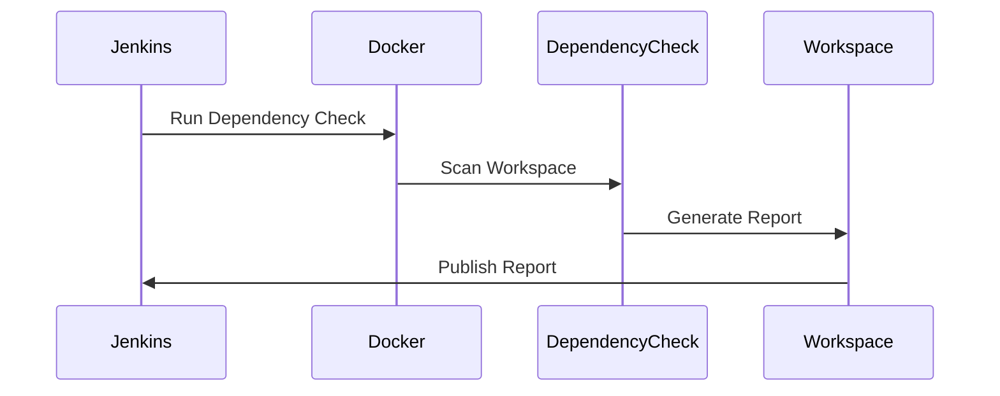

## Automating Third-Party Libraries Security Testing Using OWASP Dependency Check in a Pipeline

### Background Theory

Automating third-party libraries security testing is a critical aspect of modern DevSecOps practices. Third-party libraries are widely used in software development to speed up development cycles and reduce the burden of implementing common functionalities. However, these libraries can introduce vulnerabilities into your application if they contain known security issues. Therefore, it is essential to integrate security testing tools into your continuous integration (CI) pipeline to ensure that your application remains secure throughout its lifecycle.

OWASP Dependency Check is an open-source tool designed to identify project dependencies with known vulnerabilities. It supports various package managers and frameworks, including Maven, Gradle, npm, and more. By integrating Dependency Check into your CI pipeline, you can automatically scan your project dependencies for known vulnerabilities and take corrective actions based on the findings.

### Integrating OWASP Dependency Check into a Build Pipeline

In this section, we will demonstrate how to integrate OWASP Dependency Check into a Jenkins pipeline using the OWASP Juice Shop project as an example. The Juice Shop is a deliberately insecure web application designed for security training purposes.

#### Step-by-Step Integration Process

1. **Create a New Branch**:
    - First, create a new branch in your repository to work on the integration of Dependency Check.
    ```bash
    git checkout -b dependency-check
    ```

2. **Edit the Jenkinsfile**:
    - Next, edit the `Jenkinsfile` to configure the pipeline. This file contains the steps that Jenkins will execute during the build process.

3. **Add a New Stage for Dependency Check**:
    - Add a new stage to the pipeline that will perform the Dependency Check. Here is an example of how to modify the `Jenkinsfile`:

```groovy
pipeline {
    agent any

    stages {
        stage('Build') {
            steps {
                sh 'mvn clean install'
            }
        }

        stage('Dependency Check') {
            steps {
                script {
                    def dependencyCheckImage = 'owasp/dependency-check:latest'
                    def reportDir = 'reports'

                    sh """
                        docker run --rm \\
                            -v ${WORKSPACE}:/src \\
                            -v ${WORKSPACE}/${reportDir}:/reports \\
                            ${dependencyCheckImage} \\
                            --project "Juice Shop" \\
                            --scan /src \\
                            --out /reports \\
                            --format "HTML"
                    """
                }
            }
        }

        stage('Publish Report') {
            steps {
                archiveArtifacts artifacts: 'reports/**/*.html', allowEmptyArchive: true
            }
        }
    }
}
```

#### Explanation of the Code

- **Docker Image**: We use the `owasp/dependency-check:latest` Docker image to run Dependency Check. This ensures that we have a consistent environment for scanning dependencies.
- **Volume Mounts**: We mount the workspace (`${WORKSPACE}`) to `/src` and the report directory (`${WORKSPACE}/reports`) to `/reports`. This allows Dependency Check to access the source code and write the report to a separate directory.
- **Project Name**: We specify the project name as "Juice Shop".
- **Scan Directory**: We specify the source directory to scan (`/src`).
- **Output Directory**: We specify the output directory for the report (`/reports`).
- **Report Format**: We generate the report in HTML format.

### Running Dependency Check

When the pipeline runs, the `Dependency Check` stage will execute the following command:

```sh
docker run --rm \
    -v ${WORKSPACE}:/src \
    -v ${WORKSPACE}/reports:/reports \
    owasp/dependency-check:latest \
    --project "Juice Shop" \
    --scan /src \
    --out /reports \
    --format "HTML"
```

This command will scan the source code in the `${WORKSPACE}` directory and generate an HTML report in the `reports` directory.

### Handling Vulnerabilities

To handle vulnerabilities found by Dependency Check, we can configure the pipeline to fail if any vulnerabilities with a CVSS score of 6 or higher are detected. This ensures that the build fails if there are high-severity vulnerabilities, prompting developers to address them before proceeding.

Here is an updated version of the `Dependency Check` stage:

```groovy
stage('Dependency Check') {
    steps {
        script {
            def dependencyCheckImage = 'owasp/dependency-check:latest'
            def reportDir = 'reports'

            sh """
                docker run --rm \\
                    -v ${WORKSPACE}:/src \\
                    -v ${WORKSPACE}/${reportDir}:/reports \\
                    ${dependencyCheckImage} \\
                    --project "Juice Shop" \\
                    --scan /src \\
                    --out /reports \\
                    --format "HTML" \\
                    --failOnCVSS 6
            """
        }
    }
}
```

The `--failOnCVSS  6` flag ensures that the build will fail if any vulnerabilities with a CVSS score of 6 or higher are detected.

### Publishing the Report

After the scan is complete, the pipeline will publish the generated HTML report to Jenkins. This allows you to view the report directly from the Jenkins UI.

```groovy
stage('Publish Report') {
    steps {
        archiveArtifacts artifacts: 'reports/**/*.html', allowEmptyArchive: true
    }
}
```

### Real-World Examples and Recent CVEs

Integrating Dependency Check into your pipeline can help catch known vulnerabilities in third-party libraries. Here are some recent examples of CVEs that could have been caught using Dependency Check:

- **CVE-2021-44228 (Log4j)**: A critical vulnerability in Apache Log4j that allowed remote code execution. Dependency Check would have flagged this vulnerability if the affected version of Log4j was present in your project.
- **CVE-2022-22965 (Spring Framework)**: A vulnerability in Spring Framework that allowed unauthorized access to sensitive data. Dependency Check would have flagged this vulnerability if the affected version of Spring Framework was present in your project.

### How to Prevent / Defend

#### Detection

- **Regular Scans**: Run Dependency Check regularly as part of your CI pipeline to catch vulnerabilities early.
- **Manual Reviews**: Conduct manual reviews of the dependencies used in your project to ensure they are up-to-date and free from known vulnerabilities.

#### Prevention

- **Update Dependencies**: Keep your dependencies up-to-date by regularly updating them to the latest versions.
- **Use Secure Coding Practices**: Follow secure coding practices to minimize the risk of introducing vulnerabilities through third-party libraries.

#### Secure-Coding Fixes

Here is an example of a vulnerable dependency and its secure version:

**Vulnerable Version**:
```xml
<dependencies>
    <dependency>
        <groupId>org.apache.logging.log4j</groupId>
        <artifactId>log4j-core</artifactId>
        <version>2.14.1</version>
    </dependency>
</dependencies>
```

**Secure Version**:
```xml
<dependencies>
    <dependency>
        <groupId>org.apache.logging.log4j</groupId>
        <artifactId>log4j-core</artifactId>
        <version>2.17.1</version>
    </dependency>
</dependencies>
```

### Configuration Hardening

- **Disable Unnecessary Features**: Disable unnecessary features in third-party libraries to reduce the attack surface.
- **Use Secure Configurations**: Use secure configurations for third-party libraries to mitigate potential vulnerabilities.

### Complete Example

Here is a complete example of a Jenkins pipeline that integrates OWASP Dependency Check:

```groovy
pipeline {
    agent any

    stages {
        stage('Build') {
            steps {
                sh 'mvn clean install'
            }
        }

        stage('Dependency Check') {
            steps {
                script {
                    def dependencyCheckImage = 'owasp/dependency-check:latest'
                    def reportDir = 'reports'

                    sh """
                        docker run --rm \\
                            -v ${WORKSPACE}:/src \\
                            -v ${WORKSPACE}/${reportDir}:/reports \\
                            ${dependencyCheckImage} \\
                            --project "Juice Shop" \\
                            --scan /src \\
                            --out /reports \\
                            --format "HTML" \\
                            --failOnCVSS 6
                    """
                }
            }
        }

        stage('Publish Report') {
            steps {
                archiveArtifacts artifacts: 'reports/**/*.html', allowEmptyArchive: true
            }
        }
    }
}
```

### Pitfalls and Common Mistakes

- **Ignoring Low-Score Vulnerabilities**: While it is important to focus on high-severity vulnerabilities, low-score vulnerabilities should not be ignored as they can still pose a risk.
- **Not Keeping Dependencies Up-to-Date**: Failing to update dependencies regularly can leave your application vulnerable to known issues.
- **Overlooking Manual Reviews**: Relying solely on automated tools can lead to missed vulnerabilities. Manual reviews are essential to ensure comprehensive security.

### Conclusion

Integrating OWASP Dependency Check into your CI pipeline is a crucial step in ensuring the security of your application. By automating the process of identifying and addressing vulnerabilities in third-party libraries, you can significantly reduce the risk of security breaches. Regularly updating dependencies, conducting manual reviews, and following secure coding practices are essential components of a robust DevSecOps strategy.

### Hands-On Labs

For hands-on practice, consider the following labs:

- **PortSwigger Web Security Academy**: Offers interactive labs to practice web security concepts.
- **OWASP Juice Shop**: A deliberately insecure web application for security training.
- **DVWA (Damn Vulnerable Web Application)**: Another web application for security training.

These labs provide practical experience in integrating security testing tools into your CI pipeline and identifying vulnerabilities in third-party libraries.

### Mermaid Diagrams

#### Pipeline Architecture



#### Request/Response Flow



By following these steps and best practices, you can effectively integrate OWASP Dependency Check into your CI pipeline and ensure the security of your application.

---
<!-- nav -->
[[01-Introduction to Automating Third-Party Libraries Security Testing|Introduction to Automating Third-Party Libraries Security Testing]] | [[DevSecOps/DevSecOps Bootcamp/05-Application Security Testing/04-Automating Third Party Libraries Security Testing/03-Demo Using OWASP Dependency Check in a Pipeline/00-Overview|Overview]] | [[DevSecOps/DevSecOps Bootcamp/05-Application Security Testing/04-Automating Third Party Libraries Security Testing/03-Demo Using OWASP Dependency Check in a Pipeline/03-Practice Questions & Answers|Practice Questions & Answers]]
