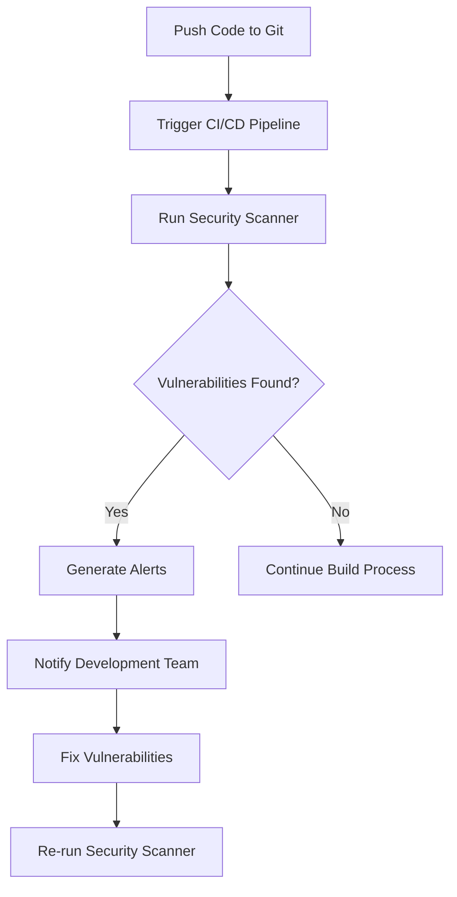
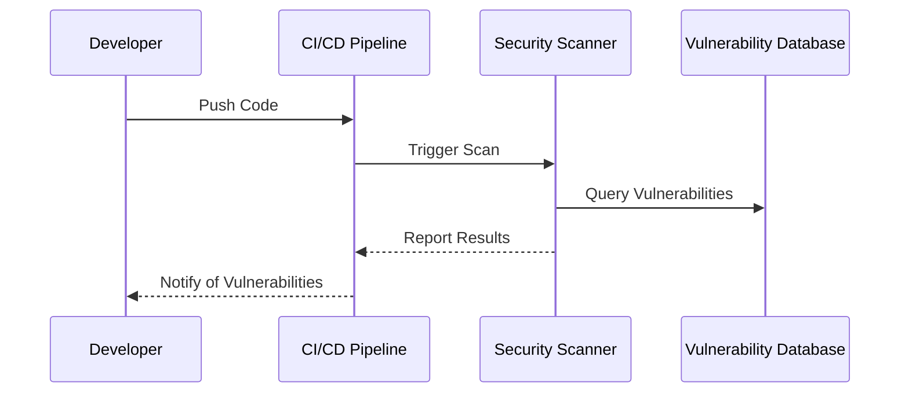

## Introduction to Third-Party Library Security Testing

In modern software development, third-party libraries play a crucial role in accelerating development cycles and providing specialized functionality. However, these libraries introduce significant security risks due to potential vulnerabilities and outdated dependencies. To mitigate these risks, automating third-party library security testing is essential. This chapter delves into the workflow, best practices, and tools used for automating third-party library security testing within a DevSecOps environment.

### Why Automate Third-Party Library Security Testing?

Automating third-party library security testing ensures that developers are promptly notified of any security issues related to the libraries they use. This proactive approach helps in maintaining the overall security posture of the application. By integrating security testing into the Continuous Integration/Continuous Deployment (CI/CD) pipeline, organizations can catch vulnerabilities early in the development cycle, reducing the likelihood of security breaches.

### Key Concepts and Terminology

Before diving into the details, let's define some key terms:

- **Third-Party Libraries**: External software components that are included in a project to provide specific functionalities.
- **Security Scanner**: Tools designed to identify vulnerabilities and outdated dependencies in third-party libraries.
- **CI/CD Pipeline**: A series of steps that automate the process of building, testing, and deploying software.
- **Vulnerability Reports**: Databases containing information about known security vulnerabilities in various software components.

### Workflow for Third-Party Library Scanners

The workflow for third-party library scanners typically includes the following steps:

1. **Integration with CI/CD Pipeline**: The scanner is integrated into the CI/CD pipeline to automatically run whenever new code is pushed.
2. **Scheduling Scans**: Scans can be scheduled at regular intervals (e.g., daily or weekly) to ensure continuous monitoring.
3. **Library Audit**: Regularly auditing the list of libraries to ensure all third-party libraries are being scanned.
4. **Alert Generation**: Generating alerts when vulnerabilities are detected, ensuring timely notification to the development team.
5. **Tool Updates**: Keeping the security scanning tools up-to-date to leverage the latest vulnerability databases and detection algorithms.

#### Example Workflow Diagram



### Best Practices for Automating Third-Party Library Security Testing

#### Scheduling Scans

While it is possible to run scans synchronously (i.e., immediately after pushing code), it is generally more efficient to schedule scans at regular intervals. This approach allows for a more controlled and consistent security testing process.

**Example Configuration**

```yaml
# Jenkinsfile example
pipeline {
    agent any
    stages {
        stage('Build') {
            steps {
                sh 'npm install'
            }
        }
        stage('Test') {
            steps {
                sh 'npm test'
            }
        }
        stage('Security Scan') {
            steps {
                script {
                    def scanner = load 'path/to/scanner'
                    scanner.run()
                }
            }
        }
    }
    post {
        always {
            echo 'Scan completed'
        }
        failure {
            echo 'Security vulnerabilities detected'
        }
    }
}
```

#### Regular Library Audits

Regularly auditing the list of libraries ensures that all third-party dependencies are being scanned. This is crucial because new libraries may be added, and existing ones may be updated, potentially introducing new vulnerabilities.

**Example Library Audit Script**

```bash
#!/bin/bash
# List all npm packages
npm ls --json > package-list.json

# Parse the JSON output to get a list of packages
packages=$(cat package-list.json | jq -r '.dependencies | keys[]')

# Check each package against the security scanner
for package in $packages; do
    echo "Checking package: $package"
    # Run the security scanner for the package
    scanner check $package
done
```

#### Alert Generation

When vulnerabilities are detected, it is essential to generate alerts that notify the development team. These alerts can be configured to trigger specific actions, such as halting the build process or sending notifications via email or messaging platforms.

**Example Alert Configuration**

```json
{
  "rules": [
    {
      "name": "High Severity Vulnerability",
      "conditions": [
        {
          "field": "severity",
          "operator": ">=",
          "value": "high"
        }
      ],
      "actions": [
        {
          "type": "email",
          "to": "security-team@example.com",
          "subject": "High Severity Vulnerability Detected",
          "body": "A high severity vulnerability has been detected in the following package: {{package.name}}"
        },
        {
          "type": "slack",
          "channel": "#security-alerts",
          "message": "High severity vulnerability detected in {{package.name}}. Please review."
        }
      ]
    }
  ]
}
```

### Tool Updates

Keeping the security scanning tools up-to-date is crucial for leveraging the latest vulnerability databases and detection algorithms. This ensures that the scanner can identify newly discovered vulnerabilities and apply the most effective mitigation strategies.

**Example Update Command**

```bash
# Update the security scanner tool
sudo apt-get update
sudo apt-get upgrade <scanner-tool>
```

### Real-World Examples and Recent CVEs

#### Example: Log4j Vulnerability (CVE-2021-44228)

The Log4j vulnerability, also known as Log4Shell, is one of the most significant security vulnerabilities discovered in recent years. This vulnerability affected numerous applications and systems worldwide, highlighting the importance of automated third-party library security testing.

**Impact**: The vulnerability allowed attackers to execute arbitrary code on the server, leading to potential data breaches and system compromises.

**Mitigation**: Organizations that had automated security testing in place were able to quickly identify and patch the vulnerability, minimizing the impact.

**Example Code**

```java
// Vulnerable code using Log4j
import org.apache.logging.log4j.LogManager;
import org.apache.logging.log4j.Logger;

public class Log4jExample {
    private static final Logger logger = LogManager.getLogger(Log4jExample.class);

    public void logMessage(String message) {
        logger.info(message);
    }
}

// Secure code after applying the patch
import org.apache.logging.log4j.LogManager;
import org.apache.logging.log4j.Logger;

public class Log4jExample {
    private static final Logger logger = LogManager.getLogger(Log4jExample.class);

    public void logMessage(String message) {
        logger.info("{}", message);
    }
}
```

### How to Prevent / Defend Against Third-Party Library Vulnerabilities

#### Detection

To effectively detect third-party library vulnerabilities, organizations should integrate security scanners into their CI/CD pipelines. This ensures that vulnerabilities are identified early in the development cycle, reducing the risk of security breaches.

**Example Detection Workflow**



#### Prevention

Preventing third-party library vulnerabilities involves several key strategies:

1. **Regular Audits**: Regularly audit the list of third-party libraries to ensure all dependencies are being scanned.
2. **Prompt Patching**: Apply patches and updates promptly to address newly discovered vulnerabilities.
3. **Secure Coding Practices**: Follow secure coding practices to minimize the risk of introducing vulnerabilities through custom code.

**Example Secure Coding Practices**

```python
# Vulnerable code
import os
import subprocess

def execute_command(command):
    subprocess.call(command, shell=True)

# Secure code
import os
import subprocess

def execute_command(command):
    subprocess.run(command, shell=False)
```

#### Hardening

Hardening the environment and configurations can further reduce the risk of third-party library vulnerabilities. This includes:

1. **Least Privilege Principle**: Ensure that applications and services run with the least privileges necessary.
2. **Network Segmentation**: Segment networks to limit the spread of attacks.
3. **Regular Updates**: Keep all software and dependencies up-to-date to leverage the latest security patches.

**Example Hardening Configuration**

```json
{
  "network": {
    "segmentation": true,
    "firewall_rules": [
      {
        "source": "192.168.1.0/24",
        "destination": "10.0.0.0/24",
        "action": "allow"
      }
    ]
  },
  "software_updates": {
    "auto_update": true,
    "update_frequency": "daily"
  }
}
```

### Hands-On Labs

For hands-on practice with third-party library security testing, consider the following labs:

- **PortSwigger Web Security Academy**: Offers modules on dependency checking and vulnerability scanning.
- **OWASP Juice Shop**: Provides a vulnerable web application for practicing security testing techniques.
- **DVWA (Damn Vulnerable Web Application)**: A deliberately insecure web application for practicing security testing.

These labs provide practical experience in identifying and mitigating third-party library vulnerabilities within a real-world context.

### Conclusion

Automating third-party library security testing is a critical component of a robust DevSecOps strategy. By integrating security scanners into the CI/CD pipeline, scheduling regular scans, auditing library lists, generating alerts, and keeping tools up-to-date, organizations can significantly reduce the risk of security breaches. Real-world examples and recent CVEs highlight the importance of these practices, while hands-on labs provide practical experience in implementing them effectively.

---
<!-- nav -->
[[DevSecOps/DevSecOps Bootcamp/05-Application Security Testing/04-Automating Third Party Libraries Security Testing/05-Workflow Conclusion and Summary/00-Overview|Overview]] | [[02-Automating Third-Party Libraries Security Testing|Automating Third-Party Libraries Security Testing]]
