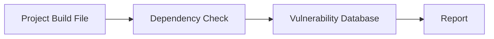
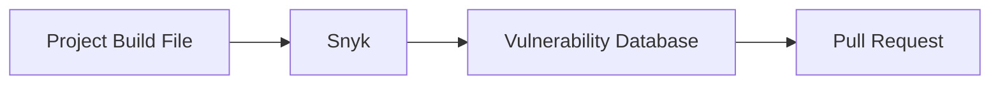

## Automating Third-Party Libraries Security Testing

### Introduction

In modern software development, third-party libraries are ubiquitous. These libraries provide pre-built functionality that developers can integrate into their applications, saving time and effort. However, these libraries also introduce potential security risks. Over time, vulnerabilities may be discovered in these libraries, and if they are not promptly updated, they can become entry points for attackers.

This chapter focuses on automating the process of identifying and updating third-party libraries to mitigate these risks. We'll cover the tools, techniques, and best practices for ensuring that your application remains secure as new vulnerabilities are discovered.

### Background Theory

#### What Are Third-Party Libraries?

Third-party libraries are software components developed by external parties that can be integrated into your application. These libraries can range from simple utility functions to complex frameworks like React or Spring. They are typically included via package managers such as npm, Maven, or pip.

#### Why Are Third-Party Libraries a Security Risk?

Third-party libraries can introduce security risks because:

1. **Vulnerabilities**: Libraries may contain bugs or design flaws that can be exploited by attackers.
2. **Outdated Versions**: Developers might continue using older versions of libraries that have known vulnerabilities.
3. **Supply Chain Attacks**: Attackers can compromise the distribution channels of libraries, injecting malicious code.

### Tools for Automated Security Testing

Several tools are available to automate the process of identifying and updating third-party libraries. These tools can scan your project dependencies and report any known vulnerabilities.

#### OWASP Dependency Check

OWASP Dependency Check is one of the most popular tools for scanning third-party libraries. It checks your project dependencies against a database of known vulnerabilities.

##### How OWASP Dependency Check Works

OWASP Dependency Check works by analyzing the dependencies declared in your project's build files (such as `pom.xml` for Maven or `package.json` for npm). It then compares these dependencies against a database of known vulnerabilities, such as the National Vulnerability Database (NVD).



##### Example Usage

Here’s an example of how to use OWASP Dependency Check with a Maven project:

```xml
<!-- pom.xml -->
<build>
    <plugins>
        <plugin>
            <groupId>org.owasp</groupId>
            <artifactId>dependency-check-maven</artifactId>
            <version>6.5.0</version>
            <executions>
                <execution>
                    <goals>
                        <goal>check</goal>
                    </goals>
                </execution>
            </executions>
        </plugin>
    </plugins>
</build>
```

Running `mvn dependency-check:check` will generate a report detailing any vulnerabilities found in your project's dependencies.

### Commercial Offerings

While OWASP Dependency Check is free and open-source, there are several commercial offerings that provide additional features and support. These tools often integrate seamlessly with CI/CD pipelines and can automatically create pull requests to update vulnerable dependencies.

#### Example: Snyk

Snyk is a popular commercial tool for managing third-party library vulnerabilities. It integrates with various package managers and can automatically create pull requests to update vulnerable dependencies.

##### How Snyk Works

Snyk works by scanning your project dependencies and comparing them against a database of known vulnerabilities. If it finds any vulnerabilities, it can automatically create pull requests to update the dependencies.



##### Example Usage

To use Snyk, you first need to install the Snyk CLI and authenticate with your account:

```sh
npm install -g snyk
snyk auth <YOUR_TOKEN>
```

Then, you can scan your project:

```sh
snyk test
```

If Snyk finds any vulnerabilities, it can automatically create pull requests to update the dependencies:

```sh
snyk monitor --project-name=my-project
```

### Asynchronous Scheduled Scans

It's important to run security scans asynchronously and schedule them regularly. This ensures that your application remains secure even as new vulnerabilities are discovered.

#### Setting Up Scheduled Scans

You can set up scheduled scans using a CI/CD pipeline. Here’s an example using Jenkins:

```yaml
# Jenkinsfile
pipeline {
    agent any
    stages {
        stage('Security Scan') {
            steps {
                sh 'mvn dependency-check:check'
            }
        }
    }
    triggers {
        cron('H H(0-23)/6 * * *') // Run every 6 hours
    }
}
```

### Time for Updates and Upgrades

Regularly updating and upgrading your third-party libraries is crucial for maintaining security. You should plan in time for these updates and ensure that they are tested thoroughly before being deployed.

#### Example: Updating Dependencies

Suppose you find that one of your dependencies has a known vulnerability. You can update it using your package manager. Here’s an example using npm:

```sh
npm outdated
npm update <dependency-name>
```

### Real-World Examples

#### Recent CVEs and Breaches

Several recent CVEs and breaches highlight the importance of keeping third-party libraries up to date.

- **CVE-2021-44228 (Log4j)**: This vulnerability in the Log4j library allowed remote code execution. Many applications were affected because they used outdated versions of Log4j.
- **CVE-2021-3427** (Apache Commons Collections): This vulnerability allowed remote code execution through deserialization attacks. Many applications were affected because they used outdated versions of Apache Commons Collections.

### Pitfalls and Common Mistakes

#### Not Keeping Libraries Up to Date

One of the most common mistakes is not keeping third-party libraries up to date. This leaves your application vulnerable to known exploits.

#### Ignoring Security Reports

Another common mistake is ignoring security reports generated by tools like OWASP Dependency Check or Snyk. These reports are critical for maintaining the security of your application.

### How to Prevent / Defend

#### Detection

To detect vulnerabilities in third-party libraries, you should regularly run security scans using tools like OWASP Dependency Check or Snyk. These tools can help you identify any known vulnerabilities in your dependencies.

#### Prevention

To prevent vulnerabilities, you should:

1. **Keep Libraries Up to Date**: Regularly update your third-party libraries to the latest versions.
2. **Use Automated Tools**: Use automated tools like OWASP Dependency Check or Snyk to scan your dependencies and create pull requests to update vulnerable dependencies.
3. **Schedule Regular Scans**: Set up scheduled scans using a CI/CD pipeline to ensure that your application remains secure.

#### Secure Coding Fixes

Here’s an example of a vulnerable dependency and how to fix it:

**Vulnerable Code**

```xml
<!-- pom.xml -->
<dependencies>
    <dependency>
        <groupId>org.apache.commons</groupId>
        <artifactId>commons-collections4</artifactId>
        <version>4.1</version>
    </dependency>
</dependencies>
```

**Fixed Code**

```xml
<!-- pom.xml -->
<dependencies>
    <dependency>
        <groupId>org.apache.commons</groupId>
        <artifactId>commons-collections4</artifactId>
        <version>4.4</version>
    </dependency>
</dependencies>
```

### Configuration Hardening

#### Example: Hardening Maven Configuration

You can harden your Maven configuration to ensure that it uses the latest versions of dependencies. Here’s an example:

```xml
<!-- settings.xml -->
<settings>
    <profiles>
        <profile>
            <id>default</id>
            <activation>
                <activeByDefault>true</activeByDefault>
            </activation>
            <properties>
                <maven.compiler.source>1.8</maven.compiler.source>
                <maven.compiler.target>1.8</maven.compiler.target>
            </properties>
        </profile>
    </profiles>
</settings>
```

### Hands-On Labs

For hands-on practice, you can use the following labs:

- **PortSwigger Web Security Academy**: Offers modules on securing third-party libraries.
- **OWASP Juice Shop**: Provides a vulnerable web application that you can use to practice securing third-party libraries.
- **DVWA (Damn Vulnerable Web Application)**: Another vulnerable web application that you can use to practice securing third-party libraries.

### Conclusion

Automating the process of identifying and updating third-party libraries is crucial for maintaining the security of your application. By using tools like OWASP Dependency Check or Snyk, scheduling regular scans, and keeping libraries up to date, you can ensure that your application remains secure even as new vulnerabilities are discovered.

In the next module, we will focus on automating container security testing. Stay tuned!

---
<!-- nav -->
[[DevSecOps/DevSecOps Bootcamp/05-Application Security Testing/04-Automating Third Party Libraries Security Testing/05-Workflow Conclusion and Summary/01-Introduction to Third-Party Library Security Testing|Introduction to Third-Party Library Security Testing]] | [[DevSecOps/DevSecOps Bootcamp/05-Application Security Testing/04-Automating Third Party Libraries Security Testing/05-Workflow Conclusion and Summary/00-Overview|Overview]] | [[DevSecOps/DevSecOps Bootcamp/05-Application Security Testing/04-Automating Third Party Libraries Security Testing/05-Workflow Conclusion and Summary/03-Practice Questions & Answers|Practice Questions & Answers]]
