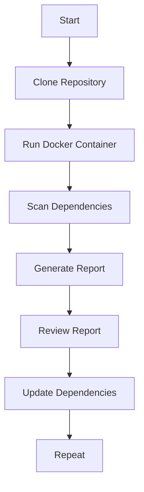

## Automating Third-Party Libraries Security Testing Using OWASP Dependency Check

### Background Theory

Automating the security testing of third-party libraries is crucial in modern software development. Third-party libraries, also known as dependencies, are external packages or modules that developers integrate into their applications to leverage existing functionality. While these libraries can significantly speed up development, they also introduce potential security risks. Vulnerabilities within these libraries can be exploited by attackers, leading to serious security breaches.

OWASP Dependency Check is an open-source tool designed to identify project dependencies with known vulnerabilities. It supports various package managers and programming languages, making it a versatile tool for DevSecOps practices. By integrating Dependency Check into your build pipeline, you can automate the process of identifying and addressing insecure dependencies.

### Why Use OWASP Dependency Check?

OWASP Dependency Check helps mitigate the risk associated with using third-party libraries by:

1. **Identifying Vulnerabilities**: It checks your project dependencies against a database of known vulnerabilities.
2. **Providing Context**: It offers detailed information about each identified vulnerability, including severity ratings and references to Common Vulnerabilities and Exposures (CVEs).
3. **Facilitating Remediation**: It suggests actions to remediate issues, such as updating to a newer version of the library.

### Setting Up OWASP Dependency Check

To demonstrate the usage of OWASP Dependency Check, we will use it in a Docker container. This approach ensures consistency across different environments and simplifies setup.

#### Prerequisites

Before proceeding, ensure you have the following installed:

1. **Docker**: A containerization platform that allows you to run applications in isolated environments.
2. **Git**: A version control system used to clone repositories.

#### Cloning the Repository

For this demonstration, we will use the OWASP Juice Shop repository. Juice Shop is a deliberately insecure web application designed for security training.

```bash
git clone https://github.com/bkimminich/juice-shop.git
cd juice-shop
```

### Running OWASP Dependency Check

We will run OWASP Dependency Check as a Docker container. This method ensures that the tool runs in a consistent environment, regardless of the host machine's configuration.

#### Docker Command Breakdown

The Docker command to run OWASP Dependency Check is as follows:

```bash
docker run \
  --rm \
  --user "$(id -u):$(id -g)" \
  -v $(pwd):/src \
  -v dependency-check-report:/reports \
  owasp/dependency-check:6.5.3 \
  --project "Juice Shop" \
  --scan /src \
  --out /reports
```

Let's break down each component of this command:

1. **`docker run`**: Starts a new container.
2. **`--rm`**: Automatically removes the container when it exits.
3. **`--user "$(id -u):$(id -g)"`**: Specifies the user ID and group ID to run the container under. This ensures that the container can write files to the host machine's filesystem.
4. **`-v $(pwd):/src`**: Maps the current directory (`$(pwd)`) to `/src` inside the container. This is the directory containing the codebase to be scanned.
5. **`-v dependency-check-report:/reports`**: Maps a named volume `dependency-check-report` to `/reports` inside the container. This volume stores the generated reports.
6. **`owasp/dependency-check:6.5.3`**: Specifies the Docker image to use, which is the OWASP Dependency Check image tagged with version `6.5.3`.
7. **`--project "Juice Shop"`**: Sets the name of the project being scanned.
8. **`--scan /src`**: Specifies the directory to scan.
9. **`--out /reports`**: Specifies the output directory for the generated reports.

### Understanding User Permissions

The `--user "$(id -u):$(id -g)"` parameter is crucial because the Dependency Check container requires specific user permissions to write files to the host machine's filesystem. Without this parameter, the container might run under a default user that lacks the necessary permissions, leading to errors.

### Named Volumes

Using named volumes (`dependency-check-report`) allows the container to cache downloaded vulnerability reports. This caching mechanism speeds up subsequent scans by avoiding redundant downloads.

### Example Output

After running the command, Dependency Check will generate a report detailing any vulnerabilities found in the third-party libraries used by the Juice Shop project. The report will be saved in the `/reports` directory inside the container, which maps to the `dependency-check-report` volume on the host machine.

### Real-World Examples

#### Recent CVEs and Breaches

Several recent CVEs highlight the importance of regularly scanning third-party libraries for vulnerabilities:

1. **CVE-2021-44228 (Log4j)**: This critical vulnerability in the Apache Log4j library allowed remote code execution. Many applications were affected because they used this widely adopted logging framework.
2. **CVE-2022-22965 (Spring Framework)**: This vulnerability in the Spring Framework allowed attackers to execute arbitrary code through deserialization attacks.

These examples underscore the necessity of continuous monitoring and updating of third-party libraries to mitigate such risks.

### How to Prevent / Defend

#### Detection

Regularly scanning your project dependencies using tools like OWASP Dependency Check is essential for detecting vulnerabilities. Integrating this tool into your CI/CD pipeline ensures that security checks are performed automatically with each build.

#### Prevention

1. **Update Dependencies**: Regularly update your project dependencies to the latest versions. This reduces the likelihood of using libraries with known vulnerabilities.
2. **Use Secure Coding Practices**: Follow secure coding guidelines to minimize the risk of introducing vulnerabilities through custom code.
3. **Implement Dependency Management Policies**: Establish policies that require dependencies to be vetted and approved before integration into projects.

#### Secure Code Fix

Here’s an example of how to fix a vulnerable dependency:

**Vulnerable Code:**

```xml
<dependencies>
    <dependency>
        <groupId>org.apache.logging.log4j</groupId>
        <artifactId>log4j-core</artifactId>
        <version>2.14.1</version>
    </dependency>
</dependencies>
```

**Fixed Code:**

```xml
<dependencies>
    <dependency>
        <groupId>org.apache.logging.log4j</groupId>
        <artifactId>log4j-core</artifactId>
        <version>2.17.1</version>
    </dependency>
</dependencies>
```

By updating the version of `log4j-core` to `2.17.1`, you mitigate the risk associated with the Log4j vulnerability.

### Complete Example

#### Full HTTP Request and Response

While OWASP Dependency Check does not typically involve HTTP requests, it does interact with external databases to fetch vulnerability data. Here’s an example of how Dependency Check might make an HTTP request to fetch vulnerability data:

```http
GET /api/vulnerabilities HTTP/1.1
Host: vulnerability-db.example.com
User-Agent: OWASP Dependency Check
Accept: application/json
```

The corresponding response might look like this:

```http
HTTP/1.1 200 OK
Content-Type: application/json
Content-Length: 1234

{
    "vulnerabilities": [
        {
            "cve": "CVE-2021-44228",
            "description": "Apache Log4j2 JNDI feature used for remote code execution.",
            "severity": "CRITICAL"
        },
        {
            "cve": "CVE-2022-22965",
            "description": "Spring Framework deserialization vulnerability.",
            "severity": "HIGH"
        }
    ]
}
```

### Mermaid Diagrams

#### Dependency Check Workflow

A mermaid diagram can help visualize the workflow of OWASP Dependency Check:



### Hands-On Labs

To practice using OWASP Dependency Check, consider the following labs:

- **PortSwigger Web Security Academy**: Offers interactive labs that cover various aspects of web security, including dependency management.
- **OWASP Juice Shop**: Provides a deliberately insecure web application for security training, which can be used to practice dependency scanning.
- **OWASP Dependency Check Official Documentation**: Contains detailed guides and examples for using the tool effectively.

### Conclusion

Automating the security testing of third-party libraries is a critical aspect of modern software development. By integrating tools like OWASP Dependency Check into your build pipeline, you can proactively identify and address vulnerabilities, thereby enhancing the overall security posture of your applications. Regular updates, secure coding practices, and comprehensive dependency management policies are key to maintaining a robust security framework.

---
<!-- nav -->
[[02-Automating Third-Party Libraries Security Testing Using OWASP Dependency Check Part 1|Automating Third-Party Libraries Security Testing Using OWASP Dependency Check Part 1]] | [[DevSecOps/DevSecOps Bootcamp/05-Application Security Testing/04-Automating Third Party Libraries Security Testing/Demo Using OWASP Dependency Check from the Command Line/00-Overview|Overview]] | [[04-Fingerprinted Files|Fingerprinted Files]]
