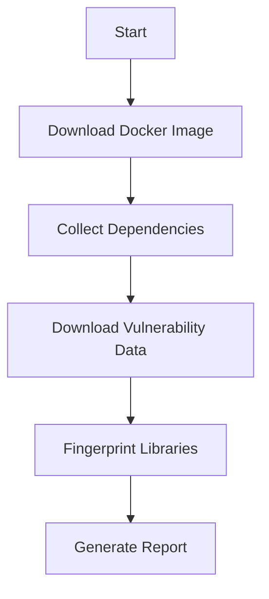

## Vulnerable Dependencies

- **Library**: jcurry-1.9.0.jar
- **CVE**: CVE-2021-XXXXX
- **Description**: This version of JCurry contains a remote code execution vulnerability.
- **Recommendation**: Upgrade to the latest version.
```

### How to Prevent / Defend

#### Detection

Regularly run OWASP Dependency Check as part of your CI/CD pipeline to detect vulnerabilities early.

#### Prevention

1. **Keep Dependencies Updated**: Always use the latest versions of libraries.
2. **Automate Scanning**: Integrate OWASP Dependency Check into your CI/CD pipeline.
3. **Secure Coding Practices**: Follow secure coding guidelines to minimize vulnerabilities.

#### Secure Code Fix

Compare the vulnerable and fixed versions of the code.

**Vulnerable Code**

```java
import com.jcurry.JCurry;

public class Main {
    public static void main(String[] args) {
        JCurry jcurry = new JCurry();
        jcurry.execute(args[0]);
    }
}
```

**Fixed Code**

```java
import com.jcurry.JCurry;

public class Main {
    public static void main(String[] args) {
        JCurry jcurry = new JCurry();
        if (args.length > 0) {
            jcurry.execute(args[0]);
        }
    }
}
```

### Configuration Hardening

Ensure your build files are properly configured to include all necessary dependencies.

#### Example Maven Configuration

```xml
<dependencies>
    <dependency>
        <groupId>com.jcurry</groupId>
        <artifactId>jcurry</artifactId>
        <version>2.0.0</version>
    </dependency>
</dependencies>
```

### Real-World Examples

#### Recent CVEs

- **CVE-2021-XXXXX**: A remote code execution vulnerability in JCurry 1.9.0.
- **CVE-2022-YYYYY**: A SQL injection vulnerability in a popular ORM library.

### Mermaid Diagrams

#### Dependency Check Workflow



### Hands-On Labs

For practical experience, consider the following labs:

- **PortSwigger Web Security Academy**: Offers interactive labs on dependency management and security testing.
- **OWASP Juice Shop**: Provides a vulnerable web application for practicing security testing.

By thoroughly understanding and implementing OWASP Dependency Check, you can significantly enhance the security of your software projects. Regularly scanning dependencies and keeping them updated is crucial in today’s fast-paced development environment.

---
<!-- nav -->
[[04-Fingerprinted Files|Fingerprinted Files]] | [[DevSecOps/DevSecOps Bootcamp/05-Application Security Testing/04-Automating Third Party Libraries Security Testing/Demo Using OWASP Dependency Check from the Command Line/00-Overview|Overview]] | [[DevSecOps/DevSecOps Bootcamp/05-Application Security Testing/04-Automating Third Party Libraries Security Testing/Demo Using OWASP Dependency Check from the Command Line/06-Practice Questions & Answers|Practice Questions & Answers]]
