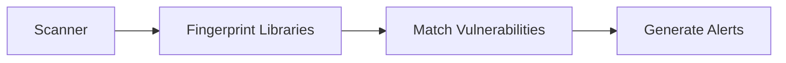
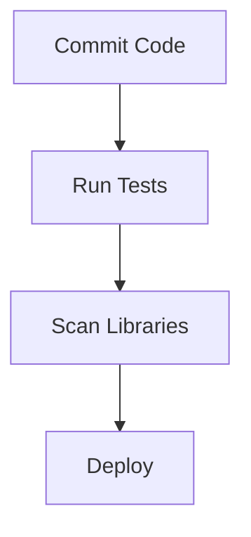

## Introduction to Third-Party Library Security Testing

In modern software development, third-party libraries play a crucial role in accelerating the development process. These libraries provide pre-built functionalities that developers can integrate into their applications, saving time and effort. However, these libraries also introduce potential security risks. Vulnerabilities within third-party libraries can be exploited by attackers, leading to serious security breaches. Therefore, automating the security testing of third-party libraries is essential to ensure the overall security of an application.

### What is a Third-Party Library Scanner?

A third-party library scanner is a tool designed to identify and report vulnerabilities present in the third-party libraries used in a project. The scanner performs several key tasks:

1. **Fingerprinting Libraries**: The scanner identifies and catalogs all the third-party libraries used in the project.
2. **Matching Vulnerabilities**: It compares the identified libraries with known vulnerabilities databases.
3. **Generating Alerts**: If a match is found, the scanner generates alerts to inform the development team about the presence of vulnerable libraries.

#### Why Use a Third-Party Library Scanner?

Using a third-party library scanner is crucial because:

- **Identifying Known Vulnerabilities**: Many third-party libraries have known vulnerabilities that can be exploited by attackers. By using a scanner, you can quickly identify these vulnerabilities.
- **Ensuring Compliance**: Many organizations have compliance requirements that mandate regular security assessments. A scanner helps meet these requirements.
- **Reducing Risk**: By identifying and addressing vulnerabilities early in the development cycle, you reduce the risk of security breaches.

### Characteristics of a Good Scanner

A good third-party library scanner should possess the following characteristics:

1. **Multiple Up-to-Date Sources**: The scanner should use multiple sources for vulnerability reports to ensure comprehensive coverage.
2. **Detailed Information Parsing**: The scanner should be able to parse detailed information from manifests or bills of materials to accurately identify library versions.
3. **Framework Understanding**: The scanner should understand multiple frameworks to detect library versions accurately.

#### Example of a Good Scanner: Snyk

Snyk is a popular third-party library scanner that meets these criteria. It uses multiple sources for vulnerability reports and can parse detailed information from manifests. Snyk supports various frameworks, making it a robust choice for security testing.



### How Does a Scanner Work?

The process of a third-party library scanner can be broken down into several steps:

1. **Fingerprinting Libraries**:
   - The scanner scans the project to identify all third-party libraries used.
   - This is typically done by analyzing the project's dependencies, such as `package.json` for Node.js, `pom.xml` for Maven, or `requirements.txt` for Python.

2. **Matching Vulnerabilities**:
   - The scanner compares the identified libraries with known vulnerabilities databases.
   - This comparison is based on the library name and version number.

3. **Generating Alerts**:
   - If a match is found, the scanner generates alerts to inform the development team.
   - These alerts can be integrated into the continuous integration/continuous deployment (CI/CD) pipeline.

#### Example: Scanning a Node.js Project

Consider a Node.js project with the following `package.json`:

```json
{
  "name": "my-project",
  "version": "1.0.0",
  "dependencies": {
    "express": "^4.17.1",
    "lodash": "^4.17.21"
  }
}
```

A scanner like Snyk would scan this project and identify the `express` and `lodash` libraries. It would then compare these libraries with known vulnerabilities databases.

### Real-World Examples of Vulnerable Libraries

Several recent CVEs highlight the importance of third-party library security testing:

1. **CVE-2021-21315**: This vulnerability was found in the `express` library, which is widely used in Node.js applications. An attacker could exploit this vulnerability to execute arbitrary code on the server.
2. **CVE-2021-3156**: This vulnerability was found in the `log4j` library, which is widely used in Java applications. An attacker could exploit this vulnerability to execute arbitrary code on the server.

These examples demonstrate the critical nature of regularly scanning third-party libraries for vulnerabilities.

### Detailed Version Numbers and Alerts

A good scanner should generate detailed alerts that include the following information:

- **Library Name**: The name of the vulnerable library.
- **Version Number**: The specific version number of the library.
- **Vulnerability Details**: A description of the vulnerability, including the CVE ID and the severity level.
- **Remediation Steps**: Recommendations for fixing the vulnerability, such as updating to a newer version of the library.

#### Example Alert

```json
{
  "library": "express",
  "version": "4.17.1",
  "vulnerability": {
    "cve_id": "CVE-2021-21315",
    "severity": "High",
    "description": "An attacker can execute arbitrary code on the server."
  },
  "remediation": {
    "update_to": "4.18.0"
  }
}
```

### Asynchronous Quality Gate

One of the key features of a third-party library scanner is its ability to act as an asynchronous quality gate. This means that the scanning process can be performed independently of changes in the codebase.

#### Example: Integrating a Scanner into a CI/CD Pipeline

Consider a CI/CD pipeline that includes a third-party library scanner. The pipeline might look like this:



In this pipeline, the scanner runs asynchronously after the tests are completed. If the scanner detects any vulnerabilities, it generates alerts that can be addressed before deploying the application.

### How to Prevent / Defend Against Vulnerable Libraries

To prevent and defend against vulnerable third-party libraries, follow these steps:

1. **Regularly Scan Libraries**: Use a third-party library scanner to regularly scan your project for vulnerabilities.
2. **Update Libraries**: Keep your third-party libraries up to date. Regularly update to the latest versions to mitigate known vulnerabilities.
3. **Secure Coding Practices**: Implement secure coding practices to minimize the risk of vulnerabilities being exploited.
4. **Hardening Configurations**: Harden configurations to reduce the attack surface. For example, disable unnecessary features and services.

#### Example: Secure Coding Practices

Consider the following insecure code snippet:

```javascript
const express = require('express');
const app = express();

app.get('/', function(req, res) {
  res.send(req.query.message);
});
```

This code snippet is vulnerable to cross-site scripting (XSS) attacks. To secure this code, you can use a library like `helmet` to sanitize user input:

```javascript
const express = require('express');
const helmet = require('helmet');
const app = express();

app.use(helmet());

app.get('/', function(req, res) {
  res.send(sanitize(req.query.message));
});

function sanitize(input) {
  return input.replace(/</g, '&lt;').replace(/>/g, '&gt;');
}
```

### Conclusion

Automating third-party library security testing is essential to ensure the overall security of an application. A good scanner should use multiple up-to-date sources for vulnerability reports, parse detailed information from manifests, and understand multiple frameworks. By integrating a scanner into your CI/CD pipeline, you can act as an asynchronous quality gate, ensuring that your application remains secure.

### Practice Labs

For hands-on experience with third-party library security testing, consider the following practice labs:

- **PortSwigger Web Security Academy**: Offers interactive labs on web security, including third-party library vulnerabilities.
- **OWASP Juice Shop**: A deliberately insecure web application for practicing web security skills.
- **DVWA (Damn Vulnerable Web Application)**: A PHP/MySQL web application that is riddled with vulnerabilities for educational purposes.

By engaging with these labs, you can gain practical experience in identifying and mitigating third-party library vulnerabilities.

---
<!-- nav -->
[[DevSecOps/DevSecOps Bootcamp/05-Application Security Testing/04-Automating Third Party Libraries Security Testing/Third Party Libraries Scanners/00-Overview|Overview]] | [[02-Introduction to Third-Party Library Security Testing Part 2|Introduction to Third-Party Library Security Testing Part 2]]
