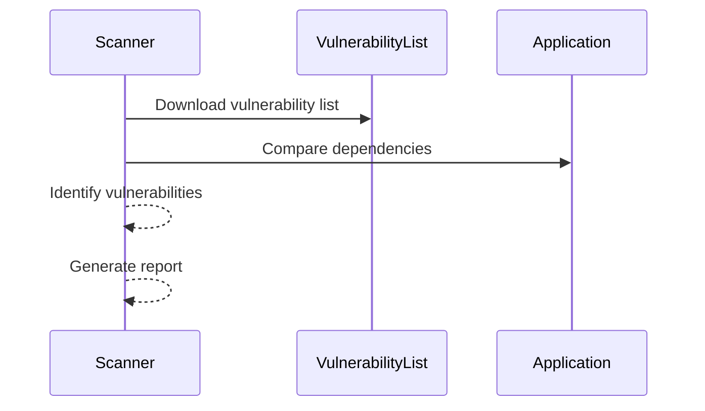

## Introduction to Third-Party Library Security Testing

### Background Theory

In modern software development, applications often rely heavily on third-party libraries to expedite development and reduce redundancy. These libraries provide pre-built functionalities that developers can integrate into their projects, saving significant time and effort. However, these third-party libraries also introduce potential security risks. Over time, vulnerabilities may be discovered in these libraries, which can compromise the security of the entire application.

The security of an application degrades over time due to several factors:

1. **Algorithmic Degradation**: Cryptographic algorithms like MD5, which were once considered secure, are now deemed broken. This means that even if the codebase remains unchanged, the security of the application can still degrade as new vulnerabilities are discovered in the underlying algorithms.

2. **Evolving Threat Landscape**: As technology advances, attacks on software become cheaper and faster. Attackers continuously develop new techniques and tools to exploit vulnerabilities, making it essential to stay updated with the latest security practices.

3. **Dependency Security**: The security of an application is not solely dependent on the code written by the development team. It also relies on the security of the third-party libraries used. If a library contains a vulnerability, it can expose the entire application to potential attacks.

### Importance of Regular Security Testing

Given the dynamic nature of the threat landscape, it is crucial to regularly test for outdated and insecure third-party libraries. This ensures that the application remains secure even as new vulnerabilities are discovered. Regular testing helps identify and mitigate risks associated with third-party dependencies, thereby maintaining the overall security posture of the application.

### How Third-Party Library Scanners Work

Third-party library scanners operate by downloading lists of known vulnerabilities from various sources. These sources include:

- **Vendors**: Software vendors often publish lists of vulnerabilities found in their products.
- **Centralized Organizations**: Organizations like the National Vulnerability Database (NVD) compile and maintain comprehensive lists of vulnerabilities.

#### Workflow of a Scanner

1. **Download Vulnerability Lists**: The scanner downloads the latest vulnerability lists from trusted sources.
2. **Compare Dependencies**: The scanner compares the third-party libraries used in the application against the downloaded vulnerability lists.
3. **Identify Vulnerabilities**: If any of the libraries match entries in the vulnerability list, the scanner flags them as potentially insecure.
4. **Generate Reports**: The scanner generates detailed reports highlighting the identified vulnerabilities along with recommendations for mitigation.



### Real-World Examples

Recent real-world examples highlight the importance of regular security testing for third-party libraries:

- **CVE-2021-44228 (Log4j)**: In December 2021, a critical vulnerability was discovered in the Apache Log4j library. This vulnerability allowed attackers to execute arbitrary code on affected systems. Many applications that relied on Log4j were exposed to this risk, emphasizing the need for continuous monitoring and testing of third-party dependencies.

- **CVE-2022-22965 (Spring Framework)**: In March 2022, a vulnerability was found in the Spring Framework, which could allow remote code execution. This vulnerability affected numerous applications that used the Spring Framework, underscoring the importance of keeping third-party libraries up-to-date.

### Complete Example of a Security Test

Let's walk through a complete example of how a third-party library scanner might be used to test an application.

#### Step 1: Set Up the Environment

First, ensure that the necessary tools and dependencies are installed. For this example, we'll use `npm` and `npm-audit`.

```bash
npm install
npm audit
```

#### Step 2: Run the Scanner

Run the scanner to check for vulnerabilities in the third-party libraries.

```bash
npm audit
```

#### Step 3: Analyze the Results

The scanner will generate a report detailing any vulnerabilities found.

```http
HTTP/1.1 200 OK
Content-Type: application/json

{
  "vulnerabilities": [
    {
      "name": "log4j",
      "severity": "high",
      "description": "Apache Log4j vulnerability (CVE-2021-44228)",
      "affected_versions": ["<=2.14.1"]
    },
    {
      "name": "spring-framework",
      "severity": "critical",
      "description": "Spring Framework vulnerability (CVE-2022-22965)",
      "affected_versions": ["<=5.3.15"]
    }
  ]
}
```

#### Step 4: Mitigate the Vulnerabilities

Based on the report, update the vulnerable libraries to their latest versions.

```bash
npm install log4j@latest spring-framework@latest
```

### How to Prevent / Defend

#### Detection

Regularly run security scanners to detect vulnerabilities in third-party libraries. Tools like `npm audit`, `pip-audit`, and `mvn dependency-check` can help automate this process.

#### Prevention

1. **Keep Libraries Updated**: Ensure that all third-party libraries are kept up-to-date with the latest security patches.
2. **Use Secure Coding Practices**: Follow secure coding guidelines to minimize the risk of introducing vulnerabilities.
3. **Implement Dependency Management**: Use tools like `npm`, `pip`, and `Maven` to manage dependencies and automatically update them.

#### Secure Code Fix

Here’s an example of a vulnerable code snippet and its secure counterpart:

**Vulnerable Code**

```javascript
const log4j = require('log4j');
log4j.info("This is a log message");
```

**Secure Code**

```javascript
const log4j = require('log4j@latest');
log4j.info("This is a log message");
```

### Hands-On Labs

For hands-on practice, consider the following labs:

- **PortSwigger Web Security Academy**: Offers modules on secure coding and third-party library management.
- **OWASP Juice Shop**: Provides a vulnerable web application for practicing security testing.
- **DVWA (Damn Vulnerable Web Application)**: A deliberately insecure web application for practicing penetration testing.

These labs provide practical experience in identifying and mitigating vulnerabilities in third-party libraries.

### Conclusion

Regular security testing of third-party libraries is essential for maintaining the security of modern applications. By understanding the workflow of third-party library scanners and implementing best practices, developers can significantly reduce the risk of vulnerabilities in their applications.

---
<!-- nav -->
[[02-Introduction to Third-Party Library Security Testing Part 2|Introduction to Third-Party Library Security Testing Part 2]] | [[DevSecOps/DevSecOps Bootcamp/05-Application Security Testing/04-Automating Third Party Libraries Security Testing/Third Party Libraries Scanners/00-Overview|Overview]] | [[04-Artifact Storage Scanning|Artifact Storage Scanning]]
