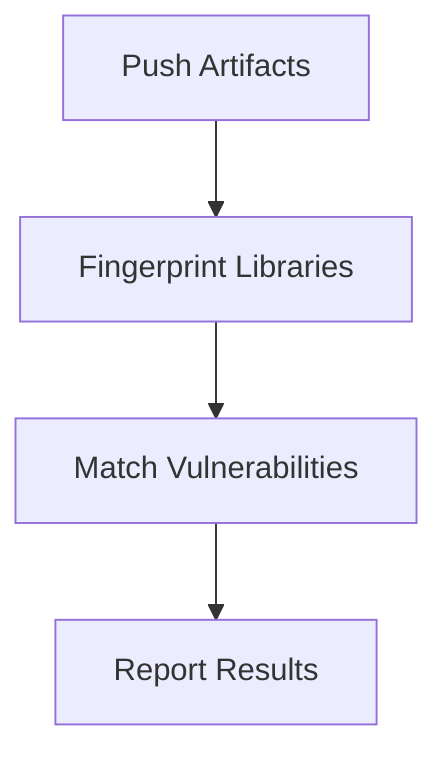

## Artifact Storage Scanning

When artifacts are pushed to a registry or stored on an artifact server, scanners can perform additional checks to ensure that the artifacts do not contain known vulnerabilities.

### How Artifact Storage Scanning Works

1. **Artifact Pushing**: Artifacts are pushed to a registry or artifact server.
2. **Fingerprinting**: The server analyzes the artifacts to identify third-party libraries and their versions.
3. **Vulnerability Matching**: The identified libraries are compared against a database of known vulnerabilities.
4. **Reporting**: Any vulnerabilities found are reported to the development team for remediation.

### Example Workflow

Consider a scenario where artifacts are pushed to an artifact server using `JFrog Artifactory`. The following steps outline the process:

1. **Artifact Pushing**:
    ```bash
    mvn deploy -DaltDeploymentRepository=artifactory::default::http://localhost:8081/artifactory/libs-release-local
    ```

2. **Fingerprinting**:
    ```bash
    artifactory scan --artifact=my-artifact.jar
    ```

3. **Vulnerability Matching**:
    ```bash
    artifactory match --vulnerabilities=my-artifact.jar
    ```

4. **Reporting**:
    ```bash

    artifactory report --output=report.json
    ```

### Mermaid Diagram: Artifact Storage Scanning



### Pitfalls and Best Practices

#### Pitfall: Outdated Artifacts

Outdated artifacts can introduce vulnerabilities if they are not scanned and updated regularly.

#### Best Practice: Regular Scanning

To minimize the risk of outdated artifacts, it is crucial to perform regular scans and update the artifacts accordingly.

### How to Prevent / Defend

#### Detection

Use tools like `JFrog Xray` to scan artifacts for vulnerabilities when they are pushed to a registry or artifact server.

#### Prevention

1. **Regular Updates**: Keep artifacts up-to-date with the latest security patches.
2. **Secure Coding Practices**: Implement secure coding practices to minimize the introduction of vulnerabilities.

### Secure-Coding Fix

#### Vulnerable Artifact

```java
// MyArtifact.java
import com.example.vulnerablelibrary.VulnerableClass;

public class MyArtifact {
    public void doSomething() {
        VulnerableClass.doSomething();
    }
}
```

#### Fixed Artifact

```java
// MyArtifact.java
import com.example.securelibrary.SecureClass;

public class MyArtifact {
    public void doSomething() {
        SecureClass.doSomething();
    }
}
```

### Configuration Hardening

Ensure that the artifact server is configured to automatically update artifacts and scan for vulnerabilities. Use tools like `JFrog Xray` to automate the process.

---
<!-- nav -->
[[03-Introduction to Third-Party Library Security Testing|Introduction to Third-Party Library Security Testing]] | [[DevSecOps/DevSecOps Bootcamp/05-Application Security Testing/04-Automating Third Party Libraries Security Testing/Third Party Libraries Scanners/00-Overview|Overview]] | [[05-Asynchronous Scanning|Asynchronous Scanning]]
