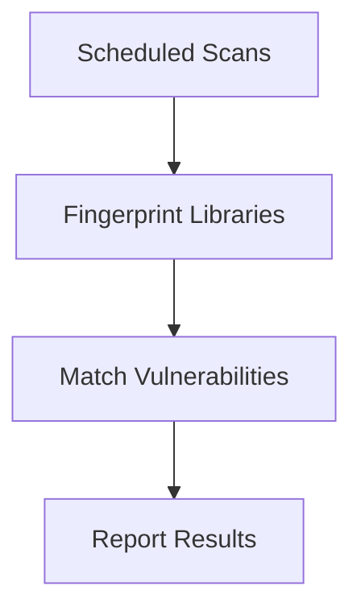

## Asynchronous Scanning

Asynchronous scanning involves performing scans periodically rather than immediately after a code commit. This approach is beneficial because some scans can take a long time and may not provide immediate value if the results are not directly related to recent code changes.

### How Asynchronous Scanning Works

1. **Scheduled Scans**: Scans are scheduled to run at specific intervals.
2. **Fingerprinting**: The system analyzes the codebase to identify third-party libraries and their versions.
3. **Vulnerability Matching**: The identified libraries are compared against a database of known vulnerabilities.
4. **Reporting**: Any vulnerabilities found are reported to the development team for remediation.

### Example Workflow

Consider a scenario where a tool like `Dependency-Check` is used to perform asynchronous scans. The following steps outline the process:

1. **Scheduled Scans**:
    ```bash
    dependency-check --scan --format ALL --out report.html
    ```

2. **Fingerprinting**:
    ```bash
    dependency-check --analyze --out report.html
    ```

3. **Vulnerability Matching**:
    ```bash
    dependency-check --match --out report.html
    ```

4. **Reporting**:
    ```bash
    dependency-check --report --out report.html
    ```

### Mermaid Diagram: Asynchronous Scanning



### Pitfalls and Best Practices

#### Pitfall: Delayed Detection

Delayed detection can occur if the scans are not performed frequently enough, allowing vulnerabilities to go unnoticed for extended periods.

#### Best Practice: Regular Scanning

To minimize the risk of delayed detection, it is crucial to perform regular scans and update the codebase accordingly.

### How to Prevent / Defend

#### Detection

Use tools like `Dependency-Check` to perform asynchronous scans and detect vulnerabilities in third-party libraries.

#### Prevention

1. **Regular Updates**: Keep third-party libraries up-to-date with the latest security patches.
2. **Secure Coding Practices**: Implement secure coding practices to minimize the introduction of vulnerabilities.

### Secure-Coding Fix

#### Vulnerable Code

```javascript
// package.json
{
  "dependencies": {
    "express": "4.17.1"
  }
}
```

#### Fixed Code

```javascript
// package.json
{
  "dependencies": {
    "express": "4.18.2"
  }
}
```

### Configuration Hardening

Ensure that the scanning tool is configured to perform regular scans and update the codebase accordingly. Use tools like `Jenkins` to automate the process.

---
<!-- nav -->
[[04-Artifact Storage Scanning|Artifact Storage Scanning]] | [[DevSecOps/DevSecOps Bootcamp/05-Application Security Testing/04-Automating Third Party Libraries Security Testing/Third Party Libraries Scanners/00-Overview|Overview]] | [[06-Automating Third-Party Libraries Security Testing|Automating Third-Party Libraries Security Testing]]
