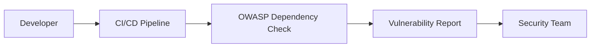
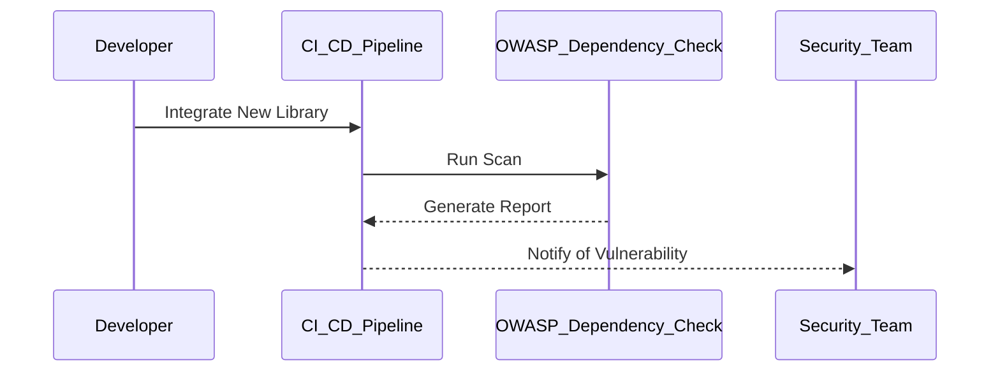

## Automating Third-Party Libraries Security Testing

### Introduction to Third-Party Libraries Security Testing

In modern software development, third-party libraries are ubiquitous. They provide pre-built functionality that can significantly speed up development time. However, these libraries also introduce potential security risks. Vulnerabilities within third-party libraries can be exploited by attackers, leading to serious security breaches. Therefore, it is crucial to integrate automated security testing for third-party libraries into the continuous integration/continuous deployment (CI/CD) pipeline.

### Why Perform Asynchronous Scans?

When integrating security testing into the CI/CD pipeline, it is essential to ensure that the build process does not fail due to third-party vulnerabilities. Performing scans asynchronously allows the build to continue even if a vulnerability is detected. This approach ensures that the development process is not unnecessarily halted, while still providing timely feedback on security issues.

#### Example Scenario

Consider a scenario where a developer integrates a new library into their project. An asynchronous scan detects a vulnerability in this library. The build continues, but the developer receives an alert indicating the presence of the vulnerability. This allows the team to address the issue promptly without disrupting the development workflow.

### Tool Overview: OWASP Dependency Check

One of the tools commonly used for scanning third-party libraries is OWASP Dependency Check. This open-source tool attempts to detect publicly disclosed vulnerabilities in used libraries. It supports a wide range of programming languages and package managers, making it a versatile choice for various projects.

#### Installation and Setup

To use OWASP Dependency Check, you first need to install it. You can download the latest release from the OWASP website or use a package manager like Maven or Gradle.

```bash
# Using Maven
mvn clean install dependency-check:check
```

```bash
# Using Gradle
gradle clean build dependencyCheckAnalyze
```

#### Configuration

OWASP Dependency Check requires minimal configuration. You can customize the settings using a `dependency-check.properties` file. Here is an example configuration:

```properties
# dependency-check.properties
projectName=MyProject
projectVersion=1.0.0
scanAllFiles=true
suppressionFile=suppressions.xml
```

### How OWASP Dependency Check Works

OWASP Dependency Check works by analyzing the dependencies of your project and comparing them against a database of known vulnerabilities. It supports various formats such as Maven, Gradle, npm, and more.

#### Step-by-Step Mechanics

1. **Dependency Collection**: OWASP Dependency Check collects the dependencies of your project.
2. **Vulnerability Database**: It compares these dependencies against a database of known vulnerabilities.
3. **Report Generation**: If any vulnerabilities are found, it generates a report detailing the issues.

#### Example Report

Here is an example of a report generated by OWASP Dependency Check:

```xml
<dependency-check xmlns="https://www.owasp.org/index.php/OWASP_Dependency_Check">
    <dependencies>
        <dependency>
            <fileName>commons-lang-2.6.jar</fileName>
            <filePath>/path/to/commons-lang-2.6.jar</filePath>
            <md5>1234567890abcdef1234567890abcdef</md5>
            <sha1>1234567890abcdef1234567890abcdef12345678</sha1>
            <vulnerabilities>
                <vulnerability>
                    <name>CVE-2015-8826</name>
                    <severity>HIGH</severity>
                    <description>A vulnerability in Apache Commons Lang.</description>
                </vulnerability>
            </vulnerabilities>
        </dependency>
    </dependencies>
</dependency-check>
```

### Real-World Examples

#### Recent CVEs and Breaches

Several recent CVEs have highlighted the importance of securing third-party libraries:

- **CVE-2021-44228 (Log4j)**: A critical vulnerability in the popular logging framework Log4j affected numerous applications and services.
- **CVE-2022-22965 (Spring Framework)**: A vulnerability in the Spring Framework allowed remote code execution.

These examples underscore the necessity of regular security testing for third-party libraries.

### Pitfalls and Common Mistakes

#### False Positives and Negatives

One common pitfall is dealing with false positives and negatives. OWASP Dependency Check may sometimes flag legitimate libraries as vulnerable, or miss actual vulnerabilities. It is important to manually verify the findings and update the suppression rules accordingly.

#### Outdated Vulnerability Database

Another issue is the timeliness of the vulnerability database. OWASP Dependency Check relies on public databases, which may not always be up-to-date. Regularly updating the tool and ensuring that the database is current can mitigate this risk.

### How to Prevent / Defend

#### Detection

To effectively detect vulnerabilities in third-party libraries, integrate OWASP Dependency Check into your CI/CD pipeline. Ensure that the tool runs asynchronously to avoid halting the build process.

#### Prevention

Prevent vulnerabilities by maintaining a robust security testing process. Regularly update the tool and the vulnerability database. Implement a policy to review and approve third-party libraries before integration.

#### Secure Coding Fixes

Here is an example of a vulnerable code snippet and its secure counterpart:

**Vulnerable Code**

```java
import org.apache.commons.lang.StringEscapeUtils;

public class VulnerableCode {
    public static void main(String[] args) {
        String userInput = "<script>alert('XSS');</script>";
        System.out.println(StringEscapeUtils.escapeHtml(userInput));
    }
}
```

**Secure Code**

```java
import org.apache.commons.lang.StringEscapeUtils;

public class SecureCode {
    public static void main(String[] args) {
        String userInput = "<script>alert('XSS');</script>";
        String safeInput = StringEscapeUtils.escapeHtml(userInput);
        System.out.println(safeInput);
    }
}
```

### Configuration Hardening

Ensure that your project configurations are hardened against vulnerabilities. For example, configure Maven or Gradle to exclude known vulnerable versions of libraries.

#### Maven Configuration

```xml
<!-- pom.xml -->
<dependencies>
    <dependency>
        <groupId>org.apache.commons</groupId>
        <artifactId>commons-lang</artifactId>
        <version>3.12.0</version>
        <exclusions>
            <exclusion>
                <groupId>*</groupId>
                <artifactId>*</artifactId>
            </exclusion>
        </exclusions>
    </dependency>
</dependencies>
```

#### Gradle Configuration

```groovy
// build.gradle
configurations.all {
    resolutionStrategy.eachDependency { details ->
        if (details.requested.group == 'org.apache.commons') {
            details.useVersion '3.12.0'
        }
    }
}
```

### Complete Example

#### Full HTTP Request and Response

Here is an example of a full HTTP request and response using OWASP Dependency Check:

**HTTP Request**

```http
POST /api/v1/dependency-check HTTP/1.1
Host: localhost:8080
Content-Type: application/json
Authorization: Bearer <token>

{
    "projectName": "MyProject",
    "projectVersion": "1.0.0",
    "dependencies": [
        {
            "fileName": "commons-lang-2.6.jar",
            "filePath": "/path/to/commons-lang-2.6.jar",
            "md5": "1234567890abcdef1234567890abcdef",
            "sha1": "1234567890abcdef1234567890abcdef12345678"
        }
    ]
}
```

**HTTP Response**

```http
HTTP/1.1 200 OK
Content-Type: application/json

{
    "dependencies": [
        {
            "fileName": "commons-lang-2.6.jar",
            "filePath": "/path/to/commons-lang-2.6.jar",
            "md5": "1234567890abcdef1234567890abcdef",
            "sha1": "1234567890abcdef1234567890abcdef12345678",
            "vulnerabilities": [
                {
                    "name": "CVE-2015-8826",
                    "severity": "HIGH",
                    "description": "A vulnerability in Apache Commons Lang."
                }
            ]
        }
    ]
}
```

### Mermaid Diagrams

#### Architecture Diagram



#### Sequence Diagram



### Hands-On Labs

For hands-on practice with third-party libraries security testing, consider the following labs:

- **PortSwigger Web Security Academy**: Offers exercises on identifying and exploiting vulnerabilities in third-party libraries.
- **OWASP Juice Shop**: Provides a vulnerable web application for practicing security testing.
- **DVWA (Damn Vulnerable Web Application)**: A deliberately insecure web application for practicing web security.

By integrating OWASP Dependency Check into your CI/CD pipeline and following best practices, you can significantly enhance the security of your software projects.

---
<!-- nav -->
[[05-Asynchronous Scanning|Asynchronous Scanning]] | [[DevSecOps/DevSecOps Bootcamp/05-Application Security Testing/04-Automating Third Party Libraries Security Testing/Third Party Libraries Scanners/00-Overview|Overview]] | [[07-Build Phase Scanning|Build Phase Scanning]]
