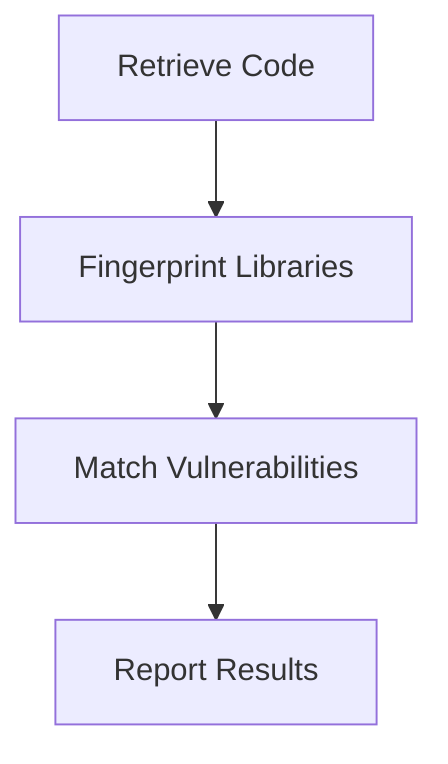

## Build Phase Scanning

During the build phase, the automation or build server retrieves code from the repository and performs a series of checks to ensure that the codebase does not contain known vulnerabilities in third-party libraries.

### How Build Phase Scanning Works

1. **Code Retrieval**: The build server pulls the latest code from the repository.
2. **Fingerprinting**: The server analyzes the codebase to identify third-party libraries and their versions.
3. **Vulnerability Matching**: The identified libraries are compared against a database of known vulnerabilities.
4. **Reporting**: Any vulnerabilities found are reported to the development team for remediation.

### Example Workflow

Consider a scenario where a build server uses a tool like `Snyk` to scan for vulnerabilities in third-party libraries. The following steps outline the process:

1. **Code Retrieval**:
    ```bash
    git clone https://github.com/example/repo.git
    ```

2. **Fingerprinting**:
    ```bash
    snyk code test --file=package.json
    ```

3. **Vulnerability Matching**:
    ```bash
    snyk monitor --target=repo
    ```

4. **Reporting**:
    ```bash
    snyk test --json > report.json
    ```

### Mermaid Diagram: Build Phase Scanning



### Pitfalls and Best Practices

#### Pitfall: False Positives

One common issue with build phase scanning is the occurrence of false positives. These can arise due to inaccuracies in the fingerprinting process or mismatches in the vulnerability database.

#### Best Practice: Regular Database Updates

To minimize false positives, it is crucial to keep the vulnerability database up-to-date. Tools like `Snyk` and `WhiteSource` regularly update their databases to reflect the latest vulnerabilities.

### How to Prevent / Defend

#### Detection

Use tools like `Snyk` or `WhiteSource` to scan for vulnerabilities in third-party libraries during the build phase. Ensure that the vulnerability database is regularly updated.

#### Prevention

1. **Regular Updates**: Keep third-party libraries up-to-date with the latest security patches.
2. **Secure Coding Practices**: Implement secure coding practices to minimize the introduction of vulnerabilities.

### Secure-Coding Fix

#### Vulnerable Code

```javascript
// package.json
{
  "dependencies": {
    "lodash": "4.17.4"
  }
}
```

#### Fixed Code

```javascript
// package.json
{
  "dependencies": {
    "lodash": "4.17.21"
  }
}
```

### Configuration Hardening

Ensure that the build server is configured to automatically update third-party libraries and scan for vulnerabilities. Use tools like `npm-check-updates` to automate the process.

---
<!-- nav -->
[[06-Automating Third-Party Libraries Security Testing|Automating Third-Party Libraries Security Testing]] | [[DevSecOps/DevSecOps Bootcamp/05-Application Security Testing/04-Automating Third Party Libraries Security Testing/Third Party Libraries Scanners/00-Overview|Overview]] | [[DevSecOps/DevSecOps Bootcamp/05-Application Security Testing/04-Automating Third Party Libraries Security Testing/Third Party Libraries Scanners/08-Hands-On Labs|Hands-On Labs]]
