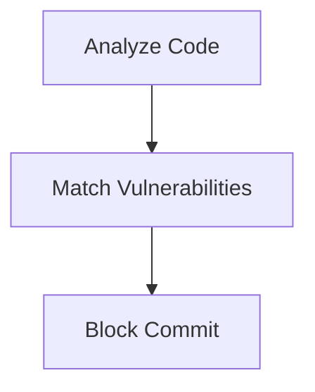

## Pre-Commit Phase Scanning

Integrated Development Environments (IDEs) can check for outdated third-party libraries before code is committed, preventing the introduction of vulnerabilities at an early stage.

### How Pre-Commit Phase Scanning Works

1. **Code Analysis**: IDEs analyze the codebase to identify third-party libraries and their versions.
2. **Vulnerability Matching**: The identified libraries are compared against a database of known vulnerabilities.
3. **Blocking Commit**: If vulnerabilities are found, the IDE can block the commit until the issues are resolved.

### Example Workflow

Consider a scenario where an IDE like `IntelliJ IDEA` is used to check for vulnerabilities in third-party libraries before code is committed. The following steps outline the process:

1. **Code Analysis**:
    ```bash
    intellij idea analyze --file=src/main/java
    ```

2. **Vulnerability Matching**:
    ```bash
    intellij idea match --vulnerabilities=src/main/java
    ```

3. **Blocking Commit**:
    ```bash
    intellij idea commit --check-vulnerabilities
    ```

### Mermaid Diagram: Pre-Commit Phase Scanning



### Pitfalls and Best Practices

#### Pitfall: False Negatives

False negatives can occur if the IDE does not have access to the latest vulnerability database or if the analysis is incomplete.

#### Best Practice: Regular Database Updates

To minimize false negatives, it is crucial to keep the vulnerability database up-to-date and ensure that the IDE performs a thorough analysis.

### How to Prevent / Defend

#### Detection

Use IDEs like `IntelliJ IDEA` or `Visual Studio Code` to check for vulnerabilities in third-party libraries before code is committed.

#### Prevention

1. **Regular Updates**: Keep third-party libraries up-to-date with the latest security patches.
2.  **Secure Coding Practices**: Implement secure coding practices to minimize the introduction of vulnerabilities.

### Secure-Coding Fix

#### Vulnerable Code

```javascript
// src/main/java/MyClass.java
import com.example.vulnerablelibrary.VulnerableClass;

public class MyClass {
    public void doSomething() {
        VulnerableClass.doSomething();
    }
}
```

#### Fixed Code

```javascript
// src/main/java/MyClass.java
import com.example.securelibrary.SecureClass;

public class MyClass {
    public void doSomething() {
        SecureClass.doSomething();
    }
}
```

### Configuration Hardening

Ensure that the IDE is configured to automatically update third-party libraries and scan for vulnerabilities. Use plugins like `SonarLint` to automate the process.

---
<!-- nav -->
[[DevSecOps/DevSecOps Bootcamp/05-Application Security Testing/04-Automating Third Party Libraries Security Testing/Third Party Libraries Scanners/08-Hands-On Labs|Hands-On Labs]] | [[DevSecOps/DevSecOps Bootcamp/05-Application Security Testing/04-Automating Third Party Libraries Security Testing/Third Party Libraries Scanners/00-Overview|Overview]] | [[DevSecOps/DevSecOps Bootcamp/05-Application Security Testing/04-Automating Third Party Libraries Security Testing/Third Party Libraries Scanners/10-Real-World Examples and Recent CVEs|Real-World Examples and Recent CVEs]]
