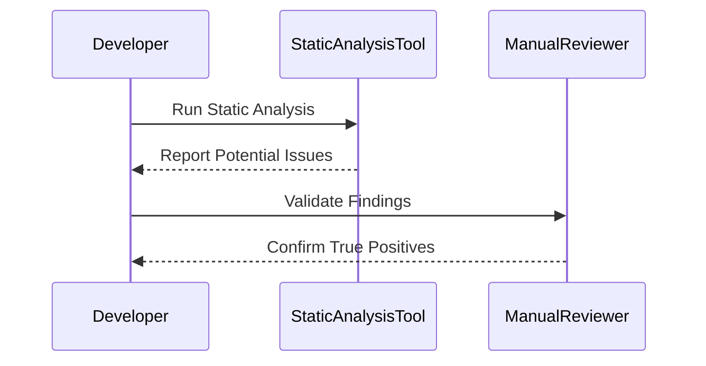
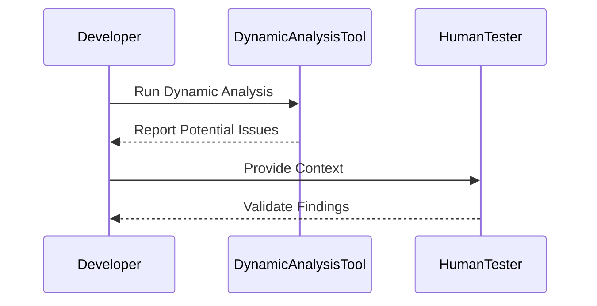

## Introduction to Automated Security Testing

Welcome to the module on differentiating the pros and cons of automated security testing. This module aims to provide a comprehensive understanding of automated security testing, its benefits, drawbacks, and when it makes sense to implement it within an organization like GlobalMantics. We will explore the advantages and disadvantages of automated security testing, and conclude with practical guidance on when to use it effectively.

### What is Automated Security Testing?

Automated security testing refers to the process of using software tools to automatically test applications for vulnerabilities and security weaknesses. These tools can range from simple scripts to sophisticated commercial solutions that can perform a wide variety of tests, including static analysis, dynamic analysis, and penetration testing.

#### Static Analysis

Static analysis involves examining the source code or compiled binaries without executing them. This type of analysis can identify potential security issues such as buffer overflows, SQL injection vulnerabilities, and insecure coding practices. Tools like SonarQube, Fortify, and Checkmarx are commonly used for static analysis.

#### Dynamic Analysis

Dynamic analysis involves executing the application and monitoring its behavior to identify security issues. This type of analysis can detect runtime vulnerabilities such as cross-site scripting (XSS), command injection, and improper error handling. Tools like Burp Suite, ZAP (Zed Attack Proxy), and OWASP Dependency-Check are often used for dynamic analysis.

#### Penetration Testing

Penetration testing involves simulating real-world attacks to identify vulnerabilities that could be exploited by attackers. This type of testing can be performed manually or using automated tools. Automated penetration testing tools like Metasploit, Nessus, and OpenVAS can automate the process of identifying and exploiting vulnerabilities.

### Advantages of Automated Security Testing

#### Time Efficiency

One of the primary advantages of automated security testing is its ability to save time. Manual security testing can be a labor-intensive process, requiring significant human resources and expertise. Automated tools can perform tests much faster, allowing organizations to test their applications more frequently and at various stages of the development lifecycle.

**Example**: Consider a large-scale web application with thousands of lines of code. Manually reviewing and testing each line would be extremely time-consuming. Automated tools can scan the entire codebase in a matter of hours, significantly reducing the time required for security testing.

#### Consistency and Reproducibility

Automated security testing provides consistent and reproducible results. Unlike manual testing, which can vary based on the tester's experience and attention to detail, automated tools follow predefined rules and criteria. This consistency ensures that the same tests are performed in the same way every time, leading to more reliable results.

**Example**: A company uses a static analysis tool to scan its codebase for vulnerabilities. The tool consistently identifies the same set of issues, allowing the development team to prioritize and address these issues systematically.

#### Scalability

Automated security testing is highly scalable. As the size and complexity of applications grow, the number of potential vulnerabilities also increases. Automated tools can handle large volumes of data and perform complex analyses that would be impractical for humans to manage.

**Example**: A financial institution with a large portfolio of applications uses automated security testing to ensure that all applications meet the same security standards. The scalability of automated tools allows the institution to test all its applications efficiently.

#### Early Detection of Vulnerabilities

Automated security testing can detect vulnerabilities early in the development lifecycle. By integrating security testing into the continuous integration/continuous deployment (CI/CD) pipeline, organizations can identify and fix security issues before they become critical.

**Example**: A software development team integrates automated security testing into their CI/CD pipeline. Each time new code is committed, the automated tool scans the code for vulnerabilities. This early detection allows the team to address security issues promptly, reducing the risk of vulnerabilities making it to production.

### Disadvantages of Automated Security Testing

#### False Positives and Negatives

One of the main drawbacks of automated security testing is the potential for false positives and negatives. False positives occur when the tool incorrectly identifies a piece of code as vulnerable, while false negatives occur when the tool fails to identify a real vulnerability. Both scenarios can lead to wasted time and resources.

**Example**: An automated tool flags a piece of code as potentially vulnerable to SQL injection. Upon further investigation, the development team discovers that the code is actually secure, leading to a false positive. Conversely, the tool might miss a real vulnerability due to its limitations, resulting in a false negative.

**How to Prevent / Defend**

To mitigate the risk of false positives and negatives, it is essential to use a combination of automated and manual testing. Automated tools should be used to identify potential issues, but these findings should be validated through manual review. Additionally, using multiple tools can help reduce the likelihood of missing vulnerabilities.

#### Limited Contextual Understanding

Automated security testing tools lack the contextual understanding that human testers possess. They may not be able to interpret the broader context of the application and its environment, leading to incomplete or inaccurate assessments.

**Example**: An automated tool identifies a function as potentially vulnerable to a buffer overflow attack. However, the tool does not consider the fact that the function is only called in a specific, controlled environment where the input is always sanitized. This lack of contextual understanding can result in misleading findings.

**How to Prevent / Defend**

To address this limitation, it is crucial to involve human testers who can provide the necessary context and validate the findings of automated tools. Combining automated and manual testing can help ensure a more accurate assessment of the application's security posture.

#### Dependence on Tool Quality

The effectiveness of automated security testing depends heavily on the quality and capabilities of the tools being used. Poorly designed or outdated tools may fail to identify critical vulnerabilities, leaving the application exposed to risks.

**Example**: A company relies on an outdated static analysis tool that does not support the latest programming languages and frameworks. As a result, the tool fails to identify vulnerabilities in modern codebases, leaving the application vulnerable to attacks.

**How to Prevent / Defend**

To ensure the effectiveness of automated security testing, it is important to use high-quality tools that are regularly updated to support the latest technologies and standards. Regularly evaluating and updating the toolset can help maintain the integrity of the security testing process.

### When to Use Automated Security Testing

#### Continuous Integration/Continuous Deployment (CI/CD) Pipelines

Automated security testing is particularly effective when integrated into CI/CD pipelines. By automating security testing as part of the build process, organizations can ensure that security issues are identified and addressed early in the development cycle.

**Example**: A software development team integrates automated security testing into their CI/CD pipeline. Each time new code is committed, the automated tool scans the code for vulnerabilities. This early detection allows the team to address security issues promptly, reducing the risk of vulnerabilities making it to production.

#### Large-Scale Applications

For large-scale applications with extensive codebases, automated security testing can provide the necessary scale and efficiency to manage the volume of code and potential vulnerabilities.

**Example**: A financial institution with a large portfolio of applications uses automated security testing to ensure that all applications meet the same security standards. The scalability of automated tools allows the institution to test all its applications efficiently.

#### Compliance Requirements

Organizations subject to regulatory compliance requirements, such as PCI DSS, HIPAA, or GDPR, can benefit from automated security testing to ensure that their applications meet the necessary security standards.

**Example**: A healthcare provider uses automated security testing to ensure that its applications comply with HIPAA regulations. The automated tool helps identify and address vulnerabilities that could compromise patient data, ensuring compliance with regulatory requirements.

### Conclusion

Automated security testing offers numerous advantages, including time efficiency, consistency, scalability, and early detection of vulnerabilities. However, it also comes with drawbacks such as false positives and negatives, limited contextual understanding, and dependence on tool quality. To maximize the benefits of automated security testing, it is essential to integrate it into CI/CD pipelines, use high-quality tools, and combine it with manual testing to ensure comprehensive coverage.

### Practical Labs

To gain hands-on experience with automated security testing, consider the following labs:

- **PortSwigger Web Security Academy**: Offers a comprehensive set of labs covering various aspects of web application security, including automated testing.
- **OWASP Juice Shop**: A deliberately insecure web application that can be used to practice automated security testing techniques.
- **DVWA (Damn Vulnerable Web Application)**: Another intentionally vulnerable web application that can be used to learn and practice automated security testing.
- **WebGoat**: A deliberately insecure Java web application that teaches web application security lessons.

These labs provide real-world scenarios and environments to practice and apply the concepts learned in this module.

### Summary

In conclusion, automated security testing is a powerful tool that can significantly enhance the security of applications. By understanding its advantages and drawbacks, organizations can make informed decisions about when and how to implement automated security testing effectively. Integrating it into CI/CD pipelines, using high-quality tools, and combining it with manual testing can help ensure comprehensive and effective security testing.

---

This expanded section covers the introduction to automated security testing, its advantages and disadvantages, and when to use it effectively. The next sections will delve deeper into specific types of automated security testing, recent real-world examples, complete code examples, mermaid diagrams, and practical labs to provide a comprehensive understanding of the topic.

---
<!-- nav -->
[[DevSecOps/DevSecOps Bootcamp/05-Application Security Testing/05-Differentiating the Pros and Cons of Automated Security Testing/01-Introduction/00-Overview|Overview]] | [[DevSecOps/DevSecOps Bootcamp/05-Application Security Testing/05-Differentiating the Pros and Cons of Automated Security Testing/01-Introduction/02-Practice Questions & Answers|Practice Questions & Answers]]
