## Introduction to Automated Security Testing

Automated security testing is a critical component of modern DevSecOps practices. It involves using tools and processes to automatically identify vulnerabilities and security issues within software applications. This approach helps organizations to maintain a high level of security throughout the software development lifecycle (SDLC).

### What is Automated Security Testing?

Automated security testing refers to the use of software tools to perform security assessments on applications. These tools can range from simple static analysis tools to more complex dynamic analysis tools that simulate attacks on running applications. The goal is to automate the process of finding security flaws, which can then be addressed by developers.

#### Why is Automated Security Testing Important?

Security is a critical aspect of any software application. Automated security testing helps ensure that applications are secure by identifying vulnerabilities early in the development process. This is particularly important because fixing security issues later in the development cycle can be much more costly and time-consuming.

#### How Does Automated Security Testing Work?

Automated security testing typically involves several steps:

1. **Tool Selection**: Choose appropriate tools based on the type of application and the specific security concerns.
2. **Configuration**: Set up the tools to work with the application being tested.
3. **Execution**: Run the tests to identify potential security issues.
4. **Analysis**: Review the results and determine which issues need to be addressed.
5. **Remediation**: Fix the identified issues and retest to ensure they have been resolved.

### Trade-offs in Implementing Automated Security Testing

Implementing automated security testing is not a one-size-fits-all solution. Each organization and project may require different approaches depending on their specific needs and constraints. Here are some key factors to consider:

#### Cost-Benefit Analysis

One of the most important considerations is the cost-benefit analysis. Implementing automated security testing requires investment in tools, training, and ongoing maintenance. Organizations must weigh these costs against the benefits of improved security and reduced risk.

#### Organizational Fit

Automated security testing should align with an organization’s existing workflows and processes. For example, integrating security testing into a continuous integration/continuous deployment (CI/CD) pipeline can provide significant benefits but requires careful planning and execution.

#### Compliance Requirements

In many industries, compliance with certain security standards is mandatory. Automated security testing can help organizations meet these requirements by ensuring that applications are regularly checked for known vulnerabilities.

### Real-World Examples

To illustrate the importance of automated security testing, let's look at some recent real-world examples:

#### Example 1: Equifax Data Breach (CVE-2017-5638)

The Equifax data breach in 2017 exposed sensitive information of millions of customers. The breach was caused by a vulnerability in the Apache Struts framework, which could have been detected and mitigated through automated security testing.

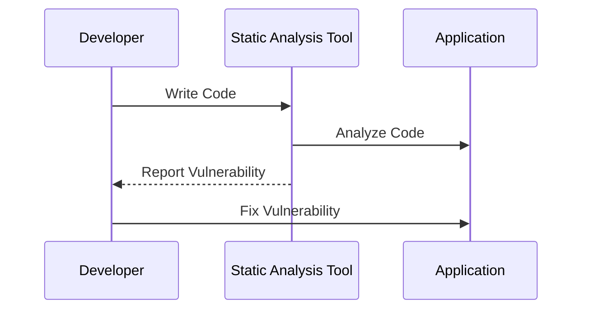

#### Example 2: Capital One Data Breach (CVE-2019-11510)

The Capital One data breach in 2019 exposed personal information of over 100 million customers. The breach was caused by a misconfiguration in the web application firewall, which could have been detected through automated security testing.

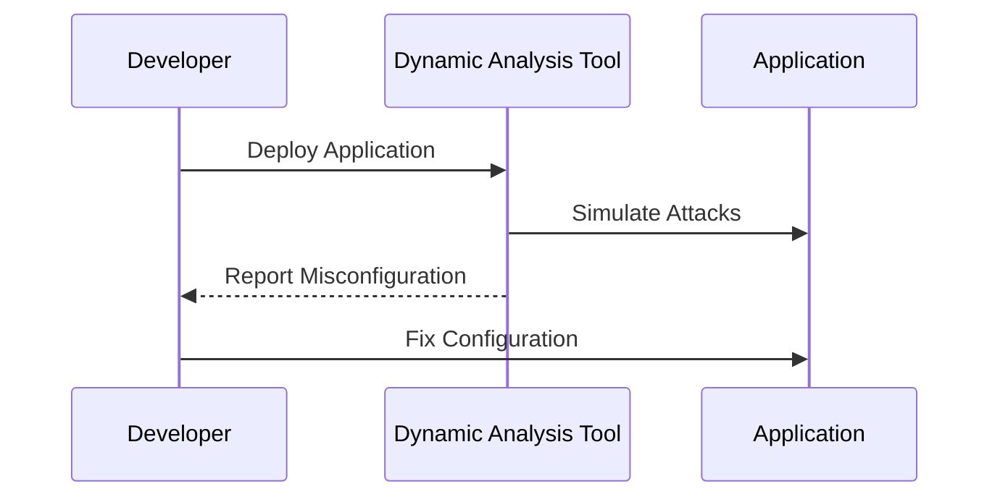

### Detailed Steps for Implementing Automated Security Testing

Let's dive deeper into the steps involved in implementing automated security testing:

#### Step 1: Tool Selection

Choosing the right tools is crucial. Common types of tools include:

- **Static Analysis Tools**: These tools analyze the source code without executing it. They can detect issues such as SQL injection, cross-site scripting (XSS), and buffer overflows.
  
  ```mermaid
graph TD
      A[Source Code] --> B[Static Analysis Tool]
      B --> C[Vulnerability Reports]
```

- **Dynamic Analysis Tools**: These tools analyze the application while it is running. They can simulate attacks and detect issues such as authentication bypass and insecure direct object references.
  
  ```mermaid
graph TD
      A[Running Application] --> B[Dynamic Analysis Tool]
      B --> C[Vulnerability Reports]
```

- **Interactive Analysis Tools**: These tools combine elements of both static and dynamic analysis. They can provide more comprehensive coverage by analyzing the application in different states.

#### Step 2: Configuration

Once the tools are selected, they need to be configured to work with the application. This involves setting up rules, defining scan scopes, and configuring integration with the CI/CD pipeline.

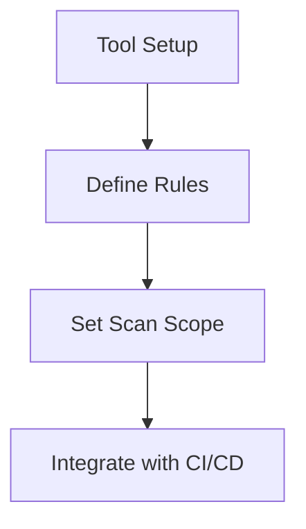

#### Step 3: Execution

The tools are then executed to perform the security tests. This can be done manually or as part of an automated process.

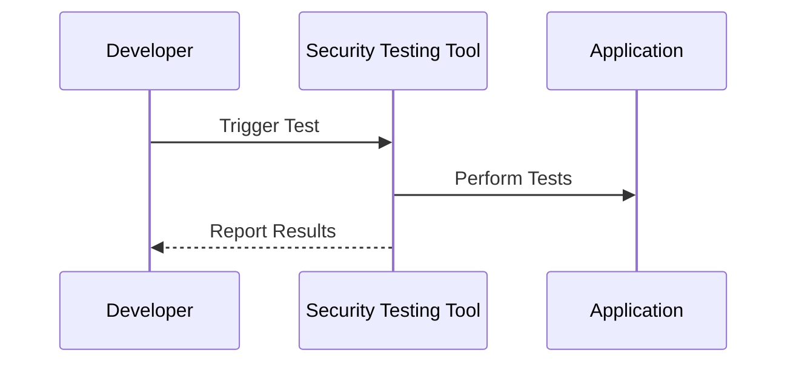

#### Step 4: Analysis

The results of the tests need to be analyzed to determine which issues are genuine and which need to be addressed.

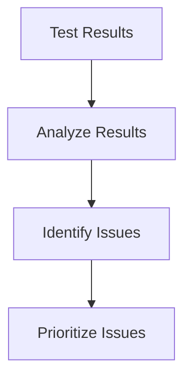

#### Step 5: Remediation

Finally, the identified issues need to be fixed. This involves modifying the code, retesting, and verifying that the issues have been resolved.

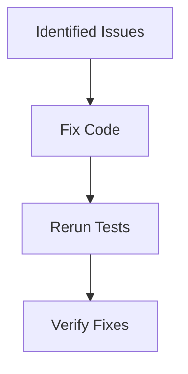

### Pitfalls and Common Mistakes

While automated security testing can provide significant benefits, there are also several pitfalls and common mistakes to avoid:

#### Over-reliance on Automated Tools

Automated tools are powerful, but they are not infallible. Relying solely on automated tools can lead to false positives and false negatives. Manual review and testing are still necessary to ensure comprehensive coverage.

#### Lack of Integration with CI/CD

Integrating automated security testing into the CI/CD pipeline is crucial for maintaining security throughout the development process. Failure to do so can result in security issues being discovered too late.

#### Inadequate Training and Resources

Effective implementation of automated security testing requires trained personnel and adequate resources. Without proper training and resources, the benefits of automated security testing may not be realized.

### How to Prevent / Defend Against Pitfalls

To prevent and defend against the pitfalls of automated security testing, organizations should take the following steps:

#### Comprehensive Training

Ensure that developers and security teams are properly trained in the use of automated security testing tools. This includes understanding the capabilities and limitations of the tools.

#### Regular Audits and Reviews

Regularly audit and review the results of automated security testing to ensure that genuine issues are being identified and addressed. This can involve manual review and testing to validate the results.

#### Continuous Improvement

Continuously improve the automated security testing process by incorporating feedback and lessons learned from previous tests. This can involve updating tools, refining rules, and adjusting scan scopes.

### Secure Coding Practices

Secure coding practices are essential for preventing security issues in the first place. Here are some key secure coding practices:

#### Input Validation

Always validate input to ensure that it meets expected criteria. This can help prevent issues such as SQL injection and XSS.

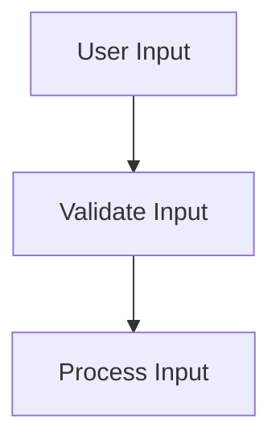

#### Error Handling

Proper error handling can help prevent information leakage and other security issues. This involves catching and handling errors gracefully without exposing sensitive information.

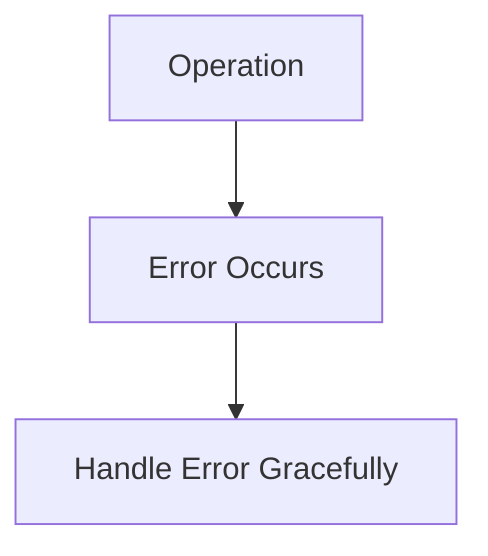

#### Authentication and Authorization

Implement strong authentication and authorization mechanisms to ensure that only authorized users can access sensitive resources.

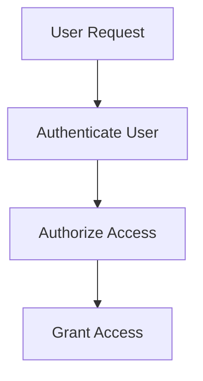

### Detection and Prevention Strategies

To effectively detect and prevent security issues, organizations should employ a combination of automated and manual strategies:

#### Automated Detection

Use automated tools to detect security issues early in the development process. This can help identify and address issues before they become major problems.

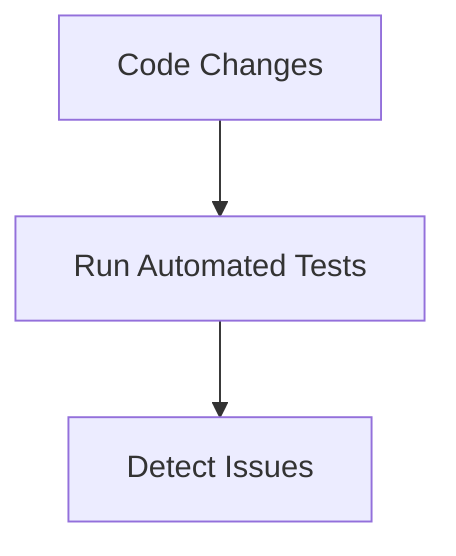

#### Manual Review

Perform regular manual reviews and testing to validate the results of automated tests. This can help catch issues that automated tools may miss.

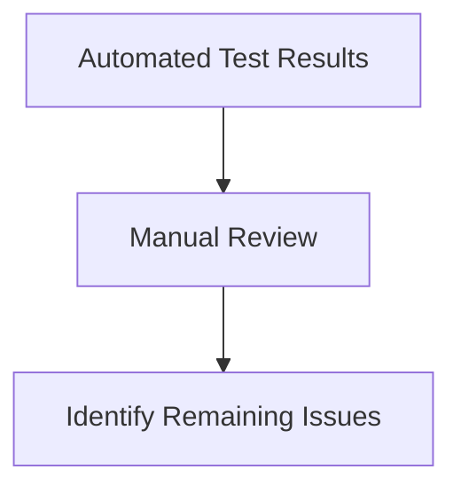

#### Continuous Monitoring

Implement continuous monitoring to detect and respond to security issues in real-time. This can involve using tools to monitor network traffic, system logs, and other sources of information.

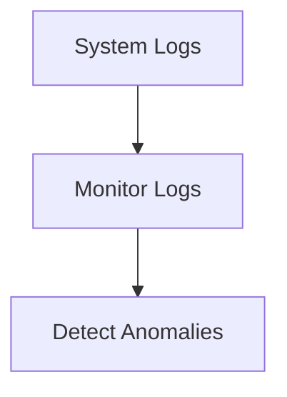

### Conclusion

Automated security testing is a critical component of modern DevSecOps practices. By understanding the pros and cons of automated security testing, organizations can make informed decisions about how to implement it effectively. Through careful planning, tool selection, configuration, execution, analysis, and remediation, organizations can significantly improve the security of their applications.

### Practice Labs

For hands-on experience with automated security testing, consider the following practice labs:

- **PortSwigger Web Security Academy**: Offers a variety of labs focused on web application security, including automated security testing.
- **OWASP Juice Shop**: A deliberately insecure web application that can be used to practice various security testing techniques.
- **DVWA (Damn Vulnerable Web Application)**: Another intentionally vulnerable web application that can be used to practice security testing.

By engaging with these labs, you can gain practical experience with automated security testing and improve your skills in this area.

---
<!-- nav -->
[[DevSecOps/DevSecOps Bootcamp/05-Application Security Testing/05-Differentiating the Pros and Cons of Automated Security Testing/03-Summary/00-Overview|Overview]] | [[DevSecOps/DevSecOps Bootcamp/05-Application Security Testing/05-Differentiating the Pros and Cons of Automated Security Testing/03-Summary/02-Practice Questions & Answers|Practice Questions & Answers]]
