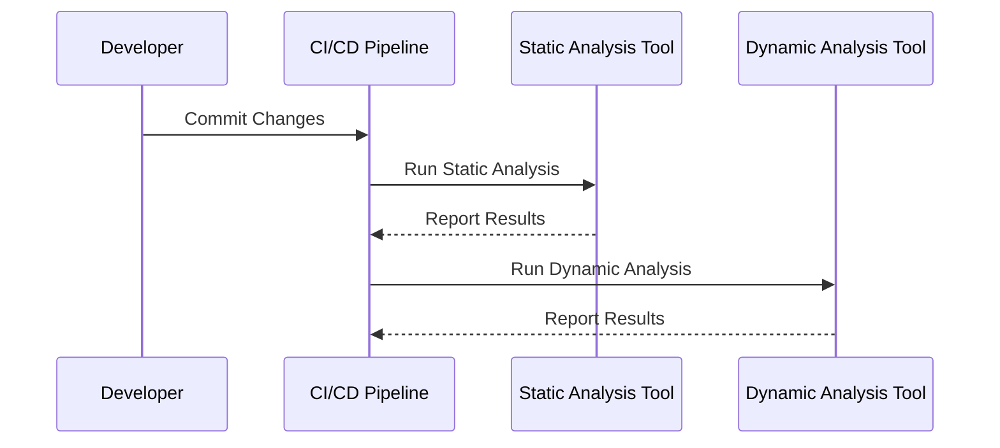
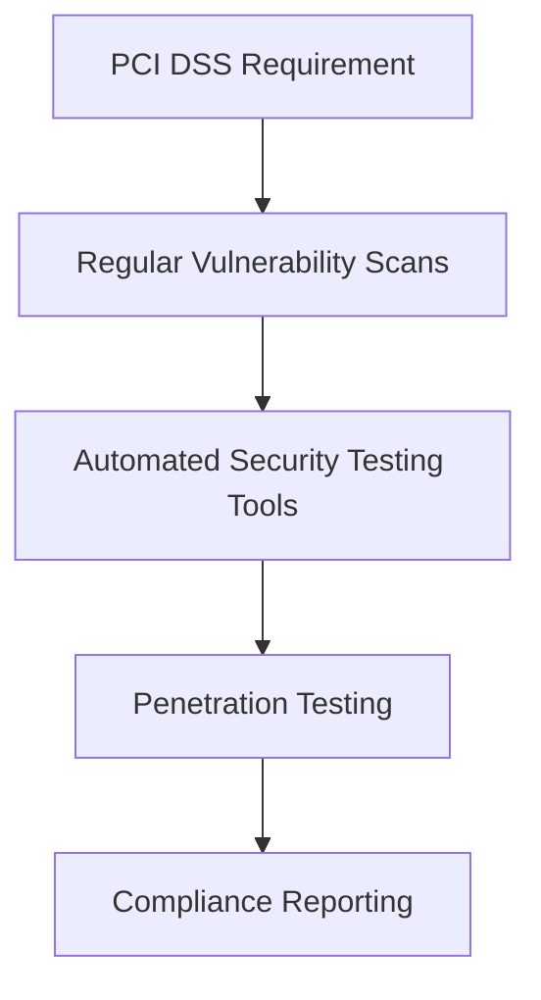
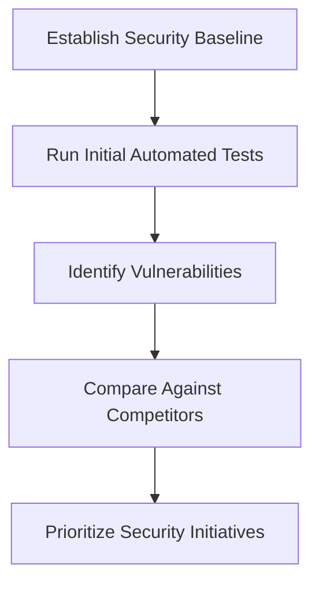
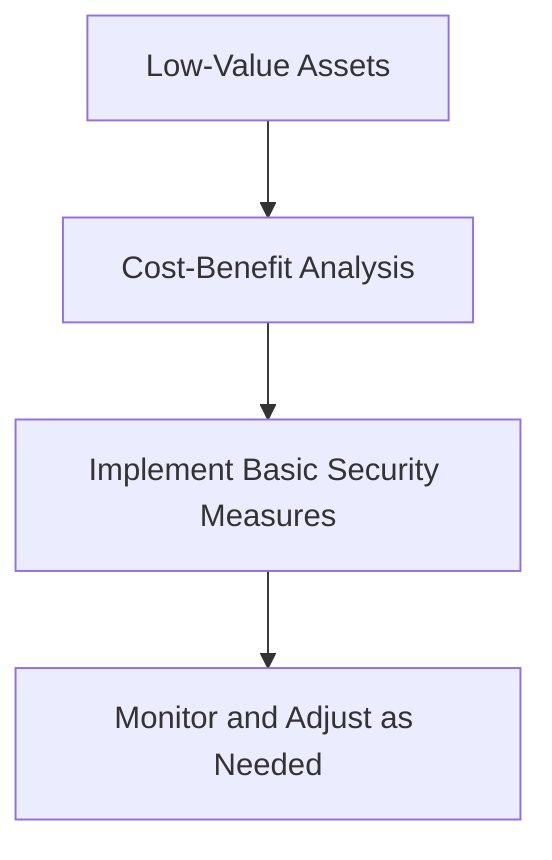
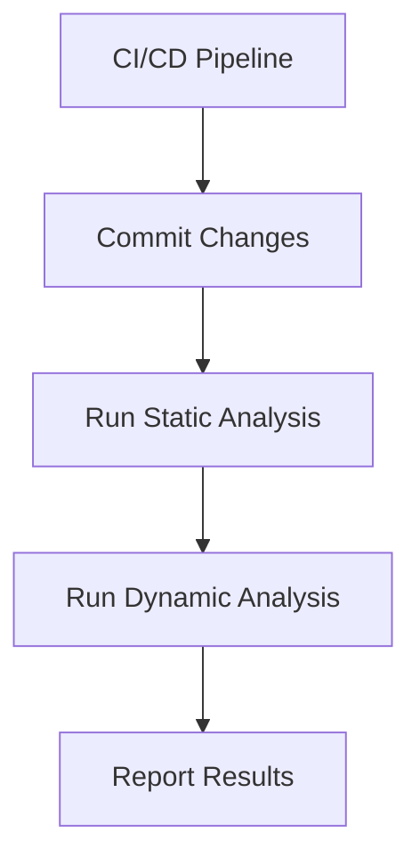
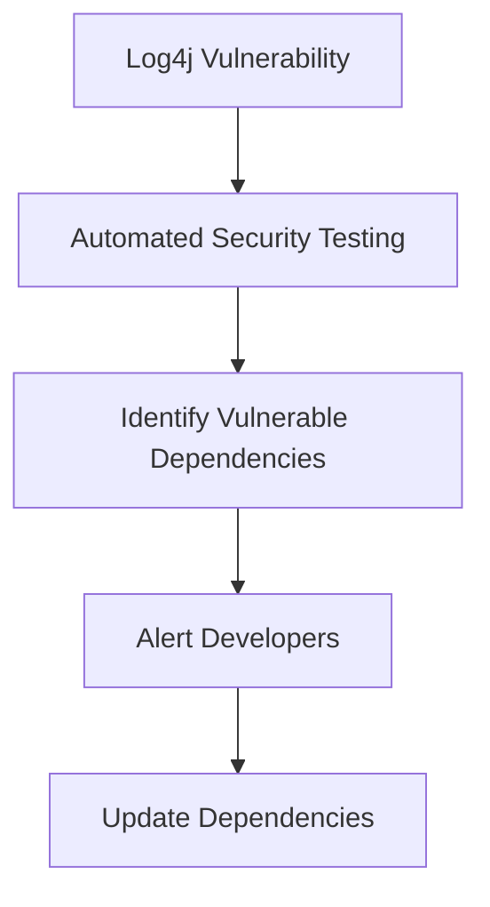

## Introduction to Automated Security Testing

Automated security testing is a critical component of modern DevSecOps practices. It involves using tools and scripts to automatically scan and test software for security vulnerabilities. This approach can significantly enhance the security posture of an organization by identifying and mitigating risks early in the development lifecycle. However, like any technology, automated security testing comes with its own set of pros and cons. Understanding these aspects is crucial for making informed decisions about its implementation.

### What is Automated Security Testing?

Automated security testing refers to the use of software tools to perform security assessments on applications, systems, or networks. These tools can range from simple static analysis tools that check code for potential vulnerabilities to more complex dynamic analysis tools that simulate attacks to identify weaknesses in runtime environments.

#### Why Use Automated Security Testing?

The primary reasons for implementing automated security testing include:

1. **Time Efficiency**: Automated tools can quickly scan large codebases and identify potential issues, saving significant time compared to manual testing.
2. **Consistency**: Automated tests can be run repeatedly with consistent results, ensuring that security standards are maintained across different versions and releases.
3. **Compliance**: Many regulatory standards, such as PCI DSS, require regular security testing. Automated tools help ensure compliance by providing a systematic approach to testing.
4. **Security Baseline**: Automated testing can provide a baseline of the current security posture, allowing organizations to measure improvements over time.

### Incremental Security Testing

One of the key advantages of automated security testing is its ability to perform incremental testing. This means that only the new or modified parts of the codebase are tested for security vulnerabilities, rather than retesting the entire application. This approach is particularly beneficial in iterative development processes where small changes are made frequently.

#### Example: Iterative Development Process

Consider a scenario where a developer makes a small change to a web application. Instead of running a full security scan on the entire application, the CI/CD pipeline can be configured to run incremental security tests on the modified code. This ensures that the new changes are thoroughly checked for vulnerabilities without wasting time on unchanged parts of the codebase.

### Compliance with Standards

Another significant advantage of automated security testing is its role in compliance with various regulatory standards. For instance, the Payment Card Industry Data Security Standard (PCI DSS) mandates regular security testing to ensure that payment card data is protected. Automated tools can help organizations meet these requirements by providing a systematic and repeatable approach to security testing.

#### Example: PCI DSS Compliance

PCI DSS requires organizations to perform regular vulnerability scans and penetration testing. Automated security testing tools can be used to automate these processes, ensuring that the necessary tests are performed regularly and consistently. This not only helps in meeting compliance requirements but also enhances the overall security posture of the organization.

### Establishing a Security Baseline

Automated security testing can also be used to establish a security baseline for an organization. By running initial security tests on existing codebases, organizations can get a snapshot of their current security posture. This baseline can then be used to measure improvements over time and compare against industry benchmarks.

#### Example: Security Baseline Comparison

Suppose an organization wants to understand how its security posture compares to its competitors. By establishing a security baseline through automated testing, the organization can identify areas of strength and weakness. This information can then be used to prioritize security initiatives and improve overall security.

### When is Automated Security Testing Not Useful?

While automated security testing offers numerous benefits, there are scenarios where it may not be the most effective solution. One of the key considerations is the investment versus reward trade-off. If the assets being protected are not valuable enough to justify the cost of implementing automated security testing, it may not be a worthwhile investment.

#### Example: Low-Value Assets

Consider a small startup with limited resources. If the startup is developing a low-value application that does not handle sensitive data, the cost of implementing automated security testing may outweigh the benefits. In such cases, simpler security measures may suffice.

### How to Prevent / Defend

To effectively implement automated security testing, organizations need to consider several factors, including tool selection, integration with the CI/CD pipeline, and ongoing maintenance.

#### Tool Selection

Choosing the right automated security testing tools is crucial. Organizations should evaluate tools based on their specific needs, such as the type of applications being developed, the level of security required, and the complexity of the codebase.

#### Integration with CI/CD Pipeline

Integrating automated security testing into the CI/CD pipeline ensures that security checks are performed consistently throughout the development lifecycle. This can be achieved by configuring the CI/CD pipeline to run security tests automatically whenever changes are committed.

#### Ongoing Maintenance

Maintaining automated security testing tools is essential to ensure their effectiveness. This includes keeping the tools up-to-date with the latest security patches and configurations, as well as regularly reviewing and refining the security policies and procedures.

### Real-World Examples

Recent real-world examples highlight the importance of automated security testing in preventing vulnerabilities. For instance, the Log4j vulnerability (CVE-2021-44228) affected millions of applications worldwide. Automated security testing could have helped organizations identify and mitigate this vulnerability earlier.

#### Example: Log4j Vulnerability

The Log4j vulnerability was a critical remote code execution flaw that allowed attackers to execute arbitrary code on affected systems. Automated security testing tools could have identified this vulnerability by scanning for the presence of the vulnerable Log4j library and alerting developers to update their dependencies.

### Conclusion

Automated security testing is a powerful tool in the DevSecOps arsenal. It offers numerous benefits, including time efficiency, consistency, compliance, and the establishment of a security baseline. However, it is important to consider the investment versus reward trade-off and ensure that the tools are properly integrated and maintained. By leveraging automated security testing effectively, organizations can significantly enhance their security posture and protect their assets from potential threats.

### Practice Labs

For hands-on experience with automated security testing, consider the following practice labs:

- **PortSwigger Web Security Academy**: Offers a comprehensive set of labs covering various aspects of web security, including automated security testing.
- **OWASP Juice Shop**: A deliberately insecure web application designed for security training purposes. It includes features for automated security testing.
- **DVWA (Damn Vulnerable Web Application)**: A PHP/MySQL web application that is riddled with vulnerabilities. It provides a platform for learning and practicing automated security testing techniques.

By engaging with these labs, you can gain practical experience in implementing and maintaining automated security testing in a real-world context.

---
<!-- nav -->
[[DevSecOps/DevSecOps Bootcamp/05-Application Security Testing/05-Differentiating the Pros and Cons of Automated Security Testing/The Pros and Cons of Automated Security Testing/00-Overview|Overview]] | [[02-Introduction to Automated Security Testing Part 2|Introduction to Automated Security Testing Part 2]]
