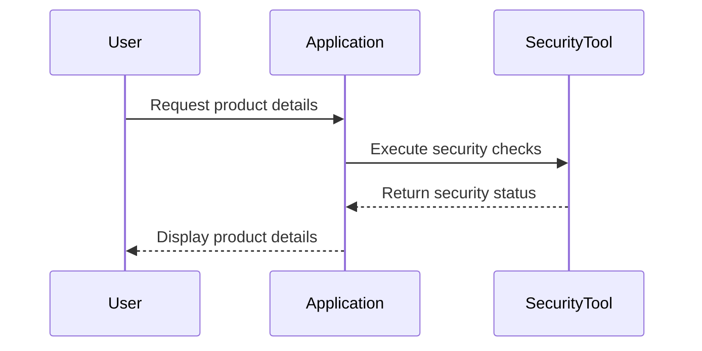
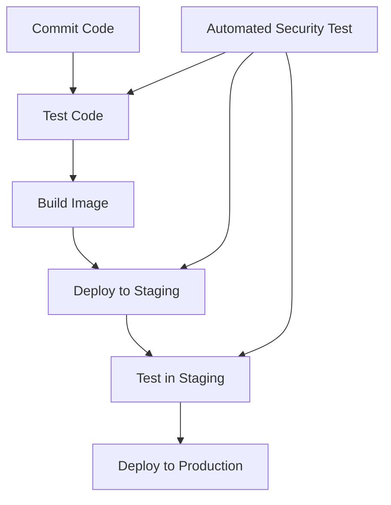
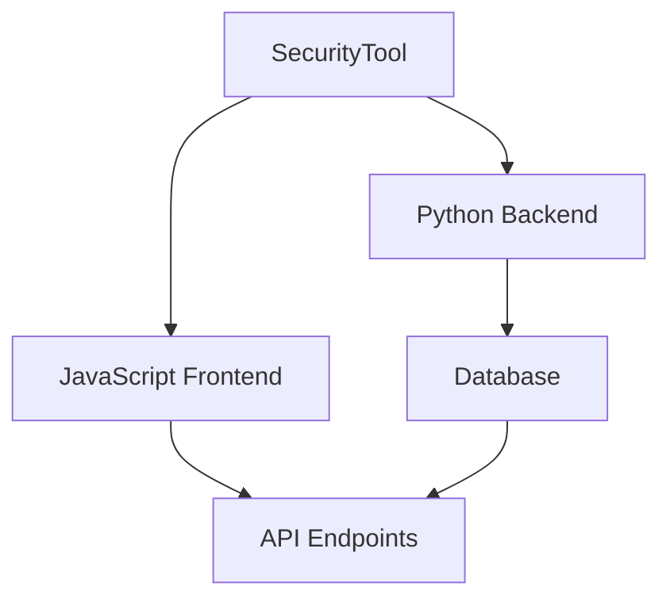
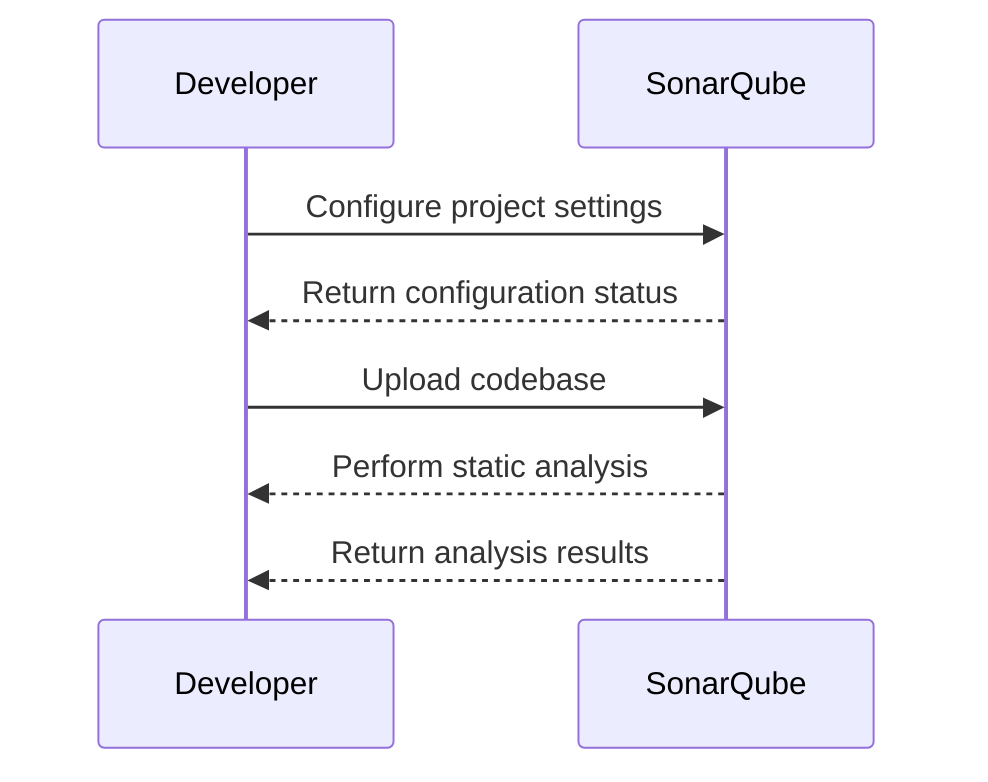
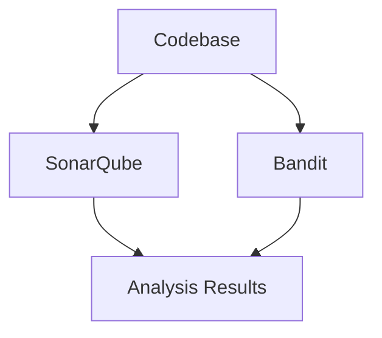
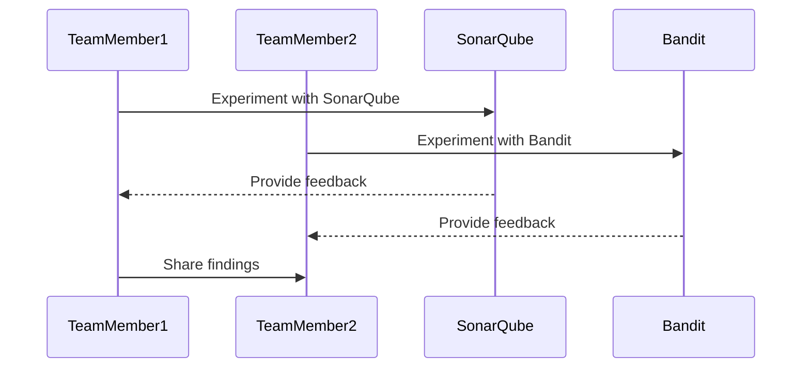
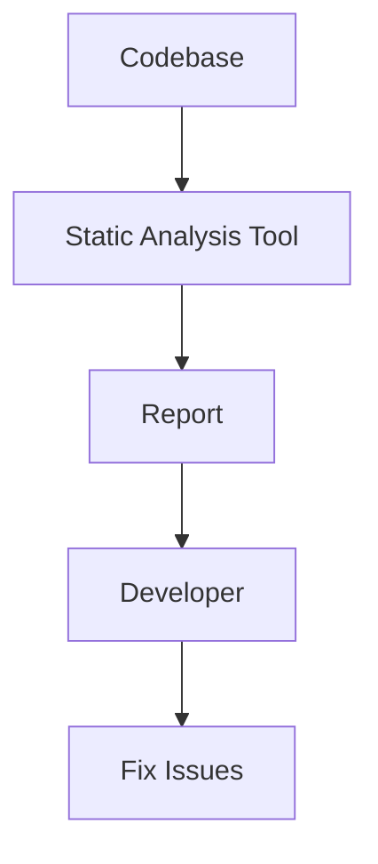
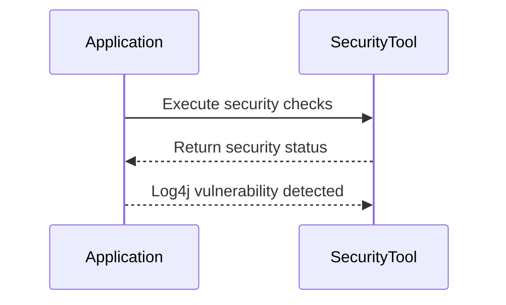
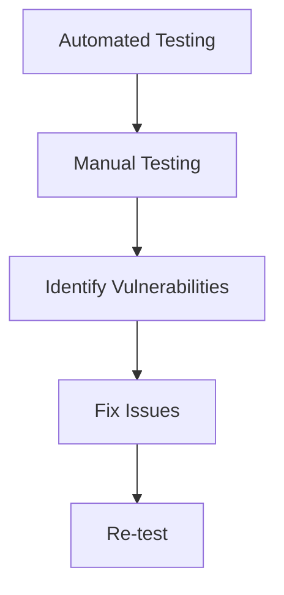

## Introduction to Automated Security Testing

Automated security testing is a critical component of modern DevSecOps practices. It involves using software tools to automatically scan applications and infrastructure for vulnerabilities and security weaknesses. This approach aims to streamline the security testing process, making it faster and more efficient compared to manual testing. However, the effectiveness of automated security testing depends heavily on the complexity of the application being tested and the environment in which it operates.

### Complexity of Business Rules

One of the primary challenges in implementing automated security testing is dealing with complex business rules within an application. Complex business logic often requires intricate configurations and custom rules to ensure comprehensive coverage during testing. This complexity can lead to significant overhead in setting up and maintaining automated tests.

#### Example: Complex Business Logic

Consider an e-commerce platform that implements a sophisticated pricing model based on user behavior, inventory levels, and external market conditions. Automating security tests for such a system would require extensive customization to cover all possible scenarios. Here’s a simplified example of how this might look:



In this scenario, the `SecurityTool` must be configured to understand the complex pricing logic and perform appropriate security checks. This setup can be highly resource-intensive and may not be feasible for all organizations.

### Rapidly Changing Environments

Another challenge arises when the testing environment changes rapidly. In dynamic environments, such as those using continuous integration and delivery (CI/CD) pipelines, the application and its dependencies can change frequently. Keeping automated security tools up-to-date with these changes can be challenging and time-consuming.

#### Example: CI/CD Pipeline

A typical CI/CD pipeline might involve frequent updates to the codebase, dependencies, and infrastructure. Here’s a simplified example of a CI/CD pipeline:



In this setup, automated security tests must be integrated at multiple stages to ensure comprehensive coverage. However, keeping these tests updated with the latest changes can be a significant challenge.

### Mixed Frameworks and Languages

Applications that use a mix of frameworks and languages pose another challenge for automated security testing. Most security tools are designed to work optimally with a specific framework or language. When an application uses multiple frameworks or languages, finding a single tool that can handle all aspects effectively becomes difficult.

#### Example: Polyglot Applications

Consider an application that uses both Python and JavaScript, with backend services written in Django and frontend components in React. Here’s a simplified example of such an application architecture:



In this scenario, the `SecurityTool` must be capable of handling both Python and JavaScript components. However, most security tools are specialized for one language or framework, leading to potential gaps in coverage.

### Configuring and Testing Tools

The time required to configure and test automated security tools can be substantial. This overhead includes setting up the tools, integrating them into the development workflow, and ensuring they provide accurate results. If the time spent on configuration and testing outweighs the benefits gained, it may be more practical to rely on manual testing.

#### Example: Configuration Overhead

Consider the process of setting up a static analysis tool like SonarQube for a large codebase. Here’s a simplified example of the configuration process:



In this scenario, the developer must spend considerable time configuring SonarQube and uploading the codebase. The time required for this setup can be significant, especially for large and complex projects.

### Choosing the Right Tools

Not all security tools are created equal. Using a single tool for all types of security testing can result in incomplete coverage. To achieve better test coverage, it is advisable to use multiple tools for the same type of test. This approach helps identify vulnerabilities that might be missed by a single tool.

#### Example: Multiple Tools

Consider using both SonarQube and Bandit for static code analysis. Here’s a simplified example of how this might look:



In this scenario, both SonarQube and Bandit analyze the codebase, providing a more comprehensive view of potential vulnerabilities.

### Team Experimentation

Allowing the team to experiment with different security tools can help identify the most effective solutions for their specific needs. This approach ensures that the tools are chosen based on their suitability rather than being imposed from above.

#### Example: Team Experimentation

Consider a team experimenting with different static analysis tools. Here’s a simplified example of the experimentation process:



In this scenario, team members experiment with different tools and share their findings, helping the team choose the most suitable tools for their needs.

### Reporting Format

The format in which security testing reports are delivered can significantly impact their usability. Reports should be clear, concise, and actionable, providing developers with the information they need to address identified issues.

#### Example: Reporting Format

Consider a security report generated by a static analysis tool. Here’s a simplified example of a report:



In this scenario, the report generated by the static analysis tool provides detailed information about identified issues, enabling the developer to address them effectively.

### Real-World Examples

Recent real-world examples highlight the importance of considering the pros and cons of automated security testing. For instance, the Log4j vulnerability (CVE-2021-44228) demonstrated the limitations of automated testing in identifying certain types of vulnerabilities. While automated tools can catch many common issues, they may miss more subtle vulnerabilities that require human expertise to identify.

#### Example: Log4j Vulnerability

The Log4j vulnerability affected numerous applications and systems worldwide. Here’s a simplified example of how this vulnerability might be detected:



In this scenario, the `SecurityTool` failed to detect the Log4j vulnerability, highlighting the limitations of automated testing in certain cases.

### How to Prevent / Defend

To effectively defend against the limitations of automated security testing, it is essential to adopt a multi-faceted approach. This includes combining automated testing with manual testing, using multiple tools, and ensuring that the team has the necessary expertise to interpret and act on security reports.

#### Secure Coding Practices

Implementing secure coding practices can help mitigate the risks associated with automated security testing. Here’s an example of a vulnerable code snippet and its secure counterpart:

**Vulnerable Code:**
```python
import os
import subprocess

def execute_command(command):
    subprocess.run(command, shell=True)
```

**Secure Code:**
```python
import subprocess

def execute_command(command):
    subprocess.run(command.split(), check=True)
```

In the secure version, the `shell=True` parameter is removed, and the command is split into a list of arguments, reducing the risk of command injection attacks.

#### Configuration Hardening

Hardening the configuration of automated security tools can help improve their effectiveness. Here’s an example of a hardened configuration for SonarQube:

```yaml
sonar.projectKey=my_project
sonar.projectName=My Project
sonar.sources=src
sonar.exclusions=**/test/**/*
sonar.host.url=http://localhost:9000
sonar.login=your_token
```

In this configuration, the `sonar.exclusions` parameter is used to exclude test files from the analysis, reducing the noise in the report.

#### Detection and Prevention

Detecting and preventing vulnerabilities requires a combination of automated and manual testing. Here’s a simplified example of a detection and prevention strategy:



In this strategy, automated testing is combined with manual testing to identify and fix vulnerabilities, followed by re-testing to ensure the issues have been resolved.

### Conclusion

Automated security testing is a powerful tool in the DevSecOps toolkit, but it is not without its challenges. Understanding the pros and cons of automated security testing is crucial for effectively integrating it into the development process. By considering the complexity of business rules, the rapidity of environment changes, the mix of frameworks and languages, the time required for configuration and testing, the choice of tools, team experimentation, and reporting formats, organizations can make informed decisions about how to leverage automated security testing to enhance their security posture.

### Practice Labs

For hands-on experience with automated security testing, consider the following practice labs:

- **PortSwigger Web Security Academy**: Offers interactive labs for learning web application security.
- **OWASP Juice Shop**: A deliberately insecure web application for practicing security testing.
- **DVWA (Damn Vulnerable Web Application)**: A PHP/MySQL web application that is riddled with vulnerabilities for educational purposes.
- **WebGoat**: An interactive, gamified training application for learning about web application security.

These labs provide practical experience with automated security testing tools and techniques, helping to reinforce the concepts covered in this chapter.

---
<!-- nav -->
[[01-Introduction to Automated Security Testing Part 1|Introduction to Automated Security Testing Part 1]] | [[DevSecOps/DevSecOps Bootcamp/05-Application Security Testing/05-Differentiating the Pros and Cons of Automated Security Testing/The Pros and Cons of Automated Security Testing/00-Overview|Overview]] | [[03-Introduction to Automated Security Testing Part 3|Introduction to Automated Security Testing Part 3]]
