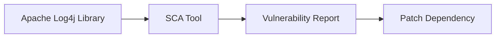
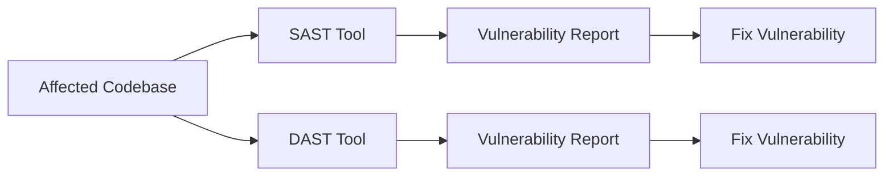
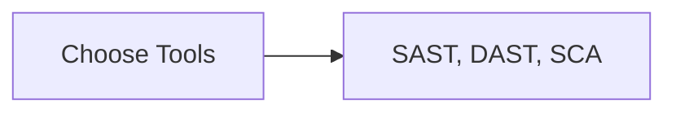
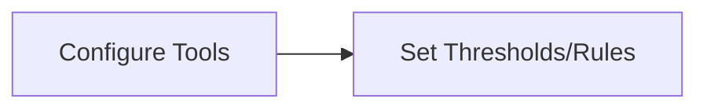
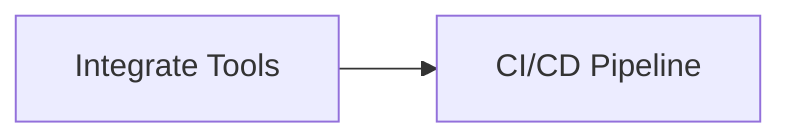
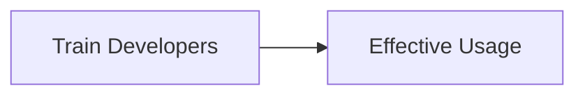
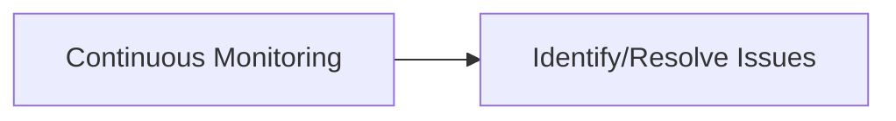

## Introduction to Automated Security Testing

Automated security testing is a critical component of modern DevSecOps practices. It involves using tools and processes to automatically identify vulnerabilities and weaknesses in software applications. This approach aims to enhance the security posture of an application by detecting issues early in the development lifecycle, thereby reducing the risk of security breaches.

### What is Automated Security Testing?

Automated security testing refers to the use of software tools to scan and analyze applications for security vulnerabilities. These tools can range from simple static analysis tools to complex dynamic analysis tools that simulate attacks on the application. The goal is to automate the process of identifying potential security issues, making it faster and more efficient than manual testing.

#### Why Automate Security Testing?

The primary reasons for automating security testing include:

1. **Speed**: Automated tools can quickly scan large codebases and identify potential vulnerabilities, saving significant time compared to manual testing.
2. **Consistency**: Automated tools provide consistent results across different environments and codebases, ensuring that the same standards are applied uniformly.
3. **Coverage**: Automated tools can cover a broader range of vulnerabilities and scenarios than manual testers, reducing the likelihood of missing critical issues.
4. **Integration**: Automated tools can be integrated into the continuous integration/continuous deployment (CI/CD) pipeline, allowing security testing to be performed as part of the regular development process.

### Types of Automated Security Testing Tools

There are several types of automated security testing tools, each designed to address different aspects of security:

1. **Static Application Security Testing (SAST)**: SAST tools analyze the source code of an application to identify potential security vulnerabilities. These tools can detect issues such as SQL injection, cross-site scripting (XSS), and buffer overflows.
   
   ```mermaid
graph LR
       A[Source Code] --> B[SAST Tool]
       B --> C[Vulnerability Report]
```

2. **Dynamic Application Security Testing (DAST)**: DAST tools simulate attacks on a running application to identify vulnerabilities. These tools can detect issues such as authentication bypass, session hijacking, and insecure configurations.
   
   ```mermaid
graph LR
       A[Running Application] --> B[DAST Tool]
       B --> C[Vulnerability Report]
```

3. **Interactive Application Security Testing (IAST)**: IAST tools combine elements of both SAST and DAST. They instrument the application at runtime to provide more accurate and context-aware vulnerability reports.
   
   ```mermaid
graph LR
       A[Instrumented Application] --> B[IAST Tool]
       B --> C[Vulnerability Report]
```

4. **Software Composition Analysis (SCA)**: SCA tools analyze the dependencies and libraries used by an application to identify known vulnerabilities in third-party components.
   
   ```mermaid
graph LR
       A[Dependencies] --> B[SCA Tool]
       B --> C[Vulnerability Report]
```

### Pros of Automated Security Testing

#### Speed and Efficiency

One of the most significant advantages of automated security testing is its speed and efficiency. Automated tools can scan large codebases and identify potential vulnerabilities much faster than manual testers. This allows organizations to perform security testing more frequently and integrate it into their CI/CD pipelines.

#### Consistency and Standardization

Automated tools provide consistent and standardized results across different environments and codebases. This ensures that the same security standards are applied uniformly, reducing the likelihood of human error and inconsistency.

#### Broader Coverage

Automated tools can cover a broader range of vulnerabilities and scenarios than manual testers. This reduces the likelihood of missing critical issues and provides a more comprehensive security assessment.

### Real-World Examples

#### Example 1: CVE-2021-44228 (Log4Shell)

In December 2021, a critical vulnerability was discovered in the Apache Log4j library, known as Log4Shell (CVE-2021-44228). This vulnerability allowed attackers to execute arbitrary code on affected systems, leading to widespread exploitation.

Automated security testing tools, particularly SCA tools, were instrumental in identifying and mitigating this vulnerability. Organizations that had implemented SCA tools were able to quickly identify and patch affected dependencies, reducing the risk of exploitation.



#### Example 2: Equifax Data Breach (2017)

In 2017, Equifax suffered a massive data breach that exposed sensitive information of millions of customers. The breach was caused by a vulnerability in the Apache Struts framework, which was exploited by attackers.

Automated security testing tools could have helped identify and mitigate this vulnerability. SAST and DAST tools could have detected the vulnerability in the codebase and simulated attacks to identify potential exploits.



### Cons of Automated Security Testing

#### False Positives and Negatives

One of the main challenges with automated security testing is the potential for false positives and negatives. False positives occur when the tool incorrectly identifies a piece of code as vulnerable, while false negatives occur when the tool fails to identify a real vulnerability.

False positives can lead to wasted time and resources as developers investigate and resolve non-existent issues. False negatives can result in real vulnerabilities being missed, leaving the application exposed to potential attacks.

#### Limited Context Awareness

Automated tools often lack the context awareness of human testers. They may miss vulnerabilities that require a deeper understanding of the application's business logic and functionality. This can lead to incomplete or inaccurate vulnerability reports.

#### Integration Challenges

Integrating automated security testing tools into existing development processes can be challenging. Organizations need to ensure that the tools are compatible with their existing infrastructure and workflows. Additionally, they need to train developers on how to use the tools effectively and interpret the results.

### How to Prevent / Defend Against Issues

#### Detecting and Mitigating False Positives and Negatives

To reduce the number of false positives and negatives, organizations should:

1. **Configure the Tools Properly**: Ensure that the tools are configured correctly to minimize false positives and negatives. This includes setting appropriate thresholds and rules for identifying vulnerabilities.
   
   ```mermaid
graph LR
       A[Tool Configuration] --> B[Reduce False Positives/Negatives]
```

2. **Use Multiple Tools**: Use a combination of different tools to cross-validate the results. This can help identify and mitigate false positives and negatives.
   
   ```mermaid
graph LR
       A[Multiple Tools] --> B[Cross-Validation]
       B --> C[Reduce False Positives/Negatives]
```

3. **Train Developers**: Train developers on how to interpret the results of automated security testing tools. This can help them identify and resolve false positives and negatives more effectively.
   
   ```mermaid
graph LR
       A[Developer Training] --> B[Interpret Results]
       B --> C[Reduce False Positives/Negatives]
```

#### Enhancing Context Awareness

To improve the context awareness of automated security testing tools, organizations should:

1. **Provide Additional Context**: Provide additional context to the tools, such as the application's business logic and functionality. This can help the tools identify vulnerabilities more accurately.
   
   ```mermaid
graph LR
       A[Additional Context] --> B[Improve Context Awareness]
```

2. **Use AI and Machine Learning**: Leverage AI and machine learning techniques to enhance the context awareness of the tools. This can help the tools identify vulnerabilities more accurately and reduce false positives and negatives.
   
   ```mermaid
graph LR
       A[AI/Machine Learning] --> B[Enhance Context Awareness]
```

#### Integrating Automated Security Testing Tools

To integrate automated security testing tools into existing development processes, organizations should:

1. **Choose Compatible Tools**: Choose tools that are compatible with the organization's existing infrastructure and workflows. This can help ensure smooth integration and adoption.
   
   ```mermaid
graph LR
       A[Compatible Tools] --> B[Smooth Integration]
```

2. **Train Developers**: Train developers on how to use the tools effectively and interpret the results. This can help ensure that the tools are used consistently and effectively.
   
   ```mermaid
graph LR
       A[Developer Training] --> B[Effective Usage]
```

3. **Implement Continuous Monitoring**: Implement continuous monitoring to ensure that the tools are functioning correctly and providing accurate results. This can help identify and resolve issues quickly.
   
   ```mermaid
graph LR
       A[Continuous Monitoring] --> B[Identify/Resolve Issues]
```

### Complete Example: Implementing Automated Security Testing

Let's walk through a complete example of implementing automated security testing in a CI/CD pipeline.

#### Step 1: Choose the Right Tools

First, choose the right tools based on the organization's needs and requirements. For example, you might choose a combination of SAST, DAST, and SCA tools.



#### Step 2: Configure the Tools

Next, configure the tools properly to minimize false positives and negatives. This includes setting appropriate thresholds and rules for identifying vulnerabilities.



#### Step 3: Integrate the Tools into the CI/CD Pipeline

Integrate the tools into the CI/CD pipeline to ensure that security testing is performed as part of the regular development process.



#### Step 4: Train Developers

Train developers on how to use the tools effectively and interpret the results. This can help ensure that the tools are used consistently and effectively.



#### Step 5: Implement Continuous Monitoring

Implement continuous monitoring to ensure that the tools are functioning correctly and providing accurate results. This can help identify and resolve issues quickly.



### Vulnerable vs. Secure Code Example

Let's consider a simple example of a vulnerable code snippet and its secure counterpart.

#### Vulnerable Code

```python
def login(username, password):
    if username == "admin" and password == "password":
        return True
    else:
        return False
```

This code snippet is vulnerable to hard-coded credentials. An attacker can easily guess the username and password and gain unauthorized access.

#### Secure Code

```python
import hashlib

def hash_password(password):
    return hashlib.sha256(password.encode()).hexdigest()

def login(username, hashed_password):
    stored_username = "admin"
    stored_hashed_password = "5e884898da28047151d0e56f8dc6292773603d0d6aabbdd62a11ef721d1542d8"  # Hash of "password"
    
    if username == stored_username and hashed_password == stored_hashed_password:
        return True
    else:
        return False
```

In the secure code, the password is hashed using SHA-256 before being stored and compared. This makes it much harder for an attacker to guess the password.

### Conclusion

Automated security testing is a critical component of modern DevSecOps practices. It helps organizations identify and mitigate security vulnerabilities early in the development lifecycle, reducing the risk of security breaches. However, it also comes with challenges such as false positives and negatives, limited context awareness, and integration challenges. By choosing the right tools, configuring them properly, integrating them into the CI/CD pipeline, training developers, and implementing continuous monitoring, organizations can effectively leverage automated security testing to enhance their security posture.

### Hands-On Labs

For hands-on practice with automated security testing, consider the following labs:

- **PortSwigger Web Security Academy**: Offers a variety of labs focused on web application security, including automated security testing.
- **OWASP Juice Shop**: A deliberately insecure web application that can be used to practice various security testing techniques, including automated security testing.
- **DVWA (Damn Vulnerable Web Application)**: Another deliberately insecure web application that can be used to practice security testing techniques.

These labs provide practical experience with automated security testing tools and techniques, helping to reinforce the concepts covered in this chapter.

---
<!-- nav -->
[[02-Introduction to Automated Security Testing Part 2|Introduction to Automated Security Testing Part 2]] | [[DevSecOps/DevSecOps Bootcamp/05-Application Security Testing/05-Differentiating the Pros and Cons of Automated Security Testing/The Pros and Cons of Automated Security Testing/00-Overview|Overview]] | [[04-Introduction to Automated Security Testing|Introduction to Automated Security Testing]]
