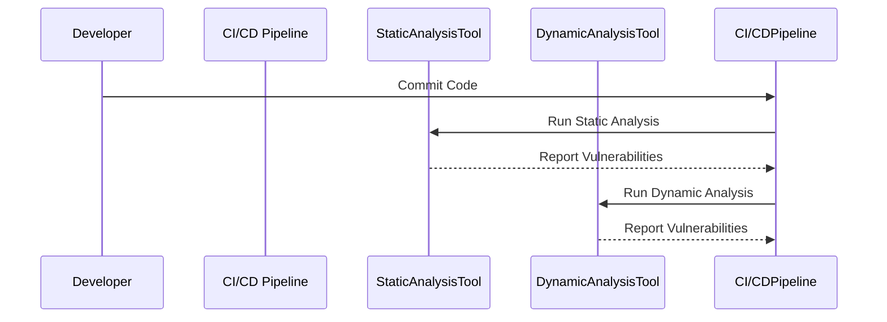
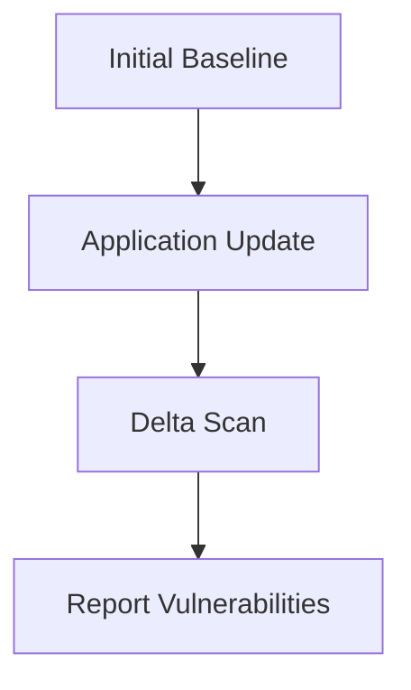

## Introduction to Automated Security Testing

Automated security testing is a critical component of modern DevSecOps practices. It leverages tools and technologies to automate the process of identifying vulnerabilities and weaknesses in software applications. While automation can significantly enhance the efficiency and effectiveness of security testing, it comes with its own set of challenges and considerations. This chapter will delve into the pros and cons of automated security testing, providing a comprehensive understanding of its application, benefits, and limitations.

### What is Automated Security Testing?

Automated security testing refers to the use of software tools to automatically scan and analyze applications for security vulnerabilities. These tools can range from simple static analysis tools to more complex dynamic analysis tools that simulate attacks on running applications. The primary goal of automated security testing is to identify potential security issues early in the development lifecycle, thereby reducing the risk of vulnerabilities making it into production.

#### Why Automate Security Testing?

The rationale behind automating security testing is multifaceted:

1. **Efficiency**: Automated tools can perform tests much faster than manual testers, allowing for more frequent and thorough testing.
2. **Consistency**: Automated tools apply the same tests consistently across different environments and builds, reducing the likelihood of human error.
3. **Coverage**: Automated tools can cover a broader range of potential vulnerabilities, including those that might be overlooked in manual testing.
4. **Integration**: Automated tools can be easily integrated into continuous integration/continuous deployment (CI/CD) pipelines, ensuring that security testing is an integral part of the development process.

### Advantages of Automated Security Testing

#### Fire-and-Forget Convenience

One of the primary advantages of automated security testing is its convenience. Once configured, automated tools can run unattended, freeing up security teams to focus on other tasks. However, this convenience comes with caveats, as we will explore later.

#### Continuous Monitoring

Automated tools can continuously monitor applications for security issues, providing real-time alerts and reports. This continuous monitoring is crucial in today’s fast-paced development environments where applications are frequently updated.

#### Scalability

Automated tools can scale to handle large and complex applications, performing tests on multiple components simultaneously. This scalability ensures that even the most intricate systems can be thoroughly tested.

### Disadvantages of Automated Security Testing

#### Hidden Continuous Costs

While automated security testing offers significant benefits, it also incurs ongoing costs. As applications evolve, the tools used to test them must also be updated and maintained. This maintenance includes:

- **Tool Updates**: Security tools must be regularly updated to incorporate new vulnerabilities and attack vectors.
- **Configuration Changes**: As the application changes, the configuration of the security tools must be adjusted to ensure accurate testing.

#### False Positives

False positives are a common issue with automated security testing. A false positive occurs when the tool incorrectly identifies a security issue that does not actually exist. Managing these false positives requires significant effort:

- **Manual Verification**: Each identified issue must be manually verified to determine whether it is a true vulnerability.
- **Tool Tuning**: Adjusting the sensitivity of the tool to reduce false positives can be a time-consuming process.

#### Dynamic Nature of Security

Security is not static; it evolves as new vulnerabilities are discovered and new attack techniques are developed. Automated tools must be continually updated to keep pace with these changes. This dynamic nature of security means that:

- **Test Parameters Must Change**: As the application changes, the test parameters must be updated to reflect new features and functionalities.
- **Generic Tools Require Customization**: Generic security tools may need to be customized to effectively test specific applications.

### Real-World Examples

To illustrate the practical implications of automated security testing, let's consider some recent real-world examples:

#### Example 1: Apache Struts Vulnerability (CVE-2017-5638)

In 2017, a critical vulnerability was discovered in Apache Struts, a popular Java framework. This vulnerability allowed attackers to execute arbitrary code on affected servers. Automated security testing tools could have potentially detected this vulnerability if they were configured to check for known vulnerabilities and misconfigurations.



#### Example 2: Equifax Data Breach (2017)

The Equifax data breach, which exposed sensitive information of millions of customers, was caused by a vulnerability in Apache Struts. Automated security testing could have helped identify and mitigate this vulnerability if the tools were properly configured and maintained.

### How to Prevent / Defend Against Automated Security Testing Limitations

#### Detection

To effectively manage the limitations of automated security testing, it is essential to implement robust detection mechanisms:

- **Regular Audits**: Conduct regular audits of automated security testing configurations to ensure they are up-to-date and effective.
- **Logging and Monitoring**: Implement logging and monitoring to track the performance and accuracy of automated tools.

#### Prevention

Preventative measures can help mitigate the risks associated with automated security testing:

- **Continuous Tool Updates**: Regularly update security tools to incorporate the latest vulnerability signatures and attack patterns.
- **Custom Configuration**: Customize security tools to match the specific requirements of the application being tested.

#### Secure Coding Fixes

Secure coding practices can help prevent vulnerabilities from being introduced in the first place. Here is an example of a vulnerable code snippet and its secure counterpart:

**Vulnerable Code:**
```java
public String getUserInput(HttpServletRequest request) {
    return request.getParameter("username");
}
```

**Secure Code:**
```java
public String getUserInput(HttpServletRequest request) {
    String username = request.getParameter("username");
    if (username != null && username.matches("[a-zA-Z0-9]+")) {
        return username;
    }
    return "";
}
```

### Delta Scans

Delta scans are a key concept in automated security testing. They involve scanning only the parts of an application that have changed since the last scan. This approach reduces the time and resources required for testing while ensuring that all changes are thoroughly evaluated.

#### What Are Delta Scans?

Delta scans are performed by comparing the current state of the application with a baseline state. Only the differences (or deltas) between these states are scanned for vulnerabilities. This method is particularly useful in CI/CD pipelines where applications are frequently updated.

#### Example of Delta Scan

Consider a scenario where a developer adds a new feature to an existing application. Instead of scanning the entire application, a delta scan would focus on the new feature and its dependencies.



### Conclusion

Automated security testing is a powerful tool in the DevSecOps arsenal, offering significant benefits in terms of efficiency, consistency, and coverage. However, it also comes with its own set of challenges, including hidden continuous costs, false positives, and the need for continuous updates. By understanding these pros and cons, organizations can make informed decisions about when and how to use automated security testing effectively.

### Practice Labs

For hands-on experience with automated security testing, consider the following practice labs:

- **PortSwigger Web Security Academy**: Offers a variety of labs focused on web application security, including automated testing.
- **OWASP Juice Shop**: A deliberately insecure web application designed for security training and testing.
- **DVWA (Damn Vulnerable Web Application)**: A PHP/MySQL web application that is riddled with vulnerabilities for educational purposes.

These labs provide real-world scenarios and environments where you can practice and refine your skills in automated security testing.

---
<!-- nav -->
[[03-Introduction to Automated Security Testing Part 3|Introduction to Automated Security Testing Part 3]] | [[DevSecOps/DevSecOps Bootcamp/05-Application Security Testing/05-Differentiating the Pros and Cons of Automated Security Testing/The Pros and Cons of Automated Security Testing/00-Overview|Overview]] | [[05-1. Authentication Part 1|1. Authentication Part 1]]
