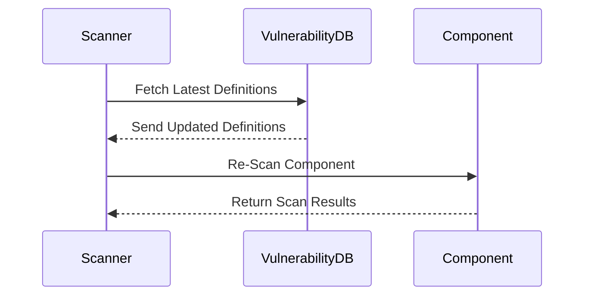
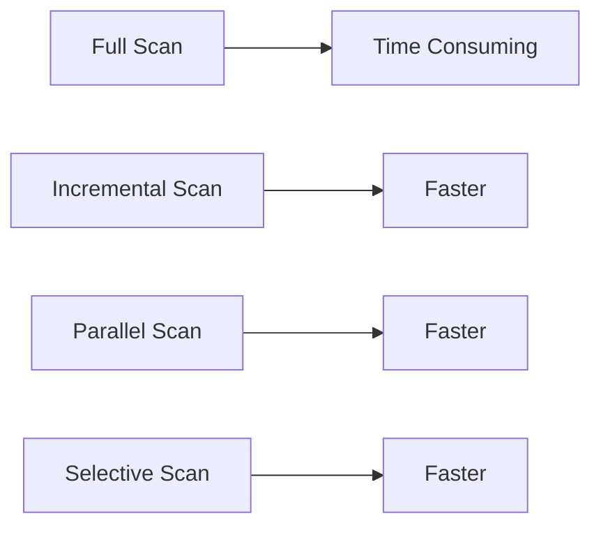
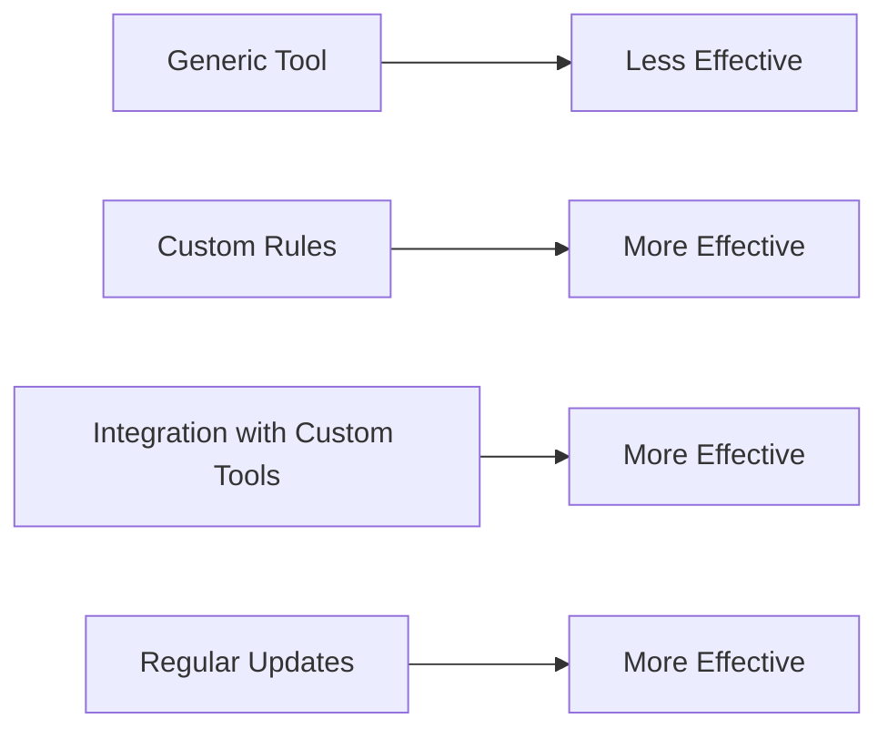
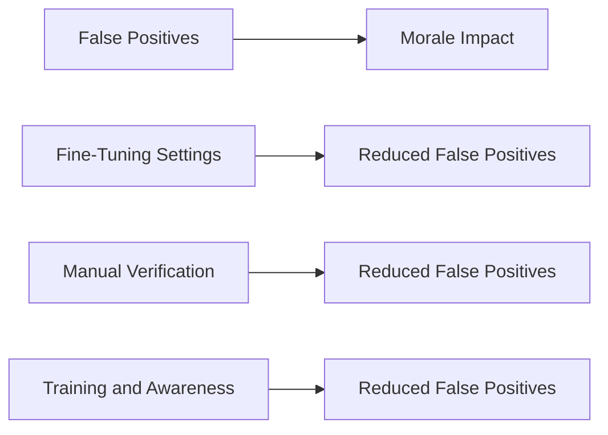
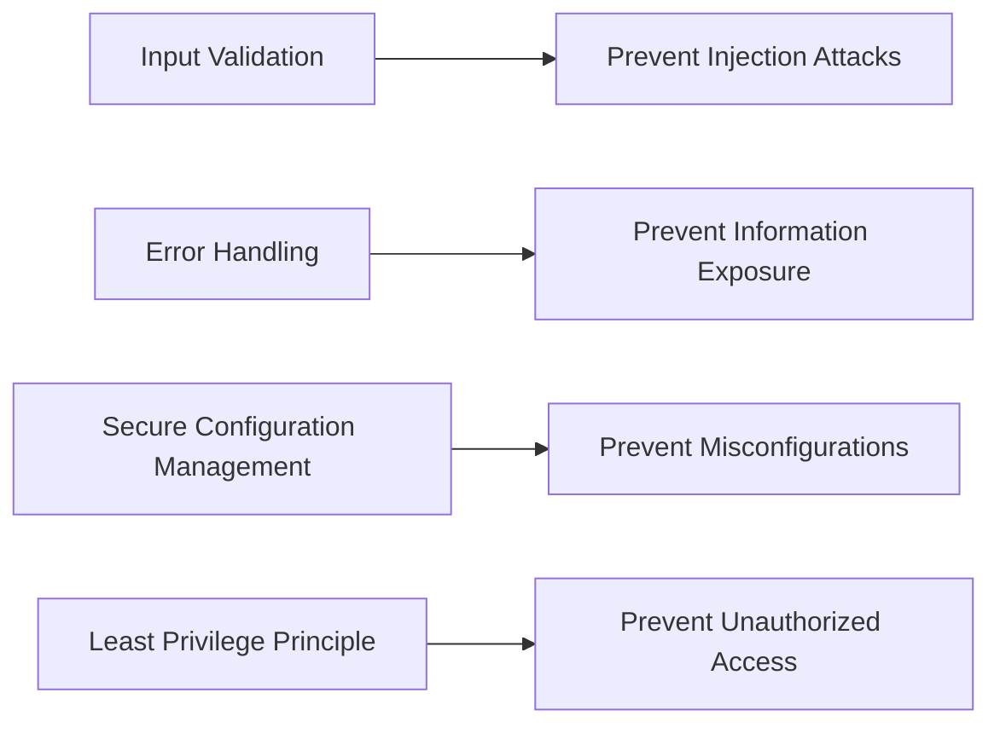
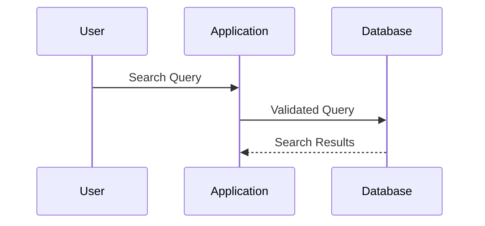
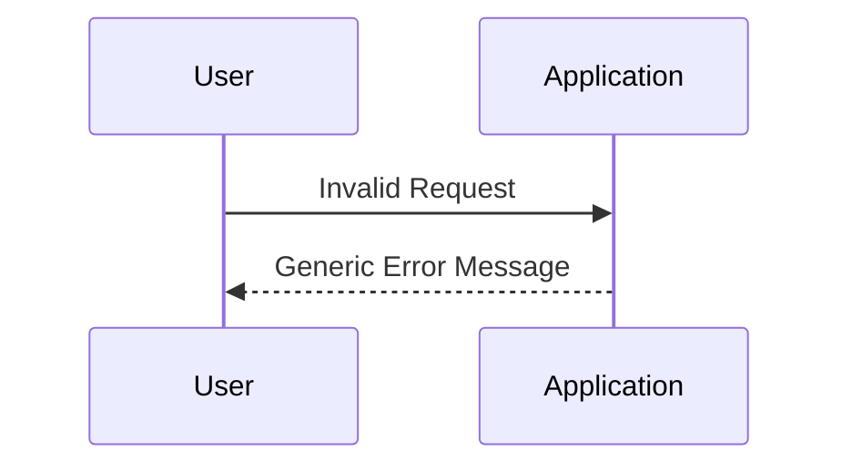

## Differentiating the Pros and Cons of Automated Security Testing

### Introduction to Automated Security Testing

Automated security testing is a critical component of modern DevSecOps practices. It involves using specialized tools to automatically scan applications, systems, and networks for potential security vulnerabilities. These tools can range from simple static analysis tools to complex dynamic analysis tools that simulate attacks on live systems.

#### What is Automated Security Testing?

Automated security testing refers to the use of software tools to identify security vulnerabilities in applications, systems, or networks. These tools can perform various types of scans, including static code analysis, dynamic analysis, and penetration testing. The primary goal is to automate the process of finding security issues, thereby reducing the workload on security teams and enabling faster identification and remediation of vulnerabilities.

#### Why Use Automated Security Testing?

The main advantage of automated security testing is its ability to keep up with the continuous evolution of security threats. New vulnerabilities are constantly being discovered and published, and automated tools can quickly incorporate these updates. This ensures that security assessments remain relevant and effective over time.

### Continuous Updates and Dynamic Results

One of the key benefits of automated security testing is its ability to adapt to new vulnerabilities. As new vulnerabilities are discovered and published, automated tools can update their definitions and re-scan components to identify newly discovered issues.

#### How It Works

Automated security testing tools maintain a database of known vulnerabilities. When a new vulnerability is discovered, it is added to this database. The tool then re-scans the components it has previously analyzed to check if they are now affected by the new vulnerability. This process ensures that the security posture of an application remains up-to-date.

#### Real-World Example

Consider the case of the Log4j vulnerability (CVE-2021-44228). This vulnerability was discovered in December 2021 and affected many applications that used the Log4j library. Automated security tools were quickly updated to include this new vulnerability, and they re-scanned existing applications to identify instances of the Log4j library that needed patching.

### Automation and Development Process

Another significant benefit of automated security testing is the reduction in manual effort required to perform security assessments. Once set up correctly, automated tools can run continuously, providing ongoing security monitoring without the need for human intervention.

#### How It Works

Automated security testing tools can be integrated into the continuous integration/continuous deployment (CI/CD) pipeline. They can run automatically at specific points in the pipeline, such as after code changes are committed or before a new version is deployed. This ensures that security checks are performed consistently and efficiently.

#### Real-World Example

In a typical CI/CD pipeline, an automated security tool like SonarQube can be configured to run a static code analysis after each commit. This ensures that any new code changes are immediately checked for security vulnerabilities, helping to catch issues early in the development cycle.

### Disadvantages of Automated Security Testing

While automated security testing offers numerous benefits, it also comes with several disadvantages that need to be considered.

#### Long Scan Times

One of the primary drawbacks of automated security testing is the time it takes to complete a scan. Depending on the size and complexity of the system being scanned, the process can take a significant amount of time. This can potentially slow down the development process, especially if developers need to wait for the scan to complete before proceeding with further work.

#### Generic Tools

Most automated security testing tools are designed to be generic, meaning they can test a wide range of applications and systems. However, this generality can sometimes lead to less effective testing for custom applications. Custom applications often have unique architectures and business logic that generic tools may not fully understand or test effectively.

#### False Positives

False positives are a common issue with automated security testing. A false positive occurs when the tool incorrectly identifies a security issue that does not actually exist. This can be frustrating for developers, as they may need to spend time verifying and dismissing these false positives. Over time, this can erode trust in the security tool, leading to a situation where valid security issues are ignored or overlooked.

### Real-World Examples of Disadvantages

#### Long Scan Times

Consider a large enterprise application with a complex architecture. Running a full security scan on this application can take several hours, depending on the number of components and the depth of the scan. This can significantly delay the development process, especially if the scan needs to be run frequently.

#### Generic Tools

A custom e-commerce platform with a unique architecture and business logic may not be fully tested by a generic security tool. The tool may miss certain vulnerabilities that are specific to the custom implementation, leading to a false sense of security.

#### False Positives

In a recent breach involving a financial institution, the security team initially dismissed a reported vulnerability due to frequent false positives from their automated security tool. This led to a critical vulnerability being overlooked, resulting in a significant data breach.

### How to Prevent / Defend Against Disadvantages

To mitigate the disadvantages of automated security testing, several strategies can be employed:

#### Optimizing Scan Times

To reduce the time taken for security scans, it is important to optimize the scanning process. This can be achieved by:

1. **Incremental Scanning**: Instead of performing a full scan every time, incremental scanning can be used to scan only the parts of the application that have changed since the last scan.
2. **Parallel Scanning**: Utilize parallel processing capabilities to speed up the scanning process. Modern tools often support distributed scanning across multiple nodes.
3. **Selective Scanning**: Focus on critical components and high-risk areas first, rather than scanning the entire application.

#### Customizing Tools for Specific Applications

To ensure that automated security tools are effective for custom applications, customization is essential. This can involve:

1. **Custom Rules**: Develop custom rules and scripts that are tailored to the specific architecture and business logic of the application.
2. **Integration with Custom Tools**: Integrate the automated security tool with other custom tools and frameworks used in the development process.
3. **Regular Updates**: Keep the tool updated with the latest definitions and patches to ensure it remains effective against new vulnerabilities.

#### Reducing False Positives

To minimize the impact of false positives, several measures can be taken:

1. **Fine-Tuning Settings**: Adjust the settings of the security tool to reduce the likelihood of false positives. This may involve tweaking sensitivity levels and exclusion rules.
2. **Manual Verification**: Implement a process for manually verifying reported issues to confirm whether they are true positives or false positives.
3. **Training and Awareness**: Educate the development team about the importance of addressing security issues and the potential consequences of ignoring them.

### Secure Coding Practices

To further enhance the effectiveness of automated security testing, it is crucial to adopt secure coding practices. This includes:

1. **Input Validation**: Ensure that all user inputs are validated to prevent injection attacks.
2. **Error Handling**: Implement proper error handling to avoid exposing sensitive information through error messages.
3. **Secure Configuration Management**: Use secure configurations for all components, including databases, servers, and network devices.
4. **Least Privilege Principle**: Follow the principle of least privilege by granting users and processes only the permissions necessary to perform their tasks.

### Real-World Examples of Secure Coding Practices

#### Input Validation

Consider the case of a web application that accepts user input for a search function. Without proper input validation, an attacker could inject malicious SQL queries to gain unauthorized access to the database. By implementing input validation, the application can prevent such attacks.

#### Error Handling

In a recent breach involving a healthcare provider, an attacker exploited a vulnerability in the error handling mechanism of the application. By manipulating error messages, the attacker was able to extract sensitive patient information. Proper error handling would have prevented this exposure.

### Hands-On Labs

To gain practical experience with automated security testing, consider the following hands-on labs:

- **PortSwigger Web Security Academy**: Offers a comprehensive set of labs covering various aspects of web security, including automated security testing.
- **OWASP Juice Shop**: A deliberately insecure web application that can be used to practice security testing techniques.
- **DVWA (Damn Vulnerable Web Application)**: Another intentionally vulnerable web application that can be used to learn and practice security testing.

These labs provide a safe environment to experiment with automated security testing tools and techniques, helping to build practical skills and confidence in securing applications.

### Conclusion

Automated security testing is a powerful tool in the DevSecOps toolkit, offering numerous benefits such as continuous updates, reduced manual effort, and efficient integration into the development process. However, it also comes with several disadvantages, including long scan times, generic tools, and false positives. By understanding these pros and cons and employing effective strategies to mitigate the disadvantages, organizations can leverage automated security testing to enhance their overall security posture.

By adopting secure coding practices and utilizing hands-on labs, developers can gain practical experience and build robust security into their applications from the start.

---
<!-- nav -->
[[14-Changing Test Results Over Time|Changing Test Results Over Time]] | [[DevSecOps/DevSecOps Bootcamp/05-Application Security Testing/05-Differentiating the Pros and Cons of Automated Security Testing/The Pros and Cons of Automated Security Testing/00-Overview|Overview]] | [[16-Hands-On Labs for Practice|Hands-On Labs for Practice]]
